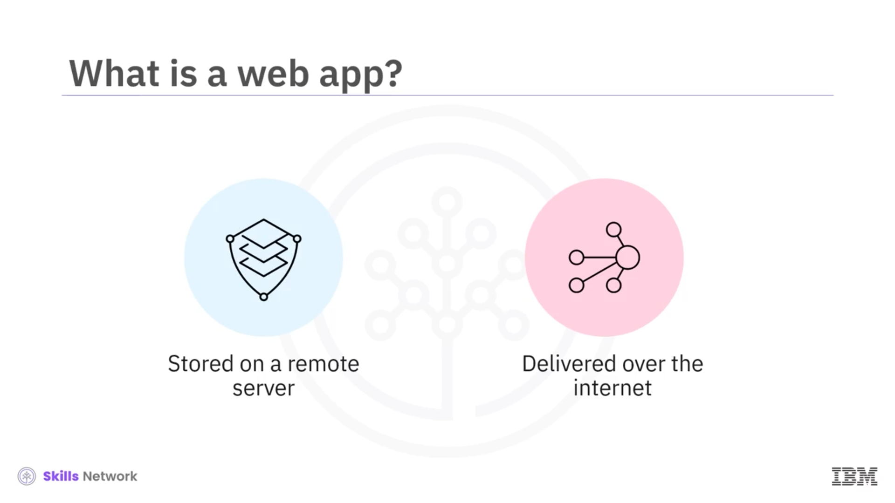
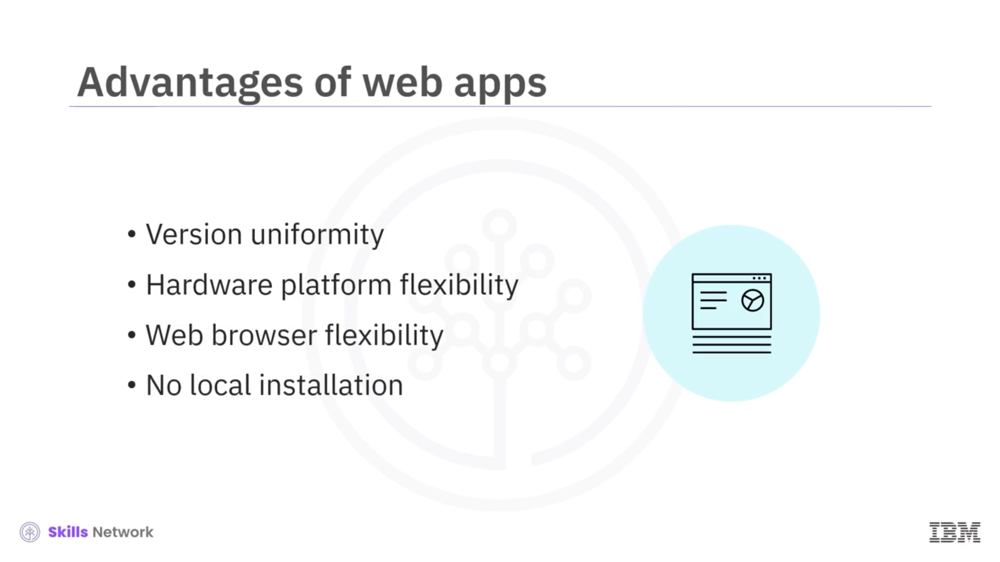
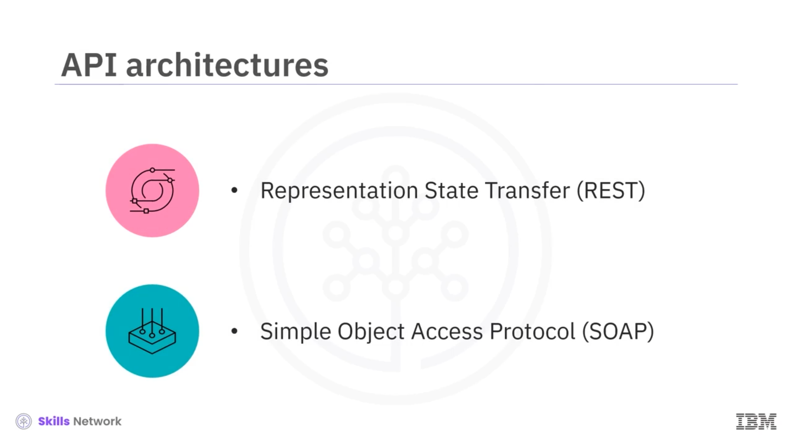
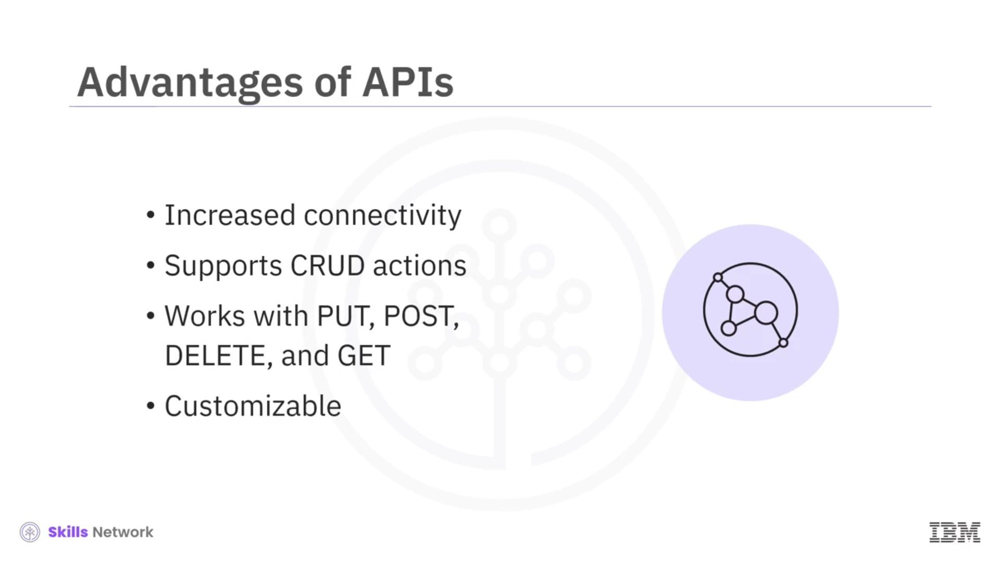
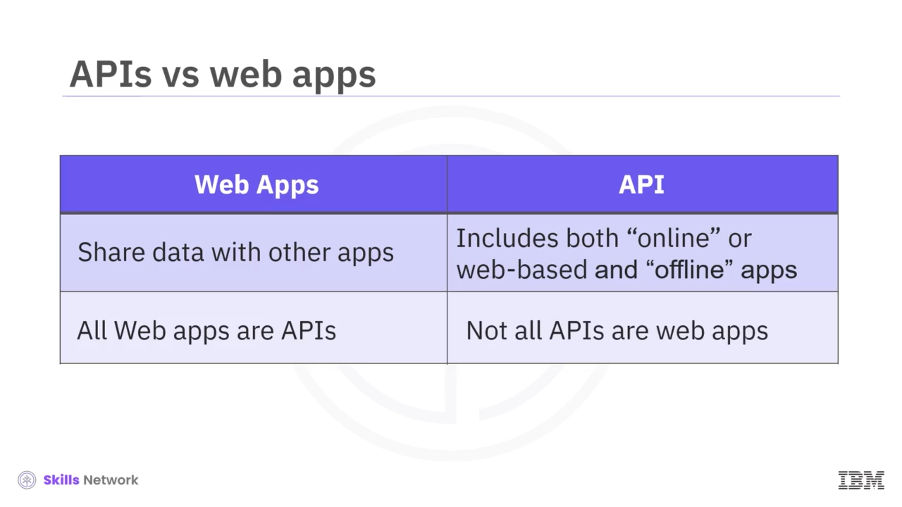

# 🌐 Web Uygulamalarına ve API’lere Giriş

## 🎬 Videoya Giriş

“ **Web Uygulamalarına ve API’lere Giriş** ”e hoş geldiniz.

Bu videoyu izledikten sonra şunları yapabileceksiniz:

* Web uygulamalarını ya da  *web app* ’leri açıklamak
* *Application Programming Interface* ’i (ya da  *API* ’yi) açıklamak
* *Web app* ’ler ile  *API* ’leri karşılaştırmak ve aralarındaki farkları belirtmek

---

## 🕸 Web Uygulaması ( *Web App* ) Nedir?

Bir  *web app* , uzak bir sunucuda saklanan ve internet üzerinden sunulan bir programdır.

Kullanıcı, uygulama ile bir tarayıcı üzerinden etkileşime girer.

E-ticaret siteleri, web e-posta servisleri ( *webmail* ) gibi web servislerinin hepsi  *web app* ’tir.

Bazı uygulamalar kullanılan tarayıcı türüne bağlı olabilirken, çoğu *web app* tüm modern web tarayıcılarında çalışır.

Bir  *web app* ’in bir istemci isteğini işleyebilmesi için üç bileşene ihtiyacı vardır:

* Yöneltilen istekleri yönetmek için bir web sunucusu
* İstenen görevi yerine getirmek için bir uygulama sunucusu ( *app server* )
* Görevi tamamlamak için gereken bilgileri saklamak üzere bir veritabanı

---

## 💻 Web Uygulamalarında Ön Uç ve Arka Uç

 *Web app* ’leri programlarken, kullanıcı tarafı ya da **ön uç** ( *front-end* ) için  **JavaScript** , **HTML** veya **CSS** ile kod yazarsınız.

Ayrıca, sunucu tarafı ya da **arka uç** ( *back-end* ) için  **Python** , **Java** veya **Ruby** kullanarak da kod yazarsınız.

---

## ✅ Web Uygulamalarının Avantajları

Yerel olarak, yalnızca kullanıcının kendi sisteminde çalışan uygulamalara kıyasla *web app* kullanmanın çeşitli avantajları vardır.

Bu avantajlar şunları içerir:

* Geliştiriciler, uygulamanın aynı sürümünü aynı anda birden fazla kullanıcıya sunabilir.
* Kullanıcılar, masaüstü, dizüstü bilgisayar veya mobil cihaz gibi tercih ettikleri platformdan uygulamayı kullanma esnekliğine sahiptir.
* Kullanıcılar, tercih ettikleri tarayıcı üzerinden uygulamaya erişebilir.
* Kullanıcıların uygulamayı kendi yerel sistemlerine kurmaları gerekmez.

---

## 🔗 Uygulama Programlama Arayüzü ( *API* ) Nedir?

Bir  *API* , birbirine bağlı olmayan iki uygulamanın iletişim kurmasını sağlayan bir yazılım bileşenidir.

 *API* ’ler, programcılar için daha fazla esneklik sağlar ve aksi hâlde kapalı olan uygulamalardan veri talep edebilmelerine imkân tanır.

Bu nedenle  *API* ’lerin, bir uygulama içinde hangi verinin alınabileceğini veya değiştirilebileceğini ve bu sürecin nasıl gerçekleşeceğini belirleyen standartlaştırılmış kuralları ve işlevleri vardır.

Örneğin, telefonunuzdaki uygulamalar; konum, kamera, ses ve kayıt cihazı gibi telefonunuzun farklı özelliklerine erişim izni vermenizi ister.

*API* kullanan bir uygulamaya örnek, bir hava durumu uygulamasıdır.

Hava durumu uygulamanız hava verisini kendi başına üretmez.

Bunun yerine, sadece bir hava durumu  *API* ’sinden bilgi talep eder.

---

## ☁️ Hava Durumu Uygulaması ve API İlişkisi

 *API* , hava verilerini toplayan ve saklayan yazılım ile mobil cihazınızdaki uygulama arasında bağlantı kurar.

Cihaz ise, bunun sonucunda size ertesi gün için ayrıntılı bir hava tahmini sunar.

---

## 🏛 API Mimarileri: REST ve SOAP

Yazılım geliştiricileri bir *API* oluştururken çeşitli mimarileri takip eder, ancak en yaygın olanları:

* *Representational State Transfer* (ya da  *REST* )
* *Simple Object Access Protocol* (ya da  *SOAP* )

Bu mimariler başka bir videoda ele alınacaktır.

---

## 🧮 API’lerin Sağladığı Faydalar

Bir *API* pek çok nedenle faydalı olabilir; bunlar arasında şunlar yer alır:

* Uygulamalar arasındaki bağlantıyı geliştirir.
* Geleneksel *create, read, update, delete* (ya da  *CRUD* ) eylemlerini destekler.
* *PUT* ,  *POST* , *DELETE* ve *GET* dâhil olmak üzere *HTTP* fiilleriyle ( *HTTP verbs* ) çalışır.
* *HTTP* ’ye dayanır ve bu da onu özelleştirilebilir kılar.

---

## 🔍 API ve Web Uygulamalarının Kavramsal Farkı

 *API* , bir sistemin herhangi iki parçası arasında bağlantı oluşturan her tür uygulamaya verilen daha genel bir terimdir.

 *Web app* ’ler, ön uç ( *front end* ) ile arka uç ( *back end* ) arasında iletişim kuran bir *API* biçimidir.

---

## 🛒 Örnek: E-Ticaret Alışveriş Servisi

 *Web app* ’ler ve  *API* ’ler arasındaki farkı netleştirmek için, bir e-ticaret alışveriş servisi örneğini ele alalım.

Bu e-ticaret alışveriş servisine bir tarayıcıdan eriştiğinizde, tarayıcı sizi  *web app* ’e bağlayan *API* görevi görür.

Bir ürün seçtiğinizde, *web app* ürünün stokta olup olmadığını kontrol eder ve eğer varsa, fiyatını gösterir.

Eğer e-ticaret alışveriş servisine bir mobil cihaz kullanarak erişmeye çalışırsanız, cihazınızdaki uygulama, e-ticaret alışveriş servisine bağlanan *API* görevi görür.

---

## 🔁 Web Uygulamaları ve API’lerin İlişkisi

Tüm  *web app* ’lerin doğası, veriyi diğer uygulamalarla paylaşmaktır; özünde, tüm  *web app* ’ler *API* olarak düşünülebilir.

Ancak  *API* , hem “çevrim içi” ya da web tabanlı, hem de “çevrim dışı” uygulamaları kapsayan genel bir terimdir.

Özetle, tüm  *web app* ’ler  *API* ’dir, ancak tüm  *API* ’ler *web app* değildir.

---

## 📚 Videonun Özeti

Bu videoda şunları öğrendiniz:

* *Web app* ’ler, uzak bir sunucuda saklanan ve internet üzerinden bir tarayıcı aracılığıyla sunulan programlardır.
* Yeni bir yazılım yüklemeye gerek kalmadan,  *web app* ’leri farklı platformlarda ve tarayıcılarda çalıştırabilirsiniz.
* *Application Programming Interface* ya da  *API* , birbirine bağlı olmayan iki uygulamanın iletişim kurmasını sağlayan bir yazılım bileşenidir.
* *Web app* ’ler birer  *API* ’dir, ancak tüm  *API* ’ler *web app* değildir.

Her ikisi de uygulamalar arasında veri paylaşır, ancak tüm  *API* ’lerin,  *web app* ’lerde olduğu gibi bir ağa ihtiyaç duyması gerekmez.

