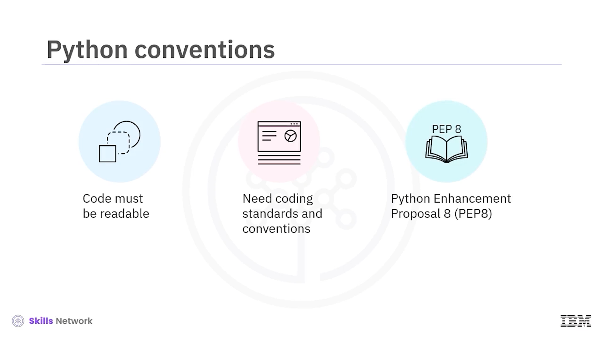
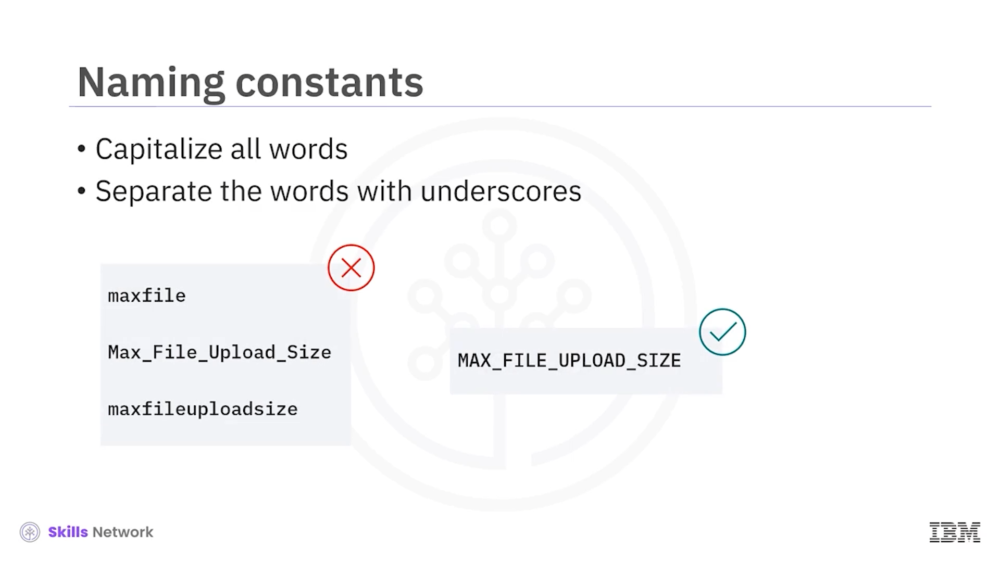
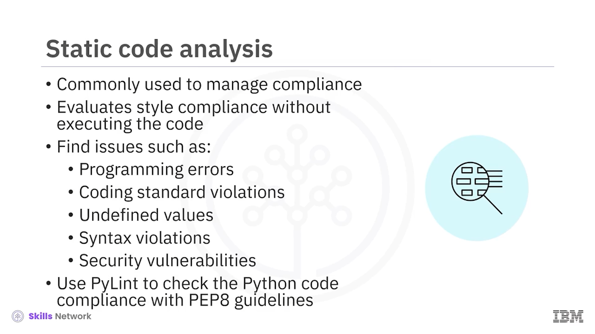
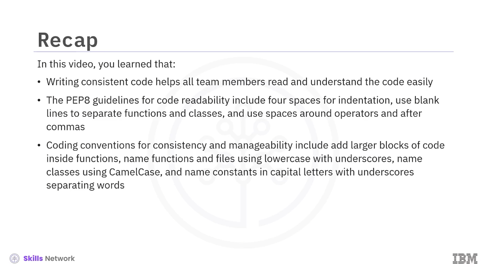

# 🧾 Python Stil Rehberi ve Kodlama Uygulamaları

## 🎬 Videoya Giriş

 *Python Style Guide and Coding Practices* ’a hoş geldiniz.

Bu videoyu izledikten sonra şunları yapabileceksiniz:

* Okunabilir kod yazmanın önemini açıklamak
* Python kodlama kurallarını ( *coding conventions* ) listelemek
* Statik kod analizini ( *static code analysis* ) açıklamak


Kod yazarken, ekibin kodu kolayca okuyup anlayabilmesini sağlamanız gerekir.

Bu görev, bazı kodlama standartları ve kuralları ( *conventions* ) gerektirir.

`Python.org`, **Python Enhancement Proposal 8** ya da kısaca `PEP-8` adlı bir belge yayımlamıştır.

Bu belge, Python kodunuzun okunabilir ve tutarlı biçimde formatlanmış olmasını sağlamak için kurallar ve yönergeler sunar.

Kodun okunabilirliğini artırmaya yönelik temel yönergelerle başlayalım.



---

## 👀 Okunabilir Kod Yazmanın Önemi

`PEP-8`, girintileme ( *indentation* ) için **sekme (tab)** yerine **boşluk (space)** kullanılmasını önerir.

Nedenini merak ediyor musunuz?

Metin düzenleyiciler ve Entegre Geliştirme Ortamları ( *Integrated Development Environments – IDE’ler* ), bir sekmenin kaç boşluğa karşılık geldiğini farklı şekilde yorumlayabilir.

Örneğin, bir editör bir sekmeyi üç boşluk olarak değerlendirirken, bir diğeri dört boşluk olarak değerlendirebilir.

Girintileme için sekme kullanmak, kodda tutarsızlığa yol açabilir ve bu da biçimlendirme hatalarıyla sonuçlanabilir.

Örneğin, birinci editörde `if` koşulu altındaki 1. ifade için sekme tuşuna basıldığında oluşan boşlukla, ikinci editörde aynı `if` koşulu altındaki 1. ifadenin önüne boşluk konduğunda oluşan boşluk farkını gözlemleyin.

Bu tür hatalardan kaçınmak için, kodunuzu girintilerken **tutarlı sayıda boşluk** kullanmalısınız.

Birlik sağlamak için yönerge, kodda her girinti seviyesi için **dört boşluk** kullanılmasını önerir.

Bir girinti için dört boşluk, uygun okunabilirlik için yeterlidir.

Dört boşluğu göstermek için, 1. ve 2. ifadelerin önüne dört nokta eklendiğine dikkat edin.


---

## 🧱 Fonksiyon ve Sınıfları Boş Satırlarla Ayırma

`PEP-8` ayrıca, kodda **fonksiyonları** ve **sınıfları** birbirinden ayırmak için **boş satırlar** kullanılmasını önerir.

PEP-8 yönergelerine uymayan sol taraftaki blokta, `function1`’in bittiği yer ile `UserClass` (U ve C büyük harf) sınıfının başladığı yer arasında hiçbir boş satır olmadığını fark edin.

Buna karşılık, sağ tarafta sınıf tanımından önce bir boş satır bulunan doğru gösterim yer alır.

Boş satırlar, kodun farklı bölümlerinin nerede başlayıp nerede bittiğinin anlaşılmasına yardımcı olur.


---

## ➕ Operatörler ve Virgüller Etrafında Boşluklar

Kodun okunabilirliğini artırmak için, **operatörlerin etrafında** ve **virgüllerden sonra** boşluk kullanın.

Boşluk kullanmak, komutların daha ferah ve net görünmesini sağlayarak okunabilirliği artırır.

Bazı örneklere bakalım:

Hiç boşluk bırakmadan şu şekilde yazdığınızda:

```python
A=B+C
```

ifade kafa karıştırıcı olabilir.

Buna karşılık, aralara boşluk eklediğinizde:

```python
A = B + C
```

okunabilirlik belirgin biçimde artar.


---

## 🧩 Kodlama Kuralları ve Fonksiyonlara Ayırma

Şimdi, tutarlılığı ve yönetilebilirliği sağlamak için bazı kodlama kurallarına bakalım.

Önemli bir kodlama kuralı, **daha büyük kod bloklarına sahip işlevsellikler için ayrı fonksiyonlar oluşturmak**tır.

Daha sonra bu fonksiyonları **ana programdan** çağırabilirsiniz.

Örneğin, bir kodda `if-else` yapısı bir fonksiyon içine alınmamışsa, bu işlevselliğe her ihtiyaç duyduğunuzda aynı yapıyı yeniden yazmanız gerekir.

Oysa `function_one` adında, iki parametre `A` ve `B` alan bir fonksiyon tanımladığınızı düşünün:

```python
def function_one(A, B):
    ...
```

Bu fonksiyon daha sonra kolayca çağrılabilir, örneğin:

```python
C = function_one(A, B)
```

Bu yaklaşım, kodun yürütülme hızını artırır ve kod bloğunun çok daha pratik bir şekilde **yeniden kullanılmasını** destekler.


---

## 🏷 Fonksiyon, Dosya ve Paket İsimlendirme

Bir başka kodlama kuralı da, **fonksiyonların ve dosyaların adlarını** küçük harf ve alt çizgi ( *underscore* ) kullanarak vermektir.

Python, bu isimlendirme kuralını kullanır ve yaygın isimlendirme kurallarını kullanan pek çok yerleşik kütüphane ve ön tanımlı fonksiyona sahiptir.

Bu nedenle, fonksiyonları özgün kılmak için küçük harflerden oluşan, tercihen alt çizgiyle ayrılmış fonksiyon adları kullanmanız tavsiye edilir.

Örneğin, fonksiyon adını:

```text
compSurfaceRadiation
```

şeklinde (Surface için büyük  **S** , Radiation için büyük  **R** ) yazmak yerine:

```text
comp_surface_radiation
```

şeklinde yazın.

Bu kurala bir istisna, alt çizgi kullanımının genel olarak önerilmediği **Python paketleri** için isimlendirme ölçütleridir.

Örneğin, şu biçimde yazmak yerine:

```text
my_package
```

şu biçimde yazın:

```text
mypackage
```


---

## 🧬 Sınıf ve Sabit İsimlendirme

Sınıfları **camel case** kullanarak adlandırmak da bir kodlama kuralıdır.

*Camel case* ya da  *cap word case* , sınıflar için kodlama topluluğunda yaygın olarak kabul gören bir isimlendirme kuralıdır.

Camel case, kodda **sınıflarla fonksiyonları birbirinden ayırt etmeye** de yardımcı olur.

Örneğin, bir sınıfı şu şekilde yazmak yerine:

```text
lamb_squirrel_cage
```

en iyi uygulama olarak sınıfı şu şekilde adlandırmaktır:

```text
LambSquirrelCage
```

burada baş harfler  **L** , **S** ve **C** büyük harftir.

Sabitler ( *constants* ) için ise, tutarlılık amacıyla **tüm sözcükleri büyük harfle yazıp aralarını alt çizgiyle ayırma** kodlama kuralını kullanın.

Sabitin adı genellikle sabitin **amaca hizmet eden anlamını** yansıtır.

Örneğin, `"max file upload size"` ifadesini tamamı büyük harflerle yazmak bir sabit ismi olarak kullanılabilir.




---

## 🧪 Statik Kod Analizi

Kodlama kuralları ve yönergelerini tartıştık.

Yazılım geliştiriciler, bu stil yönergelerine uyumu sağlamak için yaygın olarak **statik kod analizi** kullanırlar.

 *Statik kod analizi* , kodu  **çalıştırmadan** , önceden tanımlanmış bir stil ve standarda göre değerlendirme yöntemidir.

Statik analiz; programlama hataları, kod standartlarına aykırılıklar, tanımsız değerler, sözdizimi ( *syntax* ) ihlalleri ve güvenlik açıkları gibi sorunların bulunmasına yardımcı olur.

Python kodunuzun `PEP-8` yönergelerine uyup uymadığını kontrol etmek için `PyLint` kütüphanesini kullanabilirsiniz.



---

## 📚 Videoda Öğrendikleriniz

Bu videoda şunları öğrendiniz:

* Tutarlı kod yazmak, tüm ekip üyelerinin kodu kolayca **okumasına ve anlamasına** yardımcı olur.
* Daha iyi kod okunabilirliği için `PEP-8` yönergeleri şunları içerir:
  * Girintileme için **dört boşluk** kullanmak.
  * Fonksiyonları ve sınıfları ayırmak için **boş satırlar** kullanmak.
  * Operatörlerin etrafında ve virgüllerden sonra **boşluk** kullanmak.
* Kodun tutarlılığı ve yönetilebilirliği için bazı kodlama kuralları:
  * Daha büyük kod bloklarını **fonksiyonların içine** almak.
  * Fonksiyonları ve dosyaları **küçük harfler** ve **alt çizgiler** kullanarak adlandırmak.
  * Sınıfları **camel case** kullanarak adlandırmak.
  * Sabitleri, tümü **büyük harflerden** oluşacak ve sözcükler **alt çizgiyle ayrılacak** şekilde adlandırmak.
* Kodu çalıştırmadan, önceden tanımlanmış bir stil ve standarda göre değerlendirmek için **statik kod analizi** yöntemini kullanmak.


