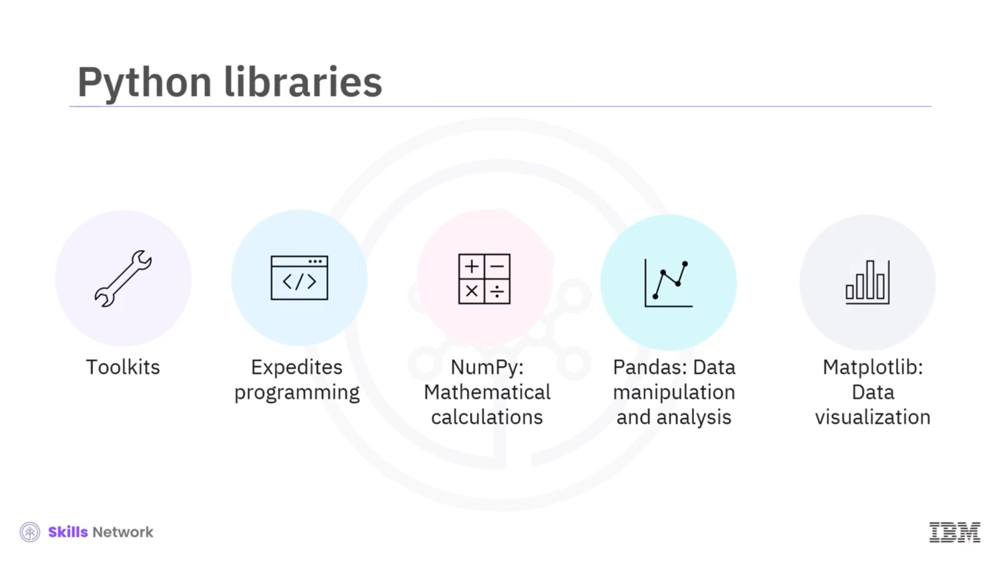
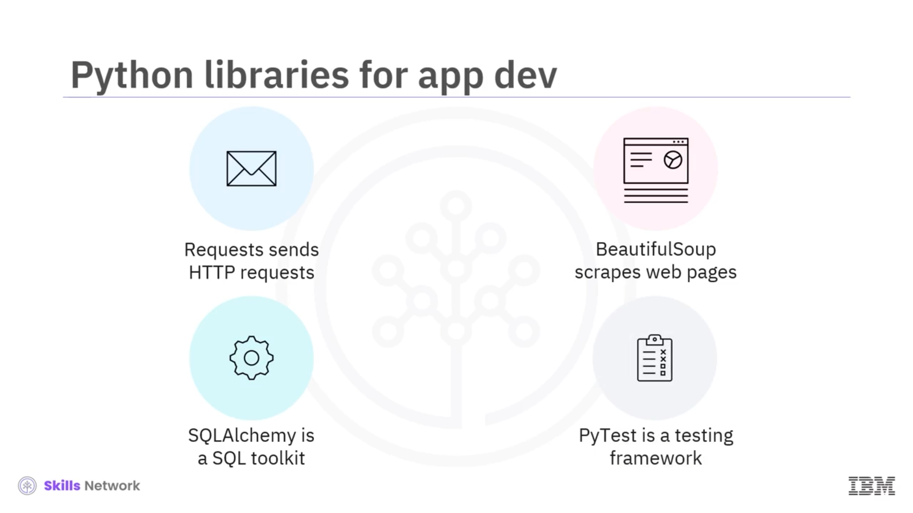
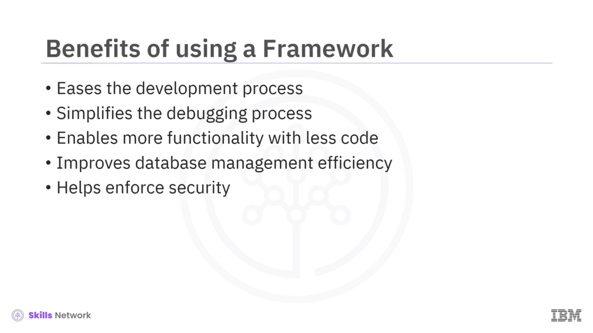
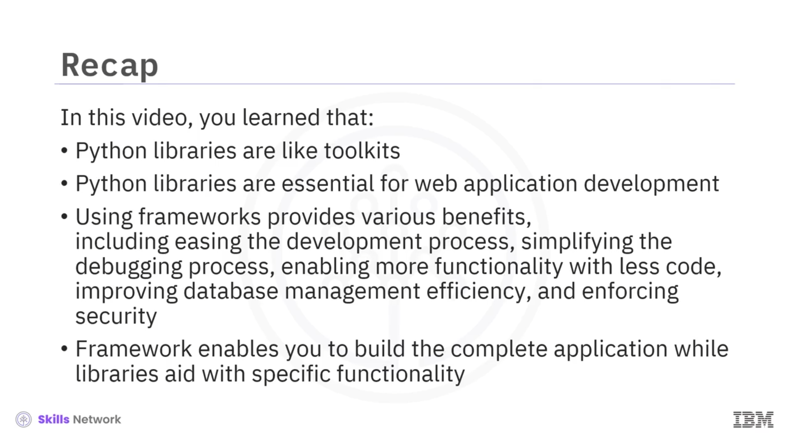

# 📚 Uygulama Geliştirme için Python Kütüphaneleri ve Framework'ler

Uygulama Geliştirme için Python Kütüphaneleri ve Framework'ler konusuna hoş geldiniz.

Bu videoyu izledikten sonra şunları yapabileceksiniz:

* Uygulama geliştirme için Python kütüphanelerini açıklamak
* Uygulama geliştirme için bir  *framework* 'ü tanımlamak
* Uygulama geliştirmede *framework* kullanmanın faydalarını belirlemek
* *Framework* 'leri ve kütüphaneleri karşılaştırmak

---

## 🧰 Python Kütüphaneleri: Araç Setleri

Python kütüphaneleri araç setlerine benzer. Her kütüphane, belirli programlama görevlerini basitleştirmek ve hızlandırmak için özel araçlar içerir.

*NumPy* gibi kütüphaneler, ileri düzey matematiksel hesaplamaları kolaylaştırır.  *Pandas* , veri manipülasyonu ve analiz yetenekleri sunar.  *Matplotlib* , veri görselleştirmesini basitleştirir.

Bu kütüphaneler, geliştiricilerin bu işlevleri oluşturmada harcayacağı ciddi zaman ve efordan tasarruf sağlar.

---

## 🌐 Web Uygulama Geliştirme için Temel Python Kütüphaneleri

Web uygulaması geliştirme için bazı Python kütüphaneleri vazgeçilmezdir. *Requests* kütüphanesi, HTTP istekleri göndermeyi basitleştirir.

 *BeautifulSoup* , web sayfalarından bilgi kazımayı, ayrıştırma ağacını yineleme, arama ve değiştirme işlemleri için kolay hale getirir.

 *SQLAlchemy* , bir SQL araç seti ve *Object-Relational Mapping* ya da kısaca *ORM* aracıdır. Uygulama geliştiricilere SQL'in tüm gücünü ve esnekliğini sunan bir sistemdir.

 *PyTest* , kullanıcıların küçük ve basit testleri kolayca oluşturmasına olanak tanıyan, ancak aynı zamanda uygulamalar ve kütüphaneler için karmaşık işlevsel testleri destekleyecek şekilde ölçeklenebilen bir test framework'üdür.

Framework'ler, uygulama geliştirme için önceden tanımlanmış yapılardır.

---

## 🏗️ Framework Nedir ve Ne Sağlar?

Ayrıca framework'ler, uygulama geliştirme için bir dizi yönerge sağlar. Framework'ler, kod yazma ve düzenleme için iyi tanımlanmış bir yapı sunarak ve ek özellikler için kod kütüphanelerinin yeniden kullanılmasını mümkün kılarak iyi kodlama uygulamalarını kolaylaştırır.

Kimi framework'lere  *Django* , *Flask* ve *Web2Py* örnek verilebilir.

---

## 🚀 Framework Kullanmanın Faydaları

Uygulama geliştirme için bir framework kullanmanın çeşitli faydaları vardır.

Bu faydalardan biri, önceden yazılmış kod kütüphaneleri, modüller ve geliştirici yönergeleriyle geliştirme sürecini kolaylaştırmasıdır. Hazır hata ayıklama araçları sayesinde web framework'leri, geliştiriciler için web uygulamalarında hata ayıklama sürecini basitleştirir.

Framework kullanmanın bir diğer faydası da geliştiricilerin daha az kod yazarak daha fazla işlevsellik ekleyebilmesidir.

---

## 🧩 Nasıl Daha Az Kodla Daha Fazla İşlevsellik Sağlanır?

Nasıl mı? Bir framework, geliştiricinin kendi kodunu yazarken yararlanabileceği birçok hazır kütüphane ve modülle donatılmıştır.

Bir geliştiricinin gerekli tüm işlevleri sıfırdan oluşturmasına gerek yoktur.

---

## 💾 Veritabanı Yönetimi ve Güvenlik

Framework kullanmak, veritabanı yönetimi verimliliğini artırır. Framework'ler, veri aktarımı için veritabanı uç noktalarının sorunsuz entegrasyonuna yardımcı olan yerleşik veritabanı entegrasyon araçlarıyla birlikte gelir.

Güvenlik, uygulama kullanıcıları için temel bir endişe olduğundan, framework kullanmanın bir diğer faydası da geliştiricilerin güvenliği sağlamak için yerleşik güvenlik özelliklerinden ve yönergelerinden yararlanabilmesidir.

---

## ⚖️ Framework ve Kütüphane Arasındaki Farklar

Şimdi framework'ler ile kütüphanelerin birbirinden nasıl farklılaştığına kısaca bakalım.

Bir framework, uygulamanın temel akışını ve mimarisini içerir ve bu da sizin eksiksiz bir uygulama inşa etmenizi sağlar.

Bir Python kütüphanesi ise yalnızca belirli bir işlevselliği yerine getiren paketlerin bir kümesidir.

---

## 📝 Özet

Bu videoda şunları öğrendiniz:

* Python kütüphaneleri araç setlerine benzer.
* Her kütüphanede, belirli programlama görevlerini basitleştirmek ve hızlandırmak için özel araçlar bulunur.
* Framework'ler, uygulama geliştirme için önceden tanımlanmış yapılardır.
* Framework kullanmak; geliştirme sürecini kolaylaştırma, hata ayıklama sürecini basitleştirme, daha az kodla daha fazla işlevsellik sağlama, veritabanı yönetimi verimliliğini artırma ve güvenliği sağlamaya yardımcı olma gibi çeşitli faydalar sunar.
* Framework, eksiksiz bir uygulama oluşturmanızı sağlarken kütüphaneler belirli işlevsellikler konusunda size yardımcı olur.

