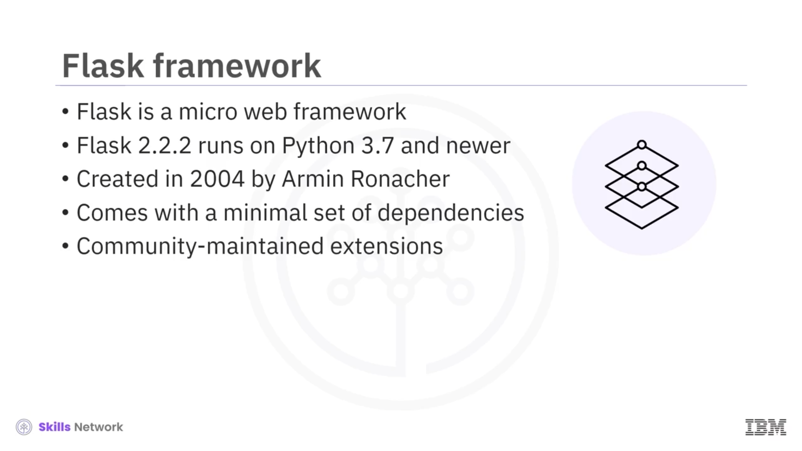
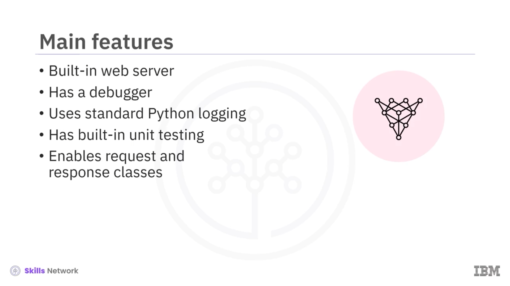
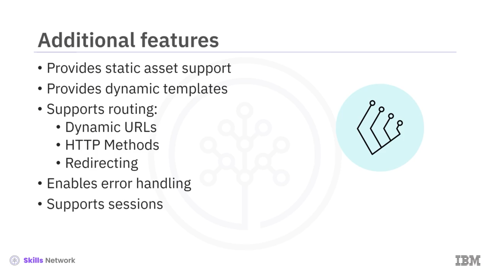
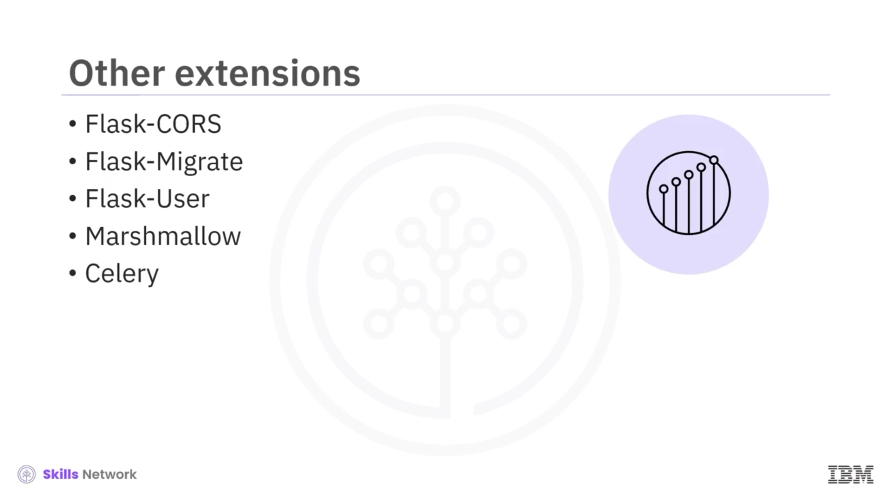
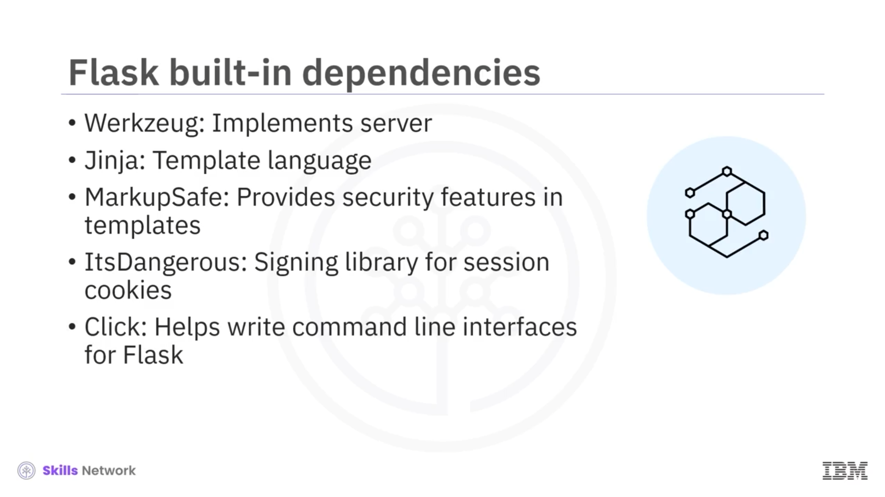
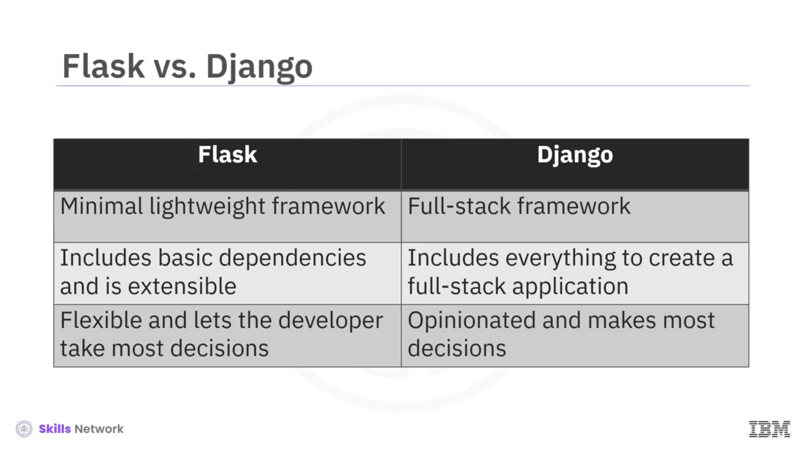

# 🌐 Flask’e Giriş

Flask’e Giriş’e hoş geldiniz. Bu videoyu izledikten sonra şunları yapabileceksiniz: Flask web framework’ünü tanımlamak ve temel özelliklerini açıklamak, Flask’in makinelerinize nasıl kurulacağını açıklamak, Flask’in temel bağımlılıklarını tanımlamak ve Flask ile Django adlı başka bir Python web framework’ü arasındaki temel farkları açıklamak.

Flask, web uygulamaları oluşturabilen bir mikro framework’tür. Diğer bazı büyük framework’ler gibi *opinionated* değildir ve kullanıcıyı belirli bir araç setine bağlamaz. Flask’in karmaşık bağımlılıklarından biri Python’dur.


---

## 🧩 Flask Sürümü ve Tarihçesi

Flask 2.2.2’yi çalıştıracaksınız; bu sürüm en az 3.7 Python sürümünü gerektirir. 2004 yılında Armin Ronacher bu framework’ü bir 1 Nisan şakası olarak oluşturdu. Kullanım kolaylığı ve genişletilebilirliği sayesinde hızla popülerlik kazandı.

Flask, bir web uygulaması oluşturmak için ihtiyaç duyabileceğiniz asgari bağımlılıkları sağlar. Ancak genişletilebilir yapıdadır ve birçok topluluk uzantısı Flask’e ek özellikler katar.



---

## ⚙️ Flask’in Temel Özellikleri

Flask’in temel özellikleri şunları içerir:

Flask, geliştirme modunda uygulamaları çalıştıran bir web sunucusuna sahiptir.

Flask ayrıca uygulamaların hata ayıklanmasına yardımcı olan bir hata ayıklayıcıyla birlikte gelir. Hata ayıklayıcı, tarayıcıda etkileşimli *traceback* ve *stack trace* gösterir.

Flask, uygulama günlükleri için standart Python *logging* mekanizmasını kullanır ve uygulamanızla ilgili özel mesajları kaydetmek için aynı  *logger* ’ı kullanabilirsiniz.

Flask, uygulamanızın farklı bölümlerini test etmek için bir yol sağlar. Bu test özelliği, geliştiricilerin test odaklı bir yaklaşımı takip etmelerini sağlar. Kodunuzun istenen şekilde çalıştığından emin olmak için Pi test ve *coverage* gibi framework’leri kullanabilirsiniz.

Son olarak, geliştiriciler istek ( *request* ) ve yanıt ( *response* ) nesnelerine erişerek argümanları alabilir ve yanıtları özelleştirebilirler.



---

## 🎨 Statik Dosyalar ve Şablonlama (Templates)

Şimdi Flask’in ek özellikleri şunlardır:

Framework, CSS dosyaları, JavaScript dosyaları ve görseller gibi statik varlıkları ( *static assets* ) destekler. Flask, şablonlarda statik dosyaları yüklemek için etiketler sağlar.

Ayrıca Jinja şablonlama framework’ünü kullanarak dinamik sayfalar geliştirebilirsiniz ve bu dinamik sayfalar her istek için değişebilecek bilgileri görüntüleyebilir veya kullanıcının oturum açıp açmadığını kontrol edebilir.


---

## 🔀 Yönlendirme, Dinamik URL’ler ve Hata Yönetimi

Flask, yönlendirme ( *routing* ) sağlar ve RESTful servisler için son derece kullanışlı olan dinamik URL’leri destekler. Farklı HTTP metotları için  *route* ’lar oluşturabilir ve uygulamanızda yönlendirme ( *redirection* ) sağlayabilirsiniz.

Flask’te uygulama seviyesinde çalışan global hata işleyicileri ( *error handlers* ) yazabilirsiniz.

Son olarak, kullanıcı oturum yönetimini destekler.



---

## 🧱 Popüler Flask Topluluk Uzantıları

Uygulamanıza eklenebilecek bazı popüler topluluk uzantıları şunlardır:

 **Flask-SQLAlchemy** , SQLAlchemy adlı ORM’ye (Object-Relational Mapping) Flask desteği ekler ve geliştiricilere veritabanı nesneleriyle Python içinde çalışmanın bir yolunu sunar.

 **Flask-Mail** , bir SMTP posta sunucusu kurma imkânı sağlar.

 **Flask-Admin** , Flask uygulamalarına yönetici arayüzlerini kolayca eklemenizi sağlar.

 **Flask-Uploads** , uygulamanıza özelleştirilmiş dosya yükleme desteği eklemenize izin verir.


İşte diğer bazı uzantılar:

 **Flask-CORS** , uygulamanızın *Cross-Origin Resource Sharing* işlemlerini ele almasını sağlayarak kökenler arası ( *cross-origin* ) JavaScript isteklerini mümkün kılar.

 **Flask-Migrate** , SQLAlchemy ORM’ye veritabanı geçişleri ( *database migrations* ) ekler.

 **Flask-User** , kullanıcı kimlik doğrulama ( *authentication* ), yetkilendirme ( *authorization* ) ve diğer kullanıcı yönetimi aktivitelerini ekler.

 **Marshmallow** , kodunuza kapsamlı nesne serileştirme ( *serialization* ) ve seriden çıkarma ( *deserialization* ) desteği ekler.

Son olarak  **celery** , basit arka plan görevleri ve karmaşık çok depolamalı programlar ve zamanlamalar ( *schedules* ) için kullanılabilen güçlü bir görev kuyruğudur ( *task queue* ).



---

## 💻 Flask’in Kurulumu ve Sanal Ortam Önerisi

Flask, `pip` adlı Python paket yöneticisi üzerinde mevcuttur ve `pip`, laboratuvar ortamında kullanılabilirdir. Ancak kendi makinelerinize kurulum yapıyorsanız, önce `venv` veya `bin venv` modülünü kullanarak bir sanal ortam oluşturmanız önerilir.

Flask sürüm 2.2.2’yi kurabilirsiniz.

Bağımlılıklarınızın sürüm numarasını sabitlemeniz ( *pinlemeniz* ) önerilir. Bu, uygulamanın geliştirme, hazırlık ( *staging* ) ve üretim ( *production* ) gibi farklı ortamlarda sıfırdan yeniden üretilebilmesini sağlar. Ayrıca, paketler sürüm numarası olmadan otomatik olarak güncellendiğinde yeni sorunların ve hataların yanlışlıkla eklenmemesini sağlar.


---

## 🧷 Flask’in Dahili Bağımlılıkları

Flask, çeşitli özellikleri etkinleştiren bazı yerleşik bağımlılıklarla birlikte gelir:

 **Werkzeug** , WSGI’yi (Web Server Gateway Interface) uygular. Bu, uygulamalar ve sunucular arasındaki standart Python arayüzüdür.

 **Jinja** , uygulamanızdaki sayfaları oluşturan ( *render eden* ) bir şablon dilidir.

 **MarkupSafe** , Jinja ile birlikte gelir. Şablonları *render* ederken güvenilmeyen girdileri kaçışlayarak ( *escape ederek* ) enjeksiyon saldırılarından kaçınır.

 **ItsDangerous** , verileri güvenli bir şekilde imzalamak için kullanılır. Bu, verilerin kurcalanıp kurcalanmadığını belirlemeye yardımcı olur ve Flask oturum çerezini ( *session cookie* ) korumak için kullanılır.

Son olarak  **Click** , komut satırı uygulamaları yazmak için kullanılan bir framework’tür. `flask` komutunu sağlar ve özel yönetim komutları eklemeye imkân verir.



---

## 🧪 Bağımlılıkları Görüntüleme: `pip freeze`

Yerleşik bağımlılıkları görmek için sanal ortamda `pip freeze` komutunu kullanabilirsiniz ve tüm yerleşik paketlerin varsayılan olarak kurulu olduğunu görebilirsiniz:

```bash
pip freeze
```


---

## 🆚 Flask ve Django Arasındaki Temel Farklar

Şimdi, başka bir Python geliştirici framework’ü olan Django’ya bakalım. İşte Flask ve Django arasındaki bazı temel farklar:

Flask, çok hafif bir framework olmayı hedefler. Django ise tam yığın ( *full-stack* ) bir framework’tür.

Sonuç olarak Flask, bir web uygulaması oluşturmak için gereken temel bağımlılıkları sağlar. Ancak geliştirici, ek özellikler sunan diğer uzantıları seçebilir.

Öte yandan Django, tam yığın bir uygulama oluşturmak için ihtiyaç duyduğunuz her şeyi içerir.

Ayrıca Flask çok esnektir. Parçaları tak-çıkar ( *plug-and-play* ) bir şekilde ekleyip kaldırabilirsiniz. Öte yandan Django, geliştiricinin uygulamanın mantığına odaklanabilmesi için çoğu kararı geliştirici adına veren *opinionated* bir framework’tür.



---

## 🧾 Video Özeti

Bu videoda şunları öğrendiniz:

Flask, minimal bağımlılıklarla gelen bir mikro framework’tür.

Web siteleri oluşturmak için Flask’te hata ayıklama sunucuları, yönlendirme, şablonlar ve hata yönetimi gibi özellikler bulunur.

Flask, topluluk uzantıları kullanılarak genişletilebilir.

Flask, bir Python paketi olarak kurulabilir.

Django, Flask ile karşılaştırıldığında tam yığın ( *full-stack* ) bir framework’tür.


