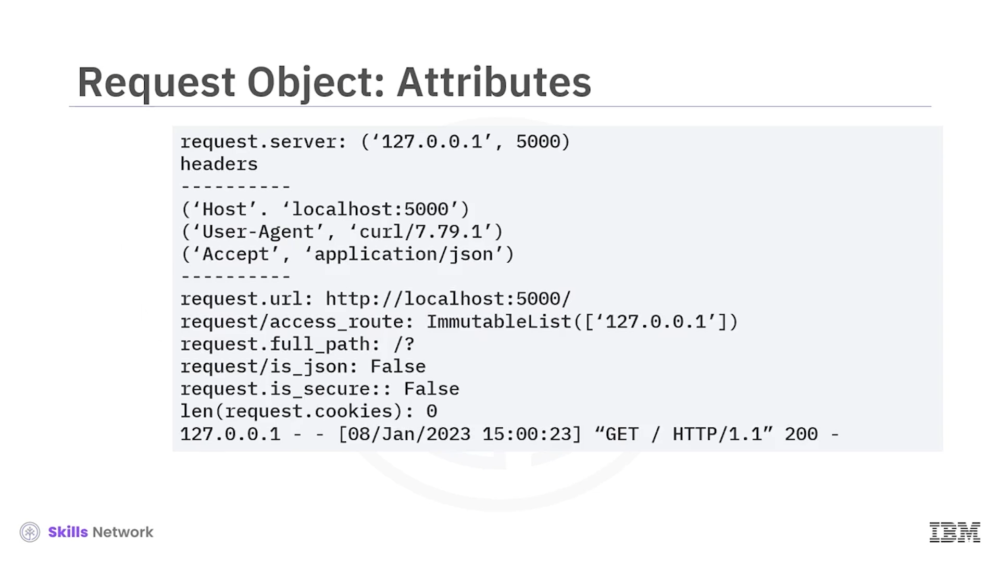
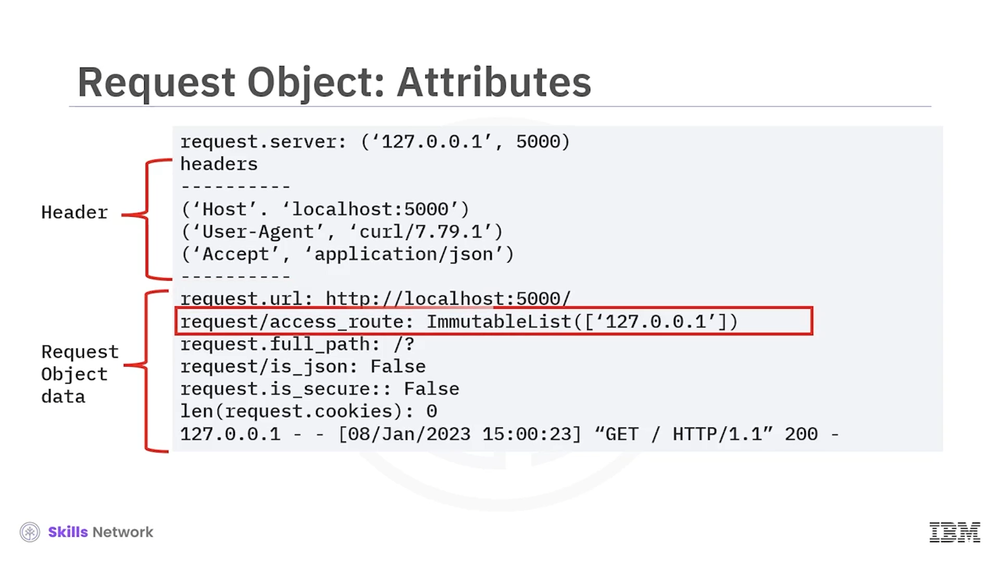
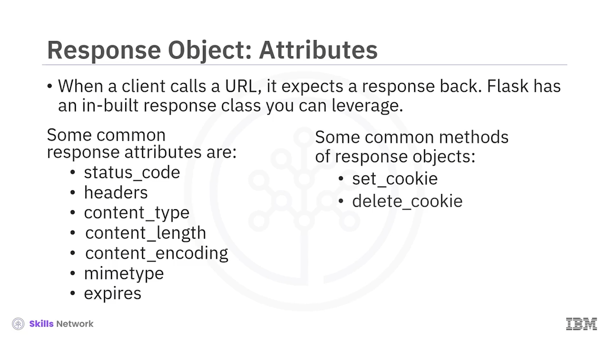
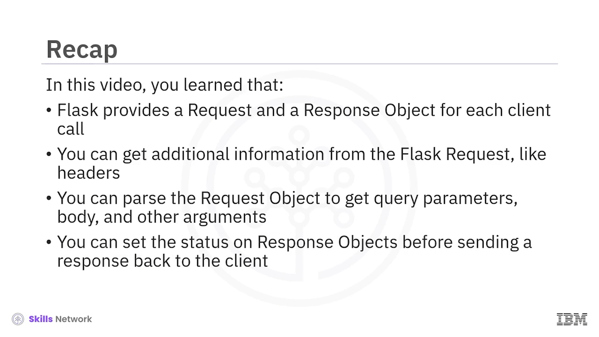

# 🔄 İstek ve Yanıt Nesneleri – GET ve POST Modlarını Kullanma

Request and Response Objects’a hoş geldiniz. Bu videoyu izledikten sonra şunları yapabileceksiniz: Flask *Request* nesnesini açıklamak ve Flask *Response* nesnesini açıklamak.

Haydi Flask’te rotaları ( *routes* ) nasıl özelleştireceğinizi öğrenelim.

Yolu ( *path* ) `RouteDecorator` kullanarak tanımlarsınız ve `AddApp.RouteDecorator` varsayılan olarak `Get` metodunu kullanır. İstemciler yalnızca belirtilen yola `Get` isteği gönderebilir.

Artık yolun hangi HTTP metotlarına yanıt vereceğini kontrol etmek için ikinci bir `methods` argümanı gönderebilirsiniz. Örneğin, aynı olan şu iki metoda bakın.

Bu koddaki `Get` metodu örtüktür ( *implicit* ), buna karşılık bu kod `Get` metodunu açıkça belirtmektedir.

---

## 🩺 GET ve POST ile Sağlık Kontrolü Örneği

Başka bir örneğe bakalım. `/health` URL’si `Get` ve `Post` isteklerine yanıt verecektir.

İstek `Get` ise, kod `OK` durumunu ve metod olarak `Get` değerini çıktılar.

İstek `Post` ise, kod `OK` durumunu ve metod olarak `Post` değerini çıktılar.

Bu, `Get` `curl` komutundan gelen çıktıdır; bu ise `Post` `curl` komutundan gelen çıktıdır.

---

## 📥 Flask Request Nesnesi

Flask’e yapılan tüm HTTP çağrıları, `Flask.Request` sınıfından oluşturulan *request* nesnesini içerir.

Bir istemci Flask sunucusundan bir kaynak talep ettiğinde, bu istek `AddApp.RouteDecorator` tarafından ele alınır.

Aynı metodun içinde, *request* nesnesini inceleyebilir ve keşfedebilirsiniz.

Şimdi, *request* nesnesinde aşağıdaki bilgiler mevcuttur:

* Sunucunun adresi, `(host, port)` şeklinde bir demet olarak
* İstekle birlikte gönderilen başlıklar ( *headers* )
* İstek tarafından talep edilen kaynak olan URL

`AccessRoute`, isteğin birden fazla kez yönlendirilmesi durumunda tüm IP adreslerini listeler.

`FullPath`, sorgu dizesi ( *query string* ) de dahil olmak üzere isteğin tam yolunu temsil eder.

`IsSecure`, bir istemci isteği `HTTPS` veya `WSS` protokolünü kullanarak yaptığında `true` değerine sahiptir.

`IsJSON`, istek JSON veri içeriyorsa `true` değerine sahiptir.

Ve `Cookies` sözlüğü, istekle birlikte gönderilen tüm çerezleri ( *cookies* ) içerir.

---

## 📡 Başlıklardan (Header) Erişilebilen Bilgiler

Buna ek olarak, başlıktan aşağıdaki verilere erişebilirsiniz:

* `CacheControl`, tarayıcılarda verinin nasıl önbelleğe alınacağına dair bilgiyi tutar.
* `Accept`, istemcinin hangi içerik tiplerini anlayabildiğini tarayıcıya bildirir.
* `AcceptEncoding`, içerik kodlamasını belirtir.
* `UserAgent`, istemciyi, uygulamayı, işletim sistemini veya sürümü tanımlar.
* `AcceptLanguage`, belirli bir dil ve yerel ayar ( *locale* ) talep eder.
* `Host`, isteğin gönderildiği sunucunun *host* ve port numarasını belirtir.

Artık *request* nesnesini özel bir *custom request* nesnesi ile değiştirebilirsiniz; ancak bu genellikle isteğe bağlıdır, çünkü Flask *request* sınıfının özellikleri ve metotları çoğu durumda yeterlidir.

---

## 🖨️ Örnek: Sunucuda Yazdırılan Request Değerleri

Şimdi, bir istemci istek yaptığında sunucuda yazdırılan bazı gerçek değerlere bakalım. Bu durumda istemci, terminalden çalışan `curl` komutudur.

*Request* sunucusu `127.0.0.1` ya da `localhost`’tur ve port `5000`’dür.

Sonraki adımda bazı başlıkları yazdırırsınız.

`Host`, `localhost:5000` tam yoludur.

`User-Agent`, `curl` sürümü `7.79.1`’dir.

Ve istemci, içerik tipi olarak `application/json` talep etmiştir.

---

## 🔎 Request Nesnesinin Diğer Özellikleri

Şimdi *request* nesnesinden bazı ek özelliklere bakalım:

* İstenen URL `http://localhost:5000`’dır.
* `AccessRoute` listesi, tek değer olarak `127.0.0.1` içerir.
* İstek için tam yol ( *full path* ), tek bir `/` ile gösterilen ana sayfa yoludur.
* `IsJSON`, `GET` isteğiyle herhangi bir veri göndermediğimiz için `false` değerindedir.
* `IsSecure`, URL `HTTP` ve `HTTPS` olmadığı için `false` değerindedir.
* Ve `Cookies` sözlüğünün uzunluğu sıfırdır.

---

## 📥 Request Gövdesinden ve Parametrelerden Veri Alma

*Request* nesnesinden bilgi almanın birden fazla yolu vardır.

`get_data`, `POST` isteğinden veriye bayt ( *bytes* ) olarak erişmek için kullanılır. Bu durumda veriyi ayrıştırma ( *parse* ) sorumluluğu sizdedir.

`get_json` metodunu da kullanarak `POST` isteğinden ayrıştırılmış JSON verisini alabilirsiniz.

Artık Flask, veriyi belirli bir türe ayrıştırmak zorunda kalmamanız için doğrudan ihtiyaç duyduğunuz bilgiyi sağlayan daha odaklı metotlar da sunar:

* `Args`, sorgu parametrelerini ( *query parameters* ) bir sözlük olarak verir.
* `JSON`, veriyi bir sözlüğe ayrıştırır.
* `Files`, kullanıcı tarafından yüklenen dosyaları sağlar.
* `Form`, bir form gönderiminde ( *form submission* ) gönderilen tüm değerleri içerir.
* `Values`, `Args` verisini `Form` verisiyle birleştirir.

Artık *request* nesnesinin nasıl göründüğünü ve istek parametreleri ile gövdeden veri almak için metotları bildiğinize göre, bu veriden belirli değerleri nasıl çıkaracağımıza bakalım.

---

## 🎯 Belirli Değerleri Çekmek ve Multidict Yapıları

Şimdiye kadar gördüğünüz metotların dönüş tipleri `Multidict`, `ImmutableMultidict` veya `CombinedMultidict`’tir.

Bu veri yapılarının tümü, bir Python sözlüğü gibi davranır ve değerleri çıkarmak için indeksleme ( *indexing* ) ya da `get` metodunu kullanabilirsiniz.

Verilen URL için, `Capstone` ve `Rating` sorgu parametrelerini almak istersiniz.

Önce, metodunuzda Flask ve `request` modüllerini içe aktarırsınız.

`course` argümanının değerini indeksleme kullanarak çıkarırsınız.

Sonra, `rating` argümanının değerini `get` metodunu kullanarak çıkarırsınız.

`get` metodu, argüman mevcut değilse `None` değerini döndürür; buna karşılık indeksleme, bir hata döndürür ve sunucuyu `400 bad request` ile durdurur.

Mesaj, tarayıcıda `course` olarak `Capstone` ve `rating` olarak `10` içeren isteği gösterir.

---

## 📤 Flask Response Nesnesi

Flask, bir *request* nesnesi sağladığı gibi bir *response* nesnesi de sağlar ve bu nesneyi istemciye özel nitelikler ve başlıklar ( *headers* ) göndermek için kullanabilirsiniz.

Bazı yaygın *response* özellikleri şunlardır:

* *Status code* , isteğin başarılı veya başarısız olduğunu belirtir.
* *Headers* , yanıt hakkında daha fazla bilgi verir.
* *Content type* , talep edilen kaynağın ortam türünü ( *media type* ) gösterir.
* *Content length* , yanıt mesaj gövdesinin boyutudur.
* *Content encoding* , yanıta uygulanan herhangi bir kodlamayı belirtir, böylece istemci veriyi nasıl çözeceğini bilir.
* *MIME type* , yanıtın ortam türünü ayarlar.
* *Expires* , yanıtın artık geçersiz sayılacağı tarih veya zamanı içerir.

İşte *response* nesneleri üzerinde kullanılan bazı standart metotlar:

* `set_cookie`, istemcide bir tarayıcı çerezi ayarlar.
* `delete_cookie`, istemcide bir çerezi siler.

---

## ⚙️ Response Nesnesiyle Çalışma Biçimleri

Şimdi, Flask’in response nesnesiyle farklı metotları kullanarak nasıl çalıştığını öğrenelim.

`@Route` metodundan veri döndürdüğünüzde, durum kodu ( *status code* ) 200 ve MIME türü HTML olan bir *response* nesnesi, sizin için otomatik olarak oluşturulur.

`jsonify` de otomatik olarak bir *response* nesnesi oluşturur.

Özel bir *response* oluşturmak için `makeResponse` kullanabilirsiniz.

Flask, istemciyi başka bir URL’ye yönlendirmek için 302 durum kodu döndüren özel bir `redirect` metodu sağlar.

Ve son olarak Flask, bir hata durumu içeren bir yanıt döndürmek için `abort` metodunu sağlar.

---

## 🧾 Videoda Öğrendikleriniz

Bu videoda şunları öğrendiniz:

* Flask, her istemci çağrısı için bir *request* ve bir *response* nesnesi sağlar.
* Flask *request* nesnesinden başlıklar ( *headers* ) gibi ek bilgiler alabilirsiniz.
* İstek nesnesini ayrıştırarak sorgu parametrelerini, gövdeyi ve diğer argümanları alabilirsiniz.
* İstemciye yanıt göndermeden önce *response* nesnelerinde durum ( *status* ) ayarlayabilirsiniz.

