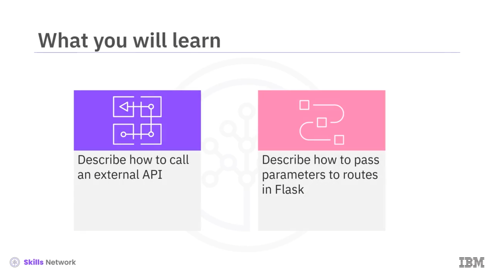
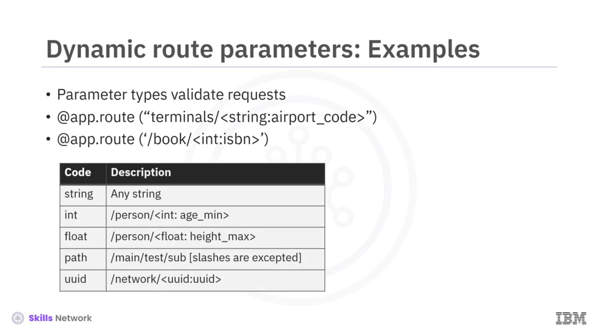

# 🔀 Dinamik Rotalar

“Dynamic Routes” bölümüne hoş geldiniz. Bu videoyu izledikten sonra şunları yapabileceksiniz:

* Flask içinde harici bir  *API* ’yi nasıl çağıracağınızı açıklamak
* Flask’te parametreleri  *routes* ’lara nasıl aktaracağınızı açıklamak

---

## 🌍 Flask’te Harici API Çağırma

Flask’te harici bir  *API* ’yi nasıl çağırabileceğinize dair bir örneğe bakalım.

Bunun en kolay yolu, Python `requests` kütüphanesini kullanmaktır. Harici  *API* ’den dönen JSON’u doğrudan istemcinize geri gönderebilirsiniz. Ancak, verileri istemcinize göndermeden önce işleyebilirsiniz.

İşte bir örnek: Önce, `flask` ve `request` modüllerini içe aktarırsınız. Buradaki kod, `requests` kütüphanesini zaten yüklemiş olduğunuzu varsaymaktadır.

---

## 📡 openlibrary API Örneği ve Durum Kodları

Sonraki adımda,  *route* ’unuzu tanımlayabilirsiniz.

`requests` kütüphanesini kullanarak  *openlibrary API* ’sine istek gönderir ve yazar **Michael Crichton** hakkında bilgi ararsınız.

Yanıtı `res` adlı bir değişkende saklarsınız.

Daha sonra,  *openlibrary API* ’sinden gelen yanıtın durum kodunun 200 olup olmadığını kontrol edersiniz.

Eğer yanıt 200 ise, JSON’u istemciye geri döndürürsünüz.

Eğer yanıt 404 olursa, “ **Something went wrong.** ” mesajını gönderirsiniz.

Son olarak, bu varsayımsal durumda, yanıt başka bir şey olursa 500 durum koduyla birlikte “ **Server error.** ” mesajını döndürürsünüz.

---

## 📘 RESTful API’lerde Dinamik Parametreler

RESTful  *API* ’ler geliştirirken, bazı *resource-id* değerlerini istek URL’sinin bir parçası olarak gönderebilirsiniz.

Örneğin, Uluslararası Standart Kitap Numarası ( *International Standard Book Number – ISBN* ) ile kitap bilgisi döndüren bir *endpoint* oluşturmak istiyorsunuz; ancak ISBN’i kodun içine sabitlemek ( *hard coding* ) yerine, istemcinin bunu URL’nin bir parçası olarak göndermesini istiyorsunuz.

Flask, bu amaç için dinamik yönlendirme ( *dynamic routing* ) sağlar.

Somut bir örneğe bakalım:

URL’nin dinamik bir parçası olarak `isbn` adlı bir değişken ekleyin.

Sonra bu değişkeni  *openlibrary API* ’sine iletin.

Sonuç, ardından istemciye geri gönderilir.

---

## 🧮 Parametre Tipleri ve Doğrulama

Flask ayrıca parametre türünü ( *parameter type* ) ayarlamanıza izin verir.

Framework, gelen istekleri doğrulamak için bu bilgiyi kullanır.

Örneğin, San Francisco havaalanındaki terminal sayısını almak için `terminals` ve `SFO` şeklinde bir *endpoint* oluşturabilirsiniz.

Bu  *route decorator* , kullanıcı URL’nin sonuna bir `string` gönderirse tetiklenir.

Benzer şekilde, önceki örnekte ISBN için türü `number` (sayı) olarak belirleyebilirsiniz.

---

## 🧱 Flask’te Diğer Parametre Tipleri

İşte Flask’teki bazı diğer parametre türleri örnekleri:

`string`, `int` ve `float` basit parametrelerdir;

buna karşın, bir web yolu ( *web path* ) veya klasör yolu belirtmek için `path` gibi daha karmaşık tipleri de kullanabilirsiniz ya da  *Universal Unique Identifier (UUID)* , *Globally Unique Identifier (GUID)* gibi benzersiz bir kimliği göstermek için `uuid` kullanabilirsiniz.

---

## 🆔 UUID ile Dinamik Route Örneği

İşte `UUID`’ye bir örnek:

Ağ hakkında bilgi almak için belirli bir `UUID`’ye sahip `"network"` adlı bir *endpoint* oluşturabilirsiniz.

Bu kodu şöyle yazabilirsiniz:

* *Route* , `uuid` türünde bir `uuid` değişkeni bekler,
* `uuid`, metoda argüman olarak aktarılır,
* `uuid` bulunursa bir başarı mesajı döndürürsünüz,
* aksi takdirde, uygun bir mesajla birlikte bir hata kodu döndürürsünüz.

---

## 🧾 Videoda Öğrendikleriniz

Bu videoda şunları öğrendiniz:

* Sorgu parametreleri ( *query parameters* ), gövde ( *body* ) ve diğer argümanları almak için  *Request Object* ’i ayrıştırabilirsiniz.
* İstemciye yanıt göndermeden önce *Response* nesnelerinde durum ( *status* ) ayarlayabilirsiniz.
* RESTful  *endpoint* ’ler oluşturmak için dinamik rotaları ( *dynamic routes* ) kullanabilirsiniz.

