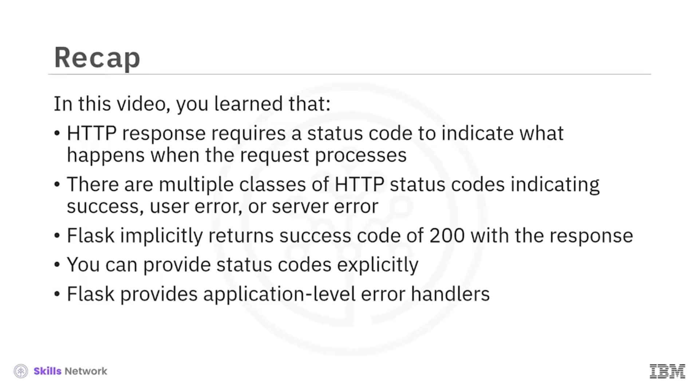

# 🚨 Error Handling (Hata Yönetimi)

Error Handling bölümüne hoş geldiniz. Bu videoyu izledikten sonra şunları yapabileceksiniz:

* *API* servislerinin döndürebileceği farklı *HTTP status* değerlerini açıklamak
* Flask’te hata yönetiminin nasıl çalıştığını açıklamak
* *API endpoint* ’lerinizden hataları nasıl döndüreceğinizi açıklamak

---

## 📊 HTTP Durum Kodlarının Kategorileri

Her *HTTP* yanıtı, farklı hata ve başarı durumlarını belirten üç basamaklı bir kod içerir ve bu hata kodunu yorumlamak ( *consume etmek* ) istemcinin sorumluluğundadır.

Geçerli yanıt kodu aralığı **100 ile 599** arasındadır. Hata kodları, her biri 100’lük bloklar halinde kategorilere ayrılmıştır.

* **100–199** aralığındaki hata kodları, isteğin alındığını ve bunların bilgilendirici ( *informational* ) olduğunu gösterir.
* **200–299** aralığındaki kodlar, isteğin alındığını ve istenen işlemin başarılı olduğunu gösterir.
* **300’lü** kodlar, sunucuda bir yönlendirme ( *redirection* ) olduğunu gösterir.
* **400–499** aralığındaki kodlar, istekte bir hata olduğunu gösterir.
* Son olarak **500–599** aralığındaki kodlar, sunucu tarafında bir hata olduğunu gösterir.

Bu derste yazacağınız  *API* ’ler bu adlandırmayı ( *nomenclature* ) takip edecek.

Örneğin, istemci, mevcut olmayan bir kaynak için `GET` isteği gönderirse, siz de `404` yanıtı gönderebilirsiniz. Yanlış istekler için ise `400` durum ( *status* ) kodu ile yanıt verebilirsiniz.

---

## 🧱 Flask’te Varsayılan ve Özel Durum Kodları

Flask sunucusu, `@app.route` metodundan döndüğünüzde otomatik olarak `200 OK` durumu döndürür.

Bir isteğe yanıt vermek için `jsonify` metodunu kullandığınızda da varsayılan olarak yine `200` döndürülür.

Verilen kod çalıştığında, durum kodu `200` olan başarılı bir yanıt gönderilecektir.

Artık kodunuzun, varsayılan olandan farklı bir kod döndürebileceğini biliyorsunuz. Flask, yanıtla birlikte bir *tuple* içinde durum kodu göndermenize izin verir.

İlgili örnekte, `"my first application in action"` HTML yanıtını, durum kodu `200` ile birlikte geri gönderirsiniz.

Durum kodunu açıkça ayarlamak için `make_response` metodunu da kullanabilirsiniz. Bu kod, önceki kodla aynı HTML mesajını ve yine `200`  *HTTP status code* ’unu döndürür; ancak burada `make_response` metodunu kullanırsınız.

---

## 📚 Sık Kullanılan HTTP Durum Kodları

Bu derste kullanabileceğiniz birkaç kod örneğine bakalım:

* `200` durumu, varsayılan olarak döndürülür ve isteğin başarılı olduğunu belirtir.
* `201`, sunucunun kaynağı ( *resource* ) başarıyla oluşturduğunu istemciye bildirir.
* `202`, isteğin kabul edildiğini ve işleme alındığını, işlemin devam ettiğini gösterir; toplu işlem ( *batch processing* ) operasyonlarında yaygındır.
* Sunucu, bir isteği başarıyla tamamladıktan sonra, içerik döndürmeden `204` döndürür. Bu durum, tarayıcının herhangi bir işlem yapmasını istemediğiniz durumlarda kullanışlıdır; örneğin, kullanıcının mevcut sayfada kalması gibi.

Hata tarafında:

* `400`, geçersiz bir isteği gösterir. Bu durum, parametrelerin eksik veya hatalı olduğunu ya da isteğin başka bir şekilde geçersiz olduğunu ima edebilir.
* `401`, kimlik bilgilerinin ( *credentials* ) eksik veya geçersiz olduğunu gösterir.
* `403`, istemci kimlik bilgilerinin isteği yerine getirmek için yeterli olmadığını ima eder.
* Sunucu kaynağı bulamazsa, `404` durumu döndürür.
* `405`, istenen işlemin desteklenmediğini gösterir.
* `500`, sunucuda bir hata olduğunda kullanılır.

Artık farklı *HTTP* kodlarını bildiğinize göre, bir geliştirici olarak servisten doğru kodu döndürmeniz gerekir.

---

## 🔍 Örnek: `search_response` Metodu ve Durum Kodları

Şimdi bir örneğe bakalım.

Bu `search_response` metodu, veritabanındaki `q` sorgu parametresini arar. Servis, sorgunuzu ayrıştırdıktan sonra sahte ( *mock* ) `fetch_from_database` metodunu çağırır.

Kaynak mevcutsa, kod kaynağı istemciye döndürür. Sunucu, örtük olarak `200` kodunu döndürür ve kaynak bulunamazsa `404` döndürür.

---

## 🧪 `curl` ile Endpoint Çağrıları

Şimdi bu  *endpoint* ’i `curl` programını kullanarak çağıralım.

1. Rota, herhangi bir sorgu parametresi olmadan çağrılır.

   `curl` programı, gövdede `"input parameter missing"` mesajını ve `422` dönüş durumunu verir.
2. Sonraki adımda, rota doğru *resource id* ile çağrılır.

   `curl` komutu, gövde olarak kaynağı ve `200` durumunu döndürür.
3. Son olarak, mevcut olmayan bir kaynakla çağrı yapılır.

   `curl` komutu, `"resource not found"` mesajını ve `404` durumunu döndürür.

---

## ⚙️ Flask’te Uygulama Seviyesinde Hata İşleme

Flask, hata mesajlarını uygulama seviyesinde ele almanın bir yolunu sağlar.

Burada, `404` hatasını işleyen ve `"API not found"` mesajını `404` durum koduyla döndüren bir metot görürüz.

Benzer şekilde, bu kod parçası ( *snippet* ), `500` hataları için bir hata işleyici ( *error handler* ) oluşturur ve `"something went wrong on the server"` mesajını döndürür.

---

## 🧾 Videoda Öğrendikleriniz

Bu videoda şunları öğrendiniz:

* *HTTP response* , isteğin işlendiğinde ne olduğunu göstermek için bir durum kodu gerektirir.
* Başarıyı, kullanıcı hatasını veya sunucu hatasını gösteren birden fazla *HTTP status code* sınıfı vardır.
* Flask, yanıtla birlikte örtük olarak `200` başarı kodunu döndürür.
* Durum kodlarını açıkça sağlayabilirsiniz.
* Ve Flask, uygulama seviyesinde hata işleyicileri ( *application-level error handlers* ) sunar.

