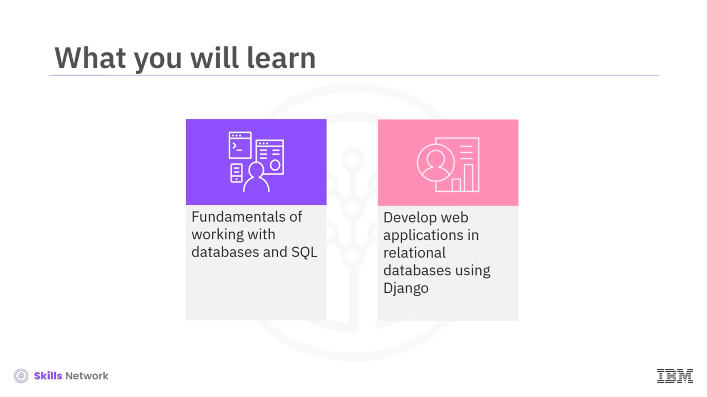
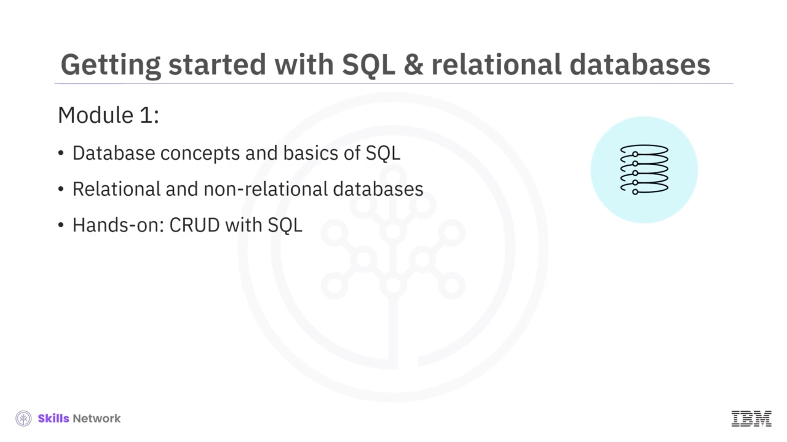
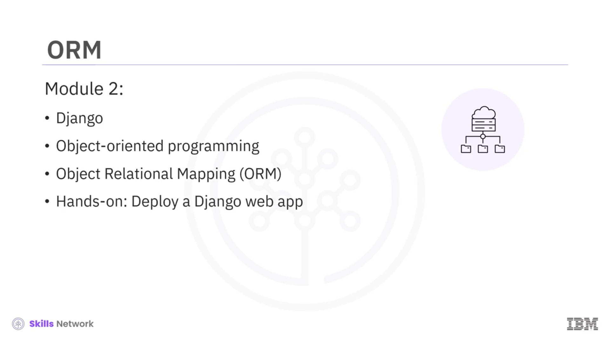
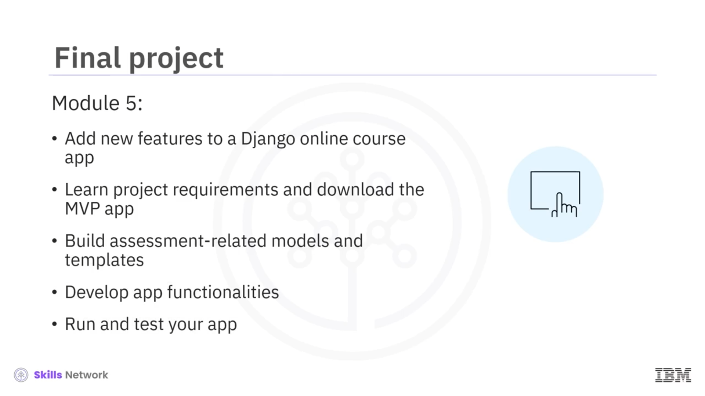
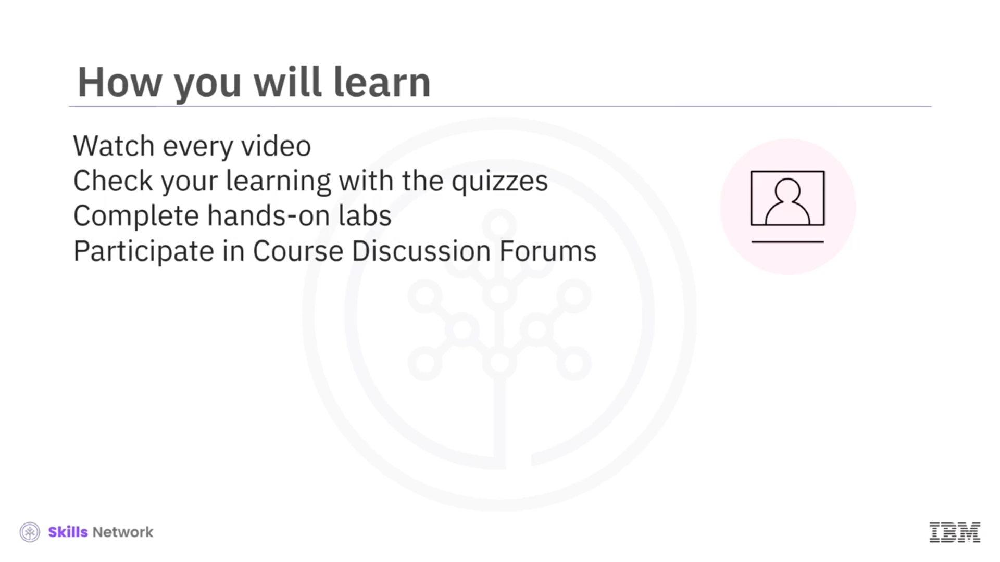

# 📚 Kurs Tanıtımı

## 👋 Hoş Geldiniz

Django kullanarak veritabanı destekli uygulamalar geliştirmeye yönelik bu giriş niteliğindeki derse hoş geldiniz.

Bu derste, veritabanlarıyla çalışma ve  *SQL* ’in temelleri hakkında bilgi edineceksiniz. Ayrıca Python’daki Django çatısını ( *framework* ) kullanarak verileri ilişkisel veritabanlarında depolayan ve yöneten web uygulamaları geliştirme becerilerinizi geliştireceksiniz.

Bu ders, hem yazılım geliştirici olmak isteyenlere hem de hâlihazırda yazılım geliştirici olarak çalışanlara uygundur.

Bu dersten en iyi şekilde yararlanmak için GitHub, Python, HTML ve CSS hakkında çalışma bilgisine sahip olmalısınız. Bu beceriler, IBM Full Stack Software Developer Professional Certificate ve IBM Back-End Development Professional Certificate programlarındaki önceki derslerde öğretilmektedir.

---

## 🧱 Modül 1: Veritabanı Temelleri ve SQL

Birinci modül, temel veritabanı kavramlarını ve verileri sorgulamak ve yönetmek için kullanılan basit ama güçlü bir programlama dili olan  *SQL* ’in temellerini tanıtır.

İlişkisel ve ilişkisel olmayan veritabanlarını öğrenecek ve *Create, Read, Update, Delete (CRUD)* işlemlerini *SQL* kullanarak gerçekleştirmek için birkaç uygulamalı lab çalışmasını tamamlayacaksınız.

---

## 🧩 Modül 2: Django ve Nesne Yönelimli Programlama

İkinci modülde  *Django* ’yu, nesne yönelimli programlamayı ( *Object-Oriented Programming* ) öğrenecek ve nesne-ilişkisel eşleme, yani *Object-Relational Mapping (ORM)* çatısı ve araçlarıyla tanışacaksınız.

İlk Django web uygulamanızı dağıtarak ( *deploy ederek* ) uygulamalı deneyim kazanacaksınız.

---

## 🧮 Modül 3: Django Model-View-Template Deseni

Üçüncü modül, Django *Model-View-Template (MVT)* deseninin bir web sitesinde verileri sunmak için nasıl birlikte çalıştığını inceler.

Django  *view* ’larını ve  *template* ’lerini birleştirerek verilerinizi dinamik web sayfaları olarak nasıl sunacağınızı keşfedeceksiniz. Ayrıca Arama ( *Search* ) ve Filtre ( *Filter* ) gibi kullanıcı arayüzü ( *UI* ) özelliklerine sahip bir yönetim (admin) sitesi oluşturacaksınız.

---

## 🏗️ Modül 4: Sınıf Tabanlı Görünümler ve Bootstrap

Dördüncü modülde bir sınıf tabanlı görünüm ( *class-based view* ) inşa etmek, Django becerilerinize yenilerini katacaktır.

Ayrıca Django’da kimlik doğrulama ( *authentication* ) ve yetkilendirme ( *authorization* ) hakkında bilgi edinecek ve etkileşimli web sayfaları oluşturmak için açık kaynaklı bir web ön yüz çatısı ( *front-end framework* ) olan  *Bootstrap* ’i Django şablonunuza ( *template* ) nasıl ekleyeceğinizi öğreneceksiniz.

Giriş, çıkış ( *log-out* ) ve kullanıcı kayıt yeteneklerine sahip bir Django web uygulaması oluşturacaksınız.

---

## 🚀 Modül 5: Final Projesi

Beşinci modülde, bir Django çevrimiçi kurs uygulamasına yeni özellikler ekleyerek becerilerinizi uygulamaya döktüğünüz bir final projesini tamamlayacaksınız.

Final projesinde şunları yapacaksınız:

* Proje gereksinimlerini öğrenecek ve *MVP (Minimum Viable Product)* uygulamasını indireceksiniz.
* Modeller ( *models* ) ve şablonlar ( *templates* ) inşa edeceksiniz.
* Sonuçları göndermek, görüntülemek ve değerlendirmek için yeni uygulama işlevleri geliştireceksiniz.
* Uygulamanızı çalıştıracak ve test edeceksiniz.

---

## ✅ Kurstan En İyi Şekilde Yararlanma

Bu dersten en fazla faydayı sağlamak için her videoyu izleyin ve her sınav ( *quiz* ) ile öğrenmenizi kontrol edin.

Yeni becerilerinizi uygulamalı lab çalışmalarıyla pekiştirin ve yeteneklerinizi gösteren bir portföy oluşturmaya devam edin.

Ayrıca Kurs Tartışma Forumlarında ders ekibi ve akranlarınızla ( *peers* ) özgürce iletişim kurmaktan çekinmeyin.

Bu heyecan verici yolculuğun bir sonraki adımına başladığınız için tebrikler. Ve bol şans.

