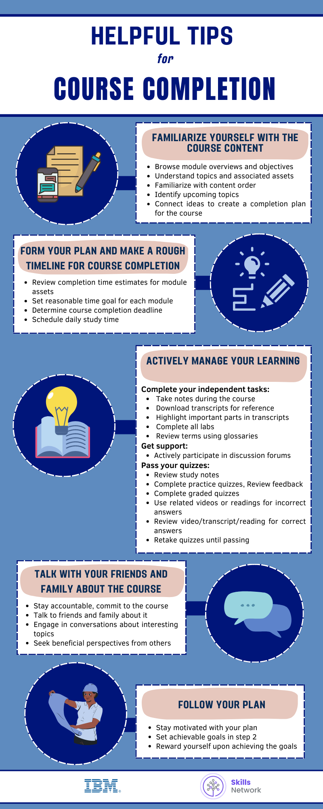

# 🎓 Kursu Tamamlamak İçin Faydalı İpuçları

## 📘 Kurs İçeriğine Aşina Ol

* Modül genel bakışlarını ve hedeflerini gözden geçir
* Konuları ve ilişkili öğrenme materyallerini anla
* İçeriğin sıralamasına aşina ol
* Gelecek konuları belirle
* Fikirleri ilişkilendirerek kurs için bir tamamlama planı oluştur

---

## 🗓️ Planını Oluştur ve Kursu Tamamlamak İçin Yaklaşık Bir Zaman Çizelgesi Hazırla

* Modül materyalleri için tahmini tamamlama sürelerini gözden geçir
* Her modül için makul bir zaman hedefi belirle
* Kursun tamamlanması için son tarihi belirle
* Günlük çalışma süresini planla

---

## 🧠 Öğrenmeni Aktif Şekilde Yönet

**Bağımsız görevlerini tamamla:**

* Kurs boyunca not al
* Başvuru için transkriptleri indir
* Transkriptlerdeki önemli kısımları vurgula
* Tüm lab’leri tamamla
* Terimleri sözlükleri ( *glossary* ) kullanarak gözden geçir

**Destek al:**

* Tartışma forumlarına aktif olarak katıl

**Kısa sınavları geç:**

* Çalışma notlarını gözden geçir
* Deneme kısa sınavlarını tamamla, geri bildirimleri gözden geçir
* Notlandırılan kısa sınavları tamamla
* Yanlış cevaplar için ilgili videoları veya okumaları kullan
* Doğru cevaplar için video/transkript/okumayı gözden geçir
* Geçene kadar kısa sınavları tekrar çöz

---

## 💬 Kurs Hakkında Arkadaşların ve Ailenle Konuş

* Sorumluluk sahibi ol, kursa bağlı kal
* Bu konu hakkında arkadaşların ve ailenle konuş
* İlginç konular hakkında sohbetlere katıl
* Başkalarından faydalı bakış açıları iste

---

## ✅ Planına Sadık Kal

* Planınla motive kal
* 2. adımda ulaşılabilir hedefler belirle
* Hedeflerine ulaştığında kendini ödüllendir

