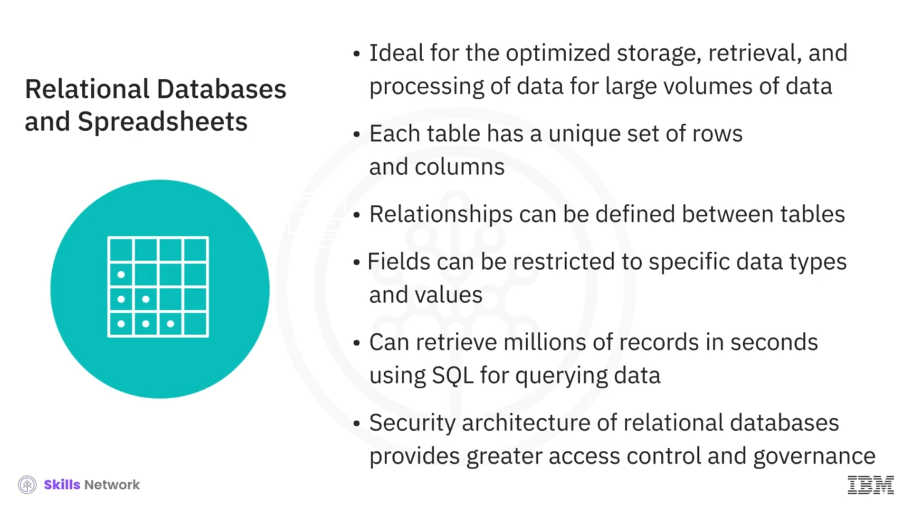
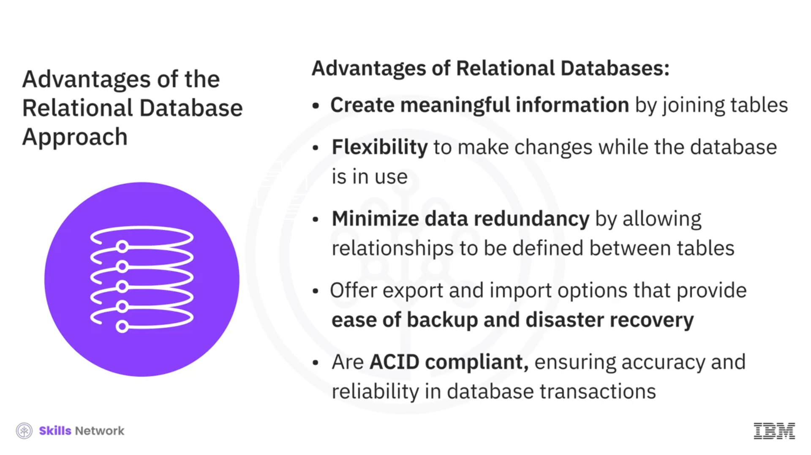
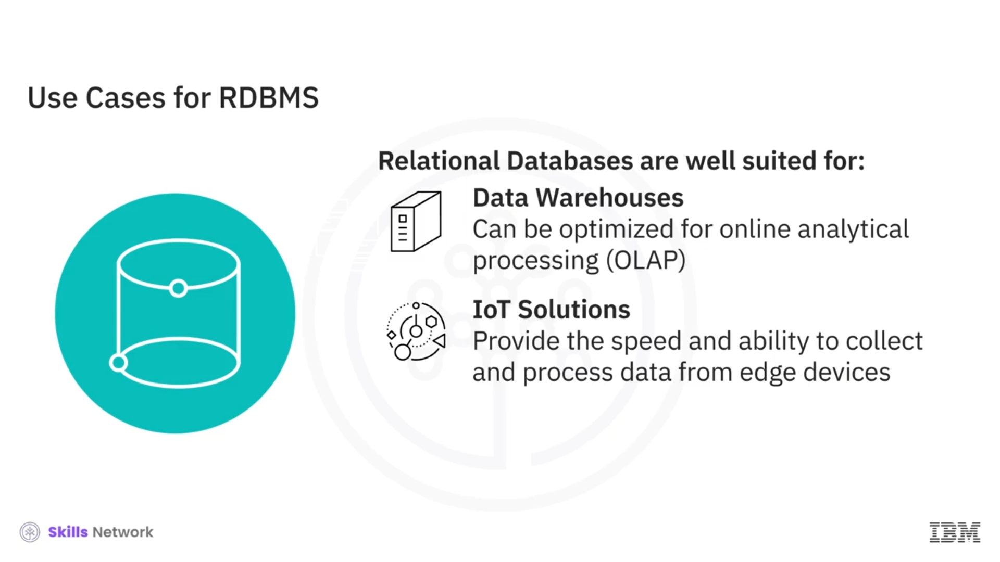
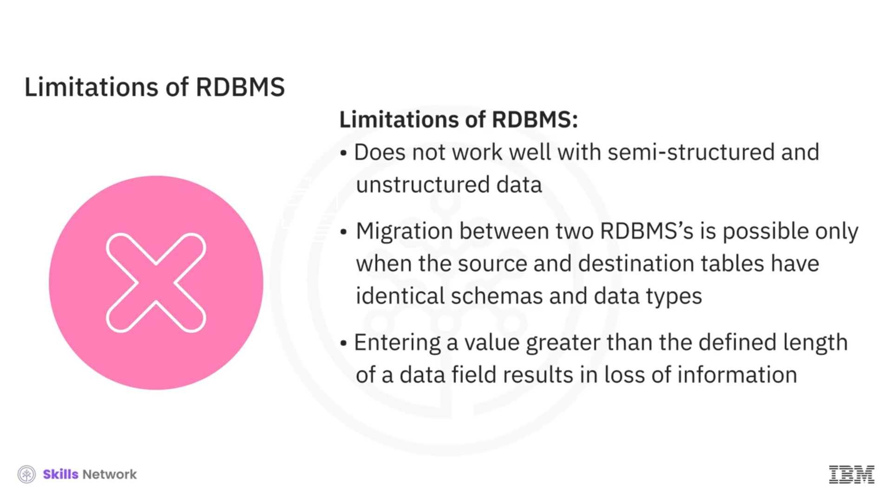

# 🗄️ İlişkisel Veritabanları

## 📊 Tablolar, Satırlar ve Sütunlar

İlişkisel veritabanı, tabloların her biri için ortak olan verilere dayalı olarak birbirine bağlanabildiği veya ilişkilendirilebildiği tablo yapısında düzenlenmiş bir veri koleksiyonudur.

Tablolar satır ve sütunlardan oluşur; satırlar kayıtları, sütunlar ise öznitelikleri temsil eder.

Bir şirketteki her bir müşteriyle ilgili verileri tutan bir *Customer Table* örneğini ele alalım. *Customer Table* içindeki sütunlar veya öznitelikler,  *Customer ID* ,  *Customer Name* , *Customer Address* ve  *Customer Primary Phone* ’dur. Ve her satır bir müşteri kaydıdır.

Şimdi, tabloların her biri için ortak olan verilere dayalı olarak birbirine bağlanması veya ilişkilendirilmesinden ne kastettiğimizi anlayalım.  *Customer Table* ’a ek olarak, şirket her bir müşteriye ait çok sayıda bireysel işlemi tanımlayan verileri içeren işlem tablolarını ( *transaction tables* ) da tutar.

Bir *transaction table* için sütunlar,  *Transaction Date* ,  *Customer ID* , *Transaction Amount* ve  *Payment Method* ’u içerebilir. *Customer Table* ve transaction tabloları, ortak *Customer ID* alanına göre ilişkilendirilebilir.

 *Customer Table* ’ı, belirli bir dönemdeki tüm işlemleri birleştiren bir müşteri ekstresi gibi raporlar üretmek için sorgulayabilirsiniz. Tabloları ortak verilere göre ilişkilendirme yeteneği, tek bir sorguyla bir veya daha fazla tablodaki verilerden tamamen yeni bir tablo elde etmenizi sağlar.

Bu ayrıca, mevcut tüm veriler arasındaki ilişkileri anlamanıza ve daha iyi kararlar almak için yeni içgörüler elde etmenize olanak tanır. İlişkisel veritabanları, verileri sorgulamak için yapılandırılmış sorgu dili, yani *Structured Query Language (SQL)* kullanır. Bu kursta daha sonra SQL hakkında daha fazla bilgi edineceğiz.

---

## 🧩 Düz Dosyalardan Farkları ve Tasarım Özellikleri

İlişkisel veritabanları, elektronik tablolar gibi düz dosyaların örgütsel ilkeleri üzerine inşa edilir; veriler, iyi tanımlanmış bir yapı ve şemayı izleyerek satır ve sütunlar halinde düzenlenmiştir. Ancak benzerlik burada sona erer.

İlişkisel veritabanları, tasarımları gereği, büyük veri hacimleri için verilerin depolanmasının, geri alınmasının ve işlenmesinin optimize edilmesi konusunda idealdir.

Satır ve sütun sayısı sınırlı olan elektronik tablolardan farklı olarak, ilişkisel bir veritabanındaki her tablonun benzersiz bir satır ve sütun kümesi vardır ve tablolar arasında tanımlanabilen ilişkiler veri tekrarını en aza indirir.

Ayrıca, veritabanı alanlarını belirli veri türleri ve değerlere kısıtlayabilirsiniz; bu da düzensizlikleri en aza indirir ve daha büyük tutarlılık ile veri bütünlüğüne yol açar.

İlişkisel veritabanları, verileri sorgulamak için SQL kullanır; bu da milyonlarca kaydı işleme ve büyük miktarda veriyi saniyeler içinde geri getirme avantajı sağlar.

Ayrıca, ilişkisel veritabanlarının güvenlik mimarisi veriye kontrollü erişim sağlar ve veriyi yönetmeye yönelik standartlar ve politikaların uygulanabilmesini de güvence altına alır.

---

## ☁️ Ölçek, Türler ve Bulut Tabanlı Çözümler

İlişkisel veritabanları, küçük masaüstü sistemlerinden devasa bulut tabanlı sistemlere kadar uzanır. Bu sistemler, açık kaynaklı, kurum içinde desteklenen ve ticari destek sunulan açık kaynaklı ya da ticari, kapalı kaynaklı sistemler olabilir.

IBM DB 2, Microsoft SQL Server, MySQL, Oracle database ve PostgreSQL, popüler ilişkisel veritabanlarından bazılarıdır.

Bulut Tabanlı İlişkisel Veritabanları ( *Cloud-Based Relational Databases* ), Hizmet Olarak Veritabanı ( *Database-as-a-Service* ) olarak da adlandırılır ve bulutun sunduğu sınırsız işlem ve depolama yeteneklerine erişebildikleri için yaygın olarak kullanılmaktadır.

Popüler Bulut İlişkisel Veritabanlarından bazıları arasında Amazon Relational Database Service veya RDS, Google Cloud SQL, IBM DB 2 on Cloud, Oracle Cloud ve SQL Azure bulunur.

 *RDBMS* , olgun ve iyi belgelenmiş bir teknolojidir; bu da öğrenilmesini ve nitelikli yetenek bulunmasını kolaylaştırır. İlişkisel Veritabanı Yaklaşımının en önemli avantajlarından biri, tabloları birleştirerek anlamlı bilgiler oluşturma yeteneğidir.

---

## ✅ Avantajlar

* **Esneklik:** Diğer bazı avantajları arasında esneklik vardır. *SQL* kullanarak, veritabanı çalışırken ve sorgular yapılırken bile yeni sütunlar ekleyebilir, yeni tablolar ekleyebilir, ilişkilerin adını değiştirebilir ve diğer değişiklikleri yapabilirsiniz.
* **Azaltılmış yineleme:** *Reduced redundancy* (azaltılmış yineleme) bir diğer avantajdır. İlişkisel veritabanları veri tekrarını en aza indirir. Örneğin, bir müşteriye ait bilgiler  *Customer Table* ’da tek bir kayıtta görünür ve müşteriye ait  *Transaction Table* ,  *Customer Table* ’a bir bağlantı saklar.
* **Yedekleme ve felaket kurtarmanın kolaylığı:** *Ease of backup and disaster recovery* de önemli bir avantajdır. İlişkisel veritabanları, yedekleme ve geri yüklemeyi kolaylaştıran, kolay dışa aktarma ve içe aktarma seçenekleri sunar. Dışa aktarma işlemleri, veritabanı çalışırken de gerçekleşebilir; bu da bir hata durumunda geri yüklemeyi kolaylaştırır. Bulut Tabanlı İlişkisel Veritabanları sürekli yansıtma ( *continuous mirroring* ) yapar; bu da geri yükleme sırasında veri kaybının saniyelerle veya daha azıyla ölçülebileceği anlamına gelir.
* **ACID uyumluluğu:** *ACID compliance* bir diğer avantajdır. ACID, atomiklik, tutarlılık, yalıtım ve kalıcılık anlamına gelir. ACID uyumluluğu, veritabanındaki verilerin hatalara rağmen doğru ve tutarlı kalmasını ve veritabanı işlemlerinin güvenilir bir şekilde işlenmesini ifade eder.

Şimdi, ilişkisel veritabanları için bazı kullanım örneklerine bakacağız.

---

## 💼 Kullanım Senaryoları

* **Online Transaction Processing (OLTP) uygulamaları:** *Online Transaction Processing (OLTP)* uygulamaları, yüksek hızda çalışan işlem odaklı görevlere odaklanır. İlişkisel veritabanları, çok sayıda kullanıcıyı barındırabildikleri için OLTP uygulamaları için son derece uygundur. Küçük miktarlarda veriyi ekleme, güncelleme veya silme yeteneğini desteklerler ve ayrıca sık sorgu ve güncellemeleri, aynı zamanda hızlı yanıt sürelerini de desteklerler.
* **Veri Ambarları:** *Data Warehouses* (Veri Ambarları) bağlamında, ilişkisel veritabanları, geçmiş verilerin iş zekâsı için analiz edildiği çevrimiçi analitik işleme, yani *Online Analytical Processing (OLAP)* için optimize edilebilir.
* **IoT Çözümleri:** *IoT Solutions* — *Internet of Things* (Nesnelerin İnterneti) veya IoT çözümleri, hızın yanı sıra, uç cihazlardan veri toplama ve işleme yeteneğini gerektirir; bu cihazlar hafif bir veritabanı çözümüne ihtiyaç duyar.

---

## 🚫 Sınırlamalar ve Günümüzdeki Rolü

Bu noktada bizi RDBMS’in sınırlamalarına getirir.  *RDBMS* , yarı yapılandırılmış veya yapılandırılmamış verilerle iyi çalışmaz ve bu nedenle bu tür veriler üzerinde kapsamlı analizler için uygun değildir.

İki RDBMS arasında geçiş (migrasyon) yapılırken, kaynak ve hedef tablolar arasında şemaların ve veri türlerinin aynı olması gerekir.

İlişkisel veritabanlarının veri alanlarının uzunluğu üzerinde bir sınır vardır; bu da, bir alana sığabileceğinden daha fazla bilgi girmeye çalışırsanız, bu bilginin saklanmayacağı anlamına gelir.

Sınırlamalara ve verinin evrimine rağmen, büyük veri, bulut bilişim, IoT cihazları ve sosyal medya çağında bile RDBMS, yapılandırılmış verilerle çalışmak için baskın teknoloji olmaya devam etmektedir.

