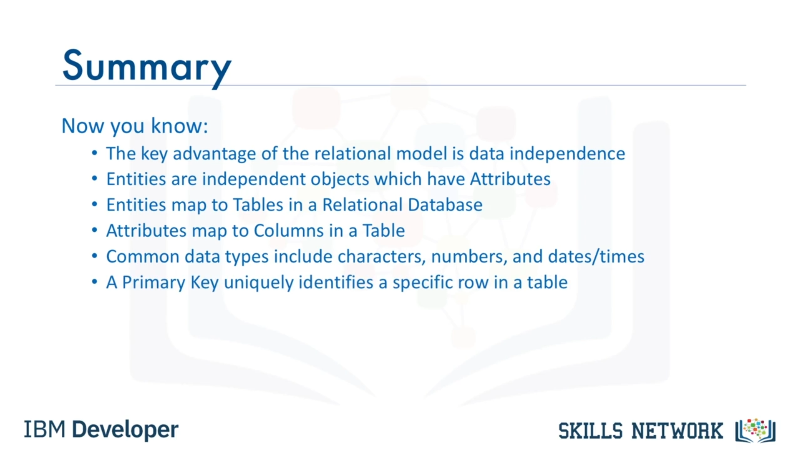

# 📊 İlişkisel Veri Kavramları

## 👋 Giriş ve ilişkisel modelin avantajı

Merhaba, Veritabanı Kavramları'na hoş geldiniz. Bu videoda, farklı model türlerini, modelleri veriyi tablolara eşlemek için nasıl kullandığımızı ve tablolar arasındaki ilişkileri nasıl tanımladığımızı öğreneceğiz.

Bu dersin sonunda, ilişkisel ( *relational* ) modelin avantajını açıklayabilecek, varlık ( *entity* ) adı ve özniteliklerin ( *attribute* ) ilişkisel bir veritabanı tablosuna nasıl eşlendiğini anlatabilecek, varlık ile öznitelik arasındaki farkı tanımlayabilecek, yaygın kullanılan bazı veri tiplerini belirleyebilecek ve birincil anahtarların işlevini açıklayabileceksiniz.

İlişkisel model, veri bağımsızlığına olanak tanıdığı için veritabanları için en çok kullanılan veri modelidir. Veri, tablolar adı verilen basit bir veri yapısında saklanır; bu da mantıksal veri bağımsızlığı, fiziksel veri bağımsızlığı ve fiziksel depolama bağımsızlığı sağlar.

Bir *entity relationship* veri modeli ( *ER data model* ), ilişkisel veri modeline bir alternatiftir.

---

## 📚 Kütüphane örneği ve ER diyagramı

Basitleştirilmiş bir kütüphane veritabanını örnek alarak, bu şekil, tablolar olarak adlandırılan varlıkları ve bunların ilişkilerini gösteren bir *entity relationship* diyagramını ( *ERD – Entity Relationship Diagram* ) göstermektedir.

Kütüphane örneğinde elimizde kitaplar vardır. Bir kitap bir veya birçok yazar tarafından yazılabilir. Kütüphanede bir kitabın bir veya birçok kopyası bulunabilir. Her bir kopya ise aynı anda yalnızca bir ödünç alan kişi tarafından alınabilir.

Bir *entity relationship* modeli, veritabanını başlı başına bir model olarak kullanmaktan ziyade, bir varlıklar koleksiyonu olarak düşünmeyi önerir. *ER* modeli, ilişkisel veritabanlarını tasarlamak için bir araç olarak kullanılır.

---

## 🧱 ER modelinde varlıklar ve öznitelikler

*ER* modelinde varlıklar, veritabanındaki diğer tüm varlıklardan bağımsız olarak var olan nesnelerdir. Bir *ER* diyagramının yapı taşları varlıklar ( *entities* ) ve özniteliklerdir ( *attributes* ).

Bir varlık bir isim olabilir: kişi, yer veya şey. Bir *ER* diyagramında bir varlık dikdörtgen olarak çizilir.

Varlıkların, varlığı karakterize eden veri öğeleri olan öznitelikleri vardır. Öznitelikler bize varlık hakkında daha fazla bilgi verir. Bir *ER* diyagramında öznitelikler oval biçiminde çizilir.

---

## 📖 Kitap varlığı örneği ve tabloya eşleme

Basitleştirilmiş bir kütüphane örneğini kullanarak, *kitap* bir varlık örneğidir. Öznitelikler, bir varlığın belirli özellikleri veya nitelikleridir ve bize varlık hakkında daha fazla bilgi verir.

Kitap varlığının, kitap başlığı, kitabın baskısı, kitabın yazıldığı yıl vb. gibi öznitelikleri vardır. Öznitelikler tam olarak bir varlığa bağlıdır.

Kitap varlığı veritabanında bir tabloya dönüşür ve öznitelikler tablodaki sütunlar hâline gelir. Bir tablo, satır ve sütunların birleşiminden oluşur. Eşleme sırasında varlık tabloya dönüşür.

---

## 🔢 Özniteliklerin sütunlara dönüşmesi ve veri tipleri

Bununla birlikte, bu aşamada tablo henüz satır ve sütunlardan oluşan biçimini tam olarak almamıştır. Öznitelikler, satır ve sütunlardan oluşan gerçek tablo biçimini sağlayacak şekilde, tabloda sütunlara dönüştürülür.

Daha sonra her bir sütuna bazı veri değerleri ekleriz; bu da tablonun biçimini tamamlar. Her öznitelik; karakterler, sayılar, tarihler, para birimi ve daha birçok farklı biçimde veri değerlerini saklar.

Kitap tablosu örneğinde başlık, karakterlerden oluşur. Kitap başlıklarının uzunluğu değişiklik gösterdiği için, başlık sütunu için değişken karakter veri tipini ayarlayabiliriz: `VARCHAR`.

Uzunluğu değişmeyen karakter sütunları için ise *character* ya da `CHAR` kullanırız.

---

## 🧮 Sütun örnekleri ve anahtarlar

`Edition` (baskı) ve yıl sütunları sayısal olur. `ISBN` sütunu ise hem tireler hem de sayılar içerdiği için `CHAR` olur ve benzeri.

Kitap varlığının eşlemesini örnek alarak, basitleştirilmiş kütüphane örneğimizin geri kalanı için de  *author* ,  *author list* ,  *borrower* , *loan* ve *copy* gibi varlık adlarını kullanarak tabloları oluşturabiliriz. Varlık öznitelikleri, tabloların sütunları olacaktır.

Her tabloya bir birincil anahtar (`primary key`) atanır. İlişkisel bir tablonun birincil anahtarı, tablodaki her bir  *tuple* ’ı veya satırı benzersiz biçimde tanımlar, veri tekrarını önler ve tablolar arasında ilişkileri tanımlamanın bir yolunu sağlar.

Tablolar ayrıca, diğer tablolarda tanımlanmış birincil anahtarlar olan yabancı anahtarlar (`foreign keys`) da içerebilir; bu da tablolar arasında bir bağlantı oluşturur.

---

## 📝 Ders özeti

Artık ilişkisel modelin başlıca avantajının mantıksal ve fiziksel veri bağımsızlığı ile depolama bağımsızlığı olduğunu biliyorsunuz.

Varlıklar, öznitelik ( *attribute* ) adı verilen birden çok özelliğe sahip olabilen bağımsız nesnelerdir. İlişkisel bir veritabanına eşleme yaparken, varlıklar tablolar olarak temsil edilir ve öznitelikler sütunlara eşlenir.

Yaygın veri tipleri arasında `CHAR` ve `VARCHAR` gibi karakter tipleri, `integer` ve `decimal` gibi sayısal tipler ve `date` ile `time` dâhil zaman damgaları ( *timestamps* ) bulunur.

Birincil anahtar (`primary key`), bir tablodaki belirli bir satırı benzersiz biçimde tanımlar ve veri tekrarını önler.

