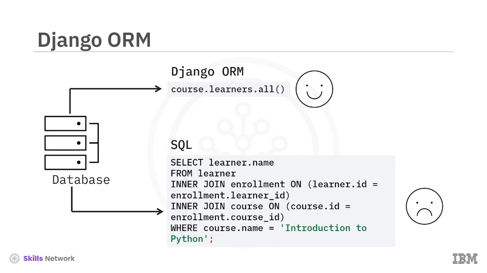
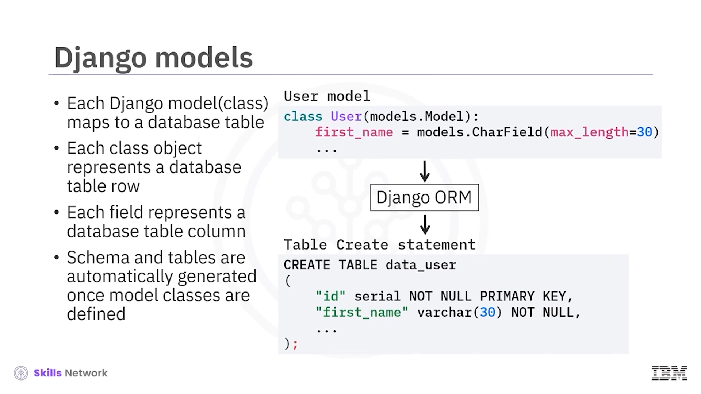
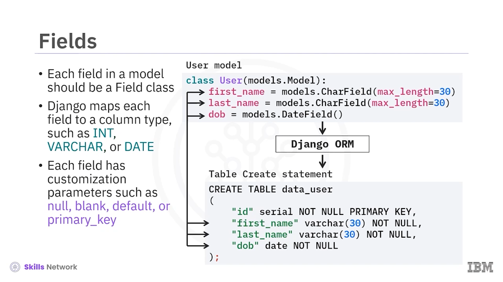
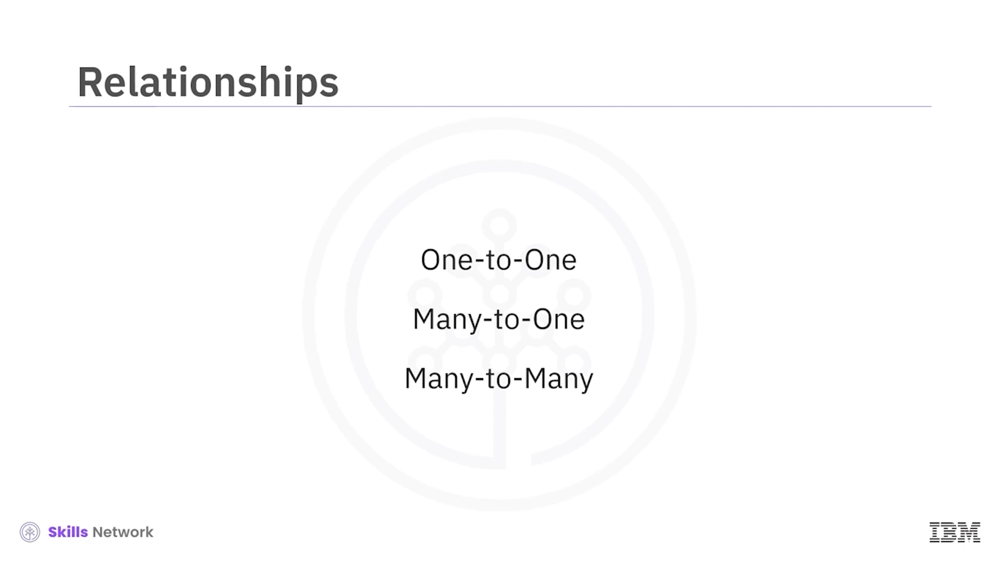
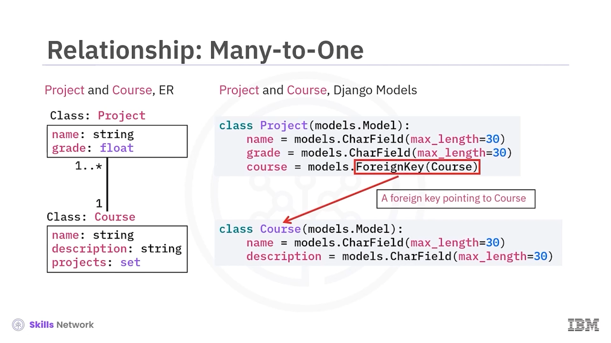
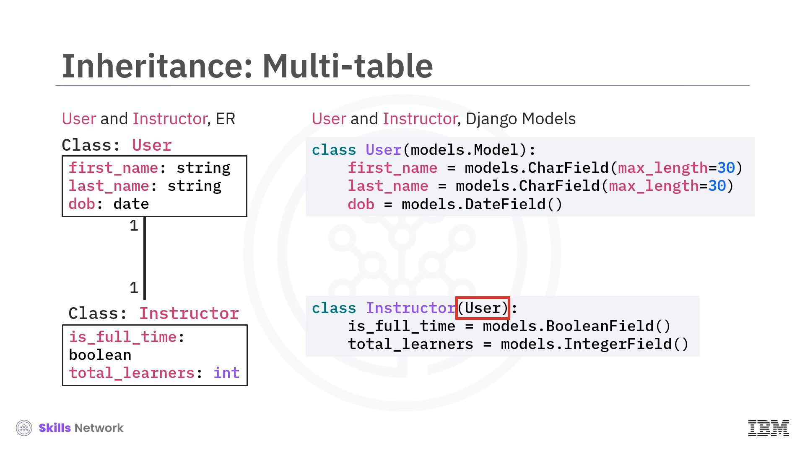

# 🗄️ Django Model

## 🎯 Django Model ve ORM’ye Giriş

Django Model’e, Python için popüler bir *object-relational mapping* (ORM) kütüphanesine hoş geldiniz.

Bu videoyu izledikten sonra, Django ORM’nin temel kavramlarını açıklayabilecek ve varlık-ilişki (ER) diyagramlarınızı Django modellere dönüştürebileceksiniz.

ORM’nin, veritabanlarını soyutlayarak nesneleri ve metotları tablolara ve SQL sorgularına otomatik olarak eşleştirerek geliştiricinin işini nasıl kolaylaştırabileceğini hatırlayın.

Şimdi, Django Web Application Framework’ün bir parçası olan Python tabanlı Django ORM bileşeninin, veritabanlarıyla çalışan uygulama geliştirmenizi nasıl hızlandırabileceğini öğreneceksiniz.

Django ORM’de, her Django model bir veritabanı tablosuna eşlenir. Bir sınıf nesnesi oluşturduğunuzda, bu nesne bir tablo satırını temsil eder. Her alan ( *field* ), bir tablo sütununu temsil eder.

---

## 🧱 Şema, Tablolar ve Modellerin Oluşturulması

Model sınıfları tanımlandıktan sonra şema ve tablolar otomatik olarak oluşturulur.

Örneğin, Django modelinin bir alt sınıfı olan bir `User` sınıfı tanımlayabilirsiniz. Django daha sonra, sınıf alanlarına dayalı olarak tablo oluşturma ifadeleri üretip sütunları oluşturarak, veritabanında buna karşılık gelen bir `User` tablosu oluşturacaktır.

Örneğimizde, `FirstName` alanına karşılık gelen bir `FirstName` sütunu oluşturulacaktır.

Modeldeki her alan bir *field class* olarak tanımlanmalıdır. Django her alanı bir sütun türüne eşler.

Burada `FirstName` bir karakter alanı ( *character field* ) olarak tanımlanmıştır ve `VARCHAR` tipine dönüştürülecektir; `DateOfBirth` ise bir tarih alanıdır ve `Date` tipine dönüştürülecektir.

---

## ⚙️ Sütun Metadatası ve Alan Parametreleri

Her sütun için, bir Django alan sınıfında parametreler belirleyerek tür ve kısıtlayıcılar gibi metasını tanımlarız.

Örneğin, `FirstName` alanı için, `VARCHAR` uzunluğunu belirtmek amacıyla `MaxLength` parametresini kullanırız.

Modelleri ve alanları tanımladıktan sonra, Django ORM şema ve tablo oluşturma ifadelerini üretecektir.

`FirstName`, `LastName` ve `DateOfBirth` alanları sütunlara dönüştürülür. Her alanın, `null`, `blank`, `default` veya `primary key` gibi özelleştirme parametreleri vardır.

Sonraki adımda, varlıklar arasındaki ilişkileri modelleriz. Django ORM,  *one-to-one* , *many-to-one* ve *many-to-many* gibi yaygın ilişki türlerini destekler.

---

## 🔗 Django ORM’de İlişki Türleri

### 1️⃣ One-to-One (Bire Bir) İlişki

Bir *one-to-one* ilişkisiyle başlayacağız.

Diyelim ki elimizde bir `Instructor` ve `User` ER diyagramı var.

`User` sınıfı, `Name` veya `DateOfBirth` gibi bazı ortak alanları tutar.

`Instructor` sınıfının ise, `IsFull` veya eğitmenin sahip olduğu `TotalNumberOfLearners` gibi bazı özel alanları vardır.

Bir `Instructor`, yalnızca bir `User` sınıfında depolanan temel bilgilere sahip olabilir ve bir `User` yalnızca `Instructor` veya `Learner` gibi tek bir role sahip olabilir.

Şimdi bu ER diyagramını iki Django modele dönüştürelim. Önce `Instructor` ve `User` modellerini ve bunların alanlarını tanımlarız.

İlişkiyi tanımlamak için, `User`’a işaret eden bir yabancı anahtar ( *foreign key* ) gibi davranacak fazladan bir *one-to-one field* tanımlarız.

Django ORM, `Instructor` ve `User` tablolarını, `Instructor` tablosunda `User` tablosuna işaret eden bir yabancı anahtar ile oluşturacaktır.

---

### 🌐 Many-to-One (Çoktan Bire) İlişki

Çoktan bire ( *many-to-one* ) ilişkiyi göstermek için bir `Project` ve `Course` ER diyagramı kullanacağız.

`Project` sınıfı, `ProjectName` ve `Grade` gibi alanlara sahip bir ders projesini temsil eder.

`Course` sınıfı, bir çevrimiçi kurs varlığını temsil eder. `Name` ve `Description` gibi atom alanlara sahiptir.

Daha da önemlisi, bir dizi kurs projesi nesnesini temsil eden `Projects` adlı kolektif bir alana sahiptir.

Dolayısıyla, bir kursun birçok kurs projesi olabilir ve bir kurs projesi yalnızca bir kursa ait olabilir. Bu, tipik bir *many-to-one* ilişkidir.

Django’da modelleri oluşturmak için, yabancı anahtar olarak işlev gören fazladan bir `course` alanı ekleriz.

Bu alanın *one-to-one field* olmadığını unutmayın, çünkü birden fazla proje aynı `course` alanına sahip olabilir.

---

### 🔁 Many-to-Many (Çoka Çok) İlişki

Bir *many-to-many* ilişki için, bir `Course` ve `Learner` ER diyagramına bakalım.

Bir `Course`’a birçok `Learner` kayıtlı olabilir ve bir `Learner` birçok `Course`’a kayıt yaptırabilir.

Bu ilişkiyi modellemek için, modellerden birine bir *many-to-many field* ekleriz.

Genelde *many-to-many* alan, en sık düzenlenecek olan modele konulmalıdır.

Örneğin, `Course`, öğrenenler eklenip çıkarıldıkça muhtemelen saatlik olarak düzenlenecektir, oysa her `Learner` yeni bir kursa yalnızca haftalık veya aylık bazda kayıt olabilir.

Bazen, modeller arasındaki ilişki hakkında fazladan bilgiye ihtiyaç duyarsınız.

Örneğin, öğrenenler ve kurslar arasındaki kayıt ( *enrollment* ) hakkında, kayıt tarihi gibi bilgilere sahip olmak isteyebilirsiniz.

Django, çoka çok ilişkiyi yönetecek modeli belirtmenize izin verir.

Bizim durumumuzda, ara model `Enrollment` tablosudur. Bu tablo, *many-to-many field* ile `through` argümanı kullanılarak ilişkilendirilir.

---

## 🧬 Django’da Model Kalıtımı (Inheritance)

Django’da model kalıtımı, Python’daki kalıtıma benzer.

Üst sınıfların, yalnızca alt modeller aracılığıyla görülecek ortak bilgilerin taşıyıcısı mı olacağına, yoksa üst sınıfların kendi tablolarına mı sahip olması gerektiğine karar vermeniz gerekir.

Model kalıtımı için üç senaryo vardır:

* Mevcut bir modeli alt sınıf yaptığınızda ve her modelin kendi veritabanı tablosuna sahip olmasını istediğinizde, *multi-table* modu kullanın.
* Üst sınıf yalnızca bilgi tutacaksa, soyut temel sınıfları ( *abstract base classes* ) kullanın.
* Alanları değiştirmeden, bir modelin Python düzeyindeki davranışını modellemek için *proxy models* kullanın.

 *Multi-table inheritance* , bire bir ( *one-to-one* ) ilişkiye benzer.

Tek fark, `Instructor`’ı modelden alt sınıf yapmanız gerekmesidir.

Django, yeni bir `Instructor` tablosu ve `Instructor` sınıfında bir *one-to-one field* oluşturacaktır.

Bu nedenle, *multi-table* sınıflar için kalıtım, örtük bir *one-to-one* ilişkidir.

---

## 🗃️ Çevrimiçi Kurs Veritabanı Örneği

Çevrimiçi kurs veritabanımız için varlıkları ve ilişkileri tanımladık.

Şimdi Django, bu veritabanı tablolarını ve yabancı anahtarları otomatik olarak oluşturacaktır.

`User` tablosu, `ID`’nin birincil anahtar olduğu ve `name` gibi atom sütunları içeren temel tablodur.

`Learner` tablosu, `User`’dan miras alınmıştır ve ara bir `Enrollment` tablosu üzerinden `Course` ile *many-to-many* ilişkiye sahiptir.

`Instructor` ve `Course` da *many-to-many* bir ilişkiye sahiptir.

Son olarak, `Project` ve `Course` tabloları arasında *many-to-one* bir ilişki vardır.

---

## ✅ Django ORM Özeti

Artık Django bu tabloları oluşturduğuna göre, veriler üzerinde okuma ( *read* ), güncelleme ( *update* ) ve silme ( *delete* ) işlemlerini gerçekleştirebiliriz.

Bu videoda şunları öğrendiniz: Django ORM’de her Django model, bir veritabanı tablosuna eşlenir.

Her alan, `INT`, `VARCHAR` veya `DATE` gibi bir sütun türüne eşlenir.

Her alanın özelleştirme parametreleri vardır.

Ve Django ORM,  *one-to-one* , *many-to-one* ve *many-to-many* gibi yaygın ilişki kalıplarını destekler.

