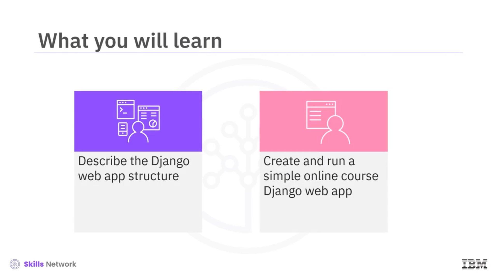
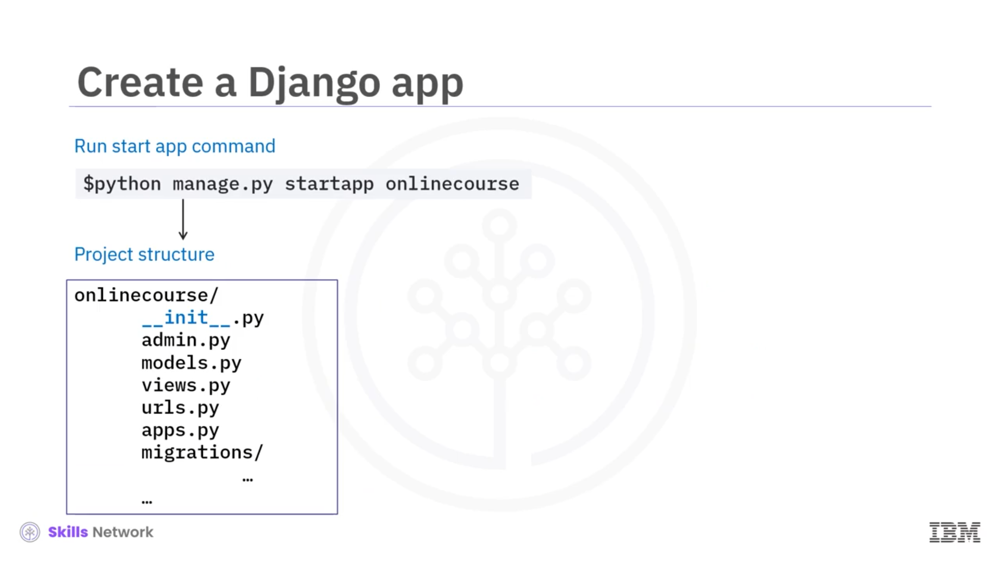
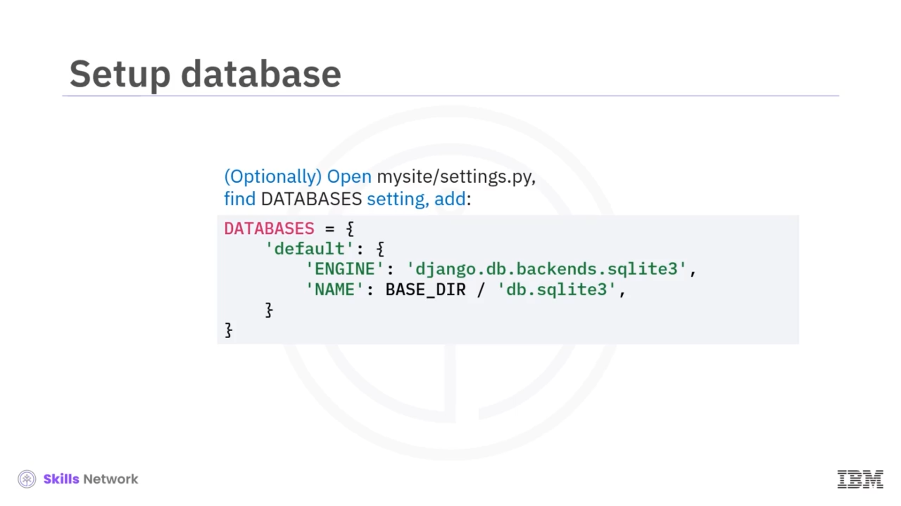
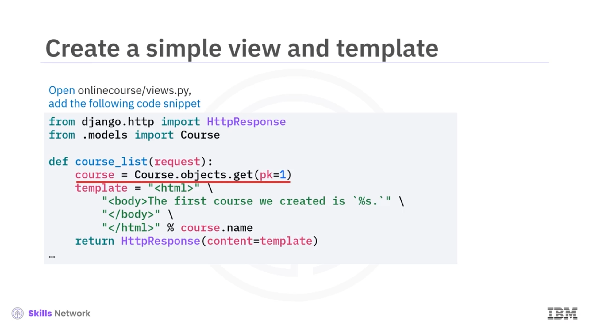
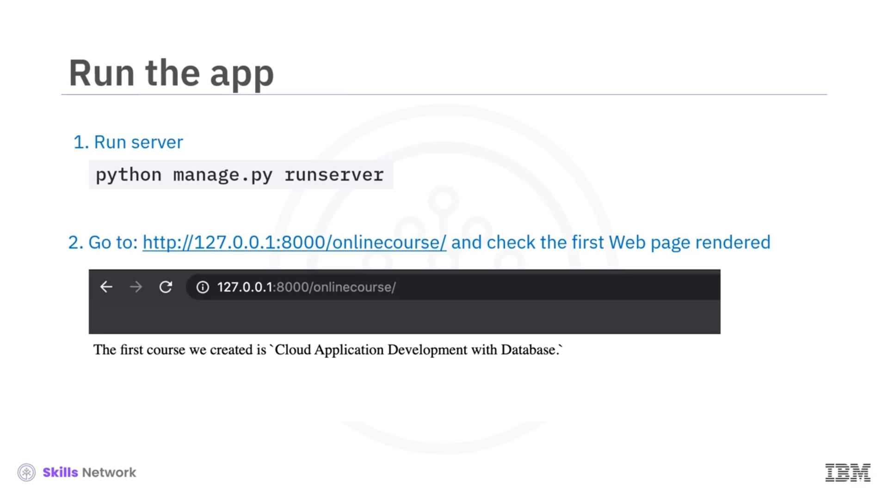

# 🚀 Bir Django Uygulaması Oluşturma

## 🎬 Giriş ve öğrenme hedefleri

Django Uygulaması Oluşturma dersine hoş geldiniz!

Bu videoyu izledikten sonra şunları yapabileceksiniz: Django web uygulamasının yapısını açıklamak ve basit bir Django web uygulaması oluşturup çalıştırmak.



## 🧭 Tipik Django geliştirme süreci

Şimdi, tipik bir Django geliştirme sürecine bakalım. Bu adımların sırası değişebilir.

Önce, Django uygulamaları ve ayarları için bir kapsayıcı olan bir Django projesi oluştururuz. Ardından, projeye bir veya daha fazla Django uygulaması (app) ekleriz.

Core Development aşamasında, veriyi modellemek için Django modellerini oluşturur ve hangi verilerin kullanıcı arayüzünde (UI) sunulacağını belirlemek için  *view* ’ler yazarız.

İstek URL'lerini  *view* ’lerimize eşleriz, böylece Django gelen istekleri URL’ler aracılığıyla ilgili  *view* ’lere yönlendirebilir. Sonra, UI’ı tasarlamaya ve inşa etmeye başlayabiliriz.

Geçerli sürümden emin olduğumuzda, birim (unit) veya sistem testleri yapabiliriz. Core development tamamlandıktan sonra, Django uygulamamızı üretim ortamına hazır hale getirmemiz gerekir; bunun için bir yönetim (admin) sitesi veya üçüncü taraf bir frontend kütüphanesi gibi eklentiler ( *Add-ons* ) kullanırız.

Çalışan bir Django uygulamamız olduğunda, bunu bir web sunucusuna, ister kurum içi (on premise) ister bulutta olsun, dağıtabilir (deploy) ve sunucu durumunu izleyebiliriz.


## 📦 Django projesi nedir?

Bir Django projesi, temelde bir Django uygulaması örneği için tüm ayarları içeren bir Python paketidir.

Bir Django projesi oluşturmak için bir komut satırı terminali açın ve şu komutu çalıştırın:

```bash
django-admin startproject mysite
```

Bu komut, ilgili dosya ve klasörlerle birlikte bir Django projesini başlatır.


## 📁 Django’nun oluşturduğu temel dosyalar

Django’nun oluşturduğu bazı temel dosyaların kullanımını bilmeniz gerekir.

`manage.py`, Django projesiyle etkileşim kurmak için kullanılan bir komut satırı arayüzüdür; sunucuyu başlatmak, modelleri migrate etmek vb. için kullanılır.

`settings.py`, Django projenizin ayarlarını ve yapılandırmalarını içerir.

`urls.py`, Django uygulamanızın URL ve yönlendirme tanımlarını içerir.



## 🧩 İlk Django uygulamasını (app) oluşturma

Django proje kapsayıcısını oluşturduktan sonra, bu projeye ilk Django uygulamanızı ekleyebilirsiniz. İlk uygulamamıza `"onlinecourse"` adını vereceğiz.

`mysite` proje dizininden şu komutu çalıştırın:

```bash
python manage.py startapp onlinecourse
```

Django, geçici bir uygulama yapısı ve bazı önemli uygulama dosyaları oluşturacaktır.

* `admin.py`, kullanıcıları ve içeriği yönetmek için bir yönetim sitesi oluşturup özelleştirmeniz için gereken her şeyi içerir.
* `models.py`, veri modellerini ve ORM katmanını barındırır.
* `views.py`, *view* oluşturmak için fonksiyonları ve sınıfları içerir.
* `urls.py`, uygulama için URL bildirimlerini ve yönlendirmeyi içerir.
* `app.py`, uygulama yapılandırma sınıfını içerir.
* `migrations` klasörü, model migration script’lerini içerir.


## 🔌 Uygulamayı projeye bağlama

Şimdi, az önce oluşturduğumuz `onlinecourse` uygulamasını `mysite` Django projemize ekliyoruz.

`mysite` klasöründeki `settings.py` dosyasını açın, ayar dosyasındaki `INSTALLED_APPS` listesini bulun ve listeye `'onlinecourse.apps.OnlinecourseConfig` adlı yeni bir giriş ekleyin.

`OnlinecourseConfig`, `onlinecourse` uygulamasını temsil eden bir yapılandırma sınıfıdır.


## 🗄️ Veritabanı yapılandırması

Artık uygulamamız projeye bağlandığına göre, isteğe bağlı olarak onun için bir veritabanı kurabiliriz.

`mysite/settings.py` dosyasında, uygulamamız için veritabanlarını yapılandırmak amacıyla kullanılan bir `DATABASES` sözlüğü (dictionary) bulunur.

Bir veritabanı örneğini, motor (engine), ad (name), kullanıcı adı (username) ve parola (password) gibi bağlantı bilgilerini ekleyerek tanımlarız.



## 🧱 Django modellerini tanımlama

Uygulama ve veritabanını kurduktan sonra, nesneler ile veritabanı tabloları arasında ORM bileşeni olarak kullanılacak Django Modellerimizi tanımlayabiliriz.

Burada, `name` ve `description` gibi alanlara sahip basit bir `Course` modeli tanımlayalım.

## 🔄 Migration oluşturma ve çalıştırma

Sonraki adımda, modeli güncellediğimizi Django’ya şu komutu çalıştırarak bildiririz:

```bash
python manage.py makemigrations onlinecourse
```

Django, ardından `migrations` klasörü altında migration script’lerini oluşturacaktır.

Migration için üretilecek SQL ifadeleri hakkında daha fazla ayrıntı görmek için şu komutu çalıştırabiliriz:

```bash
python, manage.py, sqlmigrate, onlinecourse 001
```

Burada, bir `onlinecourse_course` tablosu oluşturulacaktır.

Migration script’lerini çalıştırmak için ise şu komutu çalıştırırız:

```bash
python, manage.py, migrate,
```

## 🖼️ Basit bir view ve HTML şablonu oluşturma

Sonra, `course` nesnesini göstermek için basit bir *view* ve sabit kodlanmış (hard-coded) bir HTML şablonu oluştururuz.

`onlinecourse/views.py` dosyasını açarak `course_list` adlı bir *view* fonksiyonu ekleyin. Bu fonksiyon bir `HttpRequest` nesnesi alır ve bir `HttpResponse` nesnesi döndürür.

Önce, veritabanından `course` nesnesini bir `course` nesnesi olarak alırız. Ardından bir HTML şablonu oluşturur ve kurs adını yer tutucuya (placeholder) dinamik olarak ekleriz. Son olarak, tamamlanan HTML string’ini `HttpResponse`’un içeriği olarak ekler ve UI’a geri döndürürüz.



## 🌐 URL yönlendirmesini (URLConf) ayarlama

Şimdi `course_list`  *view* ’ini bir URL ile ilişkilendiriyoruz; böylece Django, gelen istek URL’sini işlenmek üzere bu  *view* ’e yönlendirecek.

URL yönlendirmeleri, hem her uygulama hem de Django projesi için birer `URLConf` dosyasında tanımlanır.

`onlinecourse` uygulaması için bir `URLConf` dosyası oluşturmak üzere önce `onlinecourse/` klasörü altında bir `urls.py` dosyası oluşturur ve ardından URL rotasını oluşturduğumuz `course_list`  *view* ’ine işaret eden bir `path` nesnesi ekleriz.

`path` yapıcısının (constructor) ilk argümanı `route`’tur. Bu, Django’nun HTTP isteğinden bir  *view* ’e kadar ayrıştırıp eşleyeceği URL kalıplarını tanımlar.

Burada `route`’u boş bırakıyoruz; bu, kök URL olan `host/onlinecourse` adresinin `course_list`  *view* ’ine eşleneceği anlamına gelir.

Sonraki adımda, `onlinecourse` uygulamasının kök `URLConf` dosyasını, projenin kök `URLConf` dosyasına işaret edecek şekilde ayarlarız.

`mysite/urls.py` adlı proje `URLConf` dosyasını açar ve `onlinecourse` uygulamasının `URLConf`’una referans veren bir `path` nesnesi ekleriz. Böylece Django, `onlinecourse/` son ekine sahip herhangi bir URL aldığında, bu URL’leri `onlinecourse.urls.py` dosyasındaki URL’lerle eşleştirmeye çalışacaktır.


## 🖥️ Geliştirme sunucusunu çalıştırma ve sonucu görme

Artık Django uygulamamız kurulmuş durumda. Sonucu kontrol edelim.

Önce, komut satırından şu komutu çağırırız:

```bash
python manage.py runserver
```

Bu komut, az önce oluşturduğumuz Django proje ve uygulamasını barındırmak üzere 127.0.0.1 adresinde ve varsayılan 8000 portunda yerel bir geliştirme sunucusu başlatır.

Sunucu başlatıldıktan sonra, çevrimiçi kurs (online course) uygulamasının kök URL’sine gideriz. Burada şu cümleyi görüntüleyen bir web sayfası görmemiz gerekir:

“The first course we created is `Cloud Application Development with Database`.”

Bu basit HTML dosyası, daha önce oluşturduğumuz `course_list` *view* fonksiyonu tarafından üretilir.



## ✅ Bu videoda öğrendikleriniz

Bu videoda şunları öğrendiniz: Django proje ve uygulama yapısı ile temel dosyalar, tipik bir Django uygulama geliştirme süreci ve basit bir Django uygulamasının nasıl oluşturulup çalıştırılacağı.


