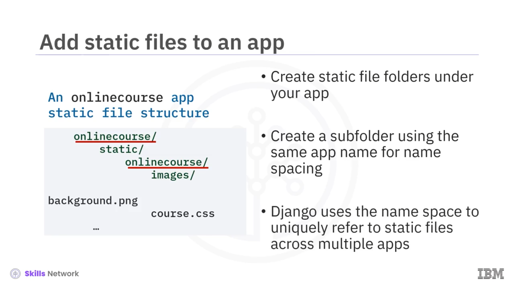

# 🗂️ Django Static Files

## 🎯 Öğrenme Hedefleri

Django Static Files’a hoş geldiniz. Bu videoyu izledikten sonra şunları yapabileceksiniz:

Django’nun CSS ve medya dosyaları gibi statik dosyaları nasıl yönettiğini açıklamak ve verilerinizi dinamik HTML sayfaları olarak sunmak için Django  *views* , *templates* ve statik dosyaları birleştirmek.

---

## 📁 Uygulamalara Statik Dosya Ekleme ve Klasör Yapısı

Uygulamalarınıza statik dosyalar eklemek için önce HTML şablonları, görseller veya CSS dosyaları gibi farklı statik dosyalar için klasörler oluşturmanız gerekir.

Daha sonra, statik dosyaları barındıracak her klasörün altında, uygulama adıyla aynı adı taşıyan bir alt klasör oluşturmanız gerekir; örneğin `onlinecourse` uygulaması gibi.

Bu ekstra seviyeye ihtiyaç duymanızın ana nedeni, statik dosyalar için bir ad alanı ( *namespace* ) oluşturmaktır; çünkü bir Django projesinde birden fazla uygulamada aynı ada sahip statik dosyalarınız olabilir.

Django, birden çok uygulama genelinde statik dosyalara benzersiz şekilde atıfta bulunmak için bu ad alanını kullanır.

---

## 🧱 Proje İçinde Farklı Uygulamalar ve Statik Dosyalar

Django’da proje konteyneri içinde farklı uygulamalar ( *apps* ) oluşturursunuz.

Her uygulamanın, genellikle uygulamanın kök klasöründe `static` adlı bir klasörde saklanan kendi statik dosya kümesi olabilir.

Bu uygulamaya özgü statik dosyalara ek olarak, bazı harici statik dosyaları da kullanmanız gerekebilir.

Bu ek statik dosyalar için dizinleri, Django projesinin `settings.py` dosyasındaki `STATICFILES_DIRS` listesinde tanımlayabilirsiniz.

---

## 🔍 STATICFILES_FINDERS ile Statik Dosyaları Bulmak

Django, bir uygulamadaki statik dosyaları bulmak için `AppDirectoriesFinder` ve diğer statik dosya dizinlerini bulmak için `FileSystemFinder` gibi `STATICFILES_FINDERS` kümesi sağlar.

Bu  *finder* ’lar, mutlak yol referanslarını oluşturur ve bu dosyaları sizin için sunar.

Bu statik klasörlerin, geliştirme ortamınızda statik dosyalarınızı sakladığınız yerler olduğunu unutmayın. Özellikle birden fazla uygulamanız varsa, yerel dosya sisteminizde birden fazla yerde saklanabilirler.

Bu durum, uygulamayı uzak bir sunucuya dağıtmak için elverişli değildir. Uygulamanızı bir üretim web sunucusuna ( *production web server* ) dağıttığınızda, tüm statik dosyalarınızı tek bir konuma taşımak isteyebilirsiniz.

Django, tüm statik dosyaları tek bir dizinde toplamak için, varsayılan olarak kurulu olan `staticfiles` adlı bir uygulama sağlar.

---

## 🗄️ STATIC_ROOT, STATIC_URL ve Statik Dosyaları Toplama

İlk olarak, statik dosyalarınız için kök konum olarak işlev gören ve onlar için bir dosya yapısı oluşturan, mutlak bir yol olan `STATIC_ROOT`’u belirtirsiniz.

Daha sonra, statik dosyalarınızın URL’si için bir ön ek ( *prefix* ) olan `STATIC_URL`’i belirtirsiniz.

Sonrasında, `staticfiles` uygulaması tarafından sağlanan `collectstatic` komut satırını çağırırsınız; bu komut, statik dosyaları sizin için oluşturulan bir dosya yapısıyla birlikte `STATIC_ROOT` klasörüne toplayacaktır.

Alternatif olarak, statik dosyalar içeren daha göreli ( *relative* ) yolları aramak için `findstatic` komut satırını da kullanabilirsiniz.

`collectstatic` komut satırı çalıştırıldıktan sonra `STATIC_ROOT` altında oluşan örnek bir dosya yapısı şöyledir:

İlk alt seviye klasör adları, ad alanı ( *naming space* ) olarak uygulama adıdır. Uygulama klasörlerinin altında ise CSS, font ve görseller gibi farklı türde statik dosya klasörleri bulunur.

Django uygulamanızı uzak bir web sunucusuna dağıttığınızda, web sunucusu tüm dosyaların `STATIC_ROOT` klasörü altında toplandığını bilecektir. Bu da sunucunun gerekli tüm dosyaları bulmasını kolaylaştıracaktır.

---

## 🌐 Statik Dosyaların Sunulması ve URL Yapısı

`STATIC_ROOT` klasörü altındaki dosyaların, uygulamalarınıza veya diğer dış kullanıcılara sunulması gerekir.

Bunlar, yerelde bir geliştirme Django sunucusu tarafından ya da uzakta özel bir web sunucusu tarafından sunulabilir.

Bu dosyalara, önce ana makine ( *host* ) ve etki alanı ( *domain* ) adını, ardından tanımladığınız `STATIC_URL` değerini — örneğin `/static/`, ki bu temelde statik dosyalarınız için bir URL ön ekidir — ve sonrasında da `STATIC_ROOT` klasöründeki aynı dosya yolunu, örneğin `/onlinecourse/course.css`, ekleyerek bir URL üzerinden erişebilirsiniz.

---

## ✅ Videonun Özeti

Bu videoda şunları öğrendiniz: Django’nun geliştirme ve dağıtım ( *deployment* ) ortamlarında statik dosyaları nasıl yönettiğini.
