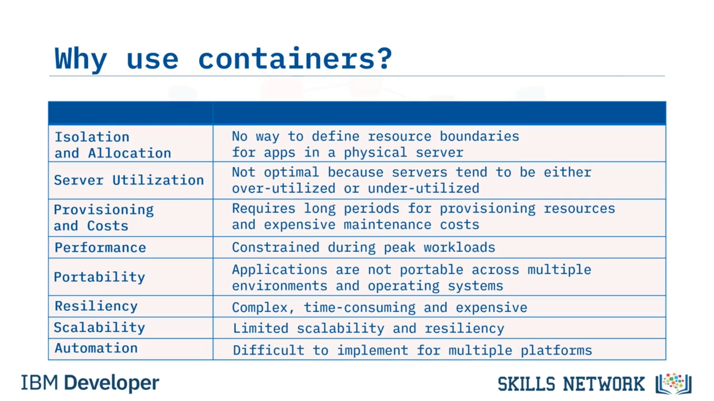
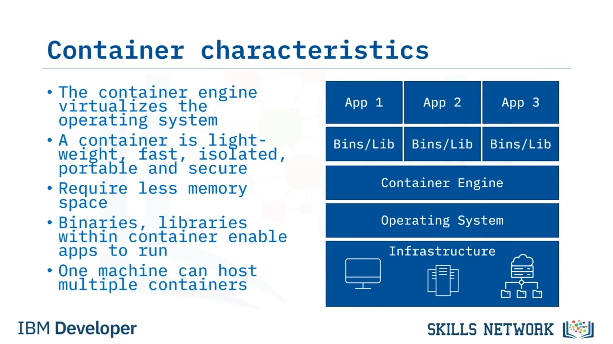
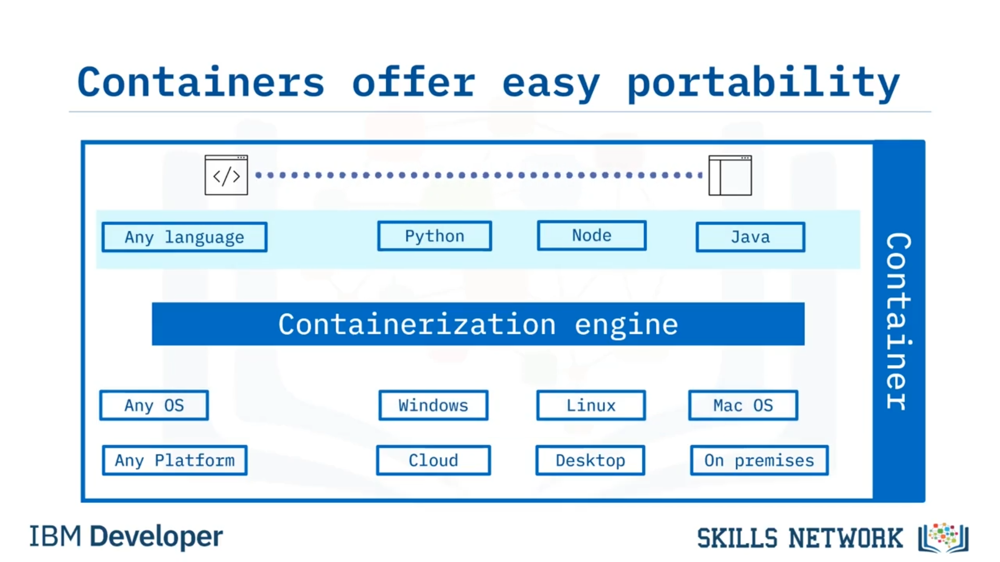
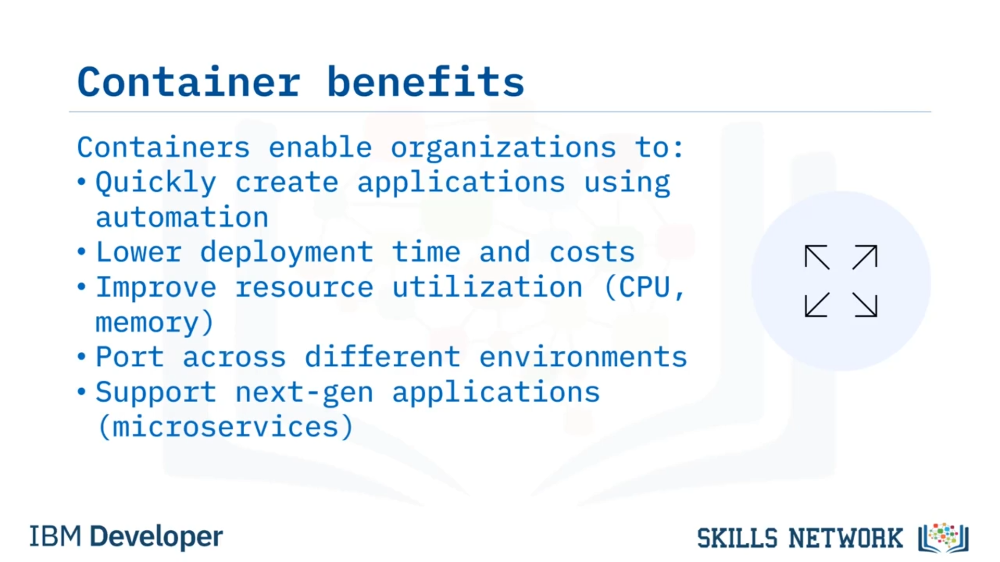
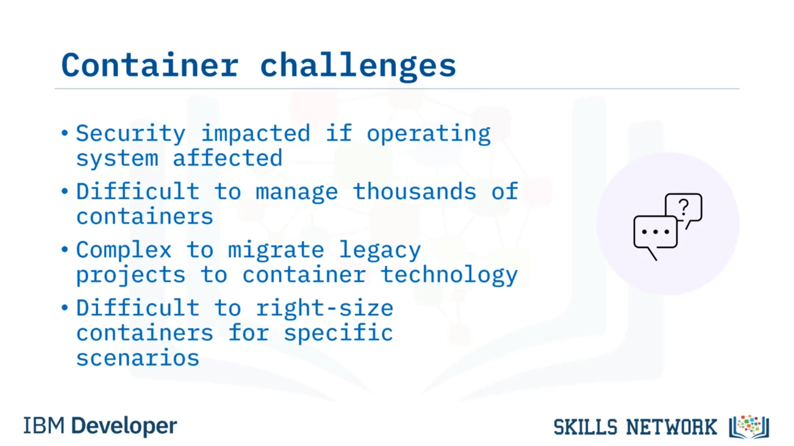
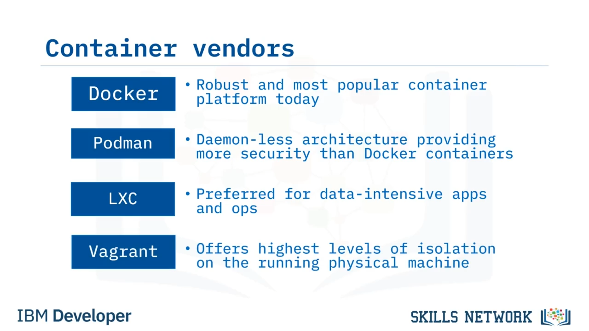

# 📦 Konteynerlere Giriş

## 👋 Konteynerlere Giriş ve Öğrenme Hedefleri

“Konteynerlere Giriş”e hoş geldiniz. Bu videoyu izledikten sonra, yazılım geliştirmede **geleneksel bilgi işlem** sorunlarını belirleyebilecek, bir **konteyneri** tanımlayıp özelliklerini açıklayabilecek, konteynerlerin **avantajlarını ve zorluklarını** sıralayabilecek ve popüler **konteyner satıcılarını** listeleyebileceksiniz. 

**Bulut yerel (cloud-native)** yaklaşım, ölçeklenebilir, dinamik ve **hibrit bulut** dostu yazılımlar oluşturmak için kullanılan en yeni uygulama geliştirme yaklaşımıdır ve **konteyner teknolojisi** bu yaklaşımın güçlü bir parçasıdır.

## 🚢 Nakliye Konteyneri Benzetmesi

Modern nakliye endüstrisi, bir dizi **nakliye konteyneri** boyutunu standartlaştırmıştır; böylece hangi ürün gönderilirse gönderilsin, konteyner boyutu aynı kalır. Bu  **standardizasyon** , nakliye verimliliğini önemli ölçüde artırır. Lojistik ekipleri, konteynerin boyutuna ve müşterinin teslimat ihtiyaçlarına göre gemi, uçak, tren ve kamyon gibi farklı taşıma seçeneklerini seçer.

## 🧳 Dijital Konteynerlerin Tanımı ve Taşınabilirlik

**Dijital konteyner teknolojisi** bu benzetmeye çok benzer. Konteynerler, uygulamaların birden fazla platformda çalışabilmesi için yazılımı **taşınabilir** hale getirme sorununu çözer. Bir  **konteyner** , konteynerleştirme motoru tarafından desteklenen, içinde uygulama kodu, çalışma zamanı, sistem araçları, sistem kütüphaneleri ve gerekli ayarları barındıran standart bir  **yazılım birimidir** . Bu sayede geliştiriciler uygulamaları verimli bir şekilde  **oluşturabilir** , **gönderebilir** ve  **çalıştırabilir** . Operasyonel sorunlar ve alttaki altyapı artık engelleyici olmaktan çıkar. Uygulamaları dizüstü bilgisayarınızdan test ortamına, hazırlama ortamından üretim ortamına; fiziksel makineden sanal makineye veya özel buluttan genel buluta hızla taşıyabilir ve her seferinde uygulamanızın düzgün çalışacağından emin olabilirsiniz. Bir konteyner çok küçük olabilir (yalnızca onlarca megabayt) ve geliştiriciler konteynerli uygulamaları neredeyse **anında** başlatabilir.

## 🧱 Geleneksel Bilgi İşlem Ortamlarının Zorlukları

Bu yetenekler sayesinde konteynerler, günümüzün geliştirme ve dağıtım çözümlerinin **standartlarının temelini** oluşturur. Peki, geleneksel bilgi işlem ortamlarında kuruluşların karşılaştığı başlıca zorluklar nelerdir?

Geleneksel ortamlarda:

* Geliştiriciler uygulamaları yeterince  **izole edemez** ,
* Fiziksel sunuculardaki uygulamalar için belirli **depolama** ve **bellek** kaynaklarını net biçimde tahsis edemez,
* Sunucular genellikle **yetersiz** ya da **aşırı** kullanılır, bu da düşük kaynak kullanımı ve düşük **yatırım getirisine** yol açar,
* Dağıtımlar kapsamlı **provizyon** (hazırlık) kaynakları ve pahalı **bakım maliyetleri** gerektirir,
* Fiziksel sunucuların sınırları, yoğun iş yükleri sırasında **performansı** sınırlar,
* Uygulamalar birden çok ortam ve işletim sistemi arasında **taşınabilir** değildir,
* **Dayanıklılık** için donanım uygulamak zaman alıcı, karmaşık ve pahalıdır,
* Geleneksel şirket içi BT ortamlarının  **ölçeklenebilirliği sınırlıdır** ,
* Yazılımı birden çok platforma ve kaynağa dağıtırken **otomasyon** sağlamak zordur.

## 🛡️ Konteynerlerin Özellikleri ve Sağladığı Faydalar

 **Konteynerler** , kuruluşların bu zorlukların önemli bir kısmının üstesinden gelmesini sağlar.  **Konteyner motorları** , işletim sistemini **sanallaştırır** ve konteynerlerin çalıştırılmasından sorumludur. Platformdan bağımsız konteynerler:

* **Hafif** ,
* **Hızlı** ,
* **Yalıtılmış** ,
* **Taşınabilir** ,
* **Göreceli olarak güvenli**dir

ve genellikle daha az bellek alanı gerektirir. Konteyner içindeki ikili dosyalar, kütüphaneler ve diğer varlıklar uygulamaların çalışmasını sağlar ve tek bir makine üzerinde **birden çok konteyner** barındırılabilir.

Konteynerler, programcıların kodu uygulamalara hızlı bir şekilde **dağıtmasına** yardımcı olur. Konteynerler **platformdan bağımsızdır** ve bulut, masaüstü ya da şirket içi ortamlarda, işletim sisteminden bağımsız olarak **Windows, Linux veya macOS** üzerinde çalıştırılabilir.

## 💻 Programlama Dili, Araçlar ve Otomasyon Açısından Esneklik

Konteynerler ayrıca, Python, Node.js, Java veya başka bir dili kullanıyor olsanız da **programlama dili** ve  **IDE’den bağımsızdır** . Konteynerler, kuruluşların şunları yapmasını sağlar:

* **Otomasyonu** kullanarak uygulamaları hızlı bir şekilde oluşturmak,
* **Daha düşük dağıtım süresi ve maliyetleri** elde etmek,
* **CPU ve bellek** dahil olmak üzere kaynak kullanımını iyileştirmek,
* Farklı ortamlar arasında  **bağlantı kurmak** ,
* **Mikro hizmetler** de dahil olmak üzere yeni nesil uygulamaları desteklemek.

## ⚠️ Konteynerleştirmenin Zorlukları

Elbette konteynerleştirmeyi kullanmak **zorluksuz** değildir. İşletim sistemi etkilenirse **sunucu güvenliği** sorunlu hale gelebilir. Geliştiriciler, **binlerce konteyneri yönetirken** bunalmış hissedebilir. **Monolitik eski uygulamaları** dönüştürmek karmaşık bir süreç olabilir ve geliştiriciler belirli senaryolar için konteynerleri **doğru boyutlandırma** konusunda zorluk yaşayabilir.

## 🐳 Popüler Konteyner Platformları ve Araçları

Şimdi de daha popüler bazı konteyner satıcılarına bakalım:

* **Docker** : Sağlam bir platformdur ve günümüzün en popüler konteyner platformu olarak kabul edilir.
* **Podman** : Docker’dan daha güvenli olacak şekilde tasarlanmış, **daemon’suz** bir konteyner motorudur.
* **LXC (Linux Containers)** : Geliştiriciler tarafından sıklıkla **veri yoğun uygulamalar** ve işlemler için tercih edilir.
* **Vagrant** : Çalışan fiziksel makine üzerinde en yüksek **izolasyon seviyelerini** sunmaya odaklanır.

## 📚 Bu Videodan Neler Öğrendiniz?

Bu videoda, kuruluşların izolasyon, kaynak kullanımı, provizyon, performans ve daha fazlası ile ilgili zorlukların üstesinden gelmek için **konteynerlere** yöneldiğini gördünüz.

Özetle:

* Bir  **konteyner** , uygulamaları oluşturmak, göndermek ve çalıştırmak için gereken her şeyi kapsayan standart bir  **yazılım birimidir** .
* Konteynerler  **işletim sistemi** , **programlama dili** ve  **platformdan bağımsızdır** .
* **Dağıtım süresini ve maliyetlerini** düşürür,  **kullanımı iyileştirir** , süreçleri **otomatikleştirir** ve yeni nesil **mikro hizmet tabanlı** uygulamaları destekler.
* Buna karşın, yönetim, eski projelerin konteynerleştirilmesi ve doğru boyutlandırma, geliştiriciler için önemli **zorluklar** oluşturabilir.
* Başlıca konteyner satıcıları ve araçları arasında  **Docker** ,  **Podman** , **LXC** ve **Vagrant** bulunmaktadır.

