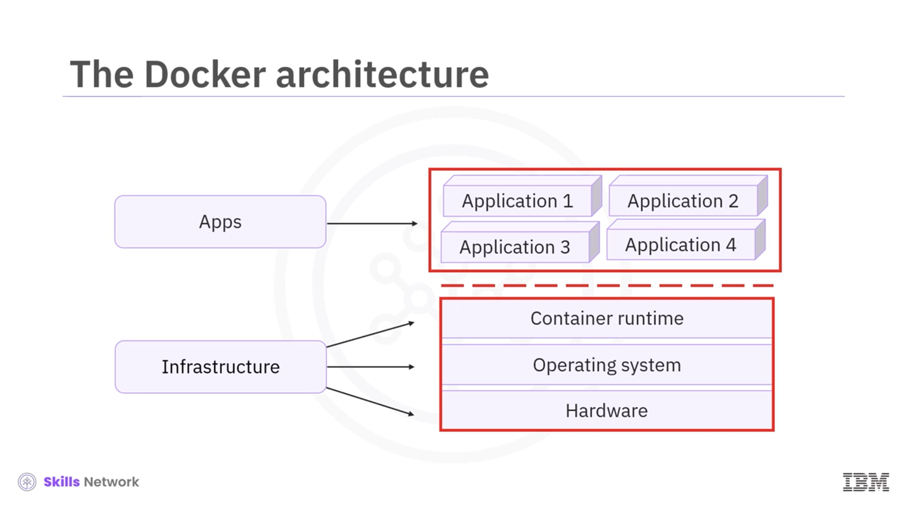
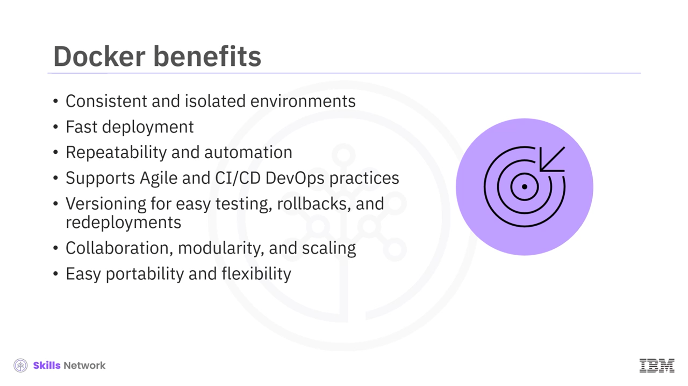
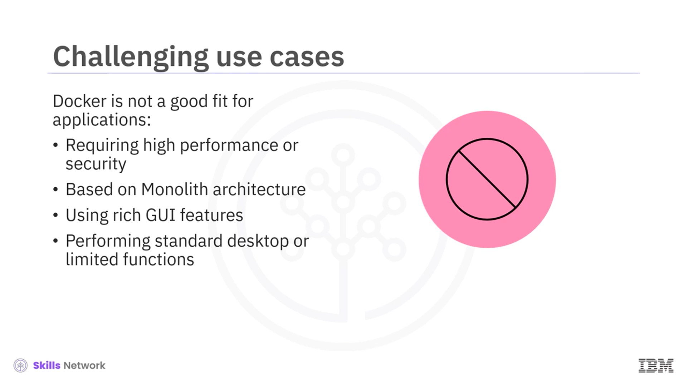
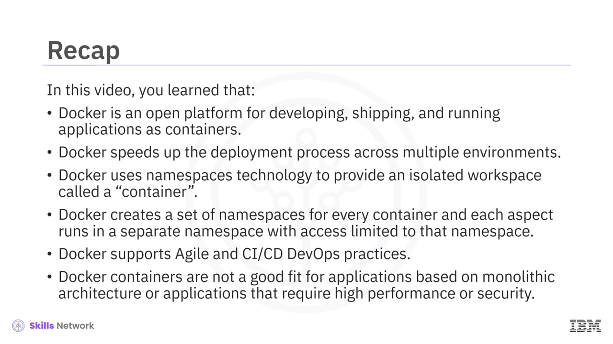

# 🐳 Docker’a Giriş

## 👋 Docker’a Giriş ve Öğrenme Hedefleri

**Docker Girişine hoş geldiniz.** Bu videoyu izledikten sonra:

* **Docker’ın ne olduğunu** tanımlayabilecek,
* **Docker sürecini ve temel teknolojisini** açıklayabilecek,
* **Docker konteynerlerinin faydalarını** listeleyebilecek,
* **Docker konteynerlerinin zorluklarını** tanımlayabileceksiniz.

## 📘 Resmi Docker Tanımı ve Docker’ın Genel Özellikleri

2013’ten beri kullanılan resmi Docker tanımına göre  **Docker** , uygulamaları **konteyner** olarak geliştirmek, göndermek ve çalıştırmak için  **açık bir platformdur** . Basit mimarisi, yüksek **ölçeklenebilirliği** ve birden fazla **platform, ortam ve konumdaki taşınabilirliği** sayesinde geliştiriciler arasında çok popüler hale gelmiştir. Docker;  **donanım** , **işletim sistemi** ve **konteyner çalışma zamanı** da dahil olmak üzere uygulamaları alttaki  **altyapıdan izole eder** .

## ⚙️ Docker’ın Temel Teknolojisi: Go, Linux Çekirdeği ve Ad Alanları

 **Docker** , **Go** programlama diliyle yazılmıştır ve işlevselliğini sağlamak için **Linux çekirdeğinin özelliklerini** kullanır. Docker ayrıca, konteyner adı verilen yalıtılmış bir çalışma alanı oluşturmak için **ad alanları (namespaces)** kullanır. Docker her konteyner için bir dizi **ad alanı** oluşturur ve her özellik (örneğin süreçler, ağ, dosya sistemi), erişimi yalnızca o ad alanıyla sınırlı olan **ayrı bir ad alanında** çalışır. Böylece her konteyner kendi izole ortamına sahip olur.

## 🧩 Docker Ekosistemi ve Tamamlayıcı Araçlar

 **Docker metodolojisi** , ek birçok yeniliğe ve araca ilham vermiştir. Örneğin:

* **Docker CLI** : Docker ile etkileşim için komut satırı aracı,
* **Docker Compose** : Birden çok konteynerden oluşan uygulamaların tanımı ve orkestrasyonu için araç,
* **Prometheus** gibi izleme ve gözlemlenebilirlik araçları,
* **Depolama eklentileri** (storage plugins) ile farklı depolama çözümleri entegrasyonu,
* **Docker Swarm** veya **Kubernetes** kullanan orkestrasyon teknolojileri,
* **Mikro hizmetler** ve **sunucusuz (serverless)** mimariler kullanan modern geliştirme metodolojileri.

Bu ekosistem, Docker’ı sadece bir konteyner teknolojisi olmaktan çıkarıp zengin bir **geliştirme ve dağıtım platformu** haline getirir.

## 🚀 Docker’ın Sağladığı Avantajlar

Docker aşağıdaki önemli avantajları sunar:

* **Tutarlı ve yalıtılmış ortamlar** sayesinde **kararlı uygulama dağıtımları** sağlar.
* **Dağıtımlar saniyeler içinde** gerçekleşebilir.
* **Docker imajları** küçük ve **yeniden kullanılabilir** olduğu için geliştirme sürecini önemli ölçüde hızlandırır.
* Docker’ın  **otomasyon yetenekleri** , hataları azaltmaya ve **bakım döngüsünü basitleştirmeye** yardımcı olur.
* Docker, **Agile** ve **CI/CD DevOps** uygulamalarını güçlü biçimde  **destekler** .
* Kolay  **sürüm oluşturma** ,  **test** , **geri alma (rollback)** ve **yeniden dağıtım** süreçlerini hızlandırır.
* Uygulamaları  **segmentlere ayırarak** , kolay  **yenileme** , **temizleme** ve **onarım** imkânı sunar.
* Geliştiriciler **ortak imajlar** üzerinden kolayca işbirliği yapabilir, sorunları daha hızlı çözebilir ve gerektiğinde konteynerleri  **ölçeklendirebilir** .
* **Docker imajları platformdan bağımsızdır** ; bu da onları oldukça **taşınabilir** kılar ve farklı ortamlar arasında geçişi kolaylaştırır.

## ⛔ Docker Konteynerleri İçin Uygun Olmayan Senaryolar

Her ne kadar Docker çok güçlü bir araç olsa da bazı senaryolar için  **en uygun çözüm değildir** . Özellikle şu özelliklere sahip uygulamalarda Docker kullanımı sınırlı veya sorunlu olabilir:

* Çok yüksek **performans** ya da çok sıkı **güvenlik** gereksinimleri olan uygulamalar,
* **Monolitik mimariye** dayalı, büyük ve bölünmemiş uygulamalar,
* Zengin **grafik arayüz (GUI)** özellikleri kullanan, geleneksel  **masaüstü uygulamaları** ,
* Sadece **sınırlı işlev** yerine getiren, klasik masaüstü kullanım senaryolarına yönelik yazılımlar.

Bu tür durumlarda konteyner yaklaşımı her zaman en verimli tercih olmayabilir.

## 📝 Videodan Çıkarımlar

Bu videoda özetle şunları öğrendiniz:

* **Docker** , uygulamaları konteyner olarak  **geliştirmek** , **göndermek** ve **çalıştırmak** için kullanılan  **açık bir platformdur** .
* Docker, birden çok ortamda **dağıtım sürecini hızlandırır** ve süreçleri otomatize eder.
* Docker, **konteyner** adı verilen yalıtılmış çalışma alanlarını sağlamak için **ad alanları (namespaces)** teknolojisini kullanır.
* Docker her konteyner için bir dizi ad alanı oluşturur ve her özellik, erişimi yalnızca o ad alanıyla sınırlı olan ayrı bir alanda çalışır; bu, güçlü bir **izolasyon** sağlar.
* Docker, **Agile** ve **CI/CD DevOps** süreçlerini destekleyerek modern yazılım geliştirme yaşam döngüsünü hızlandırır.
* Son olarak,  **Docker konteynerleri** , monolitik mimariye dayalı ya da çok yüksek performans ve güvenlik gerektiren uygulamalar için her zaman uygun değildir; bu tür senaryolarda farklı mimari veya altyapı çözümleri gerekebilir.

