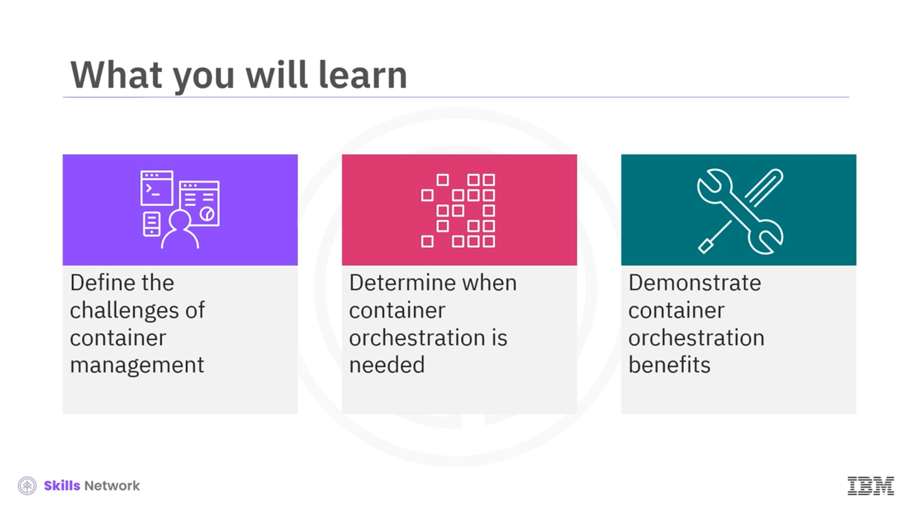
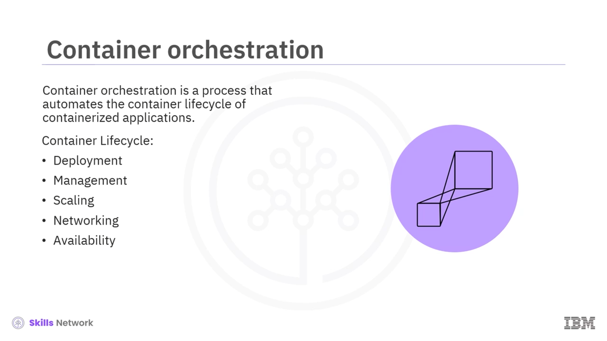
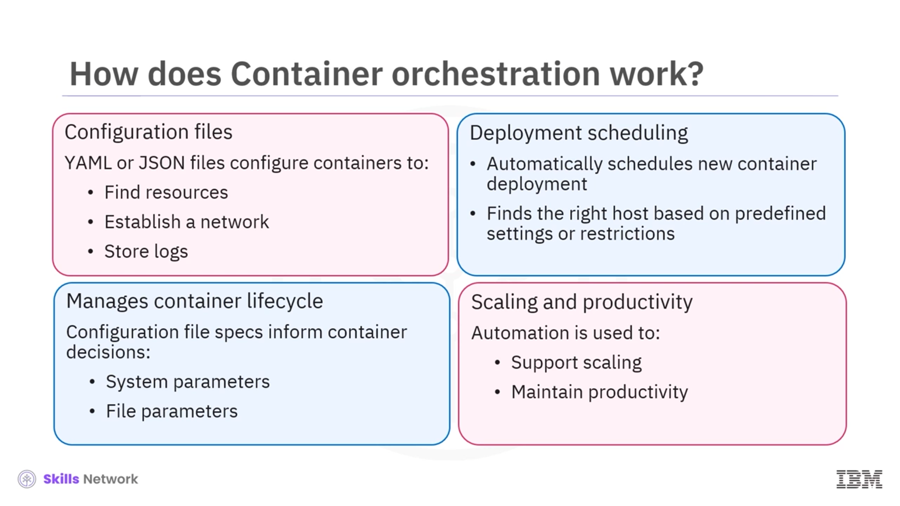
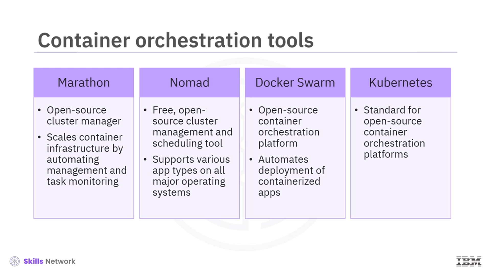
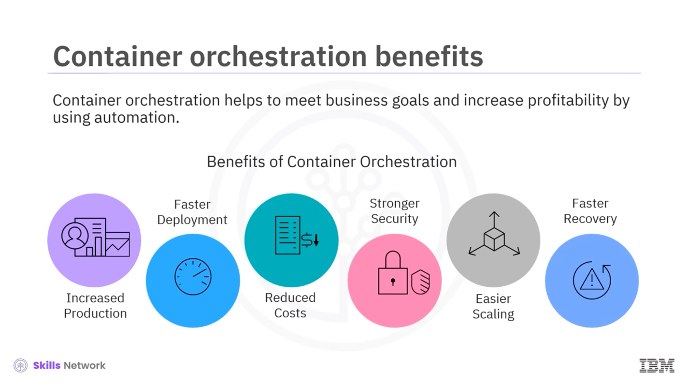
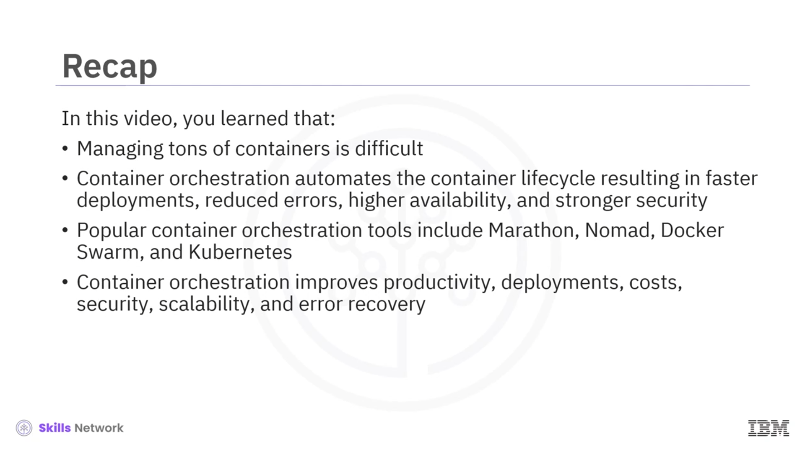

# ☸️ Konteyner Orkestrasyonuna Giriş

## 🚀 Konteyner Yolculuğu ve Büyüyen Karmaşıklık

**Konteyner orkestrasyonuna** hoş geldiniz. Bu bölümün sonunda, konteyner yönetiminin zorluklarını tanımlayabilecek, **konteyner orkestrasyonunun** ne zaman gerekli olduğunu belirleyebilecek ve sağladığı başlıca faydaları açıklayabileceksiniz. 

Çoğu ekibin konteyner yolculuğu tek bir **konteyner** ile başlar. Ancak işler uzun süre böyle kalmaz; zamanla kullanılabilirliği artırmak için yeni uygulamalar yazılır, projeler küresel olarak dağıtılır ve o ilk konteyner kaçınılmaz olarak birçok konteynere dönüşür. Başlangıçta bu büyümenin üstesinden gelmek kolay görünse de, çok geçmeden yönetilmesi zor ve bunaltıcı bir hale gelir.

## 📦 Çok Sayıda Konteyneri Yönetmenin Zorlukları

Yüzlerce hatta binlerce konteyneri; veri tabanı, web uygulaması ve arka uç servisleri gibi bileşenlerden oluşan büyük bir uygulamaya bağlayıp yönetmeyi, bunları doğru şekilde ölçeklendirmeyi ve sürekli çalışır halde tutmayı düşünün. Bu durum, elle yönetilmeye çalışıldığında kolayca kontrolden çıkabilir. Çok sayıda konteyneri güvenilir ve tutarlı biçimde  **ölçeklendirmek** , **izlemek** ve **yönetmek** için artık manuel yöntemler yeterli değildir; burada devreye **konteyner orkestrasyonu** girer.

## 🧠 Konteyner Orkestrasyonu Nedir?

 **Konteyner orkestrasyonu** , konteyner tabanlı bir uygulamanın **konteyner yaşam döngüsünü otomatikleştiren** bir süreçtir. Bu yaşam döngüsüne:

* **Dağıtım (deployment)**
* **Yönetim (management)**
* **Ölçeklendirme (scaling)**
* **Ağ oluşturma (networking)**
* **Kullanılabilirlik (availability)**

gibi alanlar dahildir. Büyük ve dinamik ortamlarda konteyner orkestrasyonu kritiktir; çünkü karmaşıklığı azaltır, uygulamaların devreye alınmasını ve ölçeklendirilmesini kolaylaştırır,  **hızı** , **çevikliği** ve **verimliliği** artırır. **CI/CD** iş akışları ve **DevOps** uygulamalarıyla sorunsuz entegre olarak geliştirme ekiplerinin kaynakları daha verimli kullanmasına yardımcı olur.

## ☁️ Kurulum Ortamları ve SOAR Bağlamı

**Konteyner orkestrasyonu** hem şirket içi (on-premises) ortamlarda hem de genel, özel veya çoklu **bulut** ortamlarında kullanılabilir. Bir kuruluşun **güvenlik, orkestrasyon, otomasyon ve yanıt** ihtiyaçlarını temsil eden **SOAR** (Security, Orchestration, Automation and Response) gereksinimlerinin kritik bir parçasıdır. Yani orkestrasyon, sadece uygulama yönetimi değil, aynı zamanda güvenlik ve operasyonel yanıt süreçleriyle de yakından ilişkilidir.

## 🧩 Orkestrasyon Araçlarının Temel Özellikleri

**Konteyner orkestrasyonu araçları** geniş bir özellik seti sunar. Öne çıkan işlevler şunlardır:

* Uygulamanın hangi **konteyner görüntülerinden (container images)** oluştuğunu ve bu görüntülerin hangi **kayıt defterinde (registry)** bulunduğunu tanımlamak
* Daha otomatik, birleşik ve sorunsuz bir süreç sağlamak için konteynerlerin **sağlanması** ve **dağıtımını** iyileştirmek
* Konteynerler arasındaki **ağ bağlantılarını güvenli** ve tutarlı bir şekilde yönetmek
* Sistem kaynaklarında bir kesinti veya eksiklik olduğunda konteynerleri başka bir ana bilgisayara taşıyarak **kullanılabilirlik** ve **performansı** korumak
* Konteynerleri **talep** ve **yük dengesi** isteklerine göre otomatik olarak ölçeklendirmek
* **Kaynak tahsisini** yönetmek ve konteynerlerin temel altyapı üzerindeki **zamanlamasını (scheduling)** optimize etmek
* Sürekli **güncelleme (rolling update)** ve gerekirse **geri alma (rollback)** işlemlerini gerçekleştirmek
* Uygulamaların çalıştığından emin olmak için **durum denetimleri (health checks)** yapmak ve bu denetimler başarısız olduğunda gerekli otomatik aksiyonları almak

Bu sayede orkestrasyon, hem uygulamaların sürekliliğini sağlar hem de operasyonel yükü ciddi anlamda azaltır.

## 🛠️ YAML/JSON Yapılandırmaları ve Yaşam Döngüsü Yönetimi

 **Konteyner orkestrasyonu** , genellikle **YAML** veya **JSON** ile yazılmış **yapılandırma dosyaları** kullanır. Bu dosyalar, her konteynerin:

* Gerekli **kaynakları** (CPU, bellek vb.) bulabilmesi
* Uygun **ağ yapılandırmasına** bağlanabilmesi
* **Günlüklerin (log)** nasıl ve nerede depolanacağını belirleyebilmesi

için gerekli tanımları içerir.

Orkestrasyon aracı, yeni bir konteynerin kümeye dağıtımını otomatik olarak planlar ve önceden tanımlanmış ayarlara veya kısıtlamalara göre doğru **ana bilgisayarı (node)** seçer. Ayrıca konteynerin tüm **yaşam döngüsünü** bu yapılandırma dosyalarındaki spesifikasyonlara göre yönetir. Buna:

* **CPU** ve **bellek** gibi sistem parametreleri
* **Yakınlık (affinity)** kuralları ve **dosya meta verileri** gibi ek parametreler

dâhildir. Sonuç olarak konteyner orkestrasyonu, ölçeklemeyi destekler ve **otomasyon** sayesinde ekiplerin **üretkenliğini** artırır.

## ⚙️ Popüler Konteyner Orkestrasyon Araçları

Piyasada birçok konteyner orkestrasyon aracı bulunmaktadır. En bilinenlerinden bazıları şunlardır:

* **Marathon**

  * Berkeley’deki California Üniversitesi tarafından geliştirilen **Apache Mesos** için bir çerçevedir.
  * Yönetim ve izleme görevlerinin çoğunu otomatikleştirerek konteyner altyapısını ölçeklendirmenize yardımcı olur.
* **HashiCorp Nomad**

  * Şirket içi veya bulut fark etmeksizin tüm altyapıda çalışabilen, ücretsiz ve **açık kaynaklı** bir küme yönetimi ve zamanlama aracıdır.
  * Tüm büyük işletim sistemlerinde **Docker** ve diğer bağımsız, sanallaştırılmış veya konteynerli uygulamaları destekler.
  * Bu esneklik, ekiplerin her tür ve seviyedeki iş yükü ile çalışmasına olanak tanır.
* **Docker Swarm**

  * Konteynerli uygulamaların dağıtımını otomatikleştirir.
  * **Docker Engine** ve diğer **Docker** araçlarıyla çalışmak üzere özel olarak tasarlanmıştır.
  * Zaten Docker ortamlarında çalışan ekipler için doğal ve popüler bir seçimdir.
* **Kubernetes**

  * Google tarafından geliştirilen ve **Cloud Native Computing Foundation (CNCF)** tarafından sürdürülen **açık kaynak** bir platformdur.
  * Konteyner orkestrasyonu için **fiilî standart (de facto standard)** hâline gelmiştir.
  * **Dağıtım** ,  **depolama sağlama** ,  **yük dengeleme** ,  **ölçeklendirme** , **hizmet bulma (service discovery)** ve **kendi kendini iyileştirme** gibi birçok konteyner yönetimi görevini otomatikleştirir.
  * Başarısız bir konteyneri yeniden başlatma, değiştirme veya tamamen kaldırma gibi yeteneklere sahiptir.
  * Geniş işlevselliği ve gelişen **açık kaynak ekosistemi** sayesinde, çoğu önde gelen bulut sağlayıcısı tarafından tam yönetilen **Kubernetes hizmetleri** olarak yaygın biçimde sunulmaktadır.

  

## 💡 Geliştiriciler ve Yöneticiler İçin Orkestrasyonun Faydaları

 **Konteyner orkestrasyonu** , otomasyonu kullanarak işletmelerin iş hedeflerine ulaşmasına ve kârlılığı artırmasına yardımcı olur. Geliştiriciler ve sistem yöneticileri için başlıca avantajlar şunlardır:

* **Artan üretkenlik**
  * Her bir konteynerin tek tek kurulması ve yönetilmesi yükünü ortadan kaldırır.
  * Hata oranını düşürür ve ekiplerin zamanını **uygulama geliştirme** ve **iyileştirmeye** odaklamasını sağlar.
* **Daha hızlı dağıtımlar**
  * Yeni özellikleri ve yetenekleri yinelemeli olarak hızlı şekilde yaymanıza imkân tanır.
  * Konteyner ve konteynerli uygulamaları hızla devreye almanızı sağlar.
* **Daha düşük maliyetler**
  * **Hizmet konteynerleri** , sanal makinelere veya geleneksel sunuculara göre daha az kaynak kullanır.
  * Genel giderleri azaltarak **maliyet etkin** bir altyapı oluşturur.
* **Daha güçlü güvenlik**
  * Kaynakları paylaşırken uygulama süreçlerini birbirinden **izole** eder.
  * Bu yalıtım, konteynerlerin genel **güvenlik seviyesini** artırır.
* **Kolay ölçeklenebilirlik**
  * Uygulamaları çoğu zaman tek bir komutla veya politika bazlı tanımlarla **yukarı/aşağı ölçeklemek** mümkündür.
* **Daha hızlı hata kurtarma ve yüksek kullanılabilirlik**
  * Altyapı arızaları gibi sorunları otomatik olarak algılar.
  * Konteynerleri yeniden başlatarak, başka node’lara taşıyarak veya replika sayısını ayarlayarak yüksek **kullanılabilirliği** korur.

## ✅ Genel Özet ve Çıkarımlar

Bu derste, çok sayıda konteyneri yönetmenin tek başına oldukça zor olduğunu gördünüz.  **Konteyner orkestrasyonu** , konteyner yaşam döngüsünü otomatikleştirerek:

* Daha hızlı dağıtımlar
* Daha az hata
* Daha yüksek kullanılabilirlik
* Daha güçlü güvenlik

sağlar. Popüler **konteyner orkestrasyon araçları** arasında  **Marathon** ,  **Nomad** , **Docker Swarm** ve **Kubernetes** bulunur. Sonuç olarak konteyner orkestrasyonu;  **üretkenliği** ,  **dağıtım hızını** ,  **maliyet verimliliğini** ,  **güvenliği** , **ölçeklenebilirliği** ve **hata kurtarma** kabiliyetini önemli ölçüde iyileştirir.

