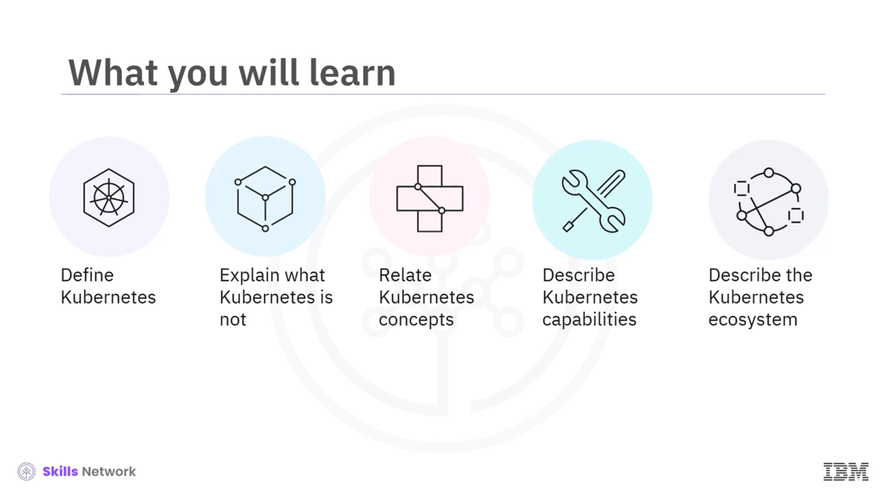
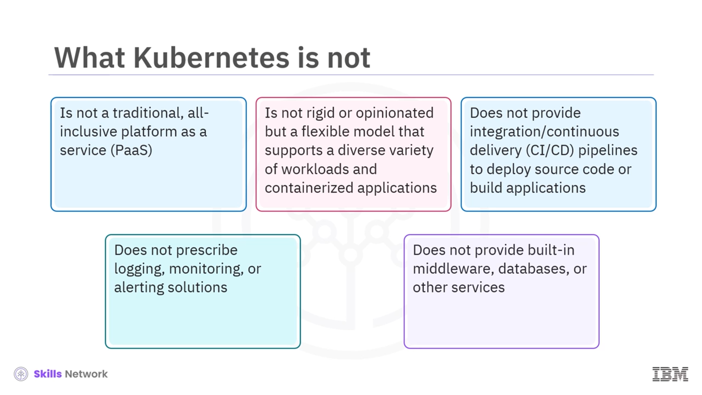
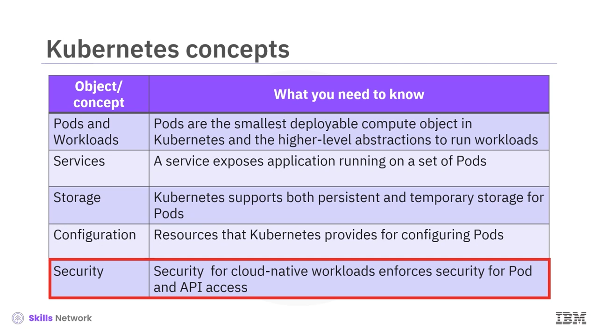
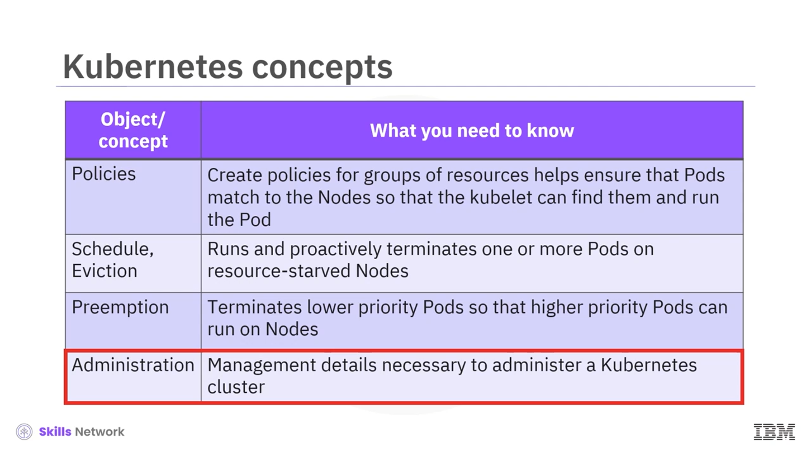
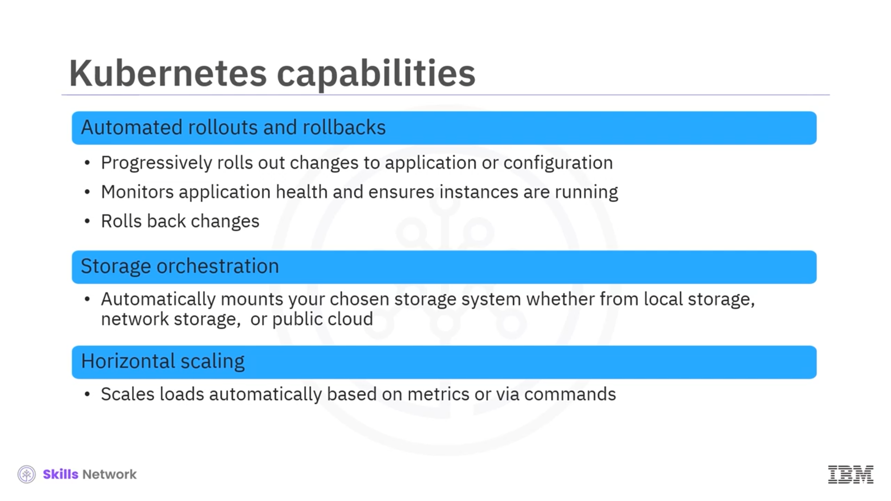
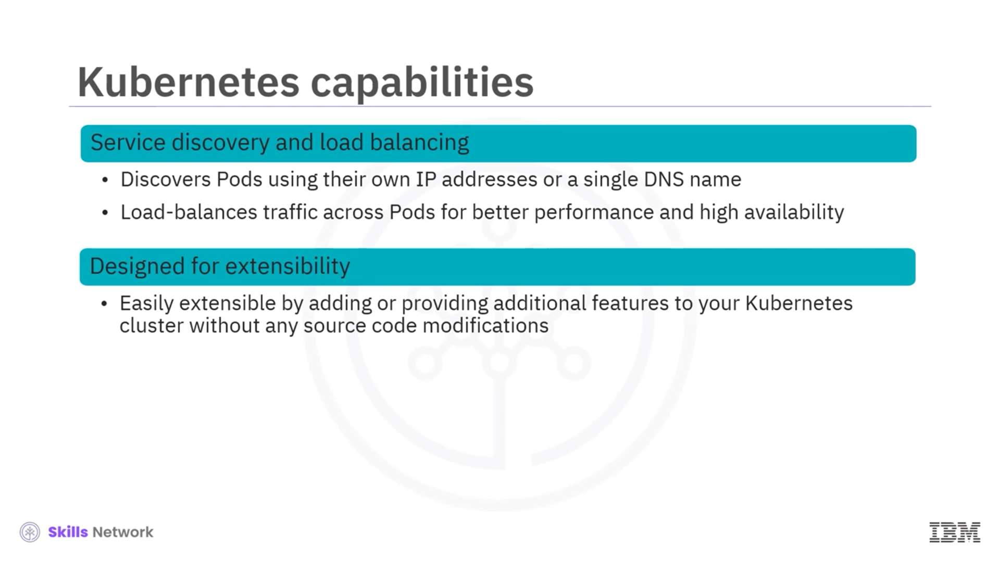
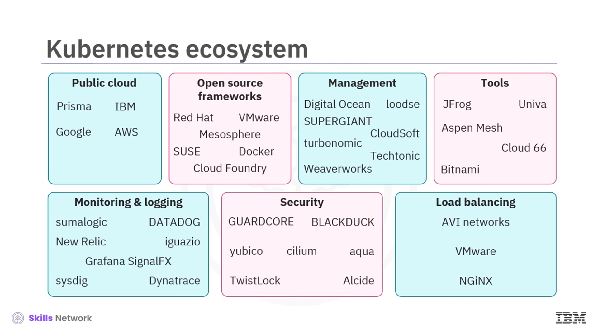

# ☸️ Kubernetes'e Giriş

## 🎯 Dersin Hedefleri

Kubernetes tanıtımına hoş geldiniz. Bu dersin sonunda **Kubernetes’i** tanımlayabilecek, Kubernetes’in ne olmadığını açıklayabilecek, temel kavramlarını birbiriyle ilişkilendirebilecek, Kubernetes’in başlıca yeteneklerini ve hızla büyüyen ekosistemini tarif edebileceksiniz.

## 📖 Kubernetes Nedir?

Resmi Kubernetes dokümantasyonu, Kubernetes’i **kapsayıcılı (container) uygulamaların dağıtımını, ölçeklendirilmesini ve yönetimini otomatikleştiren açık kaynaklı bir sistem** olarak tanımlar.  **Kubernetes** , konteyner orkestrasyonu için fiili standart hâline gelmiş, hem bulut ortamlarında hem de şirket içi veri merkezlerinde kolayca taşınabilen bir platformdur.

Kubernetes, Google tarafından bir proje olarak geliştirilmiş, bugün ise **Cloud Native Computing Foundation (CNCF)** tarafından sürdürülen açık kaynaklı bir kapsayıcı orkestrasyon platformuna dönüşmüştür. Hem üye hem de üye olmayan iş ortakları tarafından desteklenen, giderek büyüyen bir proje ve ürün ekosistemine sahiptir. Bu bağlamda  **Hizmet olarak Kubernetes (KaaS)** , **Hizmet olarak konteynerler (CaaS)** yaklaşımının doğal bir uzantısı olarak ortaya çıkmıştır.

## 🎛️ Bildirimsel Yönetim ve İstenen Durum

Kubernetes, **bildirimsel (declarative) yönetim** modelini benimser. İstediğiniz **hedef durumu** tanımlarsınız; Kubernetes bu hedef duruma ulaşmak için gerekli işlemleri otomatik olarak gerçekleştirir. Böylece, tek tek adımları belirtmek yerine “nasıl olmalı?” sorusuna cevap verirsiniz ve Kubernetes aradaki adımları kendisi hesaplar.

## 🚫 Kubernetes’in Ne Olmadığını Anlamak

Kubernetes’in ne olduğundan kadar, **ne olmadığını** bilmek de önemlidir. Kubernetes:

* Geleneksel, her şey dâhil bir **PaaS (Platform as a Service)** değildir.
* Katı veya aşırı **görüşlü (opinionated)** bir platform değildir; **durumsuz, durumlu ve veri işleme** iş yükleri de dâhil olmak üzere çok çeşitli iş yüklerini destekleyen esnek bir modele sahiptir.
* Konteynerleştirilebilen hemen her uygulamayla çalışabilir, ancak uygulama oluşturmak veya kaynak kodunu dağıtmak için yerleşik **CI/CD (sürekli entegrasyon/sürekli dağıtım)** boru hatları sağlamaz.
* Günlük kaydı, izleme ve uyarı için belirli “doğru” çözümleri dikte etmez; kuruluşlar bu alanlarda üçüncü taraf veya açık kaynak araçları seçmekte ve entegre etmekte özgürdür.
* Yerleşik  **ara yazılım (middleware)** , **veritabanları** veya diğer uygulama servislerini beraberinde getirmez; bu bileşenler ayrı araç ve hizmetlerle sağlanır.

## 🧩 Temel Kubernetes Kavramları

**Kubernetes kavramları** arasında şunlar yer alır:

* **Pod** : Kubernetes’te dağıtılabilen en küçük işlem nesnesidir. Genellikle bir veya birden fazla, birbiriyle yakından ilişkili **kapsayıcıdan (container)** oluşur.
* **İş yükleri (Workloads)** : Pod’ları kullanarak uygulamaları çalıştıran daha üst düzey soyutlamaları temsil eder.
* **Hizmetler (Services)** : Bir grup pod üzerinde çalışan uygulamaları ağ üzerinden ortaya çıkarır. Her poda benzersiz bir **IP adresi** atanır; aynı uygulamayı çalıştıran pod kümeleri ise tek bir **DNS adı** paylaşabilir.
* **Depolama** : Kubernetes, pod’lar için hem **geçici** hem de **kalıcı** depolama seçeneklerini destekler.
* **Yapılandırma (Configuration)** : Pod’ları yapılandırmak için kullanılan kaynakları ifade eder; örneğin ortam değişkenleri, konfigürasyon dosyaları ve diğer yapılandırma verileri bu kapsamda yönetilir.

## 🛡️ Güvenlik ve Politika Yönetimi

Kubernetes, özellikle bulut tabanlı iş yükleri için **pod** ve **API** erişiminde çeşitli güvenlik önlemleri sunar.  **Kaynak grupları için tanımlanan ilkeler (policies)** , pod’ların uygun düğümlerle ( **node** ) eşleşmesini sağlar; böylece  **kubelet** , ilgili pod’ları bulup bu düğümlerde çalıştırabilir.

Güvenlik politikaları; kimlik doğrulama, yetkilendirme, ağ erişimi ve kaynak kullanım sınırları gibi konuları kapsayarak iş yüklerinin güvenli ve kontrollü biçimde çalışmasına yardımcı olur.

## ⚙️ Zamanlama, Tahliye ve Önceliklendirme

Kubernetes’te  **zamanlama (scheduling)** , hangi pod’un hangi düğümde çalışacağını belirler. **Tahliye (eviction)** mekanizması ise kaynak yetersizliği yaşayan düğümlerde bir veya daha fazla pod’u proaktif olarak sonlandırarak kümenin sağlığını korur.

**Öncelik (priority)** kavramı, hangi iş yüklerinin daha kritik olduğunu belirtmenize olanak tanır. **Preemption (ön alma)** ise, daha yüksek önceliğe sahip pod’ların zamanlanabilmesi için, daha düşük öncelikli pod’ların sonlandırılmasına izin verir.

Tüm bunların üzerinde,  **küme yönetimi (cluster management)** ; bir Kubernetes kümesini oluşturmak, güncellemek, ölçeklendirmek ve sürdürmek için gerekli bileşenleri ve süreçleri kapsar.

## 🚀 Kubernetes’in Temel Özellikleri

Kubernetes, modern uygulama yaşam döngüsünü desteklemek için birçok yerleşik yetenek sunar:

* Uygulama veya yapılandırmada yapılan değişikliklerin  **otomatik olarak yayına alınması (rolling update)** .
* Küme durumunun **izlenmesi** ve gerekirse  **değişikliklerin geri alınması (rollback)** .
* Yerel disk, ağ depolama veya genel bulut sağlayıcıları gibi depolama sistemlerini bağlayan  **depolama düzenlemesi (storage orchestration)** .
* İş yüklerinin metriklere (örneğin CPU veya bellek kullanımı) ya da komutlara göre  **yatay olarak ölçeklendirilmesi (horizontal scaling)** .

Bu özellikler, uygulamaların güvenli, kontrollü ve sürekli çalışır durumda tutulmasına yardımcı olur.

## 📦 Otomatik Kutu Paketleme ve Kaynak Verimliliği

Kubernetes, **otomatik kutu paketleme (automatic bin packing)** özelliğiyle, fiziksel veya sanal makinelerdeki kaynakları daha verimli kullanmayı hedefler. Kritik ve “en iyi çaba” ( **best-effort** ) türündeki iş yüklerini aynı altyapıda karışık şekilde çalıştırarak:

* **Kaynak kullanımını artırır** ,
* **Maliyetleri düşürür** ,
* Yüksek kullanılabilirlikten ödün vermeden, kapsayıcıları **kaynak gereksinimleri ve kısıtlarına göre** düğümlere otomatik olarak yerleştirir.

Bu sayede altyapınız hem daha dolu hem de daha dengeli çalışır.

## 🔐 Gizli Veriler ve Yapılandırma Yönetimi

Kubernetes,  **şifreler** , **OAuth belirteçleri** ve **SSH anahtarları** gibi hassas bilgilerin yönetimi için **Secret** ve uygulama ayarlarının yönetimi için **ConfigMap** nesnelerini kullanır. Bu mekanizma sayesinde:

* Uygulama yapılandırmaları ve gizli veriler, kapsayıcı görüntülerini yeniden oluşturmadan güncellenebilir.
* Farklı ortamlar (geliştirme, test, üretim) için yapılandırma dağıtımları kolayca yönetilebilir.
* Pod’lara ve hizmetlere hem **IPv4** hem de **IPv6** adresleri atanarak **çift yığın (dual-stack)** ağ desteği sağlanabilir.

Böylece güvenli, esnek ve taşınabilir bir yapılandırma ve gizli veri yönetimi elde edilir.

## 🧰 İş Yükleri, Kendi Kendini İyileştirme ve Servis Keşfi

Kubernetes, hem **toplu iş (batch)** hem de **sürekli entegrasyon (CI)** iş yüklerini yönetebilme yeteneğine sahiptir. Hatalı kapsayıcıları otomatik olarak **yeniden başlatır** veya  **değiştirir** ; başarısız olan ya da yanıt vermeyen pod’ları **kendi kendine iyileştirme (self-healing)** mantığıyla yeniden konumlandırır.

Kubernetes ayrıca:

* IP adresleri veya bir **DNS adı** kullanarak pod’ları ve hizmetleri  **keşfeder (service discovery)** ,
* Daha iyi performans ve yüksek kullanılabilirlik için  **yük trafiğini dengeler (load balancing)** ,
* Uygulama kaynak kodunu değiştirmeye gerek kalmadan kümeye yeni özellikler eklemeye izin veren **genişletilebilir (extensible)** bir mimari sunar.

## 🌐 Kubernetes Ekosistemi ve Yardımcı Hizmetler

 **Kubernetes ekosistemi** , hizmetlerin, desteğin ve araçların yaygın olarak bulunduğu, büyük ve hızla büyüyen bir dünyadır. Konteynerli uygulamaları çalıştırmak yalnızca orkestrasyon aracı kullanmakla sınırlı değildir; aynı zamanda şu alanlarda ek araçlar gerektirir:

* **Kapsayıcı görüntülerini oluşturma** ,
* Bu görüntüleri bir **kapsayıcı kayıt defterinde (container registry)** saklama,
* **Uygulama günlüğü (logging)** ve  **izleme (monitoring)** ,
* **CI/CD** boru hatları ve sürüm yönetimi.

Kubernetes, bu ihtiyaçları karşılayan geniş bir ürün ve hizmet ekosistemi ile birlikte çalışır.

## 🏢 Sağlayıcı Kategorileri ve Örnekler

Kubernetes ekosistemi, farklı kategorilerde çok sayıda ürün, hizmet ve sağlayıcı içerir. Örnek olarak:

* **Genel bulut sağlayıcıları** : Prisma, IBM, Google, AWS.
* **Açık kaynak çerçeve sağlayıcıları** : Red Hat, VMware,  **SUSE** , Mesosphere, Docker, Cloud Foundry.
* **Yönetim ve operasyon sağlayıcıları** : DigitalOcean, Loodse, Supergiant, CloudSoft, Turbonomic, Tectonic, Weaveworks.
* **Araç sağlayıcıları** : JFrog, Univa, Aspen Mesh, Bitnami, Cloud 66.
* **İzleme ve günlükleme sağlayıcıları** : Sumo Logic, Datadog, New Relic, Iguazio, Grafana, SignalFx, Sysdig, Dynatrace.
* **Güvenlik sağlayıcıları** : Guardicore, Black Duck, Yubico, Cilium, Aqua, Twistlock, Alcide.
* **Yük dengeleme sağlayıcıları** : Avi Networks, VMware, NGINX.

Bu çeşitlilik, Kubernetes’i farklı altyapı ve ihtiyaçlara uyarlamayı kolaylaştırır.

## ✅ Özet ve Kazanımlar

Bu videoda  **Kubernetes’in** , otomatik dağıtım ve basitleştirilmiş yönetim yeteneklerine sahip, yüksek düzeyde taşınabilir ve  **yatay olarak ölçeklenebilir** , açık kaynaklı bir **kapsayıcı orkestrasyon sistemi** olduğunu öğrendiniz.

Kavramları arasında  **pod’lar** ,  **iş yükleri** ,  **hizmetler** ,  **depolama** ,  **yapılandırma** ,  **güvenlik politikaları** ,  **zamanlama ve tahliye** , **önceliklendirme ve preemption** ile **küme yönetimi** yer almaktadır.

Kubernetes’in yetenekleri;  **otomatik kullanıma sunma ve geri alma** ,  **depolama düzenleme** ,  **yatay ölçekleme** ,  **otomatik kutu paketleme** ,  **gizli ve yapılandırma yönetimi** ,  **IPv4/IPv6 çift yığın desteği** ,  **toplu iş yürütme** ,  **kendi kendini iyileştirme** , **servis keşfi ve yük dengeleme** ve **genişletilebilirlik** olarak özetlenebilir.

Son olarak, Kubernetes ekosisteminin;  **genel bulut sağlayıcıları** ,  **çerçeveler** ,  **yönetim çözümleri** ,  **araçlar** ,  **izleme ve günlükleme** , **güvenlik** ve **yük dengeleme** gibi birçok alanda zengin seçenekler sunduğunu gördünüz. Bu sayede Kubernetes, modern bulut yerel ( **cloud-native** ) uygulamaların temel yapı taşlarından biri hâline gelmiştir.

