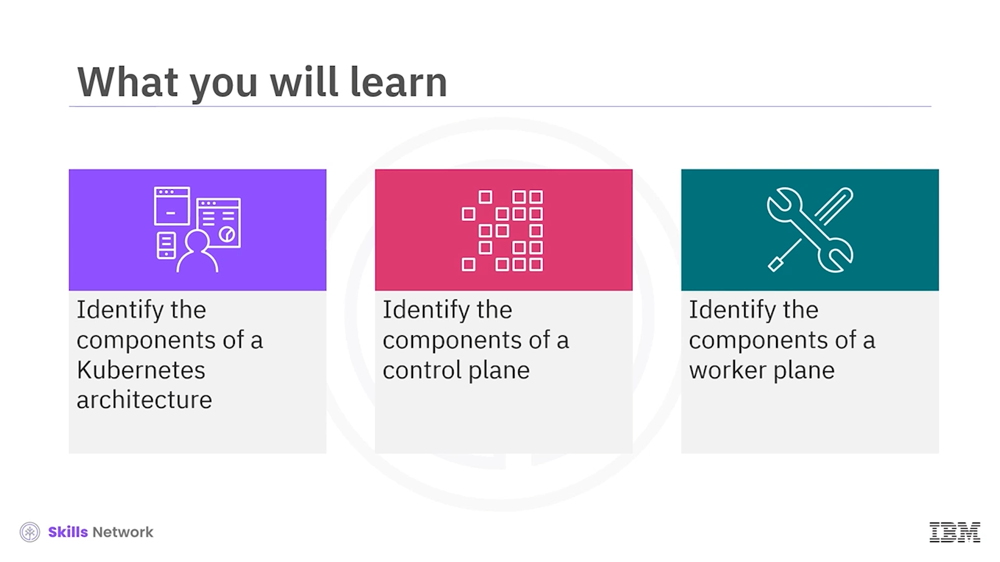
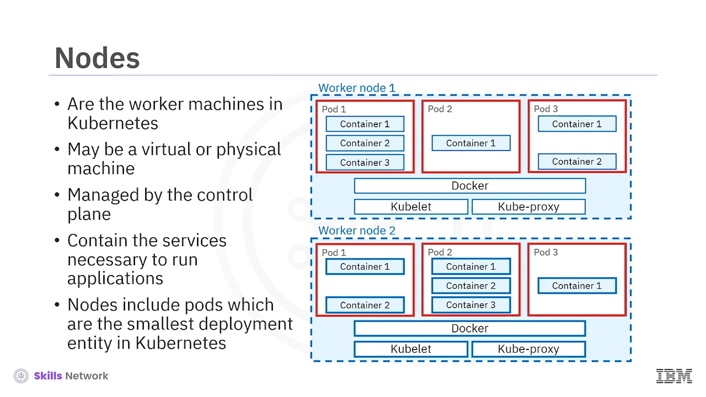
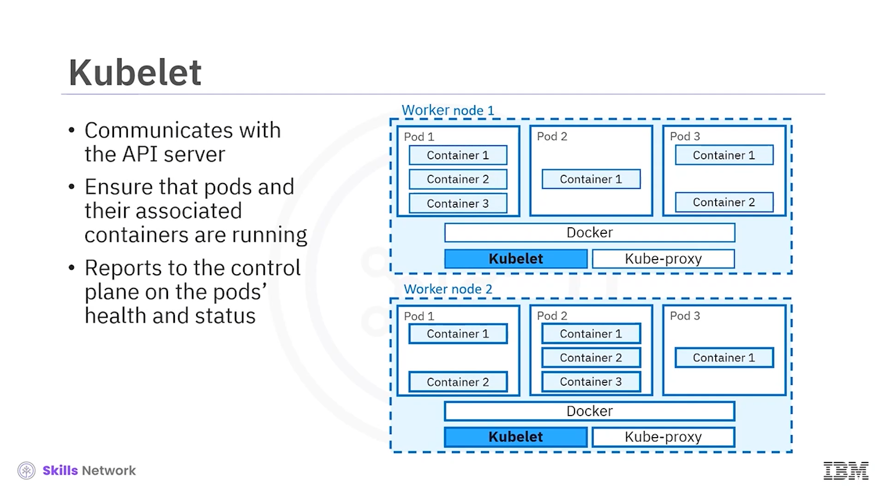
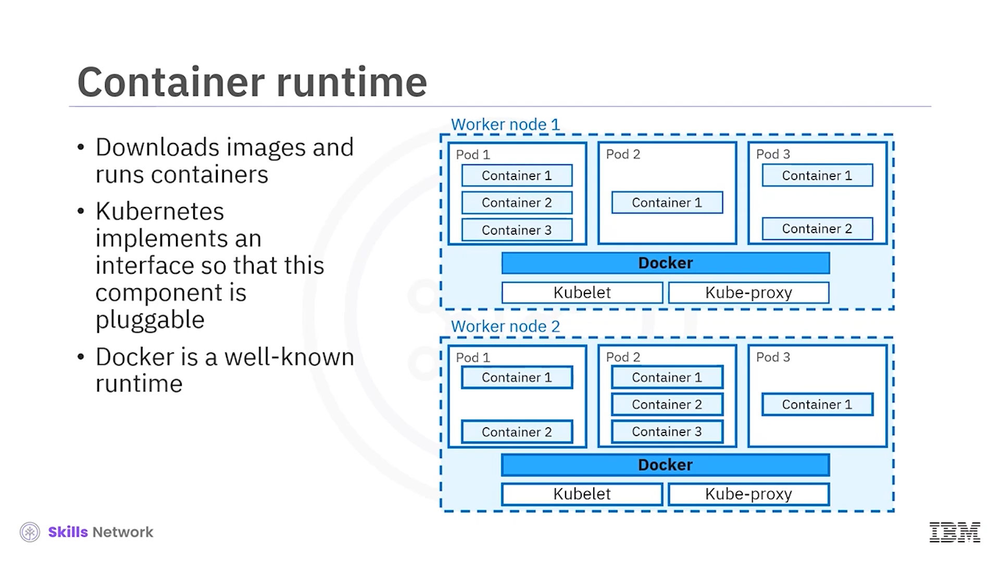
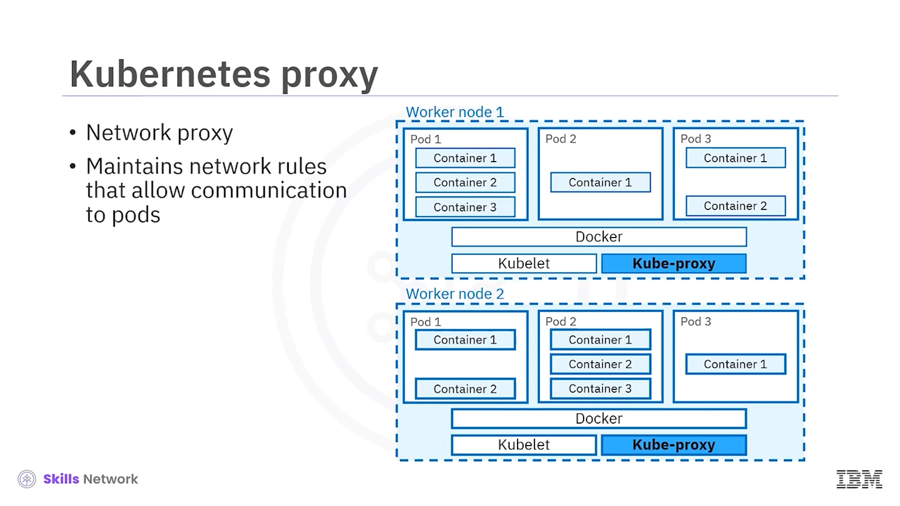

# ☸️ Kubernetes Mimarisi: Kontrol Düzlemi ve İşçi Düzlemi

## 🎯 Dersin Hedefleri ve Genel Bakış

**Kubernetes mimarisine** hoş geldiniz. Bu dersi tamamladıktan sonra:

* Bir **Kubernetes mimarisinin bileşenlerini** tanımlayabilecek,
* Bir **kontrol düzleminin** bileşenlerini açıklayabilecek,
* Bir **işçi düzleminin** (worker plane) bileşenlerini tanımlayabileceksiniz.

Bu mimari diyagram, bir **Kubernetes sistemi** içindeki temel bileşenleri gösterir. Bir Kubernetes dağıtımına **Kubernetes kümesi (cluster)** denir ve bu küme, **konteynerli uygulamaları** çalıştıran bir **düğüm (node)** kümesinden oluşur.

---

## 🧱 Kubernetes Kümesi ve Temel Kavramlar

Her Kubernetes kümesinin bir **ana düğümü** (veya ana düğüm grubu) vardır; burada **Kubernetes kontrol düzlemi (control plane)** çalışır. Buna ek olarak, üzerinde uygulamalarınızın koştuğu bir veya daha fazla **işçi düğüm** bulunur.

 **Kontrol düzlemi** , küme hakkında kararlar alarak ve kümedeki olayları algılayıp bunlara yanıt vererek **istenen küme durumunu** korur. Yani “kümenin beyni” gibi davranır.

---

## 🌡️ Kontrol Düzlemi ve İstenen Durum (Termostat Benzetmesi)

Kontrol düzlemini bir **termostata** benzetebiliriz. Termostata istediğiniz sıcaklığı ayarlarsınız; termostat da bu hedef duruma ulaşmak için ısıtma ve soğutma sistemlerini sürekli olarak düzenler.

Kubernetes’te de siz istenen durumu tanımlarsınız (örneğin “bu uygulamadan 3 kopya çalışsın”) ve  **kontrol düzlemi** :

* **İş yüklerinin zamanlaması** gibi kararları alır,
* Yeni bir uygulama dağıtıldığında **yeni kaynaklar oluşturarak** olaylara yanıt verir,
* Sürekli olarak gerçek durumu istenen durumla eşleştirmeye çalışır.

---

## 🖥️ Düğümler ve Altyapıdan Bağımsızlık

 **Düğümler** , bir Kubernetes kümesindeki **işçi makineler**dir. Başka bir deyişle, kullanıcı uygulamaları bu düğümlerde çalıştırılır.

Genellikle:

* Düğümler Kubernetes’in kendisi tarafından değil,
* Bir **bulut sağlayıcısı** veya altyapı yöneticisi tarafından oluşturulur.

Bu sayede Kubernetes, **farklı altyapılarda ve bulut sağlayıcılarında** çalışabilir. Düğümler oluşturulduktan sonra, bunlar **kontrol düzlemi** tarafından yönetilir.

---

## 📡 Kubernetes API Sunucusu

**Kubernetes kontrol düzleminin** merkezinde **Kubernetes API sunucusu** bulunur. Bu bileşen, **Kubernetes API’sini** dışarıya açar ve kontrol düzlemi için bir **ön uç (frontend)** görevi görür.

* Kümedeki tüm bileşenler bu **API üzerinden** iletişim kurar.
* Kullanıcıdan veya diğer bileşenlerden gelen, kümenin durumunu **görüntülemek** veya **değiştirmek** için kullanılan komutları kabul eder.

Bu API sunucusunun temel uygulaması  **kube-apiserver** ’dır ve **yatay olarak ölçeklenecek** şekilde tasarlanmıştır. Birden fazla kube-apiserver örneği çalıştırabilir ve aralarındaki trafiği **yük dengeleme** ile dağıtabilirsiniz.

---

## 🗄️ etcd ile Küme Durumunun Saklanması

 **etcd** , tüm küme verilerini içeren, yüksek oranda kullanılabilir  **dağıtılmış bir anahtar-değer deposudur** .

* Kubernetes’e bir uygulama dağıtmasını söylediğinizde,
* Dağıtımın **yapılandırma verileri** ve **kümenin durumu** etcd’de saklanır.

Bu veriler, bir Kubernetes kümesinin **istenen durumunu** tanımlar. Sistem, **gerçek durumu** bu istenen durumla eşleştirmek için sürekli çalışır.

---

## 📅 Zamanlayıcı (kube-scheduler) ve İş Yüklerinin Yerleştirilmesi

 **Kubernetes zamanlayıcı (kube-scheduler)** , yeni oluşturulan **pod’ları** uygun düğümlere atayan bileşendir. Yani iş yüklerinizin küme içinde **hangi düğüm(ler)de çalışacağını** belirler.

Zamanlayıcı, şu kriterlere göre en uygun düğümü seçer:

* Kubernetes  **zamanlama ilkeleri** ,
* Yapılandırma seçenekleri,
* Mevcut  **CPU, bellek ve diğer kaynaklar** ,
* Kısıtlamalar (node selector, taint/toleration, affinity vb.).

---

## 🧭 Denetleyici Yöneticileri ve Küme Durumu

 **Kubernetes denetleyici yöneticisi (kube-controller-manager)** , kümenin durumunu izleyen ve kümenin **gerçek durumunun istenen durumla eşleşmesini** sağlayan tüm **denetleyici (controller)** süreçlerini çalıştırır.

Buna ek olarak bir de **bulut denetleyicisi yöneticisi (cloud-controller-manager)** vardır. Bu bileşen:

* Temel **bulut sağlayıcıları** ile etkileşime giren denetleyicileri çalıştırır,
* Kubernetes kümelerini bulut sağlayıcısının **API’sine** etkin şekilde bağlar.

Kubernetes **açık kaynak** olduğundan ve farklı bulut sağlayıcıları ile kurumlar tarafından benimsenmesi hedeflendiğinden, mümkün olduğunca **buluttan bağımsız** olmaya çalışır. Bulut denetleyicisi yöneticisi sayesinde hem Kubernetes hem de bulut sağlayıcıları, birbirine sıkı bağımlılık oluşturmadan  **bağımsız şekilde evrimleşebilir** .

---

## 🧩 İşçi Düğümler ve Pod Kavramı

 **Düğümler** , bir Kubernetes kümesindeki **işçi makineler**dir ve kullanıcı uygulamaları bu düğümler üzerinde çalıştırılır. Düğümler:

* **Sanal** veya **fiziksel** makineler olabilir,
* Kontrol düzlemi tarafından yönetilir,
* Uygulamaları çalıştırmak için gerekli tüm **hizmetleri ve ajanları** içerir.

Düğümler, Kubernetes’teki en küçük dağıtım varlığı olan  **pod** ’ları barındırır. Bir  **pod** :

* Bir veya daha fazla **konteyner** içerir,
* Bu konteynerler **aynı düğümün kaynaklarını paylaşır** (CPU, bellek, ağ),
* Pod içindeki konteynerler arasında **doğrudan ve hızlı iletişime** izin verir.

---

## 🔁 Kubelet: Düğüm Temsilcisi

Bir işçi düğümünün en önemli bileşeni  **kubelet** ’tir. Kubelet, o düğümde çalışan Kubernetes ajanıdır.

Kubelet’in görevleri:

* **Kube-API sunucusu** ile iletişim kurmak,
* Yeni ve güncellenmiş **pod tanımlarını** almak,
* Pod’ların ve içlerindeki konteynerlerin  **istenen şekilde çalıştığından emin olmak** ,
* Pod’ların **sağlık durumunu ve durum bilgisini** kontrol düzlemine raporlamak,
* Bir pod’u başlatmak için **konteyner çalışma zamanını** (container runtime) kullanmak.

---

## 📦 Konteyner Çalışma Zamanı (Container Runtime)

 **Konteyner çalışma zamanı** , pod içindeki konteynerler için:

* Gerekli **görüntüleri (image)** indirmekten,
* Bu görüntülerden **konteynerleri çalıştırmaktan** sorumludur.

Kubernetes, tek bir sabit çalışma zamanı yerine **Container Runtime Interface (CRI)** adlı bir arabirim uygular. Böylece çalışma zamanı **takılabilir** (pluggable) hale gelir.

Yaygın konteyner çalışma zamanları:

* **Docker** (en çok bilinenlerden biri),
* **Podman** ,
* **CRI-O** gibi diğer popüler çalışma zamanları.

---

## 🌐 kube-proxy ve Ağ İletişimi

Son olarak,  **kube-proxy** , kümedeki her düğümde çalışan bir **ağ proxy’si**dir.

kube-proxy:

* Düğümlerde çalışan pod’larla **iletişimi mümkün kılan ağ kurallarını** yönetir,
* Kümede çalışan iş yüklerinin birbirleriyle ve dış dünya ile **iletişim kurabilmesini** sağlar,
* **Servis (Service)** soyutlamasını destekleyerek trafiği uygun pod’lara yönlendirir.

---

## ✅ Özet: Kontrol Düzlemi ve İşçi Düzleminin Bileşenleri

Bu derste şunları öğrendiniz:

* **Kontrol düzlemi** , Kubernetes kümesi hakkında **küresel kararlar** alır ve istenen durumu korur.
* Bir **kontrol düzlemi** şu bileşenlerden oluşur:
  * **Kubernetes API sunucusu (kube-apiserver)**
  * **etcd** (durum veritabanı)
  * **Zamanlayıcı (kube-scheduler)**
  * **Denetleyici yöneticisi (kube-controller-manager)**
  * **Bulut denetleyicisi yöneticisi (cloud-controller-manager)**
* Bir **işçi düzlemi** ise şunlardan oluşur:
  * **Düğümler (nodes)**
  * **kubelet**
  * **Konteyner çalışma zamanı (container runtime)**
  * **kube-proxy**
* **İşçi düğümleri** , hem önemli Kubernetes bileşenlerini hem de kümede dağıtılan **kullanıcı iş yüklerini** çalıştırır.
* Kubernetes’teki en küçük dağıtılabilir varlık  **pod** ’dur ve bir pod bir veya daha fazla **konteyner** içerir.

Bu mimari sayesinde Kubernetes, büyük ölçekli konteynerli uygulamaları **güvenilir, esnek ve taşınabilir** şekilde yönetmenizi sağlar.

