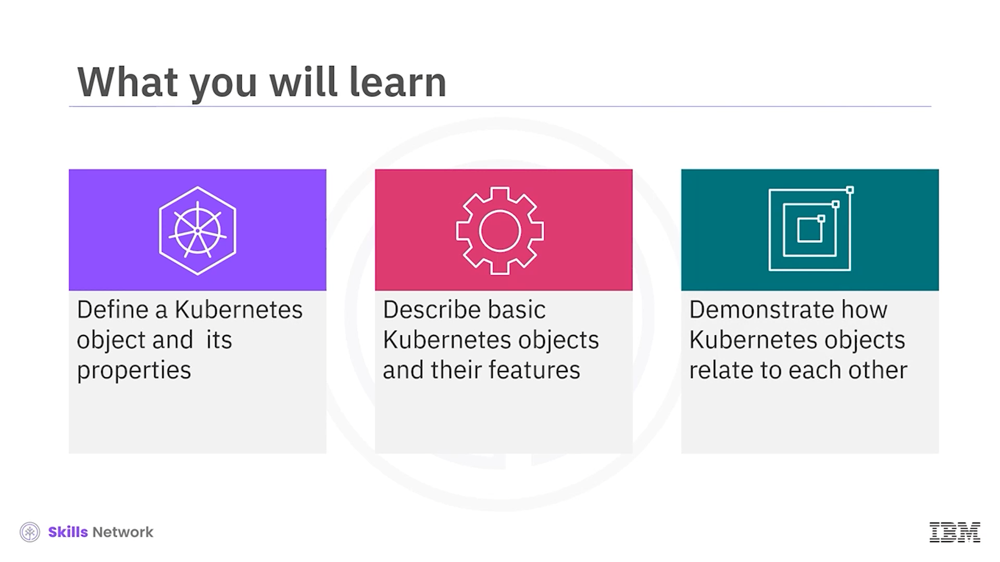
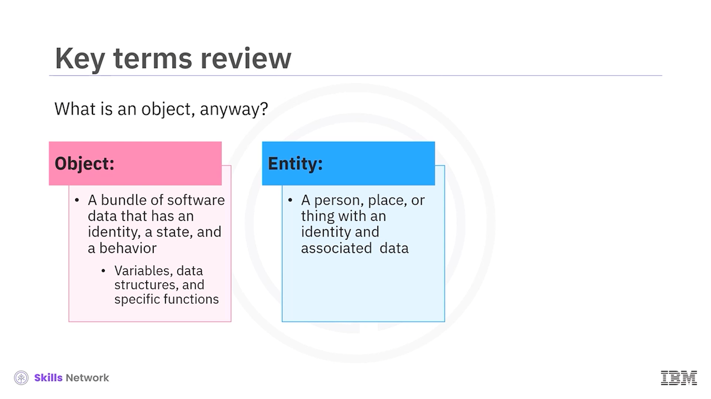
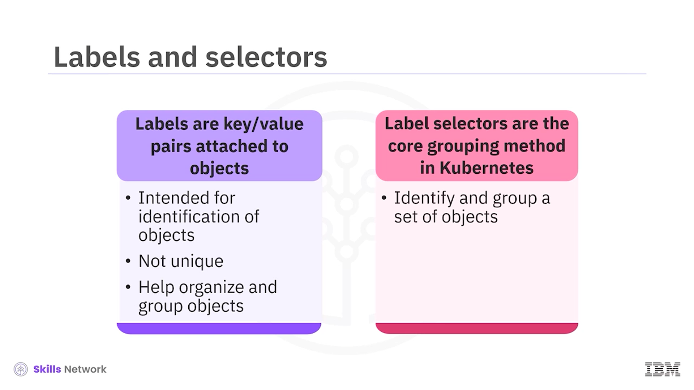
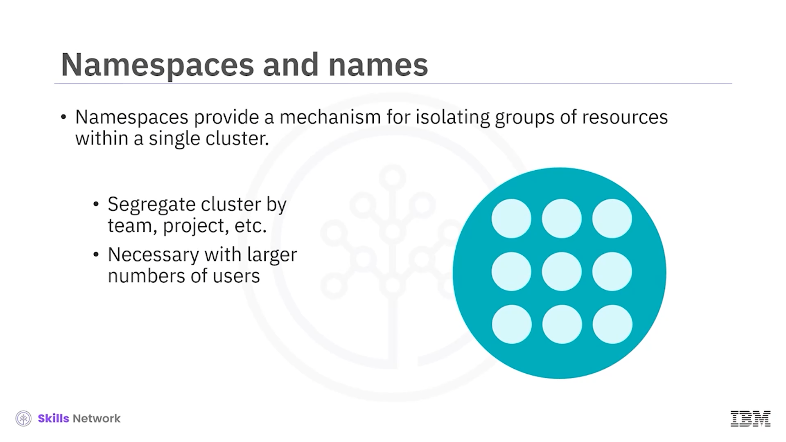
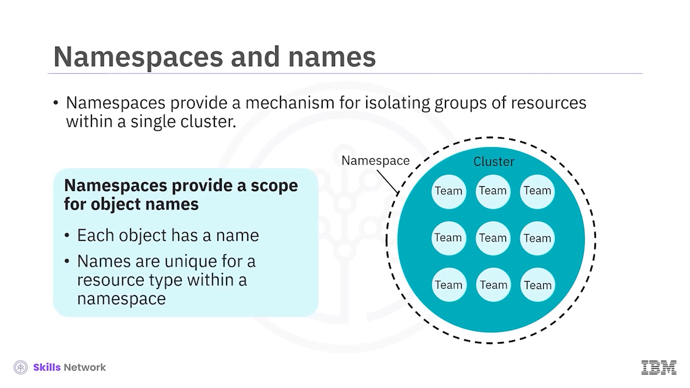
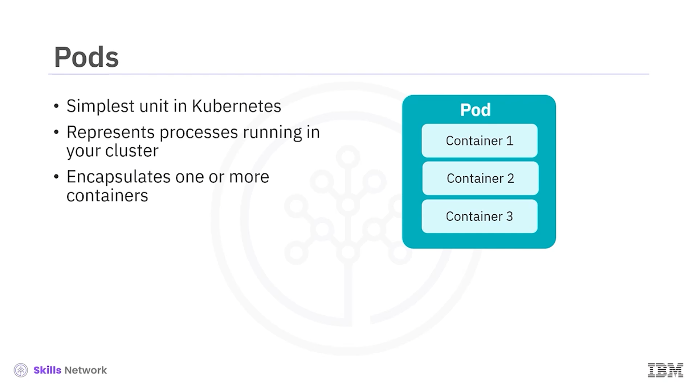
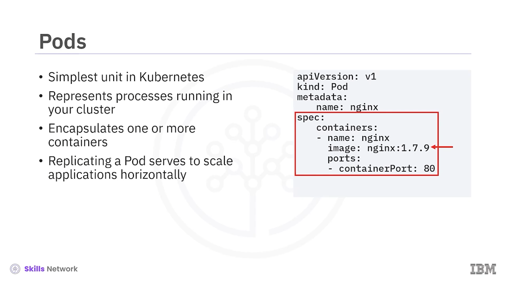
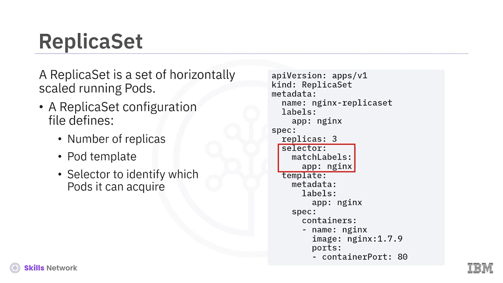
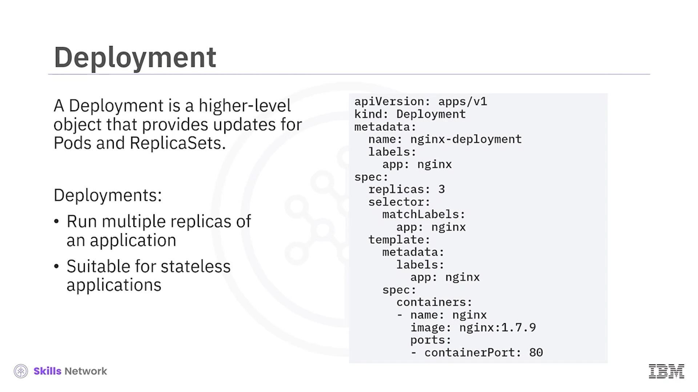
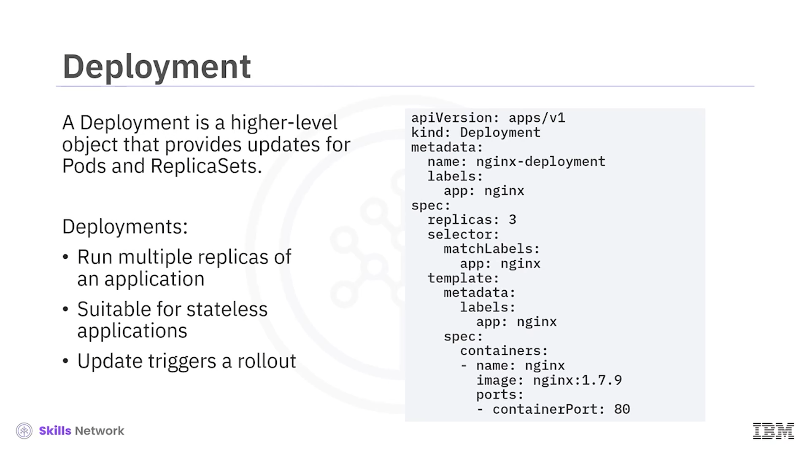

# ☸️ Kubernetes Nesnelerine Giriş (Bölüm 1)

## 🎬 Bölüme Giriş ve Öğrenme Hedefleri

**Kubernetes Nesneleri 1. bölümüne** hoş geldiniz. Bu dersi tamamladıktan sonra bir **Kubernetes nesnesini** ve özelliklerini tanımlayabilecek, temel Kubernetes nesnelerini ve özelliklerini açıklayabilecek ve Kubernetes nesnelerinin birbirleriyle nasıl ilişkili olduğunu gösterebileceksiniz.

## 🧩 Nesne Kavramı: Gerçek Dünya ve Yazılım

Gerçek dünyada bir  **nesne** , kimliği, durumu ve davranışı olan herhangi bir şeydir. Örneğin bir pencere veya alışveriş sepeti birer nesnedir.

**Yazılım nesnesi** ise kimliği, durumu ve davranışı olan bir veri paketidir. Örnek olarak değişkenler, veri yapıları ve belirli işlevler verilebilir.

Buna yakın bir terim de **varlık (entity)** kavramıdır; bu da bir kimliğe ve ilişkili verilere sahip olan şeyleri ifade eder.

## 📚 Kalıcılık (Persistence) ve Kubernetes Nesneleri

**Kalıcılık (persistent)** terimi, bir sunucu hatası veya ağ kesintisi olsa bile bir şeyin varlığını sürdürmesi anlamına gelir. Örneğin **kalıcı depolama** bu kavrama bir örnektir.

 **Kubernetes nesneleri** , bu anlamda  **kalıcı varlıklardır** . Örnekler arasında  **Pod’lar** ,  **ad alanları (namespaces)** ,  **kopya kümeleri (ReplicaSet)** , **dağıtımlar (Deployment)** ve daha fazlası yer alır.

## ⚙️ Nesne Spesifikasyonu ve Durum (Spec & Status)

**Kubernetes nesneleri** iki ana alandan oluşur: **nesne spesifikasyonu (spec)** ve  **durum (status)** .

* **Nesne spesifikasyonu** , bir nesnenin istenen durumunu tanımlar ve kullanıcı tarafından sağlanır.
* **Durum** ise Kubernetes tarafından sağlanır ve nesnenin geçerli, yani gerçek durumunu açıklar.

Kubernetes, mevcut durumu istenen durumla eşleştirmek için sürekli çalışır; bu, Kubernetes’in çekirdek davranışıdır.

## 🛠️ Kubernetes API ve kubectl ile Çalışmak

Bu nesnelerle çalışmak için **Kubernetes API’sini** doğrudan istemci kütüphaneleri aracılığıyla kullanabilir, **kubectl** komut satırı arayüzünden yararlanabilir veya her ikisini de birlikte kullanabilirsiniz. Böylece nesneleri oluşturabilir, güncelleyebilir, silebilir ve durumlarını sorgulayabilirsiniz.

## 🏷️ Etiketler (Labels) ile Nesneleri Gruplama

 **Etiketler (labels)** , nesnelere bağlı  **anahtar–değer çiftleridir** . Nesneleri tanımlamak ve kategorize etmek için tasarlanmıştır. Ancak tek bir etiketi kullanmak, tek bir nesneyi benzersiz şekilde tanımlamaz.

Birçok nesne aynı etiketlere sahip olabilir; bu da nesneleri düzenlemeye, filtrelemeye ve gruplamaya yardımcı olur.

## 🔎 Etiket Seçicileri (Label Selectors)

 **Etiket seçicileri (label selectors)** , Kubernetes’teki temel gruplama ve filtreleme yöntemidir. Belirli bir dizi etikete sahip nesneleri seçmenizi sağlar. Örneğin belirli bir uygulamaya ait tüm Pod’ları, onlara verdiğiniz ortak etiketler aracılığıyla seçebilirsiniz.

## 🗂️ Ad Alanları (Namespaces) ile Kaynakları İzole Etme

 **Ad alanları (namespaces)** , tek bir küme içindeki kaynak gruplarını izole etmek için kullanılan bir mekanizma sağlar.

Bu özellikle şu durumlarda faydalıdır:

* Ekipler **maliyet tasarrufu** amacıyla aynı kümeyi paylaştığında,
* Birden fazla projenin tek bir küme üzerinde sürdürüldüğü senaryolarda,
* Küme kullanıcılarının sayısının büyük olduğu ortamlarda.

Bu sayede kaynaklar mantıksal sınırlar içinde yönetilebilir.

## 🧭 Ad Alanı Örnekleri ve Kullanım Modelleri

Ad alanlarına örnek olarak:

* Sistem bileşenleri için kullanılan **`kube-system`** ad alanı,
* Kullanıcı uygulamalarını tutmak için kullanılan **`default`** ad alanı verilebilir.

Ad alanlarıyla çalışmak için farklı modeller vardır:

* Bir ekiple çalışan bir kullanıcı, kümeye dağıtılan tek bir proje için yalnızca **bir ad alanı** kullanabilir.
* Alternatif olarak, birçok ekip veya proje için ya da farklı ihtiyaçları olan çok sayıda kullanıcı için **birden fazla ad alanı** oluşturulabilir.

## 🧱 Ad Alanlarının Kapsam Sağlaması ve İsimlendirme

 **Ad alanları** , nesnelerin adları için bir **kapsam (scope)** sağlar. Her nesnenin, bulunduğu ad alanı içinde, ilgili kaynak türü için **benzersiz bir adı** olmalıdır. Böylece aynı isim farklı ad alanlarında tekrar kullanılabilir ve isim çakışmaları engellenir.

## 📦 Pod: Kubernetes’in En Basit Birimi

 **Pod** , Kubernetes’teki en basit ve en küçük dağıtım birimidir. Kümede çalışan bir uygulamanın **bir işlemini veya tek bir örneğini** temsil eder.

Bir Pod genellikle **bir veya birden fazla konteyneri** sarar. Bir Pod’un kopyalarını oluşturmak, uygulamayı **yatay olarak ölçeklendirmek** için kullanılır.

## 📄 YAML ile Nesneleri Tanımlama ve Basit Pod Örneği

Kubernetes’te oluşturmak istediğiniz nesneyi tanımlamak için genellikle **YAML dosyaları** kullanılır. Örnekte gösterilen YAML dosyası basit bir **Pod’u** tanımlar.

Bu manifestte:

* **`kind`** alanı, oluşturulacak nesnenin türünü belirtir (bu durumda bir  **Pod** ).
* **`spec`** alanı, nesne için gerekli asıl ayarları içerir; bu örnekte Pod içinde çalışacak **kapsayıcılar (containers)** tanımlanır.
* Bir Pod spesifikasyonu **en az bir konteyner** içermelidir.

Örnekte konteynerin adı **`nginx`** olarak verilmiştir. **`image`** alanı, Pod içinde hangi imajın çalışacağını belirtir; **`ports`** dizisi ise konteynerin dışa açtığı bağlantı noktalarını listeler.

## 📚 Kopya Kümesi (ReplicaSet) ile Yatay Ölçekleme

Bir  **kopya kümesi (ReplicaSet)** , yatay olarak ölçeklendirilmiş bir Pod’un aynı çalışan kopyalarından oluşan bir kümedir.

Bir ReplicaSet ve Pod için kullanılan yapılandırma dosyaları birbirinden farklıdır. ReplicaSet manifestinde:

* **`replicas`** alanı, herhangi bir zamanda çalıştırılması gereken Pod kopyası sayısını belirtir. Bu alan güncellendiğinde, ReplicaSet istenen sayıya ulaşmak için Pod’lar oluşturur veya siler.
* ReplicaSet spesifikasyonuna, ReplicaSet’in oluşturması gereken Pod’ları tanımlayan bir **Pod şablonu (`template`)** dahildir.

## 🎯 ReplicaSet’te Etiketler ve Seçiciler

ReplicaSet manifestinde **`selector`** alanı altında yer alan **`matchLabels`** kısmında verilen etiketler, ReplicaSet tarafından yönetilebilecek Pod’ları belirtir.

Burada tanımlanan etiketlerin, Pod şablonundaki **`metadata.labels`** alanında tanımlanan etiketlerle **aynı** olduğuna dikkat etmek gerekir. Örnekte her ikisi de **nginx** uygulamasını işaret eder; bu sayede ReplicaSet doğru Pod’ları bulup yönetebilir.

## 🚀 Neden Doğrudan ReplicaSet Değil, Deployment?

Genel olarak doğrudan **ReplicaSet** oluşturulması önerilmez. Bunun yerine ReplicaSet’leri yöneten, daha fazla özellik ve daha iyi kontrol sunan daha üst düzey bir konsept olan **Deployment (dağıtım)** nesnesi kullanılmalıdır.

 **Deployment** :

* Hem Pod’lar hem de ReplicaSet’ler için güncellemeler sağlayan  **üst düzey bir nesnedir** .
* ReplicaSet’leri kullanarak bir uygulamanın birden çok kopyasını çalıştırır.
* Bu ReplicaSet’lerin üzerine ek **yönetim yetenekleri** (güncelleme stratejileri, rollback vb.) sunar.

## 🧮 Durumsuz ve Durumlu Uygulamalar İçin Nesne Seçimi

 **Deployment’lar** , genellikle **durumsuz (stateless)** uygulamalar için uygundur.

**Durum özellikli (stateful)** uygulamalar için ise **StatefulSet** gibi durumlu nesneler kullanılır.

Deployment kullanım örnekleri:

* Çoğaltılmış bir uygulamanın dağıtımı,
* Deployment tarafından yönetilen Pod güncellemeleri,
* Bir uygulamanın yukarı veya aşağı doğru  **ölçeklendirilmesi** .

Deployment spesifikasyonunda, tür olarak **Deployment** belirtilir; **`replicas`** alanı çoğaltma sayısını tanımlar, **`selector`** hangi Pod’ların edinilebileceğini belirtir ve ayrıca bir **Pod şablonu** yer alır.

## 🔁 Sürekli Güncellemeler (Rolling Updates)

Deployment’ların ReplicaSet’lere göre sunduğu önemli özelliklerden biri  **sürekli (rolling) güncellemelerdir** .

Rolling update sırasında:

* Yeni sürüm, uygun sayıda kopyaya  **yavaş yavaş yükseltilir** ,
* Eski sürüm ise yavaş yavaş **sıfır çoğaltmaya** ölçeklendirilir.

ReplicaSet, uygun sayıda Pod’un bulunmasını sağlarken,  **Deployment** , yeni sürümün güvenli ve kontrollü bir şekilde kullanıma alınmasını  **düzenler** .

## 📌 Bölüm Özeti

Bu bölümde şunları öğrendiniz:

* **Kubernetes nesneleri** , kimlik, durum ve davranışa sahip  **kalıcı varlıklardır** .
* Temel alanları **nesne spesifikasyonu (spec)** ve **durum (status)** olarak ikiye ayrılır.
* **Ad alanları (namespaces)** , tek bir küme içindeki kaynak gruplarını izole etmeye ve yönetmeye yardımcı olur.
* **Pod’lar** , kümede çalışan bir uygulamanın bir işlemini veya örneğini temsil eden en küçük birimdir.
* **ReplicaSet’ler** , yatay olarak ölçeklendirilmiş çalışan Pod’ları oluşturur ve yönetir.
* **Deployment’lar** , Pod ve ReplicaSet’ler için güncellemeler sağlar, rolling update gibi gelişmiş yönetim yetenekleri sunar.

