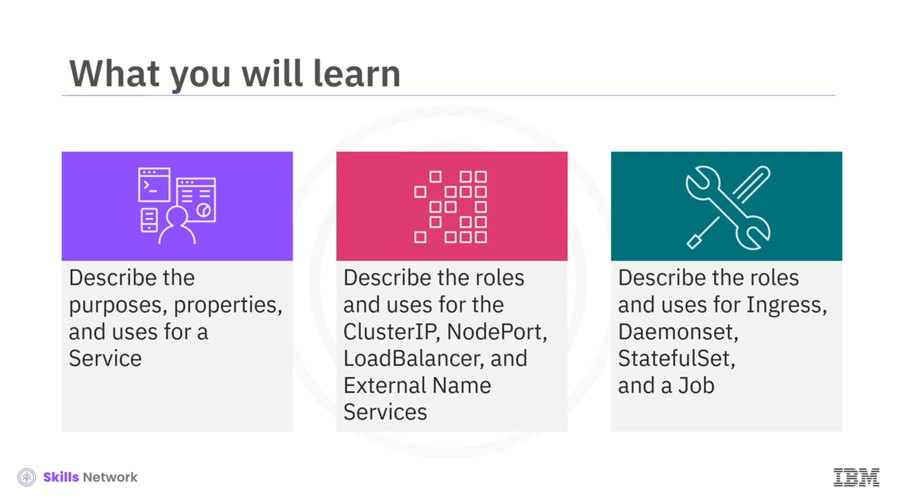
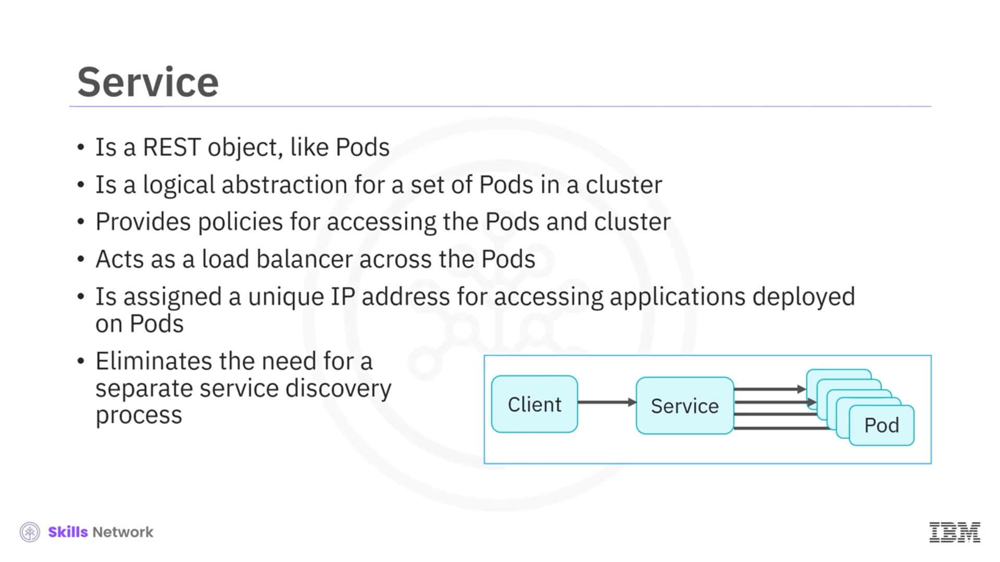
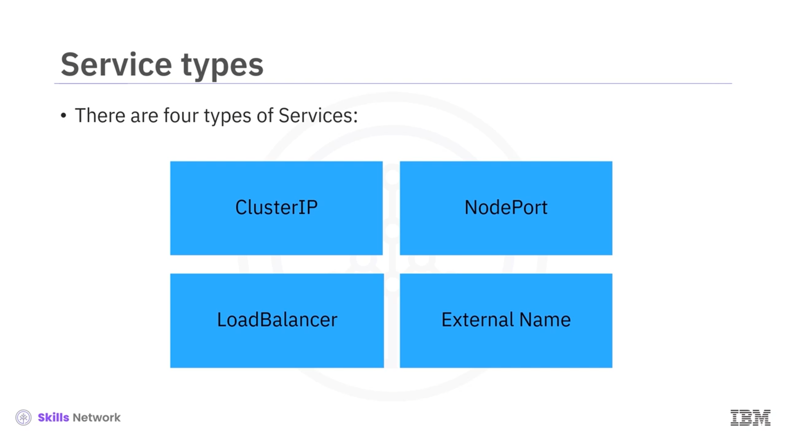
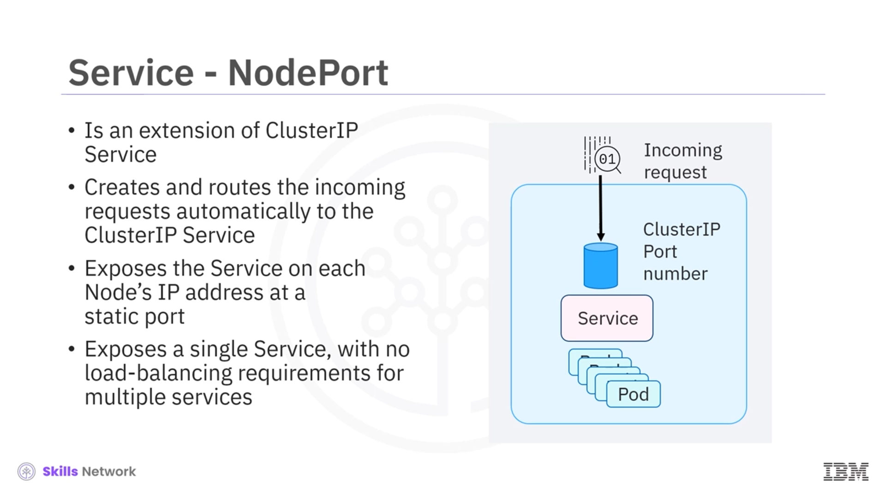
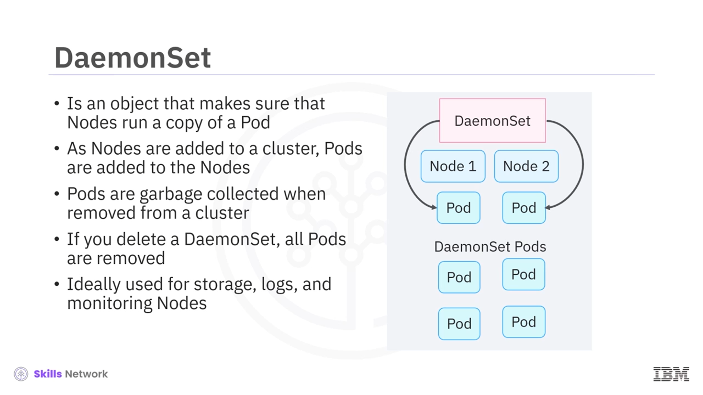
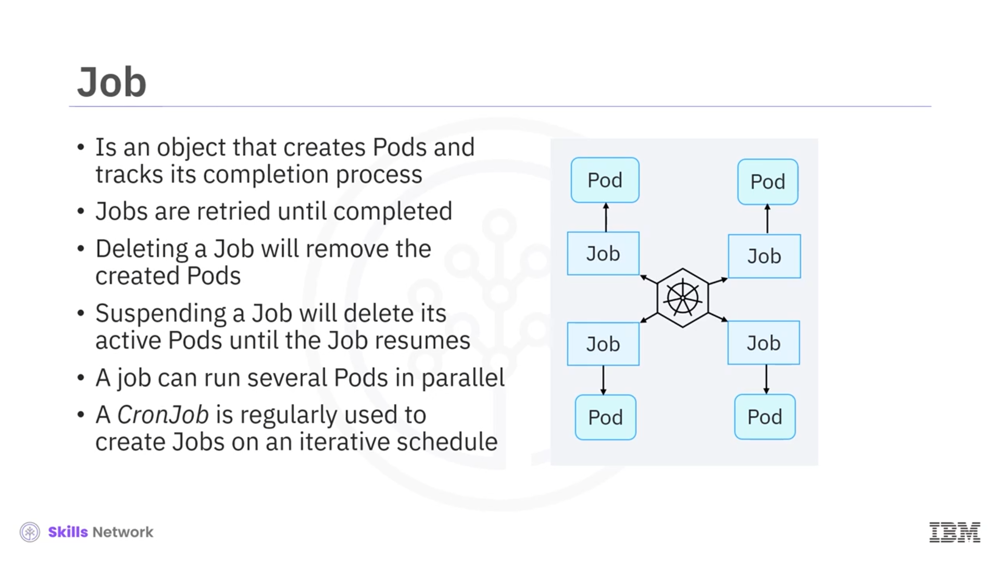

# ☸️ Kubernetes Nesneleri – Hizmetler ve Gelişmiş Çalışma Yükleri

## 🎯 Bölümün Hedefleri

Bu bölümde **Kubernetes nesneleri** arasından özellikle **Hizmet (Service)** ve bazı gelişmiş iş yükü tiplerini tanıyacaksınız. Bir **hizmetin amaçlarını, özelliklerini ve kullanım alanlarını** açıklayabilecek;  **ClusterIP** ,  **NodePort** , **LoadBalancer** ve **ExternalName (Harici Ad)** hizmet türlerinin rol ve kullanım senaryolarını ayırt edebileceksiniz. Ayrıca  **Ingress** ,  **DaemonSet** , **StatefulSet** ve **Job/CronJob** nesnelerinin ne işe yaradığını ve hangi durumlarda kullanıldığını öğreneceksiniz.

---

## 🧩 Hizmet (Service) Nedir?

 **Hizmet (Service)** , tıpkı  **Pod** ’lar gibi bir  **REST nesnesidir** . Kubernetes içinde, bir kümedeki bir dizi Pod için **mantıksal bir soyutlama** sağlar.

Hizmetler:

* Kümedeki Pod’lara erişmek için **politikalar** tanımlar,
* Pod’lar arasında bir **yük dengeleyici** görevi görür,
* Her hizmete, Pod’larda dağıtılan uygulamalara erişmek için **benzersiz bir IP adresi** atar,
* Ayrı bir **hizmet keşfi (service discovery)** sürecine olan ihtiyacı büyük ölçüde ortadan kaldırır.

Bir  **hizmet** , varsayılan protokol olan  **TCP** ’yi kullanır, ancak **UDP** ve diğer protokolleri de destekleyebilir. Ayrıca bir hizmet, birden fazla **port tanımını** destekler. Aynı isimli port numarası, her arka uç Pod’unda farklı olabilir.

Ek olarak bir hizmet:

* **İsteğe bağlı bir selector (seçici)** içerebilir,
* Gelen portları **hedef porta (targetPort)** eşleyebilir.

---

## 🔍 Neden Hizmete İhtiyaç Duyarız?

Bir Kubernetes kümesinde  **Pod’lar geçicidir** : silinebilir, yeniden oluşturulabilir, ölçeklendirilebilir ve her seferinde  **IP adresleri değişebilir** . Bu oynaklık, doğrudan Pod IP’leri üzerinden erişim yapıldığında **keşfedilebilirlik sorunlarına** yol açar.

 **Hizmet** , bu problemi çözer:

* Pod’lardaki değişiklikleri takip eder,
* Değişmeyen **tek bir IP adresi** veya **DNS adı** üzerinden erişim sağlar,
* Bir dizi Pod’u hedeflemek için **label selector** kullanır.

Küme içindeki **yerel Kubernetes uygulamaları** için hizmetteki Pod’lar değiştiğinde, ilgili  **API uç noktaları otomatik olarak güncellenir** . Yerel olmayan uygulamalar için Kubernetes, uygulamalar ve arka uç Pod’lar arasında **sanal IP tabanlı bir köprü veya yük dengeleyici** kullanır.

---

## 🧱 Hizmet Türlerine Genel Bakış

Kubernetes’te dört temel hizmet türü vardır:

* **ClusterIP**
* **NodePort**
* **LoadBalancer (Harici Yük Dengeleyici)**
* **ExternalName (Harici Ad)**

Her biri, uygulamanızı **kime** ve **nasıl** açmak istediğinize göre farklı senaryolarda kullanılır.

---

## 🌐 ClusterIP – Varsayılan Hizmet Türü

 **ClusterIP** , varsayılan ve en yaygın kullanılan hizmet türüdür.

Özellikleri:

* Kubernetes, hizmete **küme içi (internal) bir IP adresi** atar.
* Hizmete **yalnızca küme içinden** erişilebilir.
* Küme dışından, doğrudan ClusterIP’ye istek gönderilemez.
* Hizmet tanım dosyasında **clusterIP** değeri yapılandırılabilir (genelde otomatik atanır).
* Örneğin, uygulamanızın **ön uç** ve **arka uç** bileşenleri arasındaki **servisler arası iletişimi** sağlamak için kullanılır.

Kısaca  **ClusterIP** , küme içinde servislerin birbiriyle konuşmasını sağlayan **iç servis katmanı**dır.

---

## 🚪 NodePort – Düğümler Üzerinden Erişim

**NodePort** hizmeti, bir **ClusterIP** hizmetinin uzantısıdır. Kubernetes:

* Otomatik olarak bir **ClusterIP** hizmeti oluşturur,
* Her düğümün IP adresi üzerinde, belirlediğiniz veya Kubernetes’in atadığı **statik bir portu** açar,
* Bu port üzerinden gelen istekleri, arka plandaki **ClusterIP** hizmetine yönlendirir.

Özellikler:

* Her node’un IP’si + NodePort üzerinden hizmete erişilebilir:

  `http://<node-ip>:<nodePort>`
* Basit senaryolarda, harici bir yük dengeleyici olmadan **tek bir hizmeti dışarıya açmak** için kullanılabilir.
* Güvenlik ve esneklik açısından  **üretim ortamı için önerilmez** , daha çok test ve basit demolar için uygundur.

---

## ⚖️ LoadBalancer – Harici Yük Dengeleyici

**LoadBalancer** hizmeti, bir **NodePort** hizmetinin bir uzantısıdır ve genellikle bir **bulut sağlayıcısının yük dengeleyicisiyle (örneğin ELB)** entegre çalışır. Kubernetes:

* Otomatik olarak bir **ClusterIP** ve bir **NodePort** hizmeti oluşturur,
* Bulut sağlayıcısında **harici IP adresine sahip bir LoadBalancer** oluşturur,
* Harici trafiği bu LoadBalancer üzerinden **NodePort** hizmetine yönlendirir.

Özellikleri:

* Hizmeti doğrudan **İnternet’e maruz bırakmak** için kullanılır.
* Her LoadBalancer, kendine ait **ayrı bir IP adresine** sahiptir.
* Kümenizi barındırmak için bir **bulut sağlayıcısının ELB/LoadBalancer** hizmetinden faydalanabilirsiniz.

---

## 🔗 ExternalName – Harici Ad Hizmeti

**ExternalName (Harici Ad)** hizmet türü, diğer hizmetlerden farklıdır:

* Herhangi bir **selector** kullanmaz,
* Bir **DNS adına** eşlenir,
* **`spec.externalName`** alanına yazdığınız DNS adını kullanır.

Bu tip bir hizmet:

* Kendi içinde bir **CNAME kaydı** döndürür,
* Hizmeti, **harici bir ad alanındaki (external domain)** gerçek hedefe yönlendirir.

Kullanım senaryoları:

* **Harici depolama sistemlerini** temsil etmek,
* Farklı **ad alanlarındaki Pod’ların** veya harici servislerin birbiriyle konuşmasını sağlamak,
* Kubernetes içinden harici bir hizmete, sanki kümeye aitmiş gibi erişmek.

---

## 🛣️ Ingress – HTTP/S Trafik Yönlendirme Kuralları

 **Ingress** , bir **denetleyici (Ingress Controller)** ile birlikte kullanıldığında, bir Kubernetes kümesindeki **birden çok hizmete harici kullanıcı erişimini yönetmek** için **yönlendirme kuralları** sağlayan bir  **API nesnesidir** .

Özellikleri:

* Genellikle  **HTTP için 80** , **HTTPS için 443** portlarını kullanarak kümenizi İnternet’e açar.
* Tek bir giriş noktasından (örneğin `example.com`) gelen trafiği, alan adlarına veya URL yollarına göre farklı hizmetlere iletebilir.
* Üretim ortamında, birden fazla **LoadBalancer** veya çok sayıda harici IP yerine, tek bir giriş katmanı olarak kullanılır.

Not: Küme, Ingress nesnelerini izlerken genellikle harici bir yük dengeleyici kullanır; bu bileşen **kümeye dışarıdan** yönetilir ve bazı durumlarda maliyetli olabilir.

---

## 🛰️ DaemonSet – Her Düğümde Bir Pod

 **DaemonSet** , kümedeki **her düğümde bir Pod kopyası çalışmasını** sağlayan bir Kubernetes nesnesidir.

Özellikleri:

* Kümeninize yeni bir düğüm eklendiğinde, ilgili  **Pod otomatik olarak o düğümde de oluşturulur** .
* Bir düğüm kümeden çıkarıldığında, o düğümdeki Pod’lar da  **otomatik olarak temizlenir** .
* Bir **DaemonSet** sildiğinizde, bu DaemonSet tarafından yönetilen  **tüm Pod’lar kaldırılır** .

Kullanım senaryoları:

* **Depolama ajanları** ,
* **Günlük toplama (logging) ajanları** ,
* **İzleme (monitoring) ajanları** ,

  gibi her düğümde çalışması gereken bileşenler için idealdir.

---

## 🧱 StatefulSet – Durumlu Uygulamaların Yönetimi

 **StatefulSet** , **durum bilgisi olan (stateful)** uygulamaları yönetmek için kullanılır. Özellikle:

* Pod’ların **dağıtımını ve ölçeklendirilmesini** yönetir,
* Pod’ların **sıralaması (ordering)** ve **benzersizliği (uniqueness)** hakkında garanti verir,
* Her Pod için **sabit bir kimlik (stable identity)** sağlar.

Özellikleri:

* Her Pod isteği için **değişmeyen bir isim** ve kimlik kullanılır (örn. `app-0`, `app-1` …).
* İş yükleriniz için **kalıcı depolama birimleri (PersistentVolume)** sağlar ve bunları Pod kimlikleriyle ilişkilendirir.
* Veritabanı gibi **stateful uygulamalar** için tercih edilir.

---

## ⏱️ Job ve CronJob – Görev Tabanlı Çalışma Yükleri

 **Job** , belirli bir görevi yerine getirmek için **Pod’lar oluşturan** ve bu Pod’ların **tamamlama sürecini izleyen** bir Kubernetes nesnesidir.

Özellikleri:

* Pod’lar **görev başarıyla tamamlanana kadar** yeniden denenebilir.
* Bir **Job** sildiğinizde, onun tarafından oluşturulan Pod’lar da kaldırılır.
* Bir  **Job’u askıya almak** , Job tekrar devam ettirilene kadar  **etkin Pod’ları siler** .
* Bir Job, **birden fazla Pod’u paralel** olarak çalıştırabilir.

**CronJob** ise:

* Belirli bir **zamanlama (cron ifadesi)** ile düzenli aralıklarla Job oluşturmak için kullanılır.
* Örneğin, her gece yedek alma, periyodik rapor üretme gibi **tekrarlayan işler** için idealdir.

---

## 📚 Bölüm Özeti

Bu videoda şunları öğrendiniz:

* **Hizmet (Service)** , Pod’lara ve kümeye erişmek için **politikalar sağlayan bir REST nesnesidir** ve Pod’lar için mantıksal bir soyutlama oluşturur.
* **ClusterIP** , varsayılan ve en yaygın hizmet türüdür; küme içinde **servisler arası iletişimi** sağlar.
* **NodePort** , ClusterIP’nin bir uzantısıdır; her düğümün IP adresindeki **statik bir porta** gelen istekleri otomatik olarak ClusterIP hizmetine yönlendirir.
* **LoadBalancer (Harici Yük Dengeleyici)** , NodePort’un bir uzantısıdır; bulut sağlayıcısında bir yük dengeleyici oluşturur ve trafiği NodePort/ClusterIP hizmetlerine yönlendirerek uygulamayı  **İnternet’e açar** .
* **ExternalName (Harici Ad)** , harici depolamayı veya dış servisleri temsil eden bir hizmet oluşturarak, farklı ad alanlarındaki Pod’ların veya harici kaynakların **DNS üzerinden konuşmasını** sağlar.
* **Ingress** , bir denetleyici ile birlikte çalışarak, harici kullanıcıların bir Kubernetes kümesindeki birden çok hizmete **HTTP/HTTPS yönlendirme kuralları** aracılığıyla erişmesini sağlar.
* **DaemonSet** , tüm düğümlerinizde en az bir Pod örneği olmasını garanti eder; özellikle depolama, log toplama ve izleme ajanları için kullanılır.
* **StatefulSet** , durum bilgisi olan uygulamaları yönetir; Pod dağıtımını ve ölçeklendirmeyi kontrol eder, her Pod isteği için **sabit bir kimlik** tutar ve iş yükleriniz için **kalıcı depolama** sunar.
* **Job** , Pod’lar oluşturarak görevlerin tamamlanmasını izler ve gerektiğinde tekrar dener; **CronJob** ise bu işleri **düzenli bir zamanlamaya** bağlar.

Bu sayede Kubernetes’te **hizmetler ve gelişmiş iş yükü nesneleri** ile uygulamalarınızı daha esnek, ölçeklenebilir ve yönetilebilir hale getirebilirsiniz.

