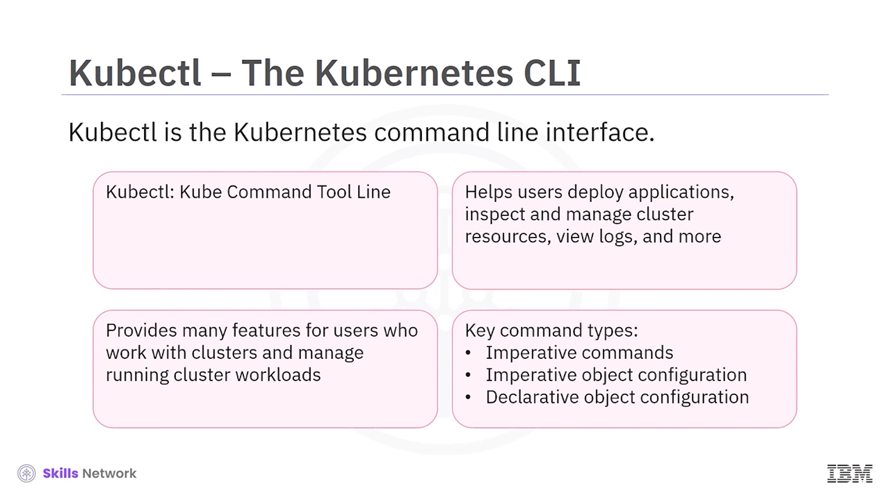
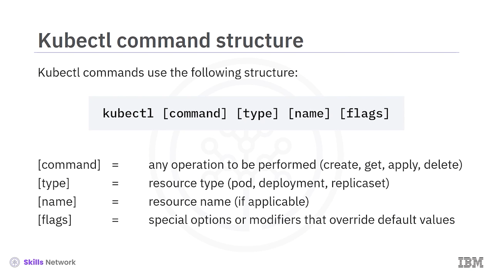
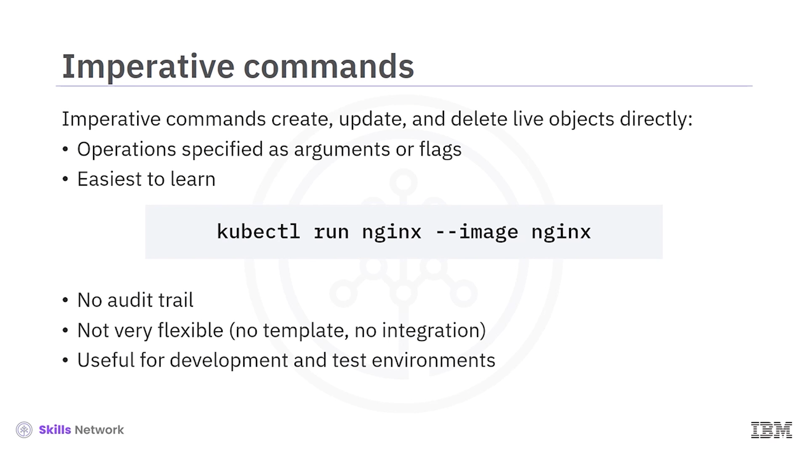
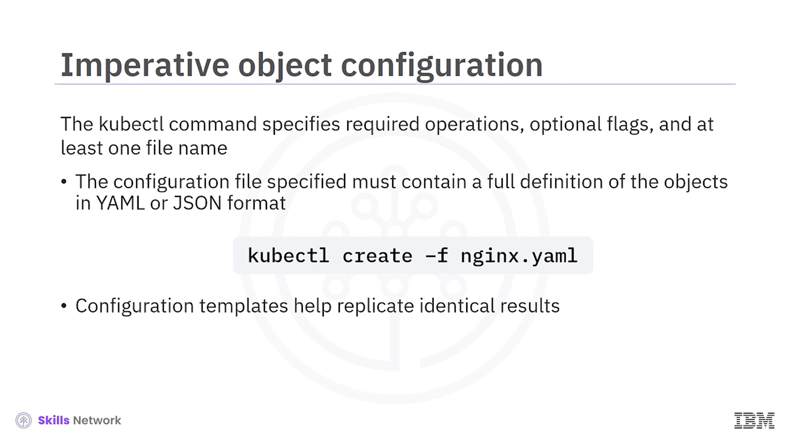
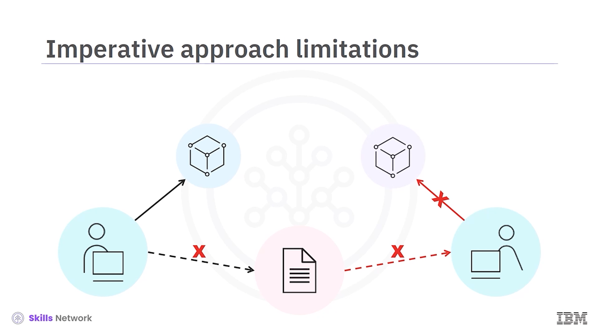
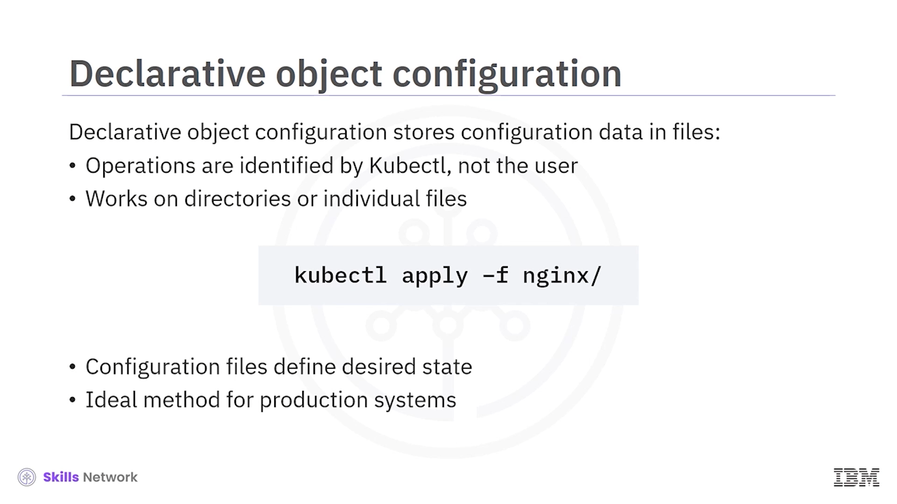
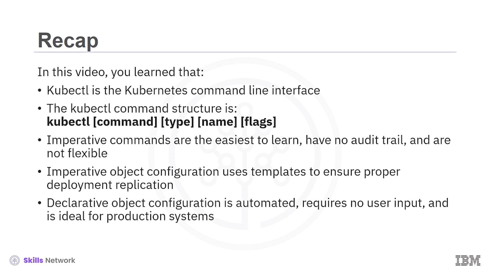

# ☸️ Kubectl Komut Satırına Giriş

## 🧩 Kubectl Nedir?

**Kubectl** kullanmaya hoş geldiniz. Bu videoyu izledikten sonra:

* **Kubectl** ve komut yapısını tanımlayabilecek,
* Üç komut türünü, özelliklerini ve avantajlarını açıklayabilecek,
* Sık kullanılan komutları belirli örneklerle ilişkilendirebileceksiniz.


 **Kubectl** ,  **Kubernetes komut satırı arayüzü (CLI)** ’dir. İsmi, “ **kube control** ” ifadesinden gelir. Kubernetes ile çalışmak için en önemli araçlardan biridir ve kullanıcılara:

* Uygulamaları dağıtma,
* Küme kaynaklarını denetleme ve yönetme,
* Günlükleri görüntüleme

ve daha fazlasını yapma imkânı sağlar. **Kubernetes kümeleriyle çalışan** ve küme üzerindeki iş yüklerini yöneten kullanıcılar için pek çok özellik sunar.



---

## 🧱 Kubectl Komut Yapısı

**Kubectl komutları** belirli bir yapıyı izler ve her bileşeni düzenli tutmak kritik öneme sahiptir:

```bash
kubectl <komut> <tür> <ad> [bayraklar]
```

* **komut** : `create`, `get`, `apply`, `delete` gibi gerçekleştirilecek işlemi belirtir.
* **tür (resource type)** : `deployment`, `pod`, `replicaset`, `service` gibi kaynak türünü belirtir.
* **ad (name)** : Varsa, ilgili kaynağın adını belirtir.
* **bayraklar (flags)** : Varsayılan değerleri geçersiz kılan özel seçenekler veya değiştiricilerdir (örneğin `-n`, `-f`, `--record` gibi).



---

## 🎯 Üç Temel Kubectl Komut Türü

**Kubectl** ile çalışırken üç temel komut stili kullanılır:

* **Zorunlu komutlar (imperative commands)**
* **Zorunlu nesne yapılandırması (imperative object configuration)**
* **Bildirimsel nesne yapılandırması (declarative object configuration)**

Bu üç yaklaşım, Kubernetes kaynaklarını oluşturma, güncelleme ve yönetme biçiminizi belirler; hangi ortamda (geliştirme, test, üretim) çalıştığınıza göre tercih değişebilir.

---

## ⚙️ Zorunlu (Emirsel) Komutlar

 **Zorunlu komutlar** , canlı nesneleri doğrudan  **oluşturmanıza** , **güncellemenize** ve **silmenize** olanak tanır. Yapılacak işlemler, komut satırında bağımsız değişken ya da bayraklar olarak açıkça belirtilmelidir.

Bu komutların avantajları:

* Öğrenmesi ve çalıştırması  **kolaydır** .
* Geliştirme ve test ortamları için **hızlı** ve  **pratiktir** .

Örneğin, belirli bir kapsayıcı görüntüsüyle tek bir **pod** oluşturmak için sadece pod adını ve görüntüyü belirterek komutu çalıştırabilirsiniz:

```bash
kubectl run my-pod --image=nginx
```

Bu şekilde, ek bir dosyaya ihtiyaç duymadan hızlıca kaynak oluşturabilirsiniz.



---

## 🧩 Zorunlu Komutların Sınırlamaları

Zorunlu komutların önemli dezavantajları da vardır:

* Yapılan değişiklikler için bir **denetim izi (audit trail)** sağlamazlar.
* **Şablon** kullanmadıkları için esneklikleri sınırlıdır.
* Değişiklik inceleme süreçleriyle (code review, pull request vb.) doğal olarak entegre olmazlar.

Örneğin:

* Bir geliştiricinin bir uygulamayı dağıtmak için komut çalıştırdığını düşünün.
* Başka bir geliştirici aynı uygulamayı aynı şekilde dağıtmak ister, ancak **hiçbir yapılandırma dosyası olmadığı** için bunu yapamaz.
* İkinci geliştirici, dağıtım için gerekli komutu tam olarak ilk geliştiriciye sormalı ve aynı komutu elle çalıştırmalıdır.

Bu senaryo, zorunlu komutlarla çalışmanın ne kadar **tekrarlı** ve **hatalara açık** olabileceğini gösterir. Her iki geliştiricinin de dağıtım için **ortak bir şablon** kullanması, bu sınırlamaları aşmak için çok daha iyi bir yaklaşımdır.


---

## 📄 Zorunlu Nesne Yapılandırması

**Zorunlu nesne yapılandırması** (imperative object configuration) yaklaşımında, `kubectl` komutu:

* Gerekli işlemi (örneğin `create`),
* İsteğe bağlı bayrakları,
* Ve en az **bir dosya adını**

kullanır. Belirttiğiniz yapılandırma dosyası, **YAML** veya **JSON** formatında nesnelerin tam tanımını içerir.

Örneğin, dosyada tanımlanan nesneleri oluşturmak için:

```bash
kubectl create -f nginx.yaml
```

Bu yaklaşım sayesinde:



* Aynı yapılandırma şablonlarını kullanarak **birden çok ortamda** aynı sonuçları elde edebilirsiniz.
* Yapılandırma dosyası bir **kaynak kontrol sistemi** (örneğin Git) içinde saklanabilir.
* Değişiklik süreçleriyle entegre olabilir, **denetim izi** ve tekrar kullanılabilir **şablonlar** sağlar.


---

## 🧱 Zorunlu Nesne Yapılandırmasının Sınırlamaları

Zorunlu nesne yapılandırmasında, yine de gerekli tüm komut işlemlerini sizin **belirtmeniz** gerekir.

Örneğin:

* Bir geliştirici, canlı nesne üzerinde konfigürasyon dosyasına **yansıtılmayan** bir güncelleme yaparsa,
* Başka bir geliştirici, gelecekteki dağıtımlarda bu güncellenmiş yapılandırmayı kullanamaz.
* İkinci geliştirici, istemeden de olsa **eski** veya **orijinal** yapılandırmayı kullanmaya devam eder.

Bu nedenle istenen durumu **paylaşılan bir yapılandırma dosyasında** tanımlamak, dağıtım anında komutları tek tek vermekten daha iyidir. Bu eksikliği, **bildirimsel nesne yapılandırması** giderir.



---

## 🧾 Bildirimsel Nesne Yapılandırması

**Bildirimsel nesne yapılandırması** (declarative object configuration) yaklaşımında:

* Yapılandırma verileri dosyalarda saklanır.
* Kullanıcı, tek tek işlemleri (create, update, delete) belirtmek yerine, **istenen durumu** tanımlar.
* Gerekli işlemler, kullanıcı tarafından değil, **Kubectl ve Kubernetes** tarafından belirlenir.

Bu yaklaşım:

* **Tek tek dosyalar** veya bir **dizin** üzerinde çalışabilir.
* Örneğin, aşağıdaki komut, belirtilen dizindeki tüm dosyalardaki yapılandırma verilerini uygular:

```bash
kubectl apply -f configs/
```

Burada kullanıcı herhangi bir işlem komutu (create, update, delete) vermez; sistem, mevcut durum ile istenen durumu karşılaştırır ve gerekli adımları **otomatik olarak** belirler.

Bu yöntem:

* Kaynakların **istenen durumunu** dosyalarda tuttuğu için,
* Özellikle **üretim sistemleri** için ideal bir yaklaşımdır.



---

## 🔁 Bildirimsel Yapılandırma Örneği

Bildirimsel yaklaşıma bir örnek:

* Bir geliştirici, çalışan bir uygulamaya bazı güncellemeler yapar.
* Yapılandırma verileri, paylaşılan bir **şablonda** saklanmaya devam eder; bu dosya, proje için **tek gerçek kaynak (single source of truth)** olmaya devam eder.
* Başka bir geliştirici bu güncellemelerin bazılarını kaçırmış olsa bile, yapması gereken tek şey:

```bash
kubectl apply -f current-config/
```

komutunu çalıştırmaktır.

 **Kubernetes** , mevcut durumu istenen durumla eşleştirmek için gerekli işlemleri **otomatik olarak** belirler ve uygular. Böylece herkes aynı, güncel yapılandırma üzerinden çalışır.


---

## 🛠️ Sık Kullanılan Kubectl Komutları

Sık kullanılan bazı **kubectl** komutları ve amaçları:

* `kubectl get` – Pod, servis, deployment gibi bir kaynağın mevcut durumunu **listelemek / görüntülemek** için kullanılır.
* `kubectl delete` – Bir dosyayı referans göstererek veya isimle bir kaynağı **silmek** için kullanılır.
* `kubectl autoscale` – Belirli bir kaynağa (örneğin deployment) **otomatik ölçekleme** davranışı uygulamak için kullanılır.

Tüm `kubectl` komutlarının tam listesini resmi **Kubernetes dokümantasyonunda** (`kubernetes.io`) bulabilirsiniz.


---

## 🔍 Kubectl Get Komutları

`kubectl get` komutları ile farklı kapsamda kaynakları listeleyebilirsiniz:

* Geçerli ad alanındaki ( **namespace** ) **servisleri** listelemek,
* Tüm ad alanlarındaki  **pod** ’ları görmek,
* Belirli bir **deployment** hakkında bilgi almak,
* Geçerli ad alanındaki tüm  **pod** ’ları görüntülemek gibi işlemler için `kubectl get` kullanılır.

Örneğin:

```bash
kubectl get pods
kubectl get svc
kubectl get pods --all-namespaces
kubectl get deploy my-dep
```


---


## 📦 Kaynak Oluşturmak İçin Apply Komutları

`kubectl apply` komutları, **YAML** veya **JSON** dosyalarını kullanarak kaynaklar oluşturmak ya da güncellemek için kullanılır. Genellikle şu uzantılara sahiptir:

* `.yaml`
* `.yml`
* `.json`

Örneğin:

```bash
kubectl apply -f deployment.yaml
kubectl apply -f service.yaml
kubectl apply -f https://example.com/config.yaml
kubectl apply -f configs/
```

Bu sayede:

* Birden çok dosyadan,
* Hatta bir URL üzerinden

kaynak oluşturabilir veya yapılandırmaları güncelleyebilirsiniz.


---

## 📈 Ölçeklendirme İçin Scale Komutları

`kubectl scale` komutları, bir kaynağın **çoğaltma (replica) sayısını** değiştirmek için kullanılır.

Örneğin:

```bash
kubectl scale rs foo --replicas=3
kubectl scale -f resourceinfo.yaml --replicas=3
```

Bu komutlarla:

* `foo` adlı bir  **replica set** ’i 3 kopyaya ölçekleyebilir,
* Ya da `resourceinfo.yaml` içinde tanımlanan kaynağın kopya sayısını 3’e çıkarabilirsiniz.


---

## 🚀 Örnek: Nginx Dağıtımı Oluşturmak

Şimdi **nginx** görüntüsünün **üç kopyasıyla** bir deployment oluşturalım.

Önce, yapılandırma dosyasını `apply` komutuyla uygularız:

```bash
kubectl apply -f nginx-deploy.yaml
```

Çıktı, ilgili deployment’ın başarıyla oluşturulduğunu onaylar.

Ardından, belirli deployment hakkında bilgi almak için `get` komutunu kullanırız:

```bash
kubectl get deploy my-dep
```

Çıktıda:

* Deployment’ın güncel durumu,
* İstenen ve mevcut **üç kopyanın** oluşturulduğu

görülür. Böylece dağıtımın beklendiği gibi çalıştığını doğrulamış olursunuz.


---

## ✅ Bölüm Özeti

Bu bölümde şunları öğrendiniz:

* **Kubectl** , **Kubernetes** için komut satırı arayüzüdür.
* Kubectl komut yapısı: `kubectl komut tür ad bayraklar` şeklindedir.
* Üç temel yaklaşım vardır:
  * **Zorunlu komutlar** : Öğrenmesi en kolay olanlardır; fakat denetim izi yoktur ve esnek değildir.
  * **Zorunlu nesne yapılandırması** : Doğru dağıtım ve çoğaltmayı sağlamak için **şablon dosyalar** kullanır.
  * **Bildirimsel nesne yapılandırması** : Otomatiktir, kullanıcıdan tek tek işlem komutları istemez ve **üretim sistemleri** için ideal yaklaşımdır.

Ayrıca `kubectl get`, `kubectl apply`, `kubectl delete`, `kubectl scale`, `kubectl autoscale` gibi sık kullanılan komutların ne işe yaradığını ve temel kullanım örneklerini görmüş oldunuz.


