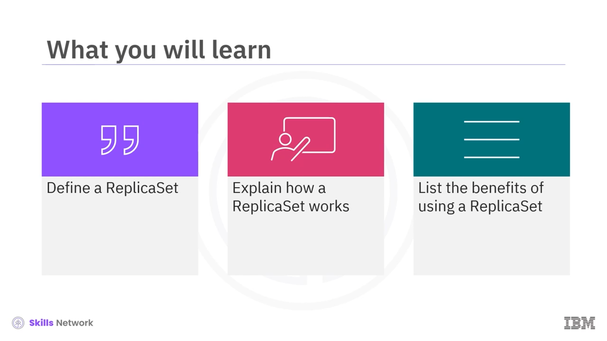
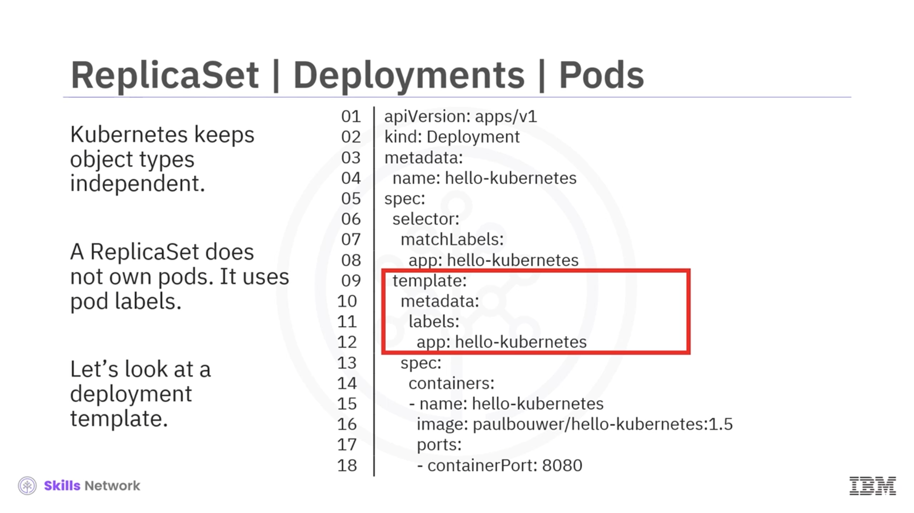
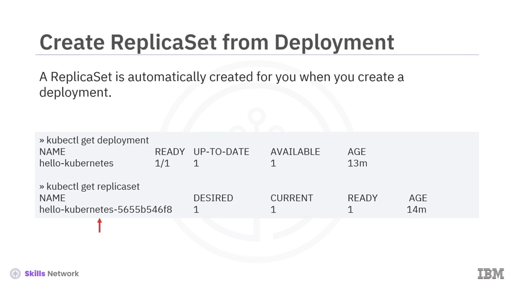
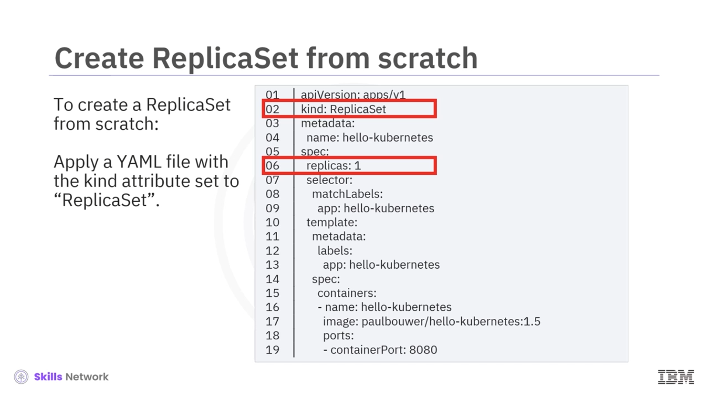
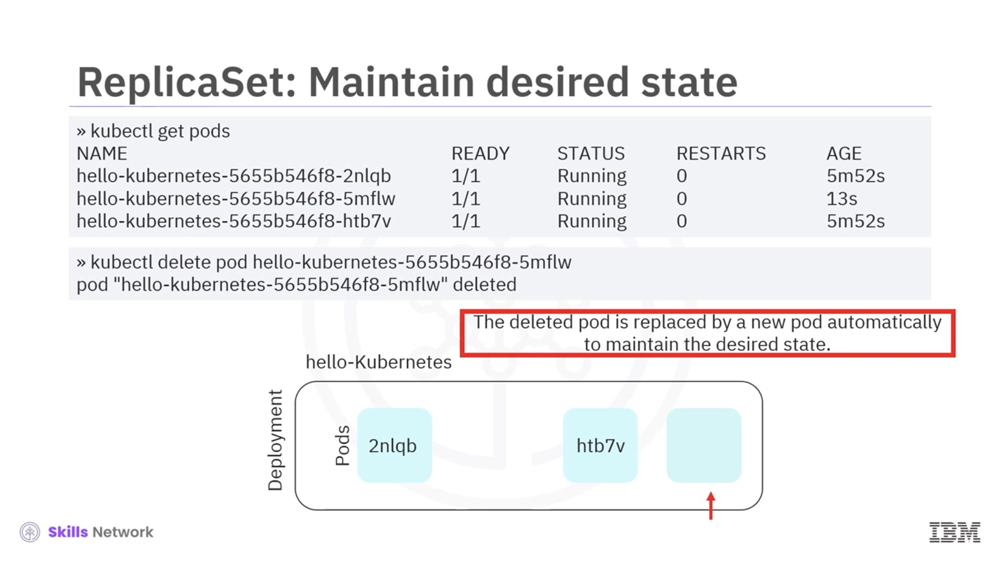
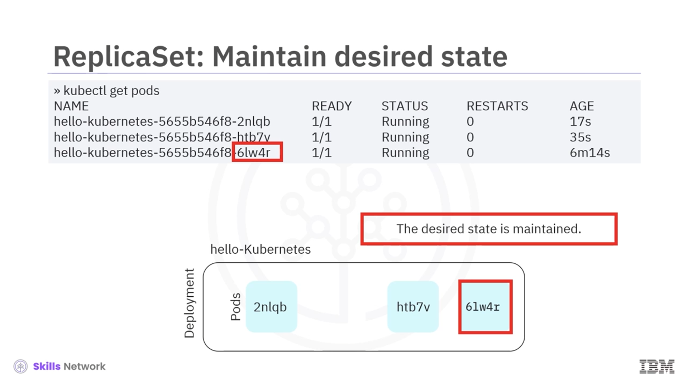

# ☸️ Kubernetes ReplicaSet’e Giriş

## 👋 ReplicaSet’e Hoş Geldiniz

ReplicaSet’e hoş geldiniz. Bu videoyu izledikten sonra bir  **ReplicaSet** ’i tanımlayabilecek, nasıl çalıştığını açıklayabilecek ve ReplicaSet kullanmanın başlıca faydalarını listeleyebileceksiniz.

## ⚠️ Tek Pod Dağıtımının Sınırları

Bir uygulama tek bir **Pod** içinde dağıtıldığında, bu Pod bazı durumlarda yetersiz kalır. İstekler arttığında gecikmeler veya kesintiler yaşanabilir. Tek Pod dağıtımları, artan talepleri karşılayamaz ve Pod’lar arasında **yük dengeleme** yapamaz. Ayrıca tek bir arıza noktası oluşur; bu da kesinti süresini ve servis kesintilerini artırır. Yüksek kullanılabilirlik için yedek Pod’lar ve gerektiğinde otomatik yeniden başlatma gibi mekanizmalara ihtiyaç vardır. Bu sınırlamaları bir **ReplicaSet** ile aşabiliriz.

## ♻️ ReplicaSet ile Yüksek Kullanılabilirlik

 **ReplicaSet** , her zaman doğru sayıda Pod’un çalışır durumda olmasını sağlar. Sürekli olarak Pod’ların **gerçek durumu** ile **istenen durumu** karşılaştırır. Ölçeklendirme ve yedeklilik için Pod ekler veya siler; böylece uygulamanın **kullanılabilirliğini** korur. Arızalı Pod’ların yerine yenilerini oluşturur veya fazladan Pod’ları siler. Ayrıca ReplicaSet, eski **ReplicationController** nesnesinin yerini almıştır ve onun yerine kullanılmalıdır.

## 🧩 ReplicaSet ve Deployment İlişkisi

Kümenizde bir **Deployment** oluşturduğunuzda, Kubernetes sizin için otomatik olarak bir **ReplicaSet** oluşturur. Deployment’lar ReplicaSet’leri yönetir, Pod’lara **bildirimsel güncellemeler** gönderir ve birçok ek özellik sunar. Bu nedenle, pratikte bir ReplicaSet’in en iyi yönetim şekli bir Deployment aracılığıyladır. Kubernetes, nesne türlerini birbirinden bağımsız tasarladığı için ReplicaSet Pod’lara doğrudan “sahip” olmaz; bunun yerine Pod etiketlerini kullanarak hangi Pod’ların bu ReplicaSet tarafından yönetileceğini belirler.

## 🏷️ Şablon Metadatası ve Pod Etiketleri

Bir Deployment tanımındaki **şablon (template)** bölümü, oluşturulacak Pod’ların etiketlerini ve özelliklerini belirler. Buradaki metadata ve etiketler, hangi Pod’ların ilgili ReplicaSet tarafından yönetileceğini belirleyen temel kriterlerdir. Bu şablona göre Deployment oluşturulduğunda, otomatik olarak eşleşen Pod’ları yönetecek bir ReplicaSet oluşturulur.

## 🔍 Deployment Oluşturduktan Sonra ReplicaSet’i Doğrulama

Bir Deployment oluşturduğunuzda, bunun sonucunda bir ReplicaSet’in oluştuğunu komut satırından doğrulayabilirsiniz. Örneğin:

* `kubectl get rs` komutu ile ilgili ReplicaSet’in oluşturulduğunu görebilirsiniz.
* Varsayılan olarak bu ReplicaSet yalnızca bir Pod oluşturur.
* `kubectl get pods` komutuyla bu Pod’un detaylarını inceleyebilir ve aynı ReplicaSet tarafından kontrol edildiğini görebilirsiniz.

## 🛠️ YAML ile Sıfırdan ReplicaSet Oluşturma

Sıfırdan bir ReplicaSet oluşturmak için, `kind: ReplicaSet` olarak ayarlanmış bir **YAML tanımı** uygulayabilirsiniz. YAML dosyasında `spec.replicas` alanını `1` olarak tanımlarsanız, bir adet Pod oluşturulur. Bu davranış, YAML dosyanızda çoğaltma sayısını açıkça belirtmediğinizde oluşan varsayılan davranışa denktir.

## 💻 Komut Satırıyla ReplicaSet Oluşturma ve Doğrulama

Sıfırdan bir ReplicaSet oluşturmanın bir diğer yolu da komut satırıdır.

* Önce `kubectl create rs ...` komutunu kullanarak ReplicaSet’i oluşturursunuz. Çıktı, ReplicaSet’in başarıyla oluşturulduğunu gösterecektir.
* Ardından `kubectl get pods` komutu ile Pod’un oluşturulduğunu ve durumunun **Running** olduğunu doğrulayabilirsiniz.
* `kubectl get rs` komutuyla da yeni oluşturulan ReplicaSet’in adını ve diğer ayrıntılarını görebilirsiniz.

  Yine de en iyi uygulama, bağımsız ReplicaSet yerine **ReplicaSet içeren bir Deployment** oluşturmaktır.

## 📈 Deployment Ölçeklendirme ve ReplicaSet

Bir Deployment’ı ölçeklendirmeden önce, kümede bir Deployment ve en az bir Pod olduğundan emin olmalısınız.

* Önce `kubectl create deployment hello-kubernetes ...` komutuyla bir Deployment oluşturursunuz.
* Çıktı, Deployment’ın oluşturulduğunu onaylar ve varsayılan olarak bir Pod oluşturulur. Bunu `kubectl get pods` ile görebilirsiniz.
* `kubectl get deploy` komutu, Deployment adının örneğin **hello-kubernetes** olduğunu gösterecektir.

  

  Daha sonra `kubectl scale deployment hello-kubernetes --replicas=3` komutunu çalıştırarak istenen çoğaltma sayısını `3` olarak ayarlarsınız. Çıktı, Deployment’ın ölçeklendirildiğini onaylar. `kubectl get pods` çıktısında ise üç adet çalışan Pod görürsünüz. ReplicaSet, örneğin `...5mflw` ve `...hbt7v` ile biten iki yeni Pod ekleyerek toplam sayıyı üçe çıkarır.

## 🧯 Pod Silindiğinde ReplicaSet’in Davranışı

ReplicaSet’in istenen durumu nasıl koruduğunu görmek için çalışan Pod’lardan birini silebilirsiniz.

* Önce `kubectl get pods` komutuyla üç Pod’un da çalıştığını doğrulayın.
* Ardından örneğin adı `...5mflw` ile biten Pod’u `kubectl delete pod <pod-adı>` komutuyla silin.

  Bu noktada gerçek durum, istenen duruma uymadığı için ReplicaSet otomatik olarak yeni bir Pod oluşturur. `kubectl get pods` çıktısında, silinen Pod’un yerine örneğin `...6lw4r` ile biten yeni bir Pod’un geldiğini görürsünüz. Böylece toplam Pod sayısı tekrar üçe yükselir ve ReplicaSet istenen durumu korumaya devam eder.

## ➕ Fazla Pod Oluşturulduğunda ReplicaSet’in Davranışı

ReplicaSet’in fazla Pod’ları nasıl yönettiğini görmek için elle ek bir Pod oluşturabilirsiniz.

* `kubectl get pods` çıktısı başlangıçta üç Pod gösterir.
* `kubectl run` veya benzeri bir komutla adı `...mx9rp` ile biten ek bir Pod oluşturun.
* Tekrar `kubectl get pods` çalıştırdığınızda dört Pod görünecektir; bu durumda gerçek durum, istenen durumdan fazladır.

  ReplicaSet, her zaman gerçek durumu istenen duruma yaklaştırmaya çalıştığı için fazla olan bu Pod’u silinmek üzere işaretler ve otomatik olarak kaldırır. Sonrasında `kubectl get pods` çıktısı, toplam Pod sayısının yeniden üçe düştüğünü gösterecektir. Böylece ReplicaSet, istenen çoğaltma sayısını korumuş olur.

## ✅ Özet: ReplicaSet Kullanmanın Faydaları

Bu bölümde şunları öğrendiniz:

* **ReplicaSet** , yedekli Pod’lar sağlayarak **yüksek kullanılabilirlik** sunar.
* Ölçeklendirme için Pod ekler veya siler, böylece uygulamayı yatayda büyütmeyi kolaylaştırır.
* Komut satırı ( **CLI** ) veya **YAML tanımı** kullanarak bir ReplicaSet oluşturabilirsiniz.
* ReplicaSet her zaman **gerçek durumu istenen durumla eşleştirmeye** çalışır; Pod silindiğinde yenisini oluşturur, fazla Pod varsa fazlayı kaldırır.
* En iyi uygulama, doğrudan ReplicaSet oluşturmak yerine, onu yöneten bir **Deployment** kullanmaktır.

