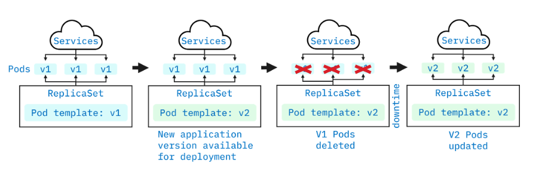
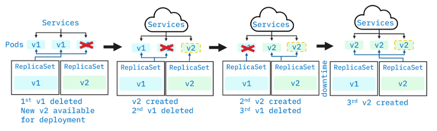
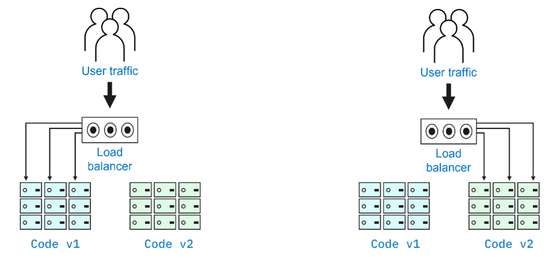
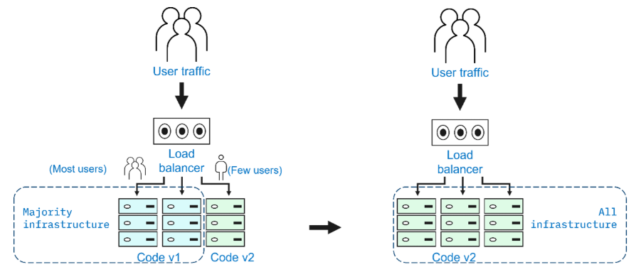
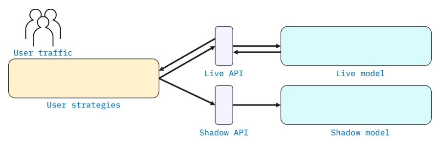

# 🚀 Dağıtım Stratejileri

## 📌 Genel Bakış

Bir Kubernetes dağıtım stratejisi, nesneler ve uygulamalar için yapılandırılmış duruma otomatik olarak ulaşıp bu durumu koruyan bir uygulama yaşam döngüsünü tanımlar. Etkili dağıtım stratejileri riski en aza indirir.

Kubernetes dağıtım stratejileri şunlar için kullanılır:

* `ReplicaSet`’leri, `Pod`’ları, `Service`’leri ve uygulamaları dağıtmak, güncellemek veya geri almak (*rollback* yapmak)
* `Deployment`’ları duraklatmak / yeniden sürdürmek
* `Deployment`’ları manuel veya otomatik olarak ölçeklendirmek

## 🧩 Dağıtım stratejisi türleri

Aşağıdaki altı tür dağıtım stratejisi vardır:

* Recreate
* Rolling
* Blue/green
* Canary
* A/B testing
* Shadow

Tek bir dağıtım stratejisi kullanabileceğiniz gibi, birden fazla dağıtım stratejisinin bir kombinasyonunu da kullanabilirsiniz.

---

## ♻️ Recreate stratejisi

Recreate stratejisinde, uygulamanın canlı sürümünü çalıştıran `Pod`’ların tümü aynı anda kapatılır ve uygulamanın yeni sürümü, yeni oluşturulan `Pod`’lara dağıtılır.

Recreate, en basit dağıtım stratejisidir. Mevcut `deployment`’ın kapatılması ile yeni `deployment`’ın devreye alınması arasında kısa bir kesinti süresi ( *downtime* ) vardır.

**Recreate stratejisi adımları şunları içerir:**

* Uygulamanın yeni bir sürümü (v2) dağıtıma hazırdır.
* Mevcut sürümü (v1) çalıştıran tüm `Pod`’lar kapatılır veya silinir.
* Yeni (v2) `Pod`’lar oluşturulur.
* Rollback işlemi, sürüm 2’nin (v2) sürüm 1 (v1) ile değiştirilmesi şeklinde ters sırada tamamlanır.

**Artıları**

* Basit kurulum
* Uygulama sürümü tamamen değiştirilir

**Eksileri**

* Mevcut dağıtımın kapatılması ile yeni dağıtım arasında kısa bir kesinti süresi oluşur

---

## 🔄 Rolling (ramped) stratejisi

Rolling stratejisinde, her `Pod` tek tek güncellenir. Tek bir v1 `Pod`’u yeni bir v2 `Pod` ile değiştirilir. Her v1 `Pod` bu şekilde güncellenir ve tüm `Pod`’lar v2 olana kadar işlem sürer. Rolling stratejisi güncellemesi sırasında neredeyse hiç kesinti olmaz, çünkü kullanıcılar her iki sürüme de yönlendirilir.

**Rolling stratejisi adımları şunları içerir:**

* Uygulamanın yeni bir sürümü (v2) dağıtıma hazırdır.
* Mevcut sürümü (v1) çalıştıran `Pod`’lardan biri kapatılır veya silinir.
* Kaldırılan (v1) `Pod`’un yerine yeni bir (v2) `Pod` oluşturulur.
* Adım 2 ve 3, tüm (v1) `Pod`’lar kaldırılıp yerlerine (v2) `Pod`’lar konulana kadar tekrarlanır.
* Rollback süreci tersine çevrilir ve v2 `Pod`’lar v1 `Pod`’lar ile değiştirilir.

**Artıları**

* Basit kurulum
* Verilerin yeniden dengelenmesi ( *rebalancing* ) gereken durumlarla başa çıkması gereken durum bilgili ( *stateful* ) uygulamalar için uygundur

**Eksileri**

* Rollout/rollback zaman alır
* Trafik dağılımını kontrol edemezsiniz

---

## 🔵🟢 Blue/green stratejisi

Blue/green stratejisinde, *blue* ortam uygulamanın canlı sürümüdür. *Green* ortam ise uygulamanın yeni sürümünün dağıtıldığı, mevcut ortamın bire bir kopyasıdır. Green ortamı kapsamlı şekilde test edilir. Tüm değişiklikler, hatalar ve sorunlar giderildikten sonra, kullanıcı trafiği blue ortamdan green ortama geçirilir.

**Blue/green stratejisi adımları şunları içerir:**

* Mevcut üretim ortamıyla aynı olan yeni bir ortam oluşturun.
* Yeni sürümü tasarlayın ve üretime hazır olana kadar kapsamlı şekilde test edin.
* Tüm kullanıcı trafiğini yeni sürüme yönlendirin.
* Rollback gerçekleştirmek için, ortamları yeniden eski haline çevirin.

**Artıları**

* Anında rollout/rollback

  (kesinti süresi yok)
* Yeni sürüm tüm kullanıcılara anında sunulur

**Eksileri**

* Pahalıdır

  (çift kaynak gerektirir)
* Üretime almadan önce titiz test gerektirir
* Durum bilgili ( *stateful* ) uygulamalarla başa çıkmak zordur

---

## 🐤 Canary stratejisi

Canary stratejisinde, uygulamanın yeni sürümü, mevcut canlı sürümle birlikte çalışan küçük bir rastgele kullanıcı grubuyla test edilir. Uygulamanın yeni sürümü başarıyla test edildikten sonra tüm kullanıcılara dağıtılır.

**Canary stratejisi adımları şunları içerir:**

* Uygulamanın yeni bir sürümünü tasarlayın.
* Kullanıcı isteklerinin küçük bir örneklemini yeni sürüme yönlendirin.
* Verimlilik, performans, hatalar ve sorunlar için test edin ve gerektiğinde rollback yapın.
* Adım 1–3’ü tekrarlayın. Tüm sorunlar çözüldüğünde trafiğin tamamını yeni sürüme yönlendirin.
* Rollback’te kesinti süresi yoktur, çünkü yalnızca az sayıda kullanıcı yeni sürüme maruz kalmıştır.

**Artıları**

* Güvenilirlik, hata ve performans izleme için elverişlidir
* Hızlı rollback

**Eksileri**

* Yavaş rollout, kademeli kullanıcı erişimi

---

## 🧪 A/B testing stratejisi

A/B testing stratejisi, *split testing* olarak da bilinir ve bir uygulamanın iki sürümünü (sürüm A ve sürüm B) değerlendirir. A/B testinde, her sürüm farklı kullanıcı kümelerine hitap eden özellikler içerir. Küresel dağıtım için hangi sürümün en uygun olduğuna kullanıcı etkileşimi ve geri bildirimlerine göre karar verebilirsiniz.

**A/B testing stratejisi adımları şunları içerir:**

* Çoğunlukla UI özellikleri ekleyerek uygulamanın yeni bir sürümünü tasarlayın.
* Ağırlık, çerez değeri, sorgu parametreleri, coğrafi konum, tarayıcı sürümü, ekran boyutu, işletim sistemi ve dil gibi koşullara göre küçük bir kullanıcı kümesi belirleyin.
* Bu kullanıcı kümesinden gelen istekleri yeni sürüme yönlendirin.
* Hatalar, verimlilik, performans ve sorunları kontrol edin.
* Tüm sorunlar çözüldüğünde trafiğin tamamını yeni sürüme yönlendirin.
* Rollback uygulanabilir, ancak kesinti süresi kullanıcıyı etkileyebilir.

**Artıları**

* Birden fazla sürüm paralel olarak çalışabilir
* Trafik dağılımı üzerinde tam kontrol

**Eksileri**

* Akıllı bir yük dengeleyici ( *load balancer* ) gerektirir
* Belirli bir oturumdaki hataları çözümlemek zordur, dağıtık izleme ( *distributed tracing* ) zorunlu hale gelir

---

## 👥 Shadow stratejisi

Shadow stratejisinde, uygulamanın bir “shadow sürümü”, canlı sürümün yanında dağıtılır. Kullanıcı istekleri her iki sürüme de gönderilir ve her ikisi de bu istekleri işler, ancak shadow sürümü yanıtları kullanıcılara geri döndürmez. Bu sayede geliştiriciler, kullanıcı deneyimini bozmadan shadow sürümün gerçek dünya verileriyle nasıl performans gösterdiğini görebilir.

Rollback gerçekleştirmek için, ortamları yeniden eski haline çevirin.

**Artıları**

* Üretim trafiğiyle performans testi
* Kullanıcı üzerinde hiçbir etki yoktur
* Kesinti süresi yoktur

**Eksileri**

* Pahalıdır (çift kaynak)
* Gerçek bir kullanıcı testi değildir, yanlış yorumlanan sonuçlara yol açabilir
* Karmaşık kurulum
* İki ortam için de izleme gerektirir

---

## 🎯 İyi bir strateji oluşturmak için

# 📊 Dağıtım Stratejileri Karşılaştırma Tablosu

| Strateji                                                                                                                  | Sıfır Kesinti Süresi | Gerçek Trafikle Test | Hedefli Kullanıcılar | Bulut Maliyeti | Rollback Süresi | Olumsuz Kullanıcı Etkisi | Kurulum Karmaşıklığı |
| ------------------------------------------------------------------------------------------------------------------------- | ----------------------- | --------------------- | ---------------------- | -------------- | ---------------- | -------------------------- | ------------------------- |
| **Recreate**Sürüm 1 kaldırılır, ardından sürüm 2 dağıtılır.                                             | X                       | X                     | X                      | •--           | •••           | •••                     | - - -                     |
| **Ramped**Sürüm 1, sürüm 2’nin yavaş bir şekilde yayına alınmasıyla değiştirilir.                       | ✓                      | X                     | X                      | •--           | •••           | •--                       | •--                      |
| **Blue/Green**Sürüm 2, sürüm 1 ile birlikte yayımlanır, ardından trafik sürüm 2’ye yönlendirilir.        | ✓                      | X                     | X                      | •••         | - - -            | ••-                      | ••-                     |
| **Canary**Sürüm 2 önce bir alt kullanıcı grubuna sunulur, üretime hazır olduğunda tamamen yayına alınır. | ✓                      | ✓                    | X                      | •--           | •--             | •--                       | ••-                     |
| **A/B Testing**Sürüm 2 yalnızca belirli özelliklere sahip bir alt kullanıcı grubuna sunulur.                  | ✓                      | ✓                    | ✓                     | •--           | •--             | •--                       | •••                    |
| **Shadow**Sürüm 2, sürüm A ile birlikte gerçek dünya trafiği alır ancak kullanıcılara yanıt vermez.      | ✓                      | ✓                    | X                      | •••         | - - -            | - - -                      | •••                    |

* Ürün türünü ve hedef kitleyi dikkate alın.
* Shadow ve canary stratejileri, kullanıcı örneklemi kullanmak yerine, canlı kullanıcı isteklerini kullanır.
* Uygulama sürümünün küçük ayarlara veya UI özelliği değişikliklerine ihtiyaç duyması durumunda A/B testing stratejisi kullanışlıdır.
* Uygulamanızın sürümü karmaşık veya kritiksa ve dağıtım sırasında kesinti olmadan düzgün izleme gerekiyorsa, blue/green stratejisi kullanışlıdır.
* Sıfır kesinti süresi istiyor ve uygulamanızın sürümünü kamuya açmaktan rahatsanız, canary stratejisi iyi bir seçimdir.
* Rolling stratejisi, uygulamanın yeni sürümünü kademeli olarak dağıtır. Kesinti yoktur ve geri almak kolaydır.
* Uygulamanın kritik olmadığı ve kullanıcıların kısa bir kesintiden etkilenmediği durumlarda, recreate stratejisi iyi bir seçimdir.

---

## 🧾 Kısa tanımlar

* **Rolling Strategy:** Rolling stratejisinde, her `Pod` tek tek güncellenir; bu da güncelleme sırasında kullanıcılar her iki sürüme de yönlendirildiği için minimum kesinti sağlar.
* **Shadow Strategy:** Shadow stratejisinde, uygulamanın bir shadow sürümü, canlı sürümün yanında dağıtılır ve kullanıcı etkisi olmadan performans testi yapılmasını sağlar.
* **Recreate Strategy:** Recreate stratejisinde, uygulamanın canlı sürümünü çalıştıran tüm `Pod`’lar aynı anda kapatılır ve yeni sürüm, yeni oluşturulan `Pod`’lara dağıtılır.
* **Canary Strategy:** Canary stratejisi, yeni bir uygulama sürümünü tüm kullanıcılara dağıtmadan önce küçük bir kullanıcı grubuyla test ederek performansın izlenmesini sağlar.
* **Deployment Strategy:** Bir Kubernetes dağıtım stratejisi, nesneler ve uygulamalar için yapılandırılmış duruma otomatik olarak ulaşan ve bu durumu koruyan bir uygulama yaşam döngüsünü tanımlar.
* **Blue/Green Strategy:** Blue/green stratejisi, iki özdeş ortamın korunmasını ve kullanıcı trafiği blue ortamdan green ortama geçirilmeden önce yeni sürümün green ortamda test edilmesini içerir.
* **A/B Testing Strategy:** A/B testing, kullanıcı etkileşimi ve geri bildirimlere göre hangisinin daha iyi performans gösterdiğini belirlemek için bir uygulamanın iki sürümünü değerlendirmeyi sağlar.
