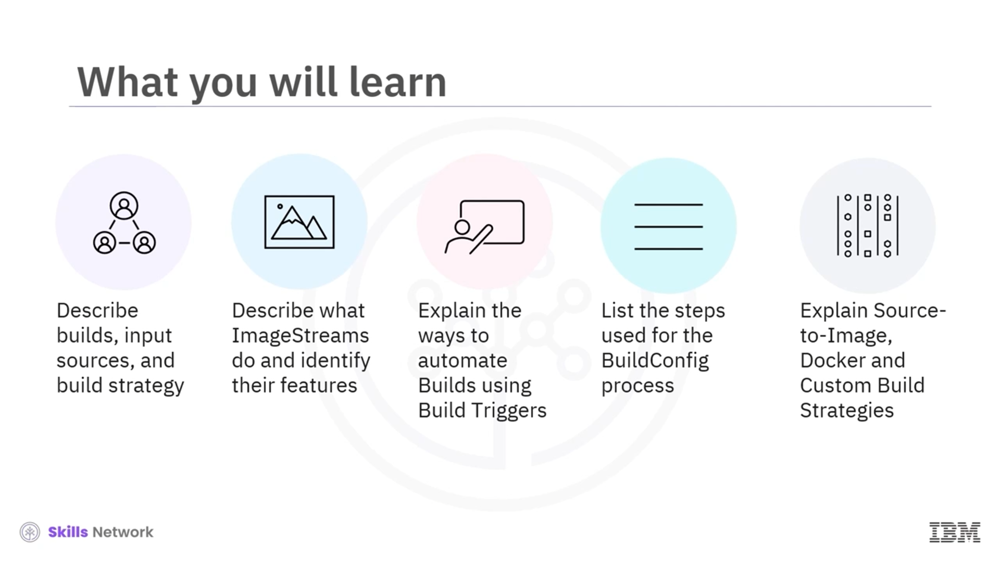
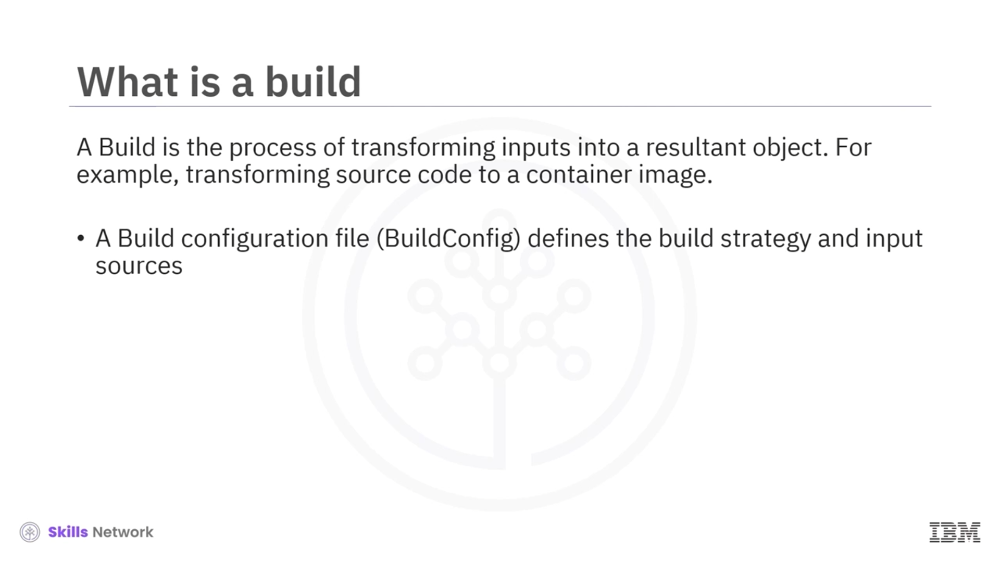
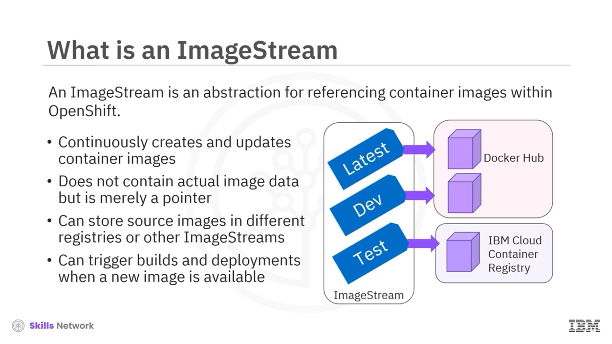
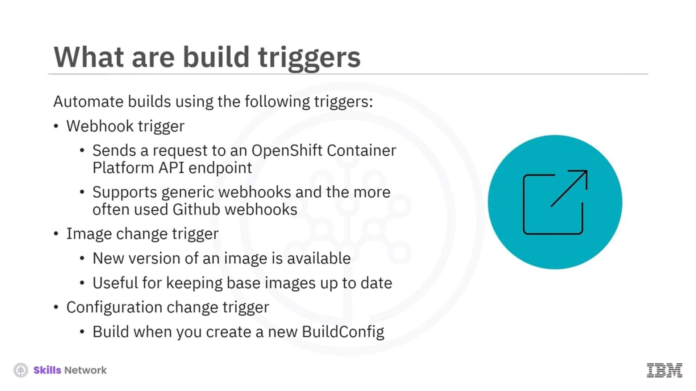
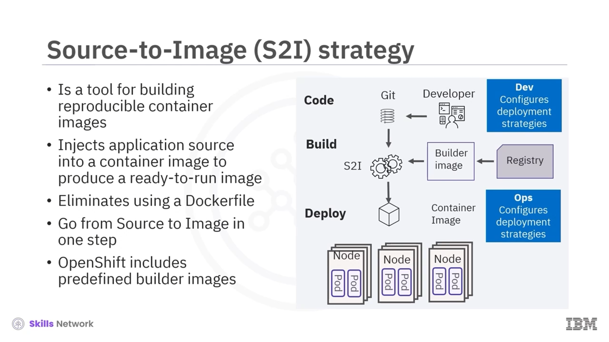
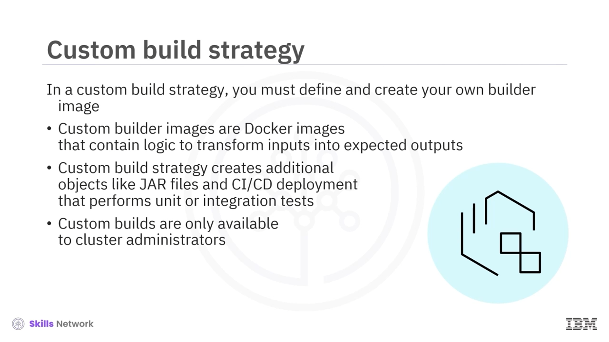
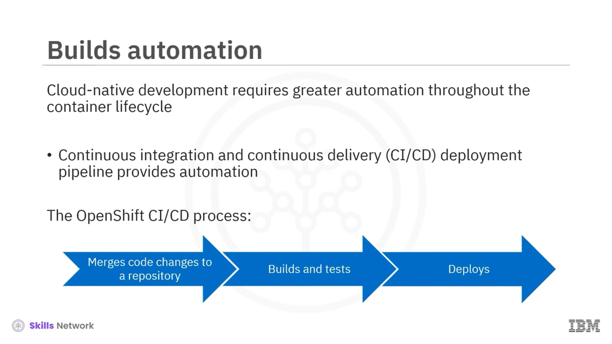

# 🔨 Builds

## 🎯 Öğrenme hedefleri

Build'lere hoş geldiniz. Bu videoyu izledikten sonra, bir `build`'ün ne olduğunu, build girdi kaynaklarını ve build stratejisini açıklayabileceksiniz.

`Image stream`'lerin ne yaptığını açıklayabilecek ve özelliklerini belirleyebileceksiniz.

Build tetikleyicilerini kullanarak build'leri nasıl otomatikleştireceğinizi açıklayabileceksiniz.

Build config sürecinde kullanılan adımları listeleyebilecek ve  *source-to-image* , Docker ve custom build stratejilerini açıklayabileceksiniz.

---

## 🧱 Build nedir?

Bir `build`, girdileri ortaya çıkan bir nesneye dönüştürme sürecidir; örneğin, kaynak kodu bir konteyner imajına dönüştürmek gibi.

Bir build, build stratejisini ve girdi kaynaklarını tanımlayan bir build yapılandırma dosyasına, yani `build config`'e ihtiyaç duyar.

Yaygın olarak kullanılan build stratejileri `source-to-image` (S2I), `Docker` ve `custom`'dır.

---

## 📥 Build girdi kaynakları

Bir build girdi kaynağı, build'ler için içerik sağlar.

Aşağıdaki build girdilerini, öncelik sırasına göre kullanabilirsiniz: satır içi `Dockerfile` tanımları, mevcut imajlardan çıkarılan içerik, Git depoları, ikili (binary) veya yerel girdiler, girdi secret'ları ve harici artefaktlar.

Birden fazla girdinin tek bir build içinde birleştirilebileceğini ve satır içi bir `Dockerfile`'ın öncelikli olduğunu ve harici herhangi bir Dockerfile'ı geçersiz kıldığını unutmayın.

---

## 🖼️ Image stream nedir?

Bir `image stream`, OpenShift içinde konteyner imajlarına referans vermek için kullanılan bir soyutlamadır.

Bir image stream, konteyner imajlarını sürekli olarak oluşturur ve günceller, ancak gerçek imaj verisini içermez.

Bunun yerine, dahili ve harici kayıt defterlerinde depolanan imajlara veya diğer image stream'lere işaret eder.

---

## 🏷️ Image stream tag’leri ve kullanım avantajları

Tek bir image stream, `latest`, `dev` ve `test` gibi birçok farklı tag'den oluşabilir ve her tag, bir kayıt defterindeki belirli bir imaja işaret eder.

Bir uygulamayı dağıtmak için, kayıt defteri URL'sini ve tag'ini kodun içine sabitlemek yerine image stream tag'ine referans verirsiniz.

Kaynak imajın konumu değişirse, tek tek tüm deployment'ları güncellemek yerine image stream tanımını güncellersiniz.

Bir image stream ayrıca, bir imajın yeni bir sürümü mevcut olduğunda build ve deployment'ları otomatik olarak tetikleyen bir tetikleyici yeteneği de sağlar.

---

## 🔁 Build tetikleyicileri

Build'leri manuel olarak çalıştırmak yerine, süreci tetikleyiciler kullanarak otomatikleştirin.

`Webhook` tetikleyicileri bir API uç noktasına (endpoint) istek gönderir; genel webhook'ları ve daha sık kullanılan GitHub webhook'larını da desteklerler ve bunlar her yeni commit, pull request veya diğer durumlarda tetikleyici isteğini API uç noktasına gönderir.

Sonraki tetikleyici, bir imajın yeni bir sürümü mevcut olduğunda build'leri tetikleyen `image change trigger`'dır.

Örneğin, uygulamanızı bir Node.js base imajını kullanarak build ediyorsanız, güvenlik düzeltmeleri yayınlandığında ve diğer güncellemeler gerçekleştiğinde bu imaj güncellenir.

Son olarak, bir `configuration change trigger`, yeni bir build config kaynağı oluşturduğunuzda yeni bir build'in çalışmasını sağlar.

---

## 🧾 BuildConfig örneği

Şimdi bir `BuildConfig` için örnek bir yapılandırma dosyasına bakalım.

Bu tanım, `Ruby Sample build` adlı yeni bir build config oluşturur.

`run policy` alanı, bir build configuration'dan oluşturulan build'lerin nasıl çalışması gerektiğini denetler; değerler arasında  *default* , *serial* ya da ardışık ve eşzamanlı çalışma yer alır.

Ayrıca yeni bir build oluşturan tetikleyicilerin bir listesini de belirtebilirsiniz.

`source` bölümü build'in kaynağını tanımlar ve kaynak türü, bir Git deposu, satır içi bir Dockerfile veya ikili (binary) yükler gibi birincil girdiyi belirler.

`strategy` bölümü, build'i yürütmek için hangi stratejinin kullanıldığını gösterir; örneğin  *source* , *docker* veya *custom* stratejisi.

Bu örnek, uygulama build'i için `ruby-20-centos7` konteyner imajını ve `source-to-image` (S2I) stratejisini kullanır.

Dolayısıyla konteyner imajını build ettikten sonra, `output` bölümünde açıklanan depoya (repository) push edilir ve `postCommit` bölümü isteğe bağlı bir build hook'unu tanımlar.

---

## 🧰 Source-to-Image (S2I) stratejisi

OpenShift'in sunduğu bir diğer build stratejisi `source-to-image` veya kısaca `S2I` olarak adlandırılır.

S2I aracı, tekrarlanabilir konteyner imajları build eder ve çalışmaya hazır bir imaj üretmek için uygulama kaynağını bir konteyner imajına enjekte eder.

Yeni imaj, bir `builder image` ile kaynağın birleştirilmesiyle, `Dockerfile` kullanmadan build edilir; bu da tek adımda source-to-image geçişine imkân tanır.

OpenShift, size zaman ve geliştirme çabası kazandıran çeşitli hazır builder imajlarıyla birlikte gelir.

---

## 🐳 Docker build stratejisi

Bir Docker build stratejisi kullanmak, bir `Dockerfile` ve gerekli artefaktları içeren bir depoya ihtiyaç duyar.

Bir build başlattığınızda, OpenShift girdiyi alır, `docker build` komutunu çağırır ve bir imaj oluşturur; bu imaj daha sonra OpenShift'in dahili kayıt defterine push edilir.

Docker build stratejisini uygulamanın dört yolu vardır.

Bunlar: imajdan Dockerfile'ı değiştirmek, Dockerfile yolu kullanmak, Docker ortam değişkenlerini kullanmak veya Docker build argümanları eklemektir.

---

## 🧩 Custom build stratejisi

Bir `custom` build stratejisinde, build süreci için gereken kendi builder imajınızı tanımlayıp oluşturmanız gerekir.

Custom builder imajları, girdileri beklenen çıktılara dönüştürmek için gereken mantığı içeren normal Docker imajlarıdır.

Hem Docker hem de S2I stratejileri çalıştırılabilir (runnable) imajlar üretir, ancak custom build stratejisi, JAR dosyaları ve birim veya entegrasyon testlerini gerçekleştiren CI/CD deployment'ı gibi ek nesneler oluşturur.

Custom build'ler yalnızca yüksek ayrıcalıklarla çalıştıkları için küme (cluster) yöneticilerinin kullanımına açıktır.

---

## 🚀 CI/CD ve otomasyon

Bulut-yerel (cloud-native) geliştirme, konteyner yaşam döngüsü boyunca daha fazla otomasyon gerektirir.

Otomasyon, sürekli entegrasyon ve sürekli teslim (CI/CD) pipeline'ı kullanılarak sağlanır.

Örneğin, OpenShift CI/CD süreci yeni kod isteklerini depoya otomatik olarak birleştirir, ardından yeni bir sürümü farklı ortamlara build eder, test eder, onaylar ve dağıtır.

---

## 📝 Özet

Bu videoda, bir build'in girdileri bir nesneye dönüştüren bir süreç olduğunu öğrendiniz.

Öncelik sırasına göre build girdileri; satır içi Dockerfile tanımları, mevcut imajlardan çıkarılan içerik, Git depoları, ikili veya yerel girdiler, girdi secret'ları ve harici artefaktları içerir.

Bir image stream, OpenShift içinde konteyner imajlarına referans vermek için kullanılan bir soyutlamadır.

Build'leri bir webhook, image change veya configuration change tetikleyicisi kullanarak otomatikleştirebilirsiniz.

Yaygın olarak kullanılan build stratejileri arasında `source-to-image` (S2I), Docker ve custom build stratejileri yer alır.

Ve son olarak, build'ler, build stratejisini ve girdi kaynaklarını tanımlayan bir build yapılandırma dosyasına, yani `build config`'e ihtiyaç duyar.

