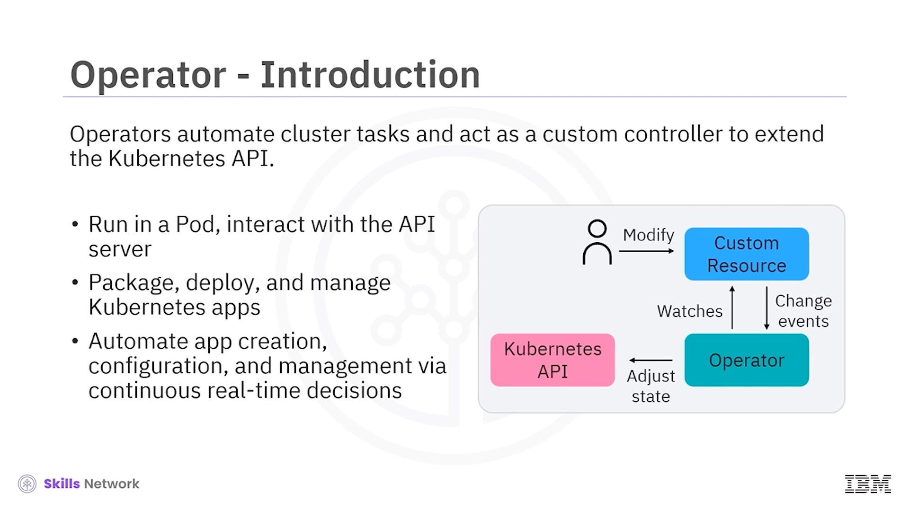
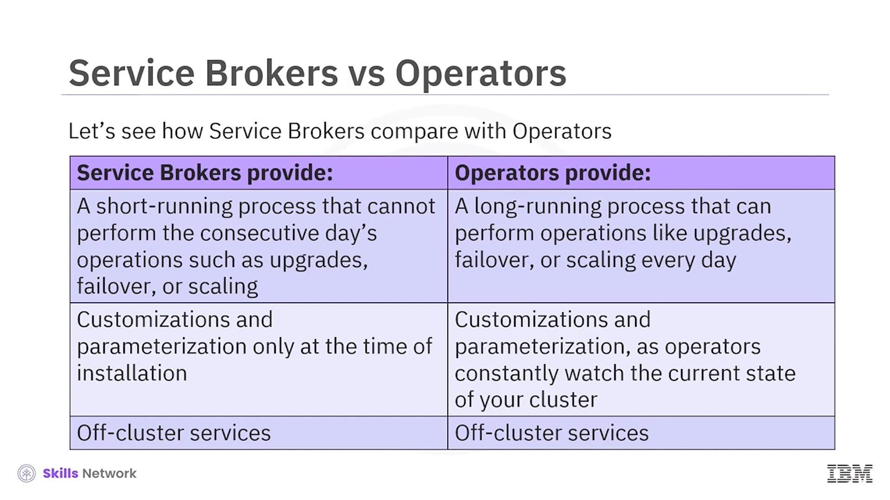
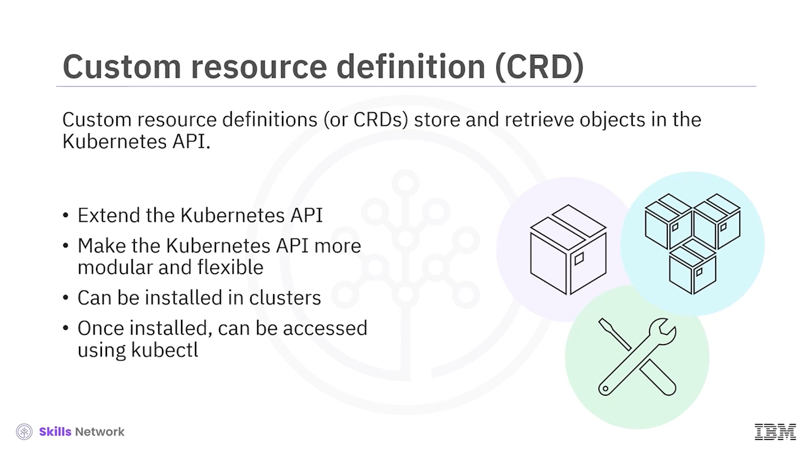
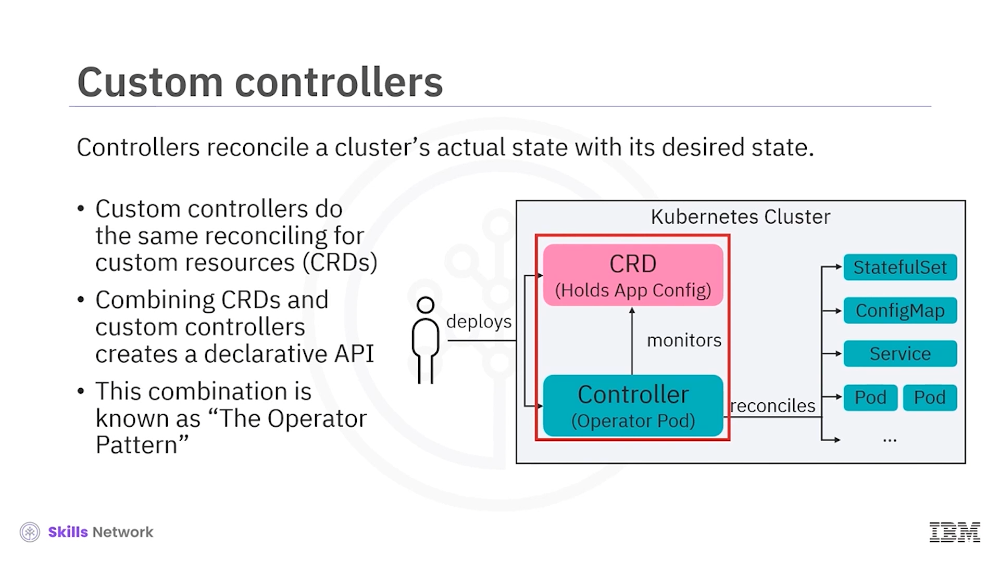
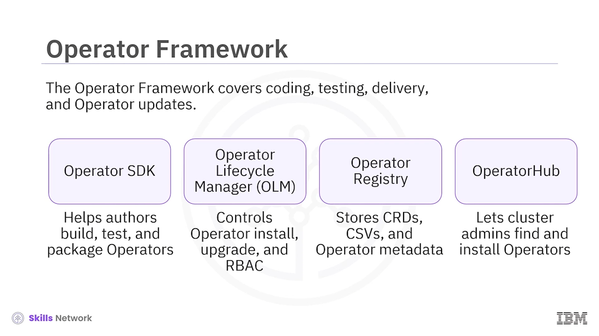
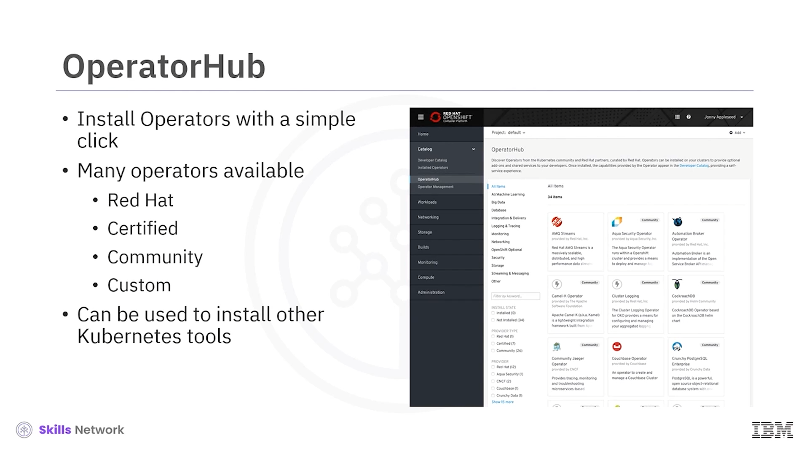

# 🧩 Operatörler

## 🎯 Bu videodan sonra neler yapabileceksiniz?

Operatörlere hoş geldiniz. Bu videoyu izledikten sonra:

* Bir operatörü tanımlayabilecek ve amacını açıklayabileceksiniz.
* Özel denetleyiciler ( *custom controllers* ), operatör deseni ( *operator pattern* ) ve Özel Kaynak Tanımları ( *Custom Resource Definitions, CRD’ler* ) arasındaki ilişkiyi gösterebileceksiniz.
* *Operator Hub* , *Operator Framework* ve olgunluk modelinin ( *maturity model* ) amacını açıklayabileceksiniz.

---

## 🤖 Operatör Nedir ve Ne İşe Yarar?

Operatörler, küme görevlerini otomatikleştirir ve Kubernetes API’sini genişletmek için özel bir denetleyici ( *custom controller* ) gibi davranır.

Operatörler bir pod içinde çalışır ve API sunucusuyla etkileşime girer, Kubernetes uygulamalarını paketler, dağıtır ve yönetir ve sürekli, gerçek zamanlı kararlar aracılığıyla uygulama oluşturma, yapılandırma ve yönetimini otomatikleştirir.

Operatörler, Kubernetes’te yerel ( *native* ) uygulamaları paketler, dağıtır ve yönetir, diğer görevleri otomatikleştirir ve ilgili tüm bileşenlerin dâhil edilmesini sağlar.

---

## 🧑‍💻 İnsan Operatörler ve Yazılım Operatörler

İki tür operatör vardır: insan operatörler ve yazılım operatörler.

İnsan operatörler, kontrol ettikleri sistemi anlarlar. Hizmetleri ( *services* ) nasıl dağıtacaklarını, sorunları nasıl tanıyıp düzelteceklerini bilirler.

Yazılım operatörler, insan operatörlerin bilgisini yakalamaya ve aynı süreçleri otomatikleştirmeye çalışır.

---

## ✅ Operatörlerin Sağladıkları Kolaylıklar

Operatörler aşağıdaki kolaylıkları sağlar:

* Tekrarlanabilir kurulum ve yükseltme süreçlerinin rahatça yürütülmesi.
* Sistemdeki her bileşenin düzenli, tam sağlık kontrolleri.
* Bileşenler ve yazılım satıcılarının içerikleri için “over-the-air” veya OTA güncellemeleri.
* Saha mühendislerinden gelen bilginin toplanması ve tüm kullanıcılara yayılmasını sağlayan bir yol.
* `kubectl` ve `oc` komutları gibi API’ler ve CLI araçlarıyla entegrasyon.

---

## 🔁 Servis Broker’ları ile Operatörlerin Karşılaştırılması

Şimdi servis broker’larının operatörlerle nasıl karşılaştırıldığına bakalım.

### 🧩 Servis Broker’ların Özellikleri

Servis broker’lar şunları sağlar:

* Yükseltme, *failover* veya ölçeklendirme gibi ardışık gün operasyonlarını gerçekleştiremeyen, kısa süreli çalışan bir süreç.
* Özelleştirmeler ve parametreleştirme yalnızca kurulum anında yapılabilir.
* Küme dışı ( *off-cluster* ) hizmetler.

### ⚙️ Operatörlerin Özellikleri

Operatörler ise şunları sağlar:

* Yükseltme, *failover* veya ölçeklendirme gibi işlemleri her gün gerçekleştirebilen, uzun süreli çalışan bir süreç.
* Operatörler kümelerinizin mevcut durumunu sürekli izlediği için, özelleştirmeler ve parametreleştirme sürekli olarak yapılabilir.
* Küme dışı ( *off-cluster* ) hizmetler.

---

## 🧱 CRD’ler ile Kubernetes API’sini Genişletmek

*Custom Resource Definitions* (CRD’ler), Kubernetes API’sinde nesneleri saklar ve geri alır.

CRD’ler, Kubernetes işlevselliğini *deployments* ve *pods* gibi yerleşik kaynakların ötesine taşır. Kubernetes API’sini daha modüler ve esnek hâle getirirler.

Kullanıcılar CRD’leri kümelere kurabilir, ancak her CRD yalnızca kurulduğu kümede kullanılabilir.

CRD bir kez kurulduğunda, CRD nesnelerine `kubectl` kullanılarak, pod’lar ve diğer kaynaklara eriştiğiniz şekilde erişebilirsiniz.

---

## 🎮 Özel Denetleyiciler ve Küme Durumunun Uzlaştırılması

Bir kümenin durumunu değiştirmek için özel denetleyiciler ( *custom controllers* ) kullanılır.

Denetleyiciler, kümenin gerçek durumunu yapılandırılmış durumla uzlaştırır. Özel denetleyiciler, özel kaynaklar ( *custom resources* ) için de aynı uzlaştırmayı yapar.

---

## 🧩 Operatör Deseni: CRD + Özel Denetleyici

CRD’ler ve özel denetleyicilerin birleştirilmesi, bildirimsel ( *declarative* ) bir API oluşturur. Bu kombinasyona operatör deseni ( *operator pattern* ) denir.

Özel denetleyiciler, CRD verilerini istenen durum ( *desired state* ) olarak yorumlar ve kümenin gerçek durumunu CRD verileriyle eşleşecek şekilde uzlaştırır.

---

## 🧰 Operator Framework ve Bileşenleri

 *Operator Framework* , kodlama, test, teslimat ve operatör güncellemelerini kapsayan, açık kaynaklı bir araç setidir.

*Operator SDK* (Helm, Go ve Ansible içerir), yazarların Kubernetes API karmaşıklıkları hakkında bilgi sahibi olmadan operatörlerini inşa etmelerine, test etmelerine ve paketlemelerine yardımcı olur.

*Operator Lifecycle Manager* (OLM), bir kümedeki operatörlerin kurulumunu, yükseltmesini ve rol tabanlı erişim kontrolünü ( *role-based access control, RBAC* ) yönetir.

*Operator Registry* ise CRD’leri,  *Cluster Service Version* ’ları (CSV’ler) ve paketler ve kanallar için operatör meta verilerini saklar.

Bu kayıt sistemi, Kubernetes veya OpenShift kümelerinde çalışır ve OLM’ye operatör katalog verilerini sağlar.

---

## 🌐 Operator Hub ve Operatör Bulma

*Operator Hub* web konsolu, küme yöneticilerinin kümelerine kuracakları operatörleri bulmalarını sağlar.

Operatör yönetim mantığının karmaşıklığı, operatörün temsil ettiği hizmet türüne bağlı olarak değişir.

Bu operatör olgunluk modeli ( *operator maturity model* ), günlük operasyon faaliyetleri için olgunluk aşamalarını tanımlar ve kapsamı temel kurulumdan *autopilot* seviyesine kadar uzanır.

Ayrıca, Operator SDK’nın Helm, Go ve Ansible yetenekleri tarafından hangi faaliyetlerin desteklendiğini de gösterir.

---

## 🛠️ Operatör Kullanım Örnekleri

Bazı operatör örnekleri şunları içerir:

* Bir uygulamayı OpenShift kümesine dağıtmak.
  * Bu, yalnızca  *deployment* ’larla sınırlı olmayıp  *secrets* , *config maps* ve depolama kaynaklarını da kapsayabilir.
* Uygulama türüne bağlı olarak çoklu  *replica* ’lar yardımıyla uygulamayı ölçeklendirmek.
* Bir kümedeki rutin görevlerin otomasyonu; örneğin, bir uygulama durumunun yedeklerinin alınması ve geri yüklenmesi.
* Entegrasyon.

---

## 🧩 Uygulama Dağıtımı Örneğini Detaylandırmak

İlk örnek hakkında biraz daha düşünelim.

Bir uygulamanın tamamını dağıtmak için, önce o uygulama için özel bir kaynak ( *custom resource* ) oluşturun, ardından bu CRD için özel bir denetleyici ( *custom controller* ) oluşturun.

Operatör mantığı, gerçek ve yapılandırılmış durumun nasıl uzlaştırılacağını belirler.

Bir CRD,  *deployments* ,  *services* , depolama ve diğer nesnelerin oluşturulmasını gerektirir.

OpenShift web konsolundaki *Operator Hub* görünümü, operatör kurulumunu tek tıklamayla mümkün kılar.

Operator Hub’da aşağıdakiler dâhil birçok farklı türde operatör bulunur:

* Red Hat operatörleri,
* Red Hat ile ortak çalışan bağımsız servis satıcılarından gelen sertifikalı operatörler,
* Açık kaynak topluluğundan gelen, ancak Red Hat tarafından resmî olarak desteklenmeyen topluluk operatörleri ( *community operators* ),
* Kullanıcılar tarafından tanımlanan özel operatörler.

Kubernetes ekosistemindeki birçok aracı, Operator Hub üzerinden kurabilirsiniz. Bir örnek,  *Istio Service Mesh* ’tir.

---

## 📚 Bu Derste Öğrendikleriniz

Bu videoda şunları öğrendiniz:

* CRD’lerin, Kubernetes API’sini genişlettiğini.
* CRD’lerin özel denetleyicilerle eşleştirilmesinin Kubernetes’te yeni bildirimsel API’ler oluşturduğunu.
* Operatörlerin, küme görevlerini otomatikleştirmek için CRD’leri ve özel denetleyicileri kullandığını.
* *Operator Framework* ’ün kodlama, test, teslimat ve güncellemeleri kapsadığını.
* *Operator Maturity Model* ’in, faaliyetler için olgunluk aşamalarını tanımladığını.

