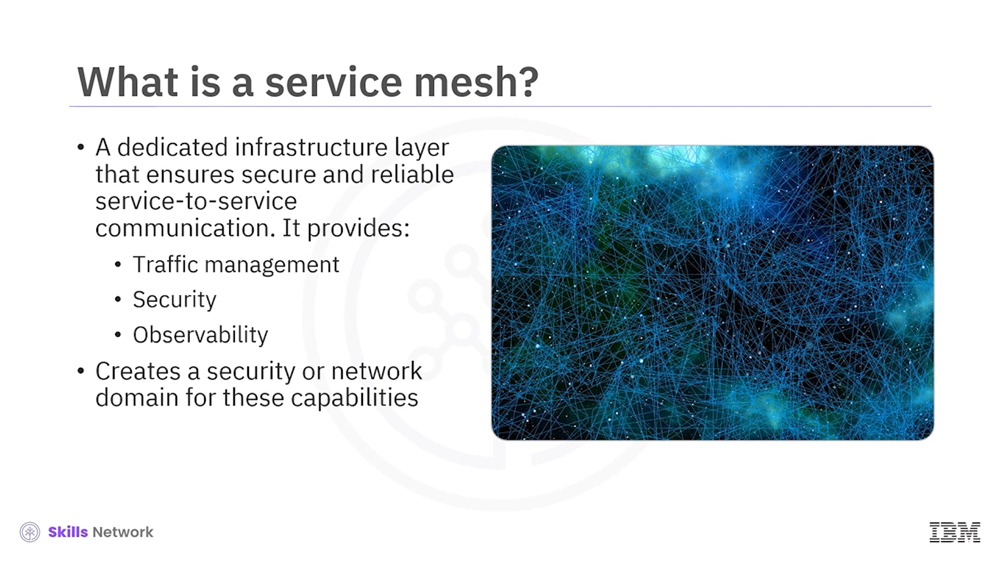
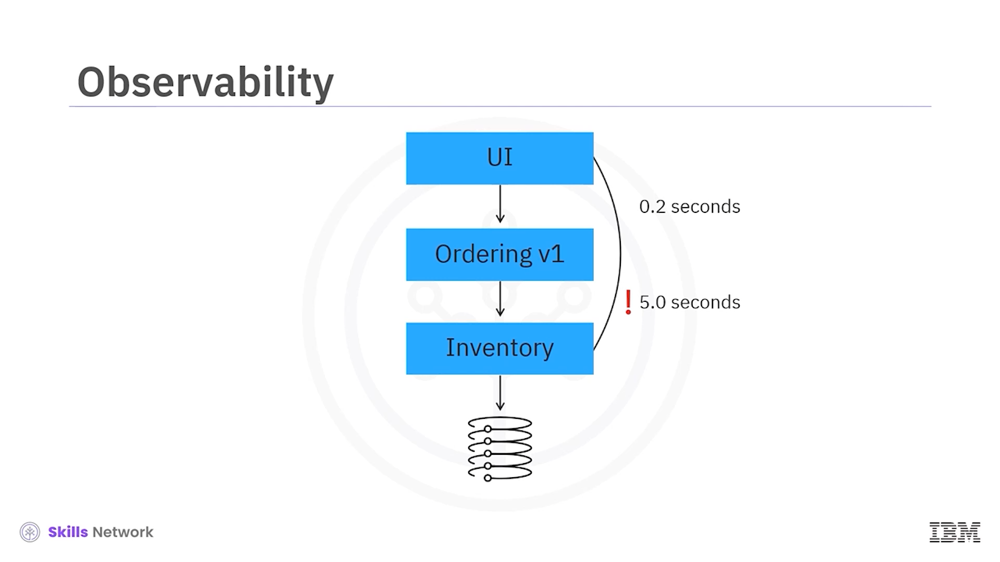
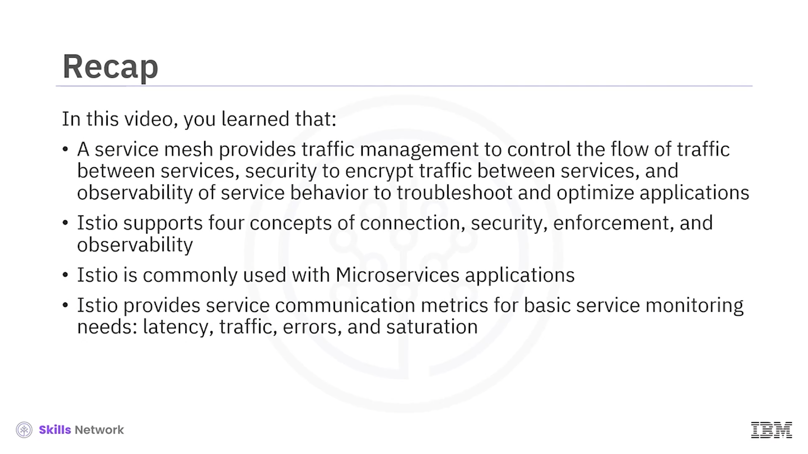

# 🕸️ Istio

Istio'ya hoş geldiniz. Bu videoyu izledikten sonra bir *service mesh*i tanımlayabilecek, Istio'nun desteklediği dört kavramı belirleyebilecek, Istio'yu mikroservislerle kullanmanın faydalarını ve zorluklarını açıklayabilecek ve temel dört servis iletişimi izleme metriğini tanımlayabileceksiniz.

---

## 🌐 Service Mesh Nedir?

 *Service mesh* , servisler arası iletişimi güvenli ve güvenilir hale getirmek için ayrılmış bir katmandır.

Diğer şeylerin yanında *service mesh* yapıları:

* Servisler arasındaki trafik akışını kontrol etmek için  **trafik yönetimi** ,
* Servisler arasındaki trafiği şifrelemek için  **güvenlik** ,
* Uygulamaları sorun gidermek ve optimize etmek için servis davranışının **gözlemlenebilirliğini**

sağlar.

*Service mesh* terimi, yukarıdaki kabiliyetleri gerçekleştirmek için bir güvenlik veya ağ alanı oluşturan yazılımı ifade eder.

 *Istio* , genellikle Kubernetes üzerinde kullanılan, **platformdan bağımsız** bir *service mesh*tir.

---

## 🔗 Istio’nun Desteklediği Dört Kavram

*Service mesh* tanımına uygun olarak Istio şu dört kavramı destekler:

### 🔁 Bağlantı (Connection)

İlk olarak **bağlantı** vardır. Bağlantı, Istio'nun *canary deployment*ler, A/B testleri ve diğer dağıtım modellerinde servisler arasındaki trafiği akıllıca kontrol etmesini sağlar.

### 🛡️ Güvenlik (Security)

Sırada **güvenlik** vardır. Istio, servisleri kimlik doğrulama ( *authentication* ), yetkilendirme ( *authorization* ) ve şifreleme ( *encryption* ) yoluyla güvence altına alır.

### 🧭 Uygulama / Politika Zorlaması (Enforcement)

Istio ayrıca **uygulanabilirlik** sağlar ve tüm filoya yayılan politikaları zorlayarak kontrol sağlar.

### 👁️ Gözlemlenebilirlik (Observability)

Son olarak Istio, **gözlemlenebilirlik** destekler. Istio’yu kullanarak mesh içindeki trafik akışını gözlemleyebilir, çağrı akışlarını ve bağımlılıklarını izleyebilir ve gecikme ( *latency* ) ile hatalar gibi metrikleri görüntüleyebilirsiniz.

---

## ⚙️ Istio Özellikleri ve Trafik Yönetimi

Istio, bir küme içindeki servisler arasında **taşıma katmanı güvenliği (TLS)** ile şifrelenmiş iletişim sağlar ve bunu uygun kimlik doğrulama ve yetkilendirme ile birleştirir.

Istio;  **HTTP** ,  **TCP** , **gRPC** ve **web socket** trafiği de dahil olmak üzere farklı protokoller için trafiği yük dengelemesi ( *load balancing* ) yapar.

Istio, trafik akışının ayrıntılı biçimde yapılandırılmasını sağlayan, **yönlendirme kuralları** olarak bilinen ince ayarlı trafik yapılandırmasını destekler ve sürekli yeniden denemeler ( *retries* ), hata enjeksiyonu ( *fault injection* ) yöntemleri ve otomatik failover’larla kontrol sunar.

Erişim kontrolleri, hız sınırlamaları ( *rate limits* ) ve kotalar için politikalar ve API desteğinin yanında Istio, hem gelen hem giden trafiğin otomatik izlenmesini, kaydedilmesini ( *logging* ) ve takip edilmesini sağlar.

Istio genişletilebilir ( *extensible* ) bir yapıya sahiptir ve çok çeşitli dağıtım ihtiyaçlarını karşılayabilir. Istio, Kubernetes üzerinde çalışır; bir kümedeki uygulamaları mesh’e ekleyebilir, mesh’i ek kümelere genişletebilir veya Kubernetes dışındaki sanal makineler ( *VM* ) ya da diğer uç noktalara bağlanabilirsiniz.

---

## 🧩 Istio ve Mikroservisler

Şimdi, Istio’nun mikroservislerle nasıl çalıştığını inceleyelim.

### 🧠 Istio’nun İki Temel Bileşeni: Control Plane ve Data Plane

Istio’da iki ana bileşen vardır: **control plane** ve  **data plane** .

Servisler arasındaki iletişim **data plane** tarafından yönetilir. *Service mesh* yoksa ağ, akan trafiğin türünü, kaynağını veya hedefini tanımlayamaz ve gerekli kararları veremez.

Tüm ağ trafiği, *service mesh* tarafından kullanılan ve yapılandırmaya bağlı olarak birçok özellik sunan **Envoy** adlı bir proxy’ye tabi tutulur veya bu proxy tarafından yakalanır.

 **Control plane** , istenen yapılandırmayı ve servisler hakkındaki görünümünü alır ve ortam değiştikçe proxy sunucularını dinamik olarak programlar ve günceller.

---

## 🧬 Mikroservis Mimarisi ve Faydaları

Bulut yerlisi ( *cloud-native* ) geliştirmenin yapı taşlarından biri  **mikroservis mimarisidir** .

 *Mikroservisler* , tek bir uygulamanın birçok, gevşek bağlı ve bağımsız olarak dağıtılabilen daha küçük bileşenler veya servisler içerdiği bulut-yerlisi bir mimari yaklaşımdır.

Mikroservislerin birbirleriyle iletişim kurmak için iyi tanımlanmış API’leri vardır.

Mikroservislerin faydaları çoktur:

* Kod güncellemeleri kolaydır; tüm uygulama yerine yalnızca ilgili servis güncellenir.
* Takımlar, her bileşen için farklı teknoloji yığınları kullanabilir.
* Ayrıca bileşenler, tüm uygulama yerine  **bağımsız olarak ölçeklenebilir** .

---

## ⚠️ Mikroservislerde Karşılaşılan Zorluklar

Mikroservislerin zorlukları arasında, güvenli iletişimi sağlamak için trafiğin şifrelenmesi yer alır.

Geliştirme ekipleri, uygulamalarındaki yeni özellikleri kullanıcıların bir alt kümesine sunmak ya da iki sürümü karşılaştırıp hangisinin kullanıcıları daha çok etkilediğini görmek isteyebilir. Bu durumlarda ekiplerin **canary deployment**lere ve **A/B testlerine** ihtiyacı vardır.

Mikroservisler arasındaki iletişim, bir servis erişilemez veya özellikle yavaş olduğunda **ardışık (cascading) hatalara** yol açar.

Geliştiricilerin, bir mikroservisteki hataların diğerlerine yayılmasını önlemek için **yeniden deneme (retries)** ve **circuit breaking** mekanizmalarına ihtiyacı vardır.

---

## 🧱 Örnek Uygulama Mimarisi

Ekranda gösterilen uygulama mimarisini düşünün; burada UI, bir **ordering** mikroservisiyle konuşur. Ordering mikroservisi, bir **inventory** mikroservisiyle etkileşime geçer ve bu da bir veritabanı ile konuşur.

Servisler arası iletişim, herhangi bir mikroservis mimarisini etkinleştirir. Ancak bu iletişim karmaşıklaştıkça, bir *service mesh* onu iyileştirmeye yardımcı olabilir.

---

## 🚦 Istio ile Trafik Yönlendirme ve A/B Testi

Şimdi Istio’nun bazı yeteneklerine biraz daha yakından bakalım.

Istio, bir mikroservisin bir sürümünden diğer sürümlerine trafiği kademeli olarak taşıyan **trafik kaydırma (traffic shifting)** işlemini gerçekleştirir.

Diyelim ki ordering mikroservisi üzerinde çalışan bir ekip, bu mikroservisin yeni bir güncellemesine sahiptir. Ekip, trafiğin %5’ini ikinci sürüme göndermeye başlayabilir. Zamanla bunu %50’ye ve sonunda %100’e çıkarabilirler.

Benzer şekilde, Istio’nun **istek yönlendirme (request routing)** özelliği, A/B testi yapmanıza ve bir mikroservisin belirli bir sürümünü kullanıcıların bir alt kümesine yönlendirirken orijinal sürümü kalan kullanıcılara göndermenize olanak tanır.

Bu süreç, yeni sürümün kullanıcı etkileşimini veya performansı artırdığından emin olmayı sağlar.

---

## 🛡️ Istio ile Güvenlik ve Erişim Kontrolü

Istio, mikroservisleriniz için şifreleme de dahil olmak üzere çeşitli güvenlik önlemleri sunar.

Istio, mikroservisler arasındaki trafiği şifreleyerek **ortadaki adam (man-in-the-middle) saldırılarına** karşı savunma sağlar.

Buna ek olarak Istio, servis erişim politikalarını uygulamayı kolaylaştırır; böylece servisler yalnızca gerekli diğer servislerle iletişim kurabilir.

Bu örnekte, UI servisi inventory servisiyle doğrudan iletişim kurmaya çalışsa bile, bunu yapamaz.

---

## 📊 Istio’nun Sağladığı Servis İletişim Metrikleri

Diğer metriklerin yanı sıra Istio, **servis iletişim metrikleri** sağlar.

Bu metrikler, dört temel servis izleme ihtiyacını kapsar:

* **Gecikme (latency)**
* **Trafik (traffic)**
* **Hatalar (errors)**
* **Doygunluk (saturation)**

Örneğin Istio, isteklerinizin ne kadar trafik aldığını görebilmeniz için **istek sayısı (request counts)** metriklerini ve darboğazları bulup zamanında yanıtlar olduğundan emin olabilmeniz için **istek süresi (request duration)** metriklerini (burada saniye cinsinden gösterilmektedir) sağlar.

---

## ✅ Özet

Bu videoda şunları öğrendiniz:

* Bir  *service mesh* , servisler arasındaki trafiğin akışını kontrol eden  **trafik yönetimi** , servisler arasındaki trafiği şifreleyen **güvenlik** ve uygulamaları sorun gidermek ve optimize etmek için **servis davranışının gözlemlenebilirliğini** sağlar.
* Istio,  **bağlantı (connection)** ,  **güvenlik (security)** , **uygulama/uygulanabilirlik (enforcement)** ve **gözlemlenebilirlik (observability)** olmak üzere dört kavramı destekler.
* Istio’nun yaygın olarak kullanıldığı örneklerden biri,  **mikroservis uygulamalarıdır** .
* Istio, gecikme, trafik, hatalar ve doygunluk dahil olmak üzere temel servis izleme ihtiyaçları için **servis iletişim metrikleri** sağlar.

