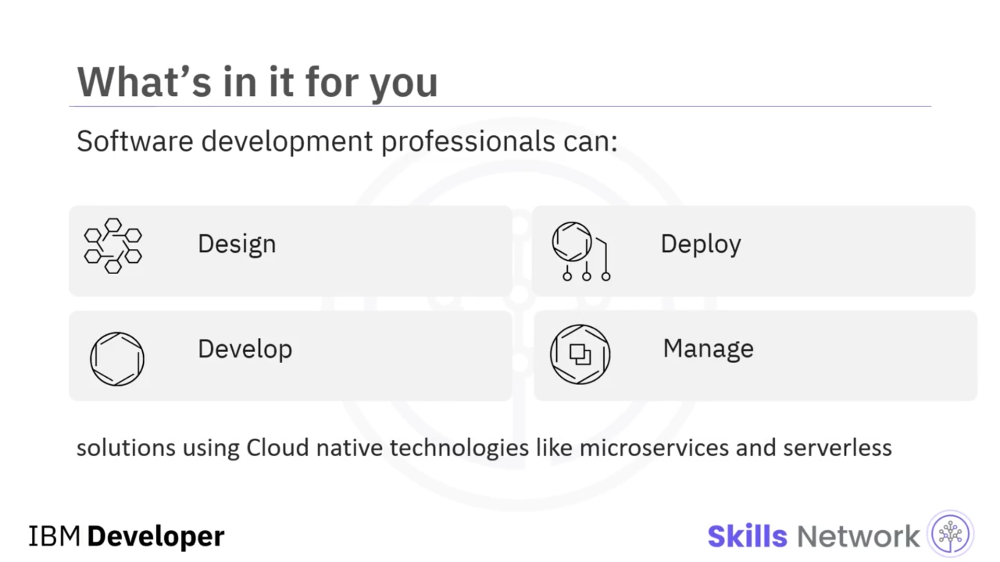
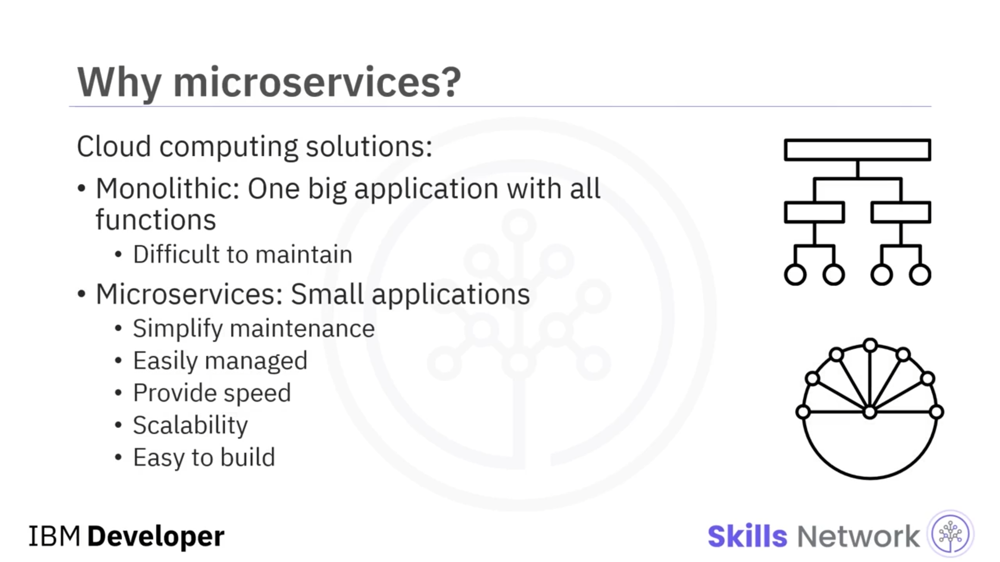
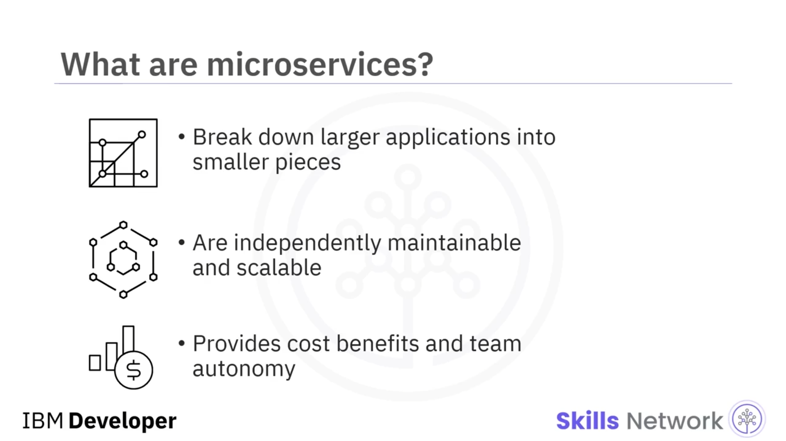
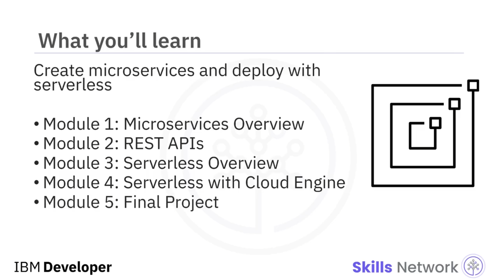

# 📚 Kursa Giriş

## 🎯 Mikroservisler ve Sunucusuz Kursuna Hoş Geldiniz

Microservices and Serverless başlıklı bu kursa hoş geldiniz.

Bu kurs, mikroservisler ve sunucusuz (serverless) gibi bulut yerlisi (cloud native) teknolojileri kullanarak çözümler tasarlamak, geliştirmek, dağıtmak ve yönetmek isteyen herkes dahil olmak üzere tüm yazılım geliştirme profesyonelleri için tasarlanmıştır.

## 🏗️ Bulutta Monolitik mi, Mikroservis mi?

Şimdi, tüm iş uygulamalarınızı yönetmek için bulut bilişimi kullanmak ister misiniz?

Hangi çözümü tercih ederdiniz?

Bakımı zor, birçok karmaşık işlev içeren, bulutta çalışan büyük tek parça bir uygulamadan oluşan *monolitik* bir mimariyi mi?

Yoksa bakımı sadeleştiren, kolay yönetilen, hız ve ölçeklenebilirlik sağlayan ve geliştirilmesi daha kolay olan küçük uygulamalardan oluşan *mikroservis* mimarisini mi?

Bu daha küçük uygulamalar, büyük bir uygulamanın işlevini yerine getirmek için birlikte çalışırlar.

## 🔍 Mikroservis Mimarisi ve Avantajları

Tüm işlevselliği yerine getiren büyük uygulamalar (*monoliths* olarak da bilinir) geliştirmek yerine, mikroservisler, daha büyük uygulamaları bağımsız olarak yönetilebilir ve ölçeklenebilir daha küçük parçalara böler ve birçok fayda sağlar.

Bu mimari, maliyet avantajları, ekip özerkliği ve diğer avantajlar sunduğu için dünyadaki en büyük yazılım organizasyonlarında kullanılmaktadır.

## ☁️ Sunucusuz (Serverless) Yaklaşımın Yükselişi

Benzer şekilde, sunucusuz (serverless), bulut çağında giderek daha popüler bir hesaplama seçeneği olarak ortaya çıkmıştır.

Bu yaklaşım, geliştiricilerin ve operasyon ekiplerinin alttaki altyapıyı yönetmeden uygulamaları çalıştırmasına olanak tanır.

Sunucusuz uygulamalar, çekirdek kod için yalnızca sunucusuz bir mimariye ihtiyaç duyar.

Sunucusuz uygulamalar hızlı bir şekilde dağıtılabilir, kısa süreli olarak çalışır ve kullanılmadıkları zaman alttaki kaynakları otomatik olarak serbest bırakırlar.

## 🧪 Bu Kursta Neler Öğreneceksiniz?

Bu derste, mikroservisler oluşturmayı ve bunları sunucusuz teknolojiler kullanarak buluta dağıtmayı öğreneceksiniz.

Bunu yapmak için, önce 1. Modülde mikroservisler hakkında genel bir bakış elde edecek ve bunların faydalarını anlayacaksınız.

Ardından, 2. Modülde, mikroservis tabanlı uygulamaların temel yapı taşları olan RESTful API’leri oluşturmayı öğreneceksiniz.

Sonra, 3. Modülde, Serverless framework’ün faydalarını anlayacak ve çeşitli sunucusuz platformlar hakkında bilgi edineceksiniz.

4. Modülde ise IBM Cloud üzerinde bir sunucusuz ortam olan Code Engine ile çalışarak mikroservisleri dağıtacak, güncelleyecek ve ölçekleyeceksiniz.

Ve son olarak, 5. Modülde, mikroservislere dayalı bir uygulama oluşturarak ve bunu sunucusuz framework kullanarak dağıtarak, kurs boyunca öğrendiklerinizi göstereceğiniz uygulamalı bir final projesini tamamlayacaksınız.

## ✅ Kurstan En İyi Şekilde Yararlanma

Burada ele alınacak çok şey var!

Bu dersten en iyi şekilde yararlanmak için, her videonun tamamını izleyin, tüm uygulamalı laboratuvarları tamamlayın ve her sınav ile öğrenmenizi kontrol edin.

## 🙋‍♀️ Destek ve Başlangıç

Mikroservisler ve sunucusuz yolculuğunuza başlarken aramızda olduğunuz için çok mutluyuz.

Ve kurs materyallerinin herhangi bir kısmında sorun yaşarsanız, lütfen tartışma forumunda bizimle iletişime geçmekten çekinmeyin.

Hadi başlayalım!
