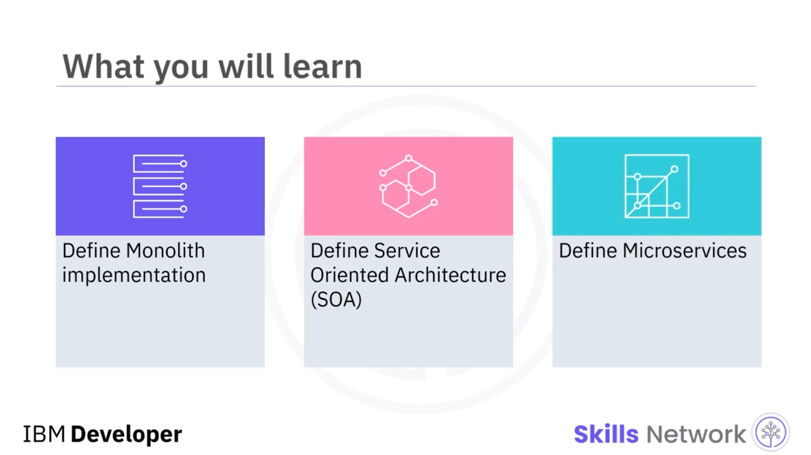
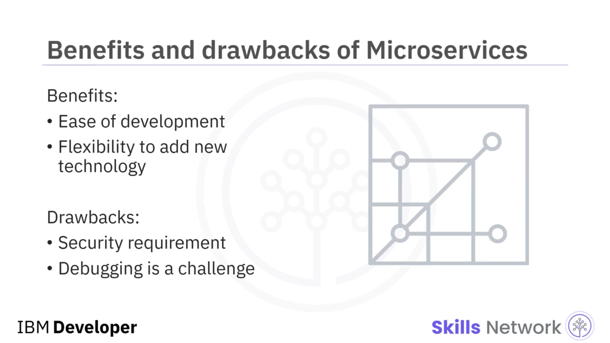
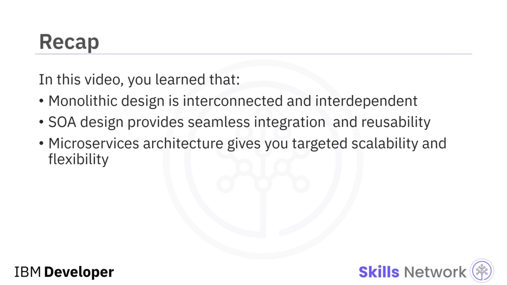

# 📊 Monolit vs. SOA vs. Mikroservisler Karşılaştırması

## 🎬 Giriş

‘Monolit vs. SOA vs. Mikroservisler Karşılaştırması’na hoş geldiniz.

Bu videoyu izledikten sonra, Monolit uygulamayı tanımlayabilecek, Hizmete Yönelik Mimarinin ( *Service Oriented Architecture* , SOA) ne olduğunu açıklayabilecek ve Mikroservisleri tanımlayabileceksiniz.

---

## 🧱 Monolitik Uygulama (Monolith) Nedir?

Monolitik bir uygulama, tüm ya da çoğu işlevselliğini tek bir süreç içinde barındırır. Uygulama, iç katmanlar veya kütüphaneler aracılığıyla yönetilir.

Bu katmanlar; güvenlik, raporlama, analitik, kullanıcı arayüzü veya veri erişimi için olabilir.

Katmanlar birbirine sıkı sıkıya bağlıdır ve birbirlerine bağımlıdır. Monolitik tasarımın faydaları da burada yatar; her şey aynı kod tabanında olduğundan, sadelik ve özellikler ile işlevler arasında daha az katmanlar arası kesişme ( *cross-cutting* ) söz konusudur.

Ancak zamanla çoğu ürün gelişir ve kapsamı genişler; bu durumda tasarım daha karmaşık hale gelir ve değiştirilmesi zorlaşır.

Ayrıca, yeni teknolojilere uyum sağlamak için bir engel haline gelir; çünkü bu uyum çoğu zaman tüm uygulamanın yeniden yazılmasını gerektirir.

Bir  **Windows Forms Application** , monolitik tasarıma tipik bir örnektir. Burada kullanıcı arayüzü, iş mantığı ve veri erişimini, tüm uygulamayı oluşturan tek bir kod tabanının içine gömeriz. Ve kapsamın dışında kalan tek bileşen veritabanıdır.

---

## 🏛️ Hizmete Yönelik Mimari (SOA) Nedir?

*Hizmete Yönelik Mimari* ( *Service Oriented Architecture* , SOA), bir hizmet sağlayıcı ve hizmet tüketicisi yaklaşımıyla tasarlanır ve inşa edilir.

Sunulan hizmetler, ayrık birer işlev birimi olarak çalışır, kesintisiz biçimde entegre edilir ve kolayca yeniden kullanılabilir.

Her SOA hizmeti üç bileşenden oluşur:

* **Arayüz (interface)** , bir hizmet sağlayıcının, hizmet tüketicisinden gelen istekleri nasıl yerine getireceğini tanımlar.
* **Sözleşme (contract)** , hizmet sağlayıcı ile hizmet tüketicisinin nasıl etkileşime gireceğini tanımlar.
* **Uygulama (implementation)** , hizmetin kendisini oluşturan koddur.

Bu üç bileşenin ayrı olması, hizmetler arasındaki sabit sözleşme sayesinde güvenilirliği artırmaya yardımcı olur ve paralel geliştirmeyi destekler.

Bununla birlikte, bu beklentiler ve gereksinimler nedeniyle, bir SOA tasarımı karmaşık hale gelebilir ve hızlı uygulama geliştirmeyi engelleyebilir.

Ayrıca SOA tasarımı, maliyetli bir yatırımdır ve bu nedenle genellikle gerekli kaynaklara ve uzmanlığa yatırım yapabilen kurumsal ekipler için uygundur.

---

## 🏢 Kurumsal Ölçekte SOA Örneği

SOA, kurum genelinde (enterprise-wide) bir kavramdır. Buna bir örnek, bir bankacılık sistemi olabilir.

SOA, mevcut uygulamaların, her biri bir iş fonksiyonuna karşılık gelen gevşek bağlı arayüzler üzerinden açığa çıkarılmasını sağlar. Bu da genişletilmiş bir işletmenin bir bölümündeki uygulamaların, diğer uygulamalardaki işlevleri yeniden kullanmasına imkân tanır.

Bankanın her bir arayüzü, kendi sorumluluğunu yerine getirmek için gerekli hizmetleri sunar.

---

## 🧩 Mikroservisler Nedir?

SOA’da olduğu gibi, mikroservis mimarileri de çoğu zaman birbirinden bağımsız çalışan, gevşek bağlı, yeniden kullanılabilir ve uzmanlaşmış bileşenlerden oluşur.

Ve bir mikroservisin içindeki veriler dahi diğer hizmetlerle paylaşılmaz. Bu durum, tek tek mikroservisleri bağımsız olarak ölçeklendirmenize yardımcı olur ve bağımsız olmaları, altta yatan teknolojiyi seçme özgürlüğüne sahip olmanız anlamına gelir.

Bu mimari, örneğin bireysel iş birimlerini birer hizmet olarak tanımlayabildiğiniz için, geliştirme kolaylığı gibi avantajlar sağlar.

Her hizmetin belirlenmiş bir sorumluluğu olduğundan, yeni teknolojiler ekleme konusunda da esneklik sunar.

---

## ⚠️ Mikroservislerde Karşılaşılan Zorluklar

Mikroservisleri kullanmak için güçlü gerekçeler olsa da, buna eşlik eden bazı zorluklar da vardır.

İlk zorluk, güvenlik boyutudur. Artık birbirinden bağımsız olarak barındırılan bu kadar çok farklı hizmetiniz olduğunda, her birinin kendi güvenlik paradigmasına ihtiyacı olacaktır.

Örneğin, ağ iletişimini güvence altına almak için **taşıma katmanı güvenliği** ( *transport layer security* , TLS) gibi basit görünen bir gereksinim bile her hizmet için ayrı ayrı ele alınmalıdır.

İkinci zorluk ise, her hizmet bağımsız çalıştığı için hata ayıklama ve sorunları izole etmenin de zorlaşabilmesidir; bu da kök nedeni bulmayı güçleştirebilir.

---

## 🛒 Uygulama Kapsamlı Mikroservis Örneği

Mikroservis mimarisi, kapsamı uygulama düzeyinde olan bir kavramdır.

Örneğin, bir e-ticaret uygulaması; siparişleri işlemek, güvenlik ve analitik için ayrı mikroservislere sahip olabilir.

Bir mikroservis tasarımı, tek bir uygulamanın iç yapısının, bağımsız olarak değiştirilebilen, ölçeklenebilen ve yönetilebilen daha küçük parçalara bölünmesini sağlar.

Ancak mikroservis mimarisi, uygulamaların birbirleriyle nasıl iletişim kuracağını tanımlamaz.

---

## ✅ Özet

Bu videoda şunları öğrendiniz:

* Monolitik tasarım, birbirine bağlı ve birbirine bağımlı bir yapıya sahiptir.
* SOA tasarımı, kesintisiz entegrasyon ve yeniden kullanılabilirlik sağlar.
* Mikroservis mimarisi ise size hedeflenmiş ölçeklenebilirlik ve esneklik sunar.

