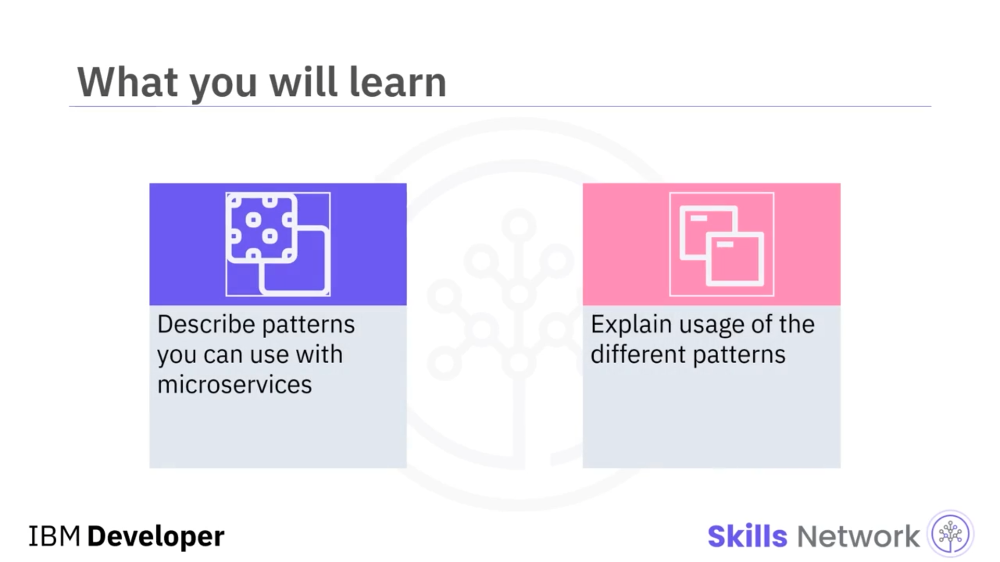
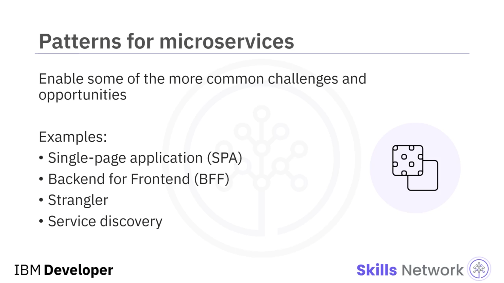
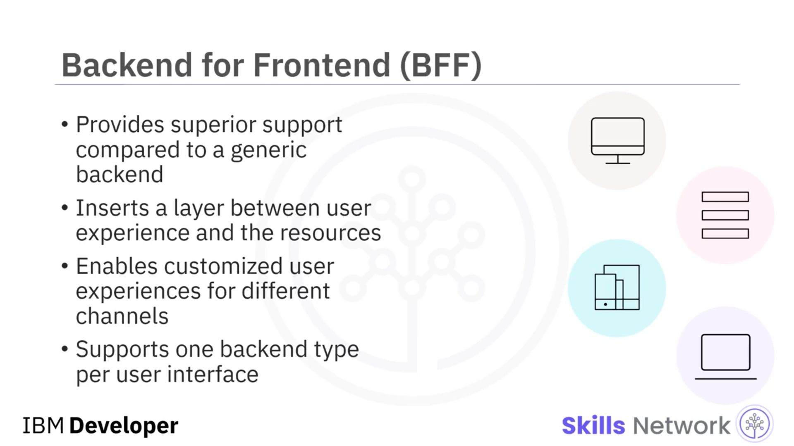
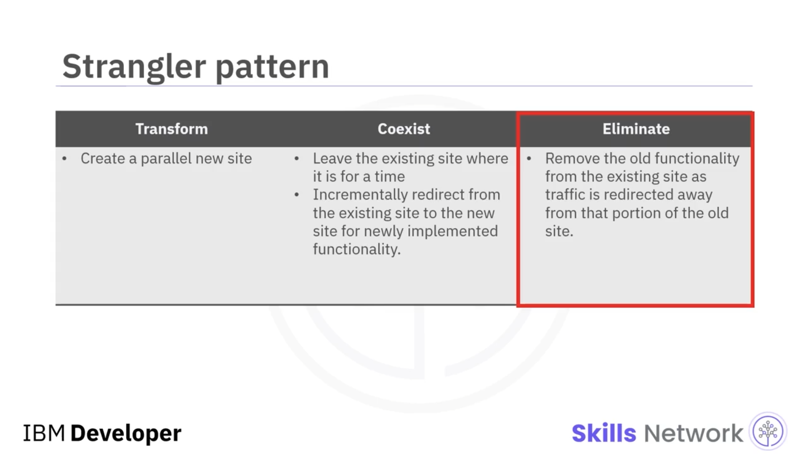
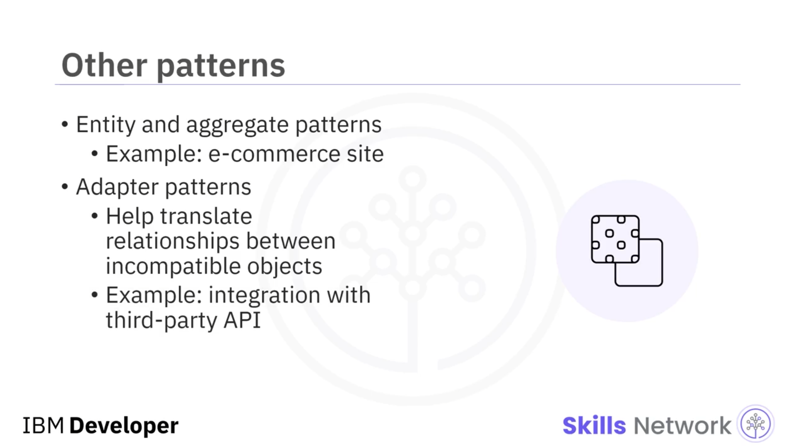

# 🧩 Microservices Patterns

## 🎬 Giriş

‘ *Microservices Patterns* ’e hoş geldiniz. Bu videoyu izledikten sonra, mikroservislerle birlikte kullanabileceğiniz desenleri tanımlayabilecek ve farklı desenlerin kullanımını açıklayabileceksiniz.

Mikroservisler, yaygın karşılaşılan bazı zorluk ve fırsatları ele almayı sağlayan çok sayıda desene sahiptir. Örnekler arasında *single-page application (SPA)* deseni, *Backend for Frontend (BFF)* deseni, *Strangler* deseni ve *service discovery* deseni bulunur.

## 🌐 Single-Page Application (SPA) Deseni

Daha güçlü tarayıcıların, daha hızlı ağların ve istemci tarafı dillerin yakınsamasıyla birlikte, birçok web arayüzü tüm işlevselliği  *single-page application* ’lara dahil etmeye başladı.

Kullanıcı, açılış sayfasını hiç yeniden yüklemeyen veya başlangıçtaki deneyimden başka bir yere gitmeyen tek bir arayüzden giriş yapar. HTML, CSS ve JavaScript kombinasyonu kullanılarak oluşturulan bu uygulamalar, tamamen yeni bir sayfaya yönlendirmek yerine, ekranın belirli bölümlerini güncelleyen arka uç  *REST* -tabanlı servis çağrılarını dinamik olarak gerçekleştirerek kullanıcı girdilerine yanıt verir.

## 🧱 SPA ve Artan Backend Sorumluluğu

Bu uygulama mimarisi, ön yüz deneyimini çoğu zaman basitleştirir; ancak bunun karşılığında arka uç servisler üzerinde daha fazla sorumluluk oluşturur.

*Single-page application* tek kanallı kullanıcı deneyimleri için iyi çalışsa da, mobil ve web gibi farklı kanallar üzerinden sunulan kullanıcı deneyimleri söz konusu olduğunda zayıf sonuç verir.

## 🧩 Backend for Frontend (BFF) Deseni

Bir *Backend for Frontend (BFF)* deseni, kullanıcı deneyimi ile bu deneyimin çağırdığı kaynaklar arasına bir katman yerleştirir. Bu tasarım, kanallar arasında özelleştirilmiş kullanıcı deneyimleri sunmayı mümkün kılar.

Örneğin, masaüstünde kullanılan bir uygulama ile bir mobil cihazda kullanılan uygulama, ekran boyutu, görüntüleme özellikleri ve performans sınırları bakımından birbirinden farklı olacaktır. *BFF* deseni, geliştiricilerin, herhangi bir arayüzle çalışabilen ancak ön yüz performansını olumsuz etkileyebilecek genel amaçlı bir arka ucu desteklemeye çalışmak yerine, her bir kullanıcı arayüzü için, o arayüz için en iyi seçenekleri kullanarak tek bir arka uç türü oluşturmasını ve bunu desteklemesini sağlar.

Bu diyagram, bir *Backend for Frontend* uygulama mimarisi için harika bir kullanım senaryosunu göstermektedir.

## 📱 Mobil ve Web için Ayrı Backend’ler

Bir kullanıcının bir uygulamaya bir mobil uygulama üzerinden veya bir masaüstü üzerindeki web uygulaması aracılığıyla erişebildiğini varsayalım.

Bir *BFF* deseni uygularken, mobil deneyim için özel olarak tasarlanmış bir arka uç ve web deneyimi için özel olarak tasarlanmış başka bir arka uç geliştirirsiniz. Her bir arka uç, doğru servisleri nasıl çağıracağını ve kodu, talep edilen kanalın deneyimini optimize edecek şekilde nasıl orkestre edeceğini bilir.

Mobil uygulama, daha sınırlı bir veri alt kümesini görüntüleyebilir ve ekran boyutları web deneyiminden farklı olacaktır. Her bir arka uç, birer mikroservistir.

Ve hangi kanalın gerekli olduğunu kontrol eden, ardından o kanal için kullanıcı deneyimini hazırlamak için gereken tüm mantığı içeren tek parça (monolitik) bir uygulamaya sahip olmak yerine, monolitik arka ucu, kendi özel ve gerekli görevlerini yerine getiren ayrı servislere ayırmak için mikroservis mimarisini uygularsınız.

## 🌿 Strangler Deseni

*Strangler* deseni, monolitik bir uygulamanın aşamalı olarak yeniden düzenlenmesini (refactoring) yönetmeye yardımcı olur.

Desen, metaforik adını, bir ağacın etrafını sararak onu boğan bir sarmaşık biçimindeki bahçe olgusundan alır.

## 🕸 Strangler Deseninin URL Tabanlı Yaklaşımı

İş alanının farklı yönlerine işlevsel olarak eşlenen bireysel URL’ler kullanılarak oluşturulmuş bir web uygulamasını düşünün.

*Strangler* deseni ile, bir uygulamayı birden fazla işlevsel alana (domain) bölmek için bir web uygulamasının yapısını kullanırsınız ve bu alanları, her seferinde bir alan olacak şekilde yeni, mikroservis tabanlı bir uygulama ile değiştirirsiniz.

Bu iki unsur, aynı URL alanında yan yana var olan ayrı uygulamalar oluşturur. Zamanla, yeni düzenlenmiş uygulama, orijinal uygulamanın yerini alır ve en sonunda monolitik uygulamayı kapatabilirsiniz.

## 🔁 Strangler Deseninin Adımları: Transform, Coexist, Eliminate

*Strangler* deseni şu adımları içerir:

Önce, *transform* (dönüştür). Bu, bir bulut platformunda veya mevcut ortamınız içinde paralel yeni bir site oluşturur.

Sonra, *coexist* (bir arada yaşa). Bu, mevcut siteyi belirli bir süre boyunca işler ve canlı halde bırakır. Yeni uygulanan işlevler için, mevcut konumdan yeni siteye kademeli olarak yönlendirme yapar.

Ve son olarak, *eliminate* (ortadan kaldır). Bu, güncel konumdan yönlendirme yaptığınızda, mevcut siteden eski işlevselliği kaldırır veya bu işlevselliği sürdürmeyi bırakır.

## 🔎 Service Discovery Deseni

Bir *service discovery* deseni, uygulamaların ve servislerin birbirlerini keşfetmesine yardımcı olur.

Bu desene, bir mikroservis mimarisinde servis örneklerinin ölçekleme, yükseltmeler, servis hataları ve hatta servis sonlandırma nedeniyle dinamik olarak değişmesi sebebiyle ihtiyaç duyulur.

## ⚖️ Load Balancer ve Diğer Desenler

Bir *load balancer* da, sağlık kontrolleri yapmak ve servis hatalarında trafiği yeniden dengelemek için bu deseni kullanabilir.

Diğer desenler arasında, bir e-ticaret sitesinde bir siparişin, bir alıcı tarafından gruplandırılmış ürünlerin bir  *aggregate* ’i olarak ele alınabileceği *entity and aggregate* deseni yer alır.

Bir diğeri ise *adapter* desenidir. Bunu, başka bir ülkeye seyahat ederken kullandığınız priz dönüştürücüleri gibi düşünebilirsiniz.

*Adapter* desenlerinin amacı, aksi halde birbirleriyle uyumsuz olan nesneler arasındaki ilişkileri çevirmeye (dönüştürmeye) yardımcı olmaktır. Örneğin, üçüncü taraf bir API ile tümleştirme yaptıysanız.

## 📚 Özet

Bu videoda şunları öğrendiniz:

Mikroservisler, sayfanın dinamik olarak güncellenmesi için arka uç servislerine dayanan  *single-page application* ’ları mümkün kılar.

*Backend for Frontend* desenleri, farklı kullanıcı deneyimlerini daha kolay kolaylaştırmak için mikroservisleri kullanır.

Monolitik uygulamaları mikroservislere bölmeye yardımcı olmak için *Strangler* desenini uygulayabilirsiniz.

Ve bir *service discovery* deseni, uygulamaların ve servislerin birbirlerini keşfetmesine yardımcı olur.

