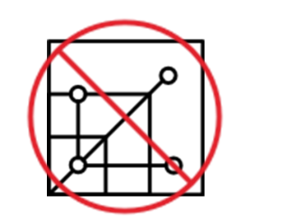

# 🚫 Mikroservis Karşı-Desenleri

*Mikroservisler* için işleri iyi yapmanızı sağlayan pek çok desen olduğu gibi, herhangi bir geliştirme ekibini hızla sıkıntıya sokabilecek aynı derecede çok sayıda desen de vardır. Aşağıda, mikroservis geliştirirken yapılmaması gerekenlerden bazıları yer almaktadır:

---

## ❌ Mikroservislerle Başlamayın

*Mikroservislerin* birinci kuralı, mikroservislerle başlamamaktır. Monolitik bir uygulamanın karmaşıklığının, uygulama geliştirme ve bakımını olumsuz etkilediğini belirlediğinizde, bu uygulamayı daha küçük servislere yeniden düzenlemeyi düşünmelisiniz.

Uygulama, kolayca güncellenip bakımı yapılamayacak kadar büyüdüğünde, bu mikroservisler karmaşıklığı parçalamak ve uygulamayı daha yönetilebilir hale getirmek için ideal olacaktır.

Ancak bu acıyı hissedene kadar, yeniden düzenlenmesi gereken bir monolitiniz bile yok demektir.

---

## 🛠️ Otomasyonu Ciddiye Almamak

Bir *monolit* uygulamanız varsa, yalnızca tek bir yazılım parçasını dağıtmanız gerekir. *Mikroservis* mimarisine geçtiğinizde ise, her birinin farklı kod, test ve dağıtım döngülerine sahip olduğu birden fazla uygulamanız olacaktır.

Şunlardan herhangi biri olmadan mikroservisler oluşturmaya çalışmak:

* doğru yapılandırılmış dağıtım ve izleme otomasyonu veya
* artık genişlemiş, heterojen altyapınızı destekleyecek yönetilen bulut hizmetleri

gereksiz pek çok sorunu davet etmek anlamına gelir.

Bu nedenle, mikroservisler geliştirirken daima *DevOps* veya bulut servislerini kullanın.

---

## ⚠️ Nanoservisler Oluşturmayın

*Mikroservislerdeki* “micro” kavramını fazla ileri götürürseniz, kendinizi çok kolaylıkla *nanoservisler* inşa ederken bulabilirsiniz. Bu durumda ortaya çıkan karmaşıklık, mikroservis mimarisinin genel faydalarının önüne geçecektir.

Daha büyük servisler oluşturma eğiliminde olun ve daha küçük servisleri yalnızca şu durumlarda oluşturun:

* Değişiklikleri dağıtmak zorlaştığında
* Ortak veri modeli aşırı derecede karmaşık hale geldiğinde
* Yükleme ve ölçeklendirme gereksinimleri artık senkronize olmadığında ve uygulama performansını etkilediğinde

---

## 🔄 SOA'ya Dönüşmeyin

İki kavram olan *mikroservisler* ve  *service-oriented architecture (SOA)* , en temel seviyede her ikisi de diğer uygulamalar tarafından tüketilebilen, yeniden kullanılabilir bireysel bileşenler inşa ettikleri için sıklıkla birbirleriyle karıştırılır.

Ancak  *mikroservisler* , her biri için bağımsız veri depolamasına sahip, ince taneli bileşenlerdir; yani  *bounded context* 'lerdir.

Bir mikroservis projesinin *SOA* projesine dönüşmesi, büyük olasılıkla kendi ağırlığı altında çökmesine yol açacaktır.

---

## 🌉 Her Servis için Ayrı Bir Ağ Geçidi Oluşturmayın

Her bir servisin içine uç kullanıcı kimlik doğrulaması, hız sınırlama, orkestrasyon, dönüşüm, yönlendirme ve analiz gibi işlevleri ayrı ayrı uygulamak yerine, bir *API Gateway* kullanmalısınız.

 *API gateway* , bir istemci ile arka uç servislerinizden oluşan koleksiyonunuz arasında konumlanan bir API yönetim aracıdır.

Bu yaklaşım, yukarıda bahsedilen işlevsel olmayan kaygılar için merkezi bir nokta haline gelir ve bu işlevleri her bir servis için yeniden tasarlama gereksinimini ortadan kaldırır.

---

## ✅ Sonuç

*Mikroservislerin* amacı, en sık karşılaşılan üç zorluğu çözmektir; yani, müşteri deneyimini iyileştirmek, yeni gereksinimlere esnek olmak ve işlevleri ince taneli servisler olarak sunarak maliyetleri azaltmaktır.

Ancak bunu yaparken, yukarıda bahsedilen karşı-desenlerin tuzaklarına düşmekten kaçınmalı ve mikroservislerin, geliştirme, teslimat ve yönetim gereksinimleriniz için bir yük haline gelmesine izin vermemelisiniz.
