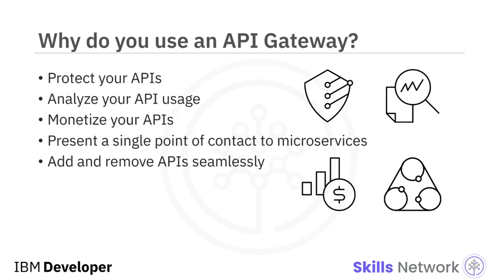
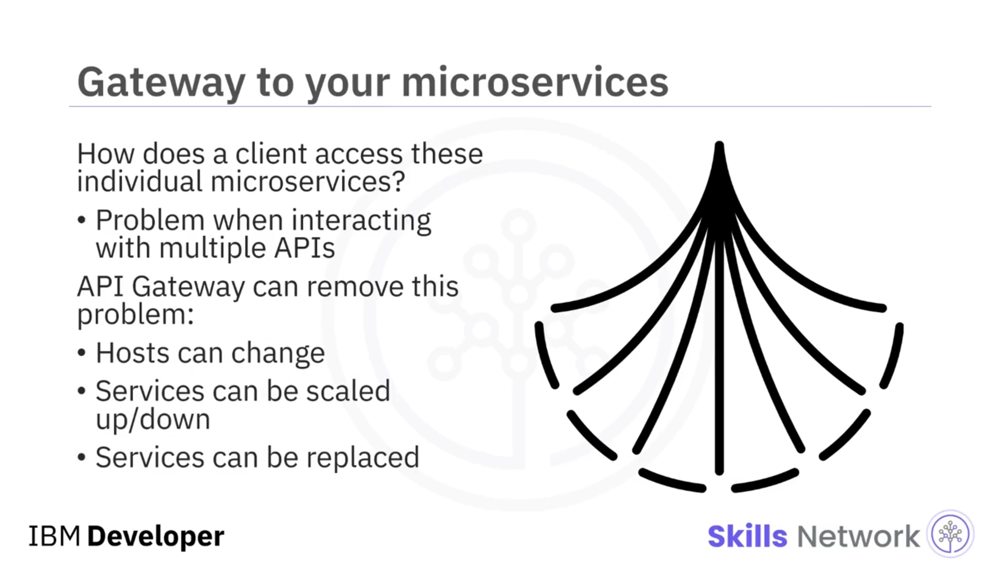
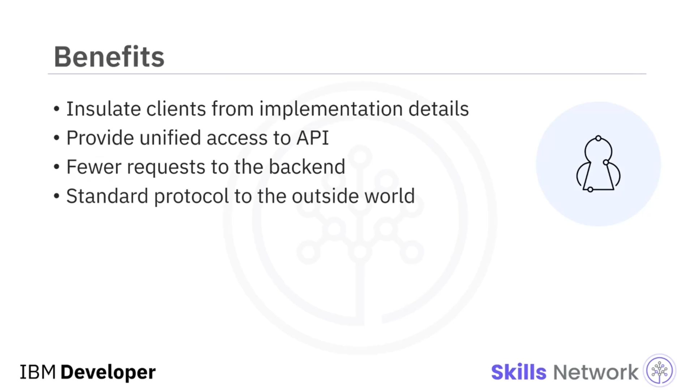
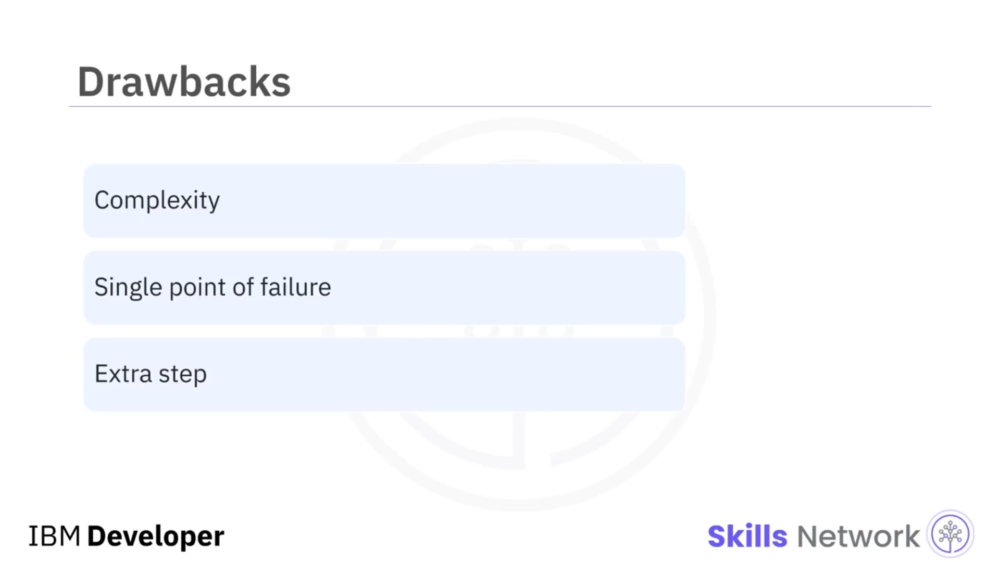
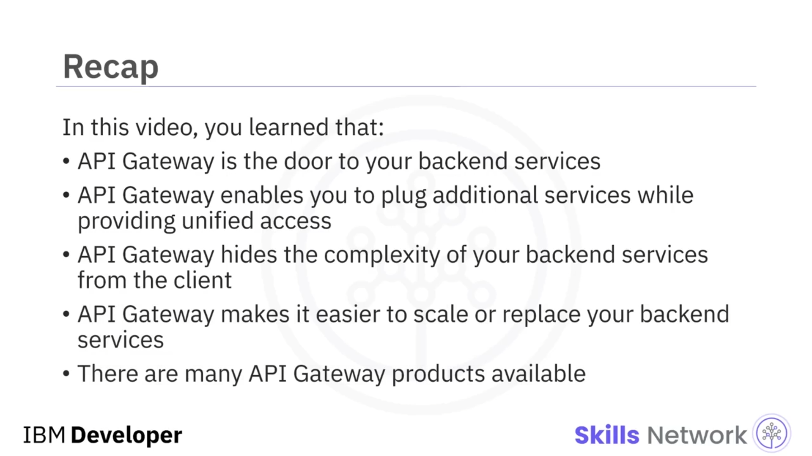

# 🚪 API Gateway’e Giriş

‘ *Introduction to API Gateway* ’e hoş geldiniz.

Bu videoyu izledikten sonra bir  *API Gateway* ’i açıklayabilecek, bir *API Gateway* kullanmanın faydalarını açıklayabilecek, bir *API Gateway* kullanmanın dezavantajlarını açıklayabilecek ve mevcut *API Gateway* ürünlerini tanımlayabileceksiniz.

---

## 🧱 API Gateway Nedir?

Bir  *API Gateway* , bir istemci ile bir dizi arka uç ( *backend* ) servisi arasında konumlanan bir API yönetim aracıdır.

İstekleri yerine getirmek için gereken çeşitli servisleri bir araya getirir ve uygun sonucu geri döndürür.

---

## 🛡️ API Gateway Neden Kullanılır?

Peki, neden bir *API Gateway* kullanırsınız?

Bir  *API Gateway* , API’lerinizi kötü niyetli kullanım veya aşırı kullanımdan korumanıza yardımcı olabilir. Bu sayede, hız sınırlama ( *rate limiting* ) ile birlikte bir kimlik doğrulama ( *authentication* ) servisi kullanabilirsiniz.

Ayrıca, bir analiz ( *analytics* ) ve izleme ( *monitoring* ) servisi kullanarak API’lerinizin nasıl kullanıldığını anlamanıza yardımcı olur.

Buna ek olarak, bir faturalandırma ( *billing* ) sistemi kullanarak API’lerinizi gelir elde edilebilir ( *monetize* ) hale getirebilirsiniz.

Bir gateway ayrıca çeşitli mikroservisleriniz için tek bir temas noktası sunar ve bir isteğe tek bir yanıt sağlar.

Son olarak, arka uçta hangi servislerin çalıştığına dair istemcinin bir bilgiye sahip olmasına gerek kalmadan API’leri sorunsuz bir şekilde ekleyebilir veya kaldırabilirsiniz.

---

## 🛒 Mikroservis Mimarili Online Mağaza Örneği

Çevrimiçi mağazanız mikroservis mimarisini izlediği için, bu servislerden bazıları şunlar olacaktır:

* Ürünle ilgili kimlik ( *id* ), ad ve fiyat gibi temel bilgileri paylaşan bir ürün bilgi servisi,
* Stokta nelerin mevcut olduğunu gösteren bir envanter servisi,
* Müşterilerin bir ürün için sipariş verebilmesini sağlayan bir sipariş servisi,
* Ve platformdaki kullanıcıları doğrulamak için bir kimlik doğrulama servisi.

Peki, bir istemci mikroservislere nasıl erişir?

Birden fazla API ile etkileşim kurmanız gerektiğinde bu bir sorun haline gelir.

---

## 🔁 API Gateway ile Esneklik ve Süreklilik

Bir *API Gateway* bu karmaşıklığı ortadan kaldırabilir ve size şunları yapma olanağı tanır:

* Hostları ve konumlarını değiştirmek,
* Servis instance (örnek) sayısını artırmak veya azaltmak,
* Ve mevcut servisinizi, örneğin bir sipariş servisini, yenisiyle değiştirmek.

İstemcinin servislere erişimi ise kesintiye uğramaz.

---

## ✅ API Gateway Kullanmanın Faydaları

Bir *API Gateway* kullanmanın faydaları şunlardır:

İstemcileri, uygulamanın mikroservislere nasıl bölündüğüne dair ayrıntılardan yalıtır.

Başka bir deyişle, birden fazla servisi çağırma mantığını istemciden alıp  *API Gateway* ’e taşıyarak istemci tarafını basitleştirir.

Ayrıca, istemcinin kim olduğundan bağımsız olarak her istemci için en uygun API’yi sağlar.

İstek veya gidiş–dönüş ( *round trip* ) sayısını azaltır.

Örneğin, bir *API Gateway* istemcilerin tek bir gidiş–dönüş ile birden fazla servisten veri almasını sağlar.

Ve mikroservislerinizin kendi aralarında nasıl iletişim kurduğundan bağımsız olarak, bir *API Gateway* dış dünya ile iletişim için standart bir protokol sunar.

---

## ⚠️ API Gateway’in Dezavantajları

Şimdi, bir *API Gateway* birçok fayda sağlasa da, bazı dezavantajlara da sahiptir.

Geliştirilmesi ve bakımının yapılması gereken başka bir bileşendir.

Ayrıca, dikkatli bir şekilde tasarlanmazsa bir uygulamada tek hata noktası ( *single point of failure* ) haline gelebilir.

Ayrıca, uygulamanın çalışması sırasında bu ek ağ adımı nedeniyle bir gateway, yanıt süresini artıracaktır.

---

## 🧩 Piyasadaki API Gateway Ürünleri

Piyasada kullanılabilir durumda çok sayıda *API Gateway* ürünü vardır.

Yönetilen ( *managed* ) veya açık kaynak ( *open-source* ) seçenekler arasından tercih yapabilirsiniz.

IBM’den, sektör lideri, yüksek güvenlikli bir uygulama gateway’i olan **IBM DataPower Gateway** bulunur.

Google, ihtiyaçlarınıza bağlı olarak iki teklif sunar: **Apigee** veya  **Cloud Endpoints** .

Microsoft Azure ve Amazon AWS de platformlarında gateway’ler sunar.

Ve bunlar yönetilen ürünler iken, açık kaynak dünyasında bazı ünlü isimler şunlardır:

* Popülerlikte listenin başında yer alan  **Kong** ,
* **Apache APISIX** ,
* Yönetilen bir versiyonu da bulunan  **Tyk** ,
* Ve son olarak, kurumsal ( *enterprise* ) bir sürümü de bulunan  **Gloo** .

---

## 🧾 Videoda Öğrendikleriniz

Bu videoda şunları öğrendiniz:

Bir  *API Gateway* , arka uç ( *backend* ) servislerinize açılan kapıdır; istemcinize servislerinize birleşik ( *unified* ) bir erişim sağlarken ek servisler bağlamanıza ( *plug* ) olanak tanır; arka uç servislerinizin karmaşıklığını istemciden gizler; arka uç servislerinizi ölçeklemeyi veya değiştirmeyi kolaylaştırır ve arasından seçim yapabileceğiniz çok sayıda yönetilen ve açık kaynak *API Gateway* ürünü vardır.

