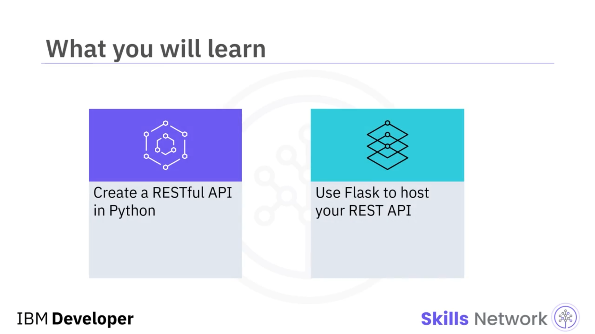
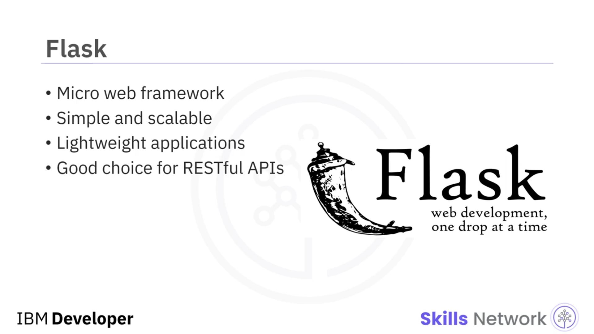
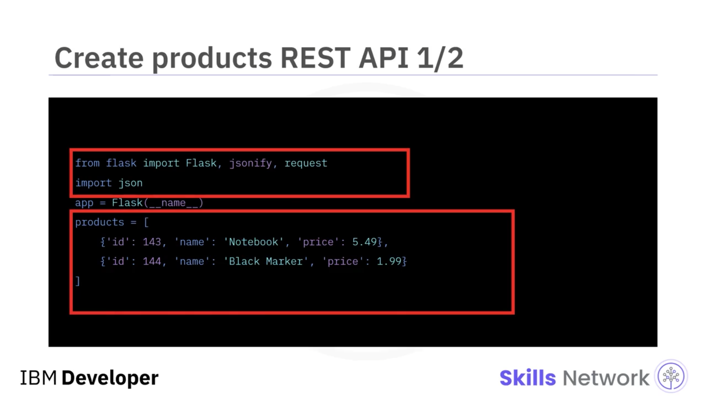

# 🚀 REST API'ler Oluşturma

## 🎯 Öğrenme Hedefleri ve Python'a Genel Bakış

‘Creating REST APIs’e hoş geldiniz.

Bu videoyu izledikten sonra şunları yapabileceksiniz: Python ile bir *RESTful API* oluşturmak ve Flask kullanarak *REST API*nizi barındırmak.

Python, daha hızlı çalışmanızı ve sistemlerinizi daha etkin biçimde entegre etmenizi sağlayan bir programlama dilidir.

Python birçok uygulama alanında kullanılır. Flask gibi framework'lerin yardımıyla Web geliştirmeyi destekler.

Python, matematik, bilim ve mühendislik için SciPy gibi kütüphanelerin yardımıyla bilimsel ve sayısal hesaplamada yaygın olarak kullanılır.

Python ayrıca Yapay Zeka ve makine öğrenimi topluluğu arasında da popüler bir tercihtir.

## 🧩 Flask ve Gerekli Araçlar

Flask, belirli araçlar veya kütüphaneler gerektirmediği için bir *micro web framework* olarak sınıflandırılır.

Ölçeklenebilirlik ve sadelik göz önünde bulundurularak geliştirilmiştir. Flask uygulamaları, diğer framework'lere kıyasla hafif yapılarıyla bilinir.

Flask hangi veritabanının veya şablon motorunun kullanılacağı konusunda katı bir görüşe sahip olmadığından, *RESTful API*ler için iyi bir seçimdir.

Bu modül için, Python paket yöneticisi olan *pip* ile birlikte  *Python 3* 'e ihtiyacınız vardır.

Python ve  *pip* 'in yüklü olduğunu doğruladıktan sonra, `pip install` komutuyla Flask'i kurmaya devam edebilirsiniz.

Önce, gösterilen içeriğe sahip `hello.py` dosyasını oluşturursunuz.

## ⚙️ Flask Sunucusunu Çalıştırma ve Hello World

Daha sonra bu Python dosyasını barındırmak için Flask sunucusunu çalıştırırsınız ve çıktı görüntülenir.

Bu ‘hello world’ web uygulamasını tarayıcıda, `127.0.0.1` adresine ve `5000` portuna giderek açtığınızda, “Hello World” yanıtını görürsünüz.

## 📦 products.py ve Ürün Uç Noktaları

Şimdi, ürünler mikro servisiniz için tüm uç noktaları sağlayacak olan `products.py` adlı yeni bir Python dosyası oluşturacaksınız.

İlk olarak, içe aktarımları ( *imports* ) tanımlayarak ve varsayılan ürün listenizi oluşturarak başlarsınız.

Bu ürünleri kalıcı hale getirmek için herhangi bir veritabanı kullanmıyorsunuz, bu nedenle API'yi her yeniden başlattığınızda aynı ürün listesiyle başlarsınız.

Sonrasında, tüm ürünleri almak için *GET* metodunu tanımlarsınız.

Ve bu metod dolaylı olarak `200` döndürür; bu da HTTP'de *OK* anlamına gelir.

## ✅ Bu Videoda Öğrendikleriniz

Bu videoda şunları öğrendiniz: Flask, Python web uygulamalarını barındırmak için kullanılan bir *micro web framework*tür; Python kullanarak ilk *RESTful API*nizi bir mikro servis olarak oluşturabilirsiniz ve ilk *RESTful API*nizi Flask kullanarak barındırabilirsiniz.

