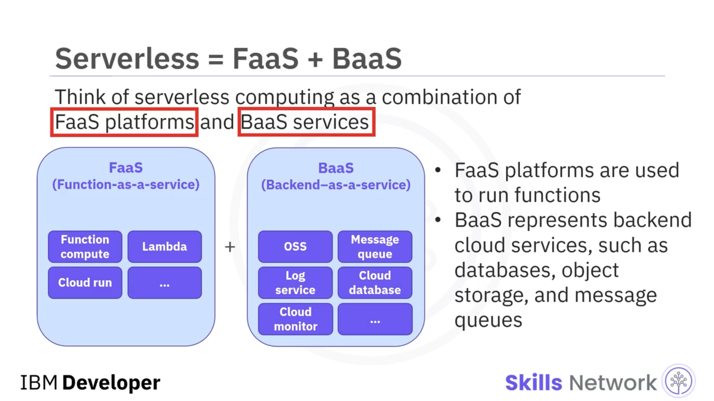
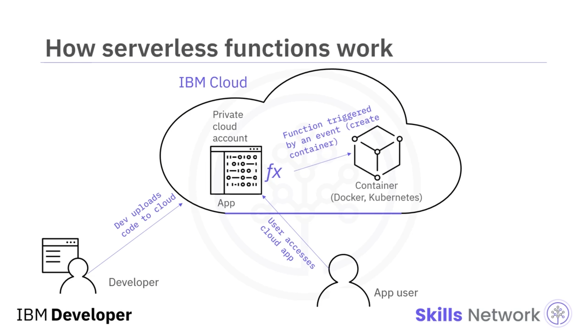
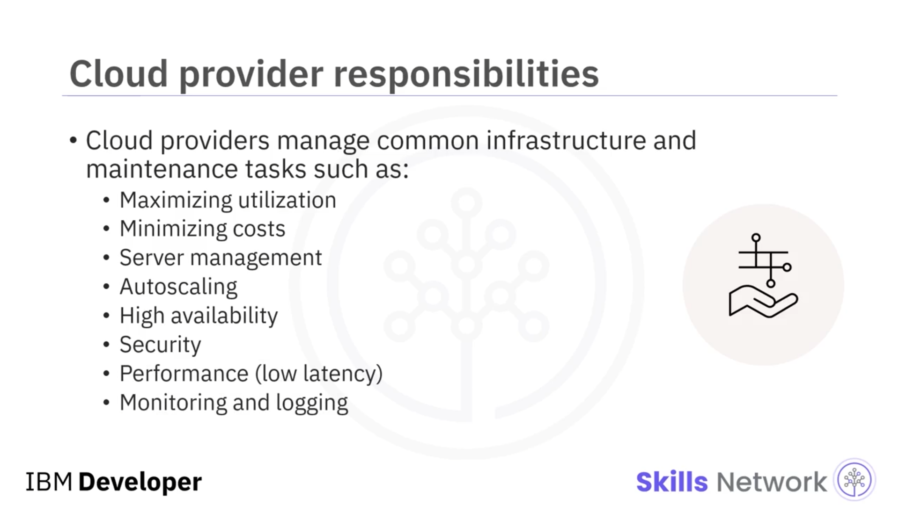
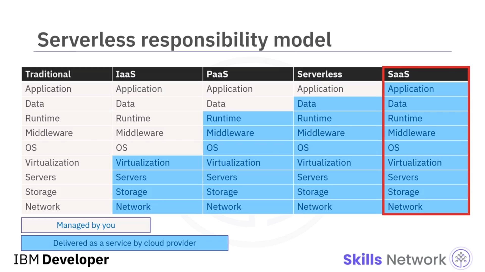

# ☁️ Sunucusuz Hesaplamaya Giriş

## 🎯 Öğrenme Hedefleri

“Sunucusuz Hesaplamaya Giriş”e hoş geldiniz.

Bu videoyu izledikten sonra şunları yapabileceksiniz: *sunucusuz hesaplama* kavramını tanımlamak ve açıklamak ve sunucusuz hesaplamanın temel özelliklerini belirlemek.

---

## 📚 CNCF’ye Göre Sunucusuz Hesaplamanın Tanımı

Bulut Yerel Hesaplama Vakfı (Cloud Native Computing Foundation – CNCF), sunucusuzu şu şekilde tanımlar:

“Sunucu yönetimi gerektirmeyen uygulamalar oluşturma ve çalıştırma kavramı.”

Ayrıca, “uygulamaların bir veya daha fazla fonksiyon olarak paketlenip bir platforma yüklendiği ve ardından o anda ihtiyaç duyulan tam talebe yanıt olarak yürütüldüğü, ölçeklendirildiği ve faturalandırıldığı daha ince taneli bir dağıtım modeli”ni ifade eder.

Başka bir deyişle, sunucusuz hesaplama, altyapı yönetimi sorumluluğunu bulut sağlayıcılarına devreder ve geliştiricilerin uygulama iş mantığına odaklanmalarını sağlar.

---

## 🧩 Sunucusuz: FaaS ve BaaS Bileşimi

Sunucusuz hesaplamayı, *function-as-a-service* ( *FaaS* ) platformları ile *backend-as-a-service* ( *BaaS* ) hizmetlerinin bir kombinasyonu olarak düşünebilirsiniz.

FaaS platformları, fonksiyonları çalıştırmak için kullanılır.

BaaS ise bulut veritabanları, nesne depolama hizmetleri ve mesaj kuyrukları gibi arka uç bulut hizmetlerini temsil eder.

---

## 🕰️ BT Hesaplamanın Evrimi: Gelenekselden Sunucusuza

BT hesaplama tarihçesi, geleneksel hesaplamadan sunucusuz hesaplamaya doğru, daha hızlı dağıtımlar, daha kısa yaşam süreleri ve artan üretkenlik ile sonuçlanan ilerleyici bir eğilim gösterir.

Bu evrimsel eğilimi birkaç kilometre taşı işaretler:

Geleneksel hesaplama, fiziksel makineler kullanır; ancak peşin yatırımlar, kapasite planlama ve benzeri unsurlar tarafından engellenir. Fiziksel makinelerin dağıtıma alınması haftalar veya aylar sürer ve ömürleri birkaç yıl kadardır.

Sanallaştırma teknolojisi, daha hızlı sağlama, yüksek ölçeklenebilirlik ve kullanılabilirlik için bulut bilişimde uygulanır. Sanallaştırma, birden çok sanal makine (VM) veya konteyner oluşturmayı kolaylaştırır. Sanal makinelerin dağıtıma alınması dakikalar sürer ve ömürleri günler veya haftalar mertebesindedir.

Konteynerler, işletim sistemi sanallaştırmasına dayanır; dağıtıma alınmaları saniyeler sürer ve dakikalar veya saatler boyunca çalışırlar.

Sunucusuz uygulamalar ise çekirdek kod için yalnızca sunucusuz mimari gerektirir. Sunucusuz fonksiyonlar milisaniyelerde dağıtıma alınır ve yaşam süreleri saniyeler kadardır.

---

## 🏗️ Sunucusuz Hesaplama ve Bulut Bilişim

Sunucusuz hesaplama, hem altyapıyı hem de yazılım ortamlarını soyutlayan standart bulut bilişimin gelişmiş bir halidir.

Kodun bir bulut platformu üzerinde çalıştığı ve donanım ile yazılım kurulumu, güvenlik, ölçeklenebilirlik vb. gibi konularla bulut sağlayıcısının ilgilendiği bir mimari stildir.

İstemci, yalnızca kullanım için faturalandırılır; CPU’nun boşta kaldığı süreler için değil.

Ve geliştiricilerin yalnızca fonksiyonlar biçimindeki uygulama kodlarına odaklanmaları gerekir.

---

## 🔎 Sunucusuz Hesaplamanın Temel Özellikleri

Sunucusuz hesaplama aşağıdaki özellikleri sergiler:

Hostless’tır; yani geliştiricilerin sunucu tedarik etmesi, yönetmesi ve bakımını yapması gerekmez.

Elastiktir; çünkü otomatik ölçeklendirme sunucusuz için içkin ve anlıktır.

Gelen trafiği birden fazla arka uç sistem arasında dağıtan otomatik yük dengeleme sunar.

Durumsuzdur; bu da daha hızlı performans ve daha yüksek ölçeklenebilirlik sağlar.

Olay güdümlüdür; yani fonksiyonlar yalnızca olaylar gerçekleştiğinde tetiklenir.

Ek çaba veya maliyet olmadan yüksek erişilebilirlik sağlar.

Ve ayrıntılı (granüler) faturalandırma ile kullanıma dayalıdır.

---

## ⚙️ Sunucusuz Dünyada Fonksiyonların Çalışma Şekli

Peki fonksiyonlar sunucusuz bir dünyada nasıl çalışır? Örneğin bir Docker veya Kubernetes konteyneri oluşturmak için gereken adımları düşünün.

Geliştirici, bulut sağlayıcısı tarafından desteklenen Python, Java, Node.js, C# veya Go gibi bir dilde kod yazarak bir fonksiyon oluşturur.

Ardından geliştirici fonksiyonu buluta yükler. Sonrasında, kullanıcı tıklaması gibi, fonksiyonu tetikleyen olaylar tanımlanır.

Olay gerçekleştiğinde tetikleyici çağrılır ve bulut sağlayıcısı fonksiyonu çalıştırır; bunun sonucunda konteyner nesnesi ortaya çıkar.

Geliştiricilerin daha fazla zamanını yüksek kaliteli ve optimize edilmiş uygulamalar oluşturmaya ayırması, kurumlar için büyük fayda sağlar.

---

## 🚀 Geliştiriciler için Avantajlar

Geliştiriciler, fonksiyonları herhangi bir popüler programlama dilini kullanarak oluşturabilir, ek özellikler ekleyerek uygulamaların işlevselliğini genişletebilir, fonksiyonlar aynı anda yalnızca tek bir görev gerçekleştirdiği için daha iyi testler yapabilir, uygulamaları ve fonksiyonları optimize edebilir ve kullanıcı deneyimini iyileştirebilir.

---

## 🛡️ Bulut Sağlayıcının Operasyonel Sorumlulukları

Sıfır operasyonel kaygı hedefine ulaşmak için bulut sağlayıcıları, rutin altyapı yönetimi ve bakım görevlerinin sorumluluğunu üstlenir. Buna, maliyetleri en aza indirirken işlemci, bellek ve ağ kullanımını en üst düzeye çıkarmak; işletim sistemi güncellemeleri ve güvenlik yamalarını içeren sunucu yönetimi sağlamak; otomatik ölçeklendirmeyi etkinleştirmek; yüksek erişilebilirliği sürdürmek; güvenliği uygulamak; yüksek performans (veya düşük gecikme) yapılandırmak ve izleme ile günlük kaydını (logging) kurmak dahildir.

---

## 🧱 Bulut Hizmet Modelleri ve Sorumluluk Dağılımı

Şimdi, bu şekilde gösterilen farklı bulut hizmet modellerini karşılaştırırken, sizin sorumluluklarınız ile bulut sağlayıcısının sorumluluklarına bakalım; özellikle de sunucusuz hizmet modeli açısından.

En soldaki yığından (geleneksel) başlarız; bu yığın tamamen sizin tarafınızdan yönetilir.

*IaaS* modelinde, işletim sisteminden yukarıya kadar olan katmanları siz yönetirsiniz; bulut sağlayıcısı ise alttaki dört katmanı yönetir.

*PaaS* modelinde, Uygulama (Application) ve Veri (Data) olan ilk iki katmanı siz yönetirsiniz; bulut sağlayıcısı kalan katmanları yönetir.

*Serverless* modelinde, yalnızca Uygulama katmanını siz yönetirsiniz; bulut sağlayıcısı geri kalan katmanların tamamını yönetir.

Ve *SaaS* modelinde, bulut sağlayıcısı tüm yığını yönetir.

---

## ✅ Özet

Bu videoda şunları öğrendiniz:

Sunucusuz, sunucu yönetimi gerektirmeyen uygulamalar oluşturma ve çalıştırma kavramıdır.

Sunucusuz hesaplama, BaaS hizmetlerini ve FaaS platformlarını kullanır.

BT hesaplama tarihçesi, gelenekselden sunucusuz hesaplamaya doğru artan bir üretkenlik eğilimi gösterir.

Sunucusuz hesaplama ile bulut sağlayıcıları; sunucu yönetimi, işletim sistemi güncellemeleri, güvenlik yamaları ve izleme gibi altyapı yönetimi görevlerini üstlenir.

Sunucusuz hesaplama, geliştiricilerin uygulamalara ve koda odaklanmasını sağlar.

Ve son olarak, kullanıcılar yalnızca kullanım için faturalandırılır; CPU’nun boşta olduğu süreler için değil.

