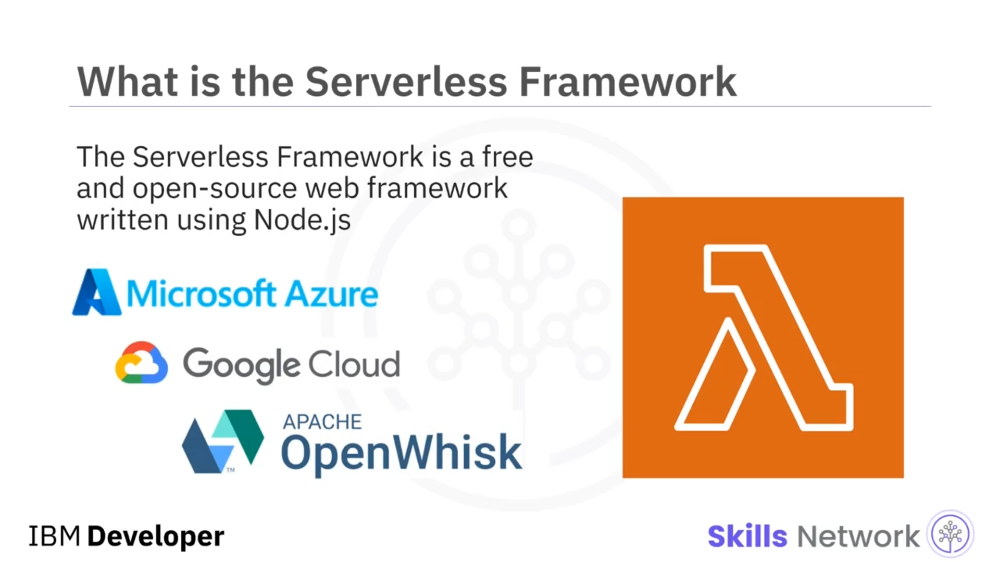
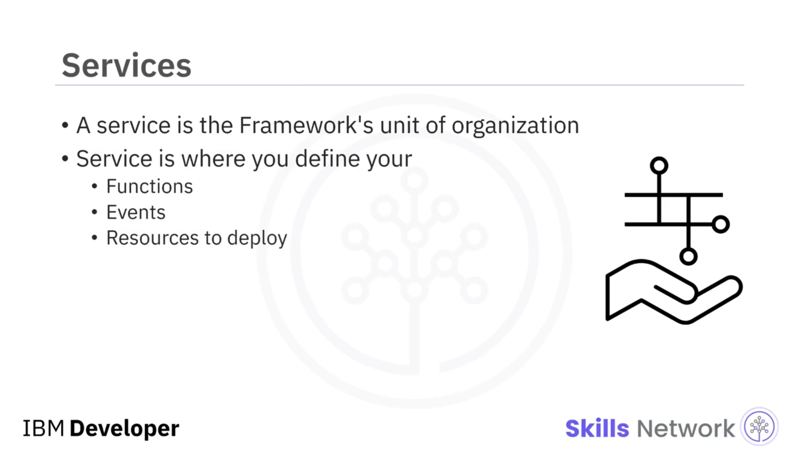
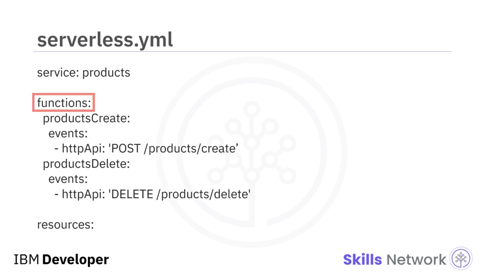
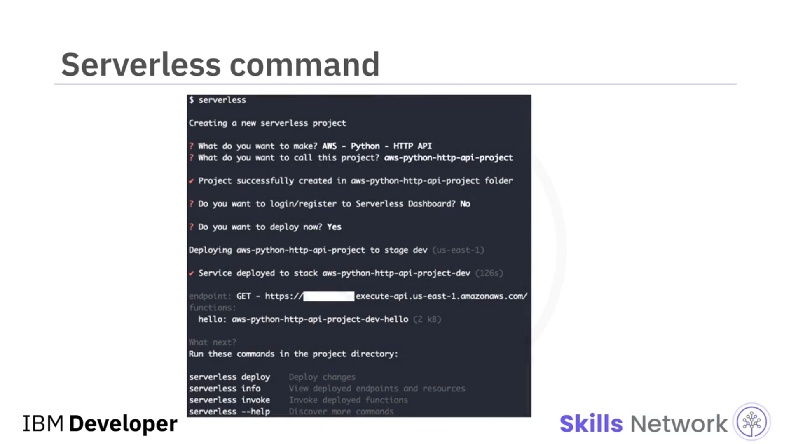
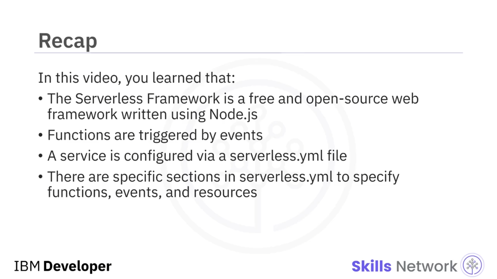

# ⚙️ Serverless Framework’e Giriş

## 🎯 Öğrenme hedefleri ve genel tanım

‘The Serverless Framework’e hoş geldiniz. Bu videoyu izledikten sonra,  *Serverless Framework* ’ü tanımlayabilecek, temel bir *Serverless* fonksiyonunun nasıl oluşturulacağını açıklayabilecek ve bir *Serverless* fonksiyonunun nasıl test edileceğini açıklayabileceksiniz.

 *Serverless Framework* , *Node.js* kullanılarak yazılmış, ücretsiz ve açık kaynaklı bir web çatısıdır ( *web framework* ). İlk olarak Amazon Web Services veya *AWS* Lambda fonksiyonlarınızı ( *Lambda Functions* ), olaylarınızı ( *Events* ) ve altyapı kaynaklarınızı ( *infrastructure Resources* ) güvenli ve hızlı bir şekilde hazırlamak ( *provision* ) için tasarlanmıştır.

Ancak yalnızca AWS ile sınırlı değildir. Desteklenen diğer sağlayıcılar şunlardır: Microsoft Azure, Google Cloud Platform ve Apache OpenWhisk.  *Serverless Framework* , size hazır olarak yapı, otomasyon ve en iyi uygulamaları sunan bir komut satırı arayüzü ( *CLI* ) olup; fonksiyonlar, olaylar, kaynaklar ve servislerden oluşan, gelişmiş, olay güdümlü, *serverless* mimariler kurmaya odaklanabilmenizi sağlar.

---

## 🧩 Fonksiyonlar, olaylar, kaynaklar ve servisler

Şimdi, bir fonksiyon aslında buluta dağıtılmış, çoğunlukla tek bir görev yerine getirmek için yazılmış koddur. Her fonksiyon, bir mikroservise benzer şekilde, yürütme ve dağıtım açısından bağımsız bir birimdir. Bir görev, bir kullanıcının veritabanına kaydedilmesi ya da belirli bir zamanda gerçekleştirilecek bir işin yürütülmesi olabilir.

Fonksiyonlar, olaylar tarafından tetiklenir ve olaylar da başka kaynaklardan gelir; örneğin bir API Gateway URL’sine gelen bir HTTP isteği ya da bir S3 kovasına ( *S3 bucket* ) yüklenen yeni bir dosya.

Kaynaklar, fonksiyonlarınızın kullandığı altyapı bileşenleridir; bulut sağlayıcınız tarafından size hizmet olarak sunulan bir veritabanı ya da dosya depolamak için kullanılan bir S3 kovası gibi.

Bir servis ( *service* ), Framework’ün organizasyon birimidir. Bunu bir proje dosyası gibi düşünebilirsiniz, ancak tek bir uygulama için birden fazla servise sahip olabilirsiniz.

---

## 🗂️ `serverless.yml` ile servis yapılandırması ve Hello World uygulaması

Bir servis, dağıtılacak fonksiyonlarınızı, olaylarınızı ve kaynaklarınızı tanımladığınız `serverless.yml` dosyası üzerinden yapılandırılır. Ve Framework *CLI* ile dağıtım yaparken, yapılandırma dosyasındaki her şey aynı anda dağıtılır. `serverless.yml` dosyası, servisinizdeki her şeyi kontrol eder. `serverless.yml` içinde fonksiyonları, olayları ve kaynakları belirtmek için kullanılan belirli bölümler vardır.

Şimdi, AWS üzerinde *Serverless Framework* kullanarak bir Hello World uygulaması oluşturalım ve dağıtalım. Bu demo için AWS kimlik bilgilerini zaten yapılandırmış durumdasınız. Öncelikle, `serverless`  *CLI* ’sine ihtiyacınız vardır; bunu `npm` kullanarak global olarak kurabilir, ardından Python kullanarak ilk AWS HTTP API’nizi oluşturmak için `serverless` komutunu çalıştırabilirsiniz.

---

## ✅ Komut sihirbazı, Hello World çıktısı ve video özeti

Bu komut sizi bir sihirbazdan geçirecek ve dağıtım tamamlandığında size bir URL sağlayacaktır. Bunu tarayıcıda açarsanız, gösterildiği gibi bir çıktı göreceksiniz. Fonksiyon kodunu, isteğe yanıt olarak *Hello World* dönecek şekilde değiştirdiniz. Ardından basitçe yeniden dağıtım yapabilir ve tekrar test edebilirsiniz.

Bu videoda şunları öğrendiniz:  *Serverless Framework* , *Node.js* kullanılarak yazılmış, ücretsiz ve açık kaynaklı bir web çatısıdır. Fonksiyonlar, olaylar tarafından tetiklenir. Bir servis, `serverless.yml` dosyası aracılığıyla yapılandırılır. Ve `serverless.yml` içinde fonksiyonları, olayları ve kaynakları belirtmek için kullanılan belirli bölümler vardır.

