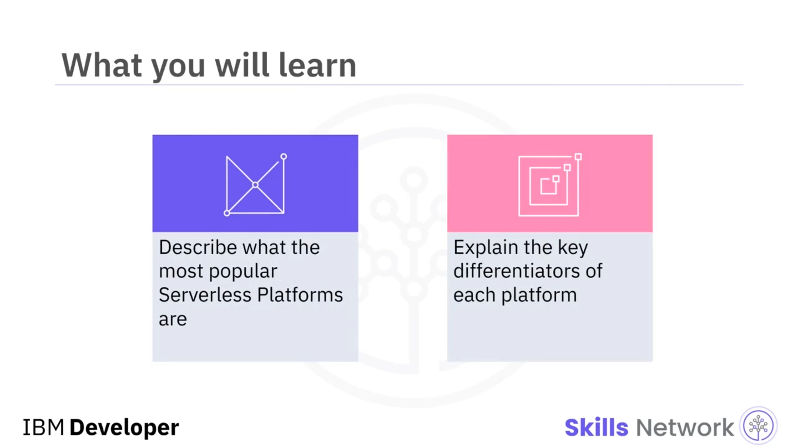
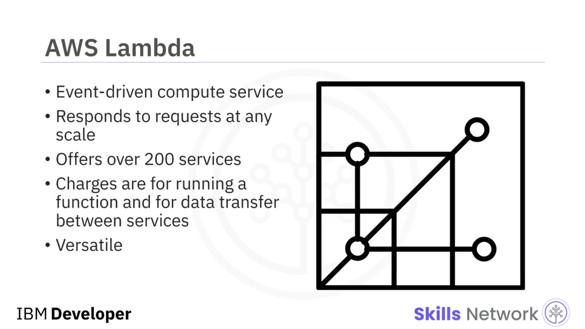
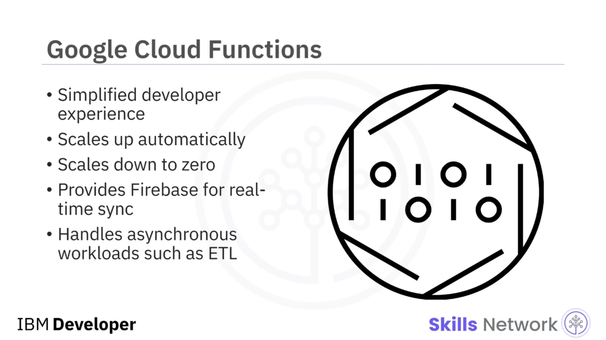
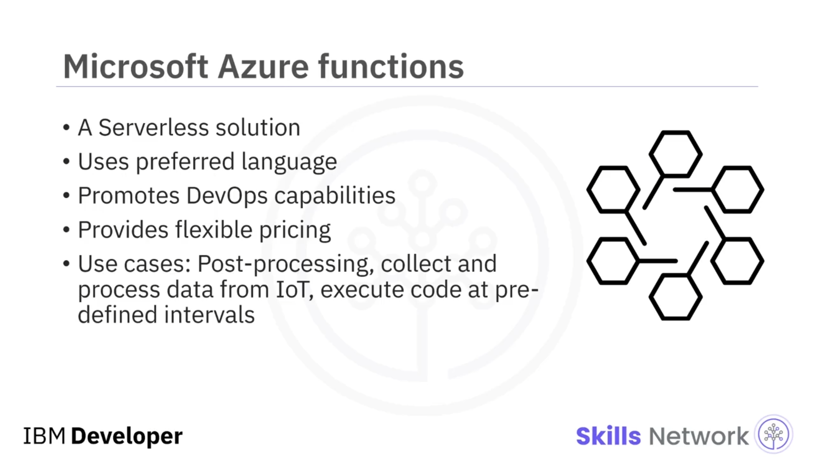
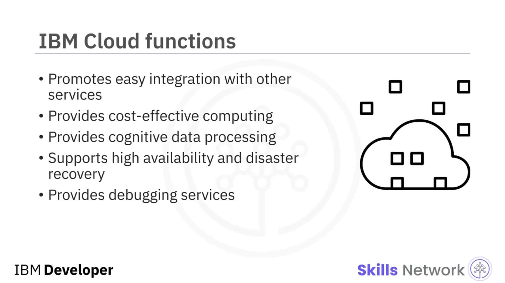
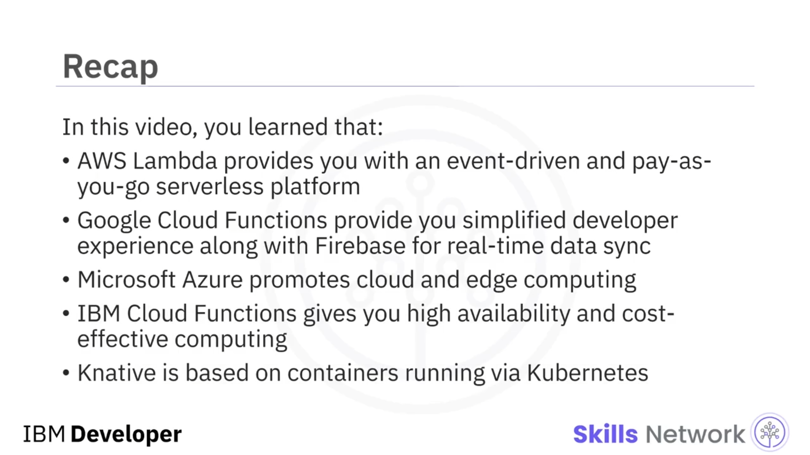

# ⚙️ Popüler Serverless Platformlar

## 🎬 Giriş

“Popüler Serverless Platformlar”a hoş geldiniz.

Bu videoyu izledikten sonra, en popüler *serverless* platformların neler olduğunu açıklayabilecek ve her bir platformun temel ayırt edici özelliklerini anlatabileceksiniz.

---

## 🟧 Amazon Web Services (AWS) Lambda

Amazon Web Services (AWS) Lambda, Amazon'un  *serverless* , olay odaklı bir bilişim hizmetidir.

Bu hizmet, herhangi bir uygulama veya arka uç ( *back-end* ) hizmeti için sunucu sağlama veya yönetme gereksinimi olmadan kod çalıştırmanızı sağlar.

Günde birkaç olaydan saniyede yüz binlerce olaya kadar her ölçekteki yürütme isteğine otomatik olarak yanıt verebilir.

AWS, platformu üzerinden iki yüz farklı hizmet sunar.

Yalnızca bir fonksiyonu çalıştırma süresi ve Lambda ile diğer AWS hizmetleri arasındaki veri aktarımı için ücretlendirilirsiniz.

Ayrıca dosya işleme, web uygulamaları, nesnelerin interneti (*Internet of Things* veya  *IoT* ) ve mobil arka uçlar ( *mobile back-ends* ) gibi çok çeşitli kullanım senaryolarında da kullanılabilir.

---

## ☁️ Google Cloud Function ve Firebase

Sonraki olarak, Google Cloud Function, basit ve sezgisel bir geliştirici deneyimi sunar.

Sadece kodunuzu yazarsınız ve operasyonel altyapıyı Google Cloud'un yönetmesine izin verirsiniz.

Trafiğe bağlı olarak otomatik biçimde ölçeği anında artırıp sıfıra kadar düşürerek tüm altyapı yönetimini soyutlar.

Google Firebase, verileri güncellendiğinde geliştiricileri anında uyarır.

Hafif veri çıkarma, dönüştürme ve yükleme ( *extract, transform, load – ETL* ) fonksiyonları gibi eşzamansız iş yükleri için ayrı sunucular gerekmemektedir.

Seçtiğiniz olaya bağlı bir fonksiyonu doğrudan dağıtabilir ve bu fonksiyonun tetiklendiğinde yürütülmesini sağlayabilirsiniz.

---

## 🔷 Microsoft Azure Functions

Şimdi, Azure daha az kod yazmanıza, daha az altyapı bakımına ihtiyaç duymanıza ve maliyet tasarrufu sağlamanıza imkân tanıyan bir *serverless* çözümdür.

Fonksiyonları C#, Java, JavaScript, PowerShell veya Python ile yazabilir ya da özel bir işleyici ( *custom handler* ) kullanarak neredeyse herhangi bir başka dili kullanabilirsiniz.

Microsoft Azure, sürekli entegrasyon ve teslimat ( *continuous integration and delivery* ) için kolay bir kurulum sunarak, mükemmel Geliştirici Operasyonları (*Developer Operations* veya  *DevOps* ) yeteneklerini öne çıkarır.

Bu yetenek Azure Functions için de geçerlidir.

Consumption planı ile yalnızca fonksiyonlarınız çalıştığı süre boyunca ödeme yaparsınız; Premium ve App Service planları ise özel ihtiyaçlar için ek özellikler sunar.

Azure Functions için birçok farklı kullanım senaryosu vardır; örneğin, bir dosya blob depolamaya yüklendiğinde veya orada değiştiğinde kod çalıştırmak, IoT cihazlarından veri toplamak ve işlemek ya da önceden tanımlanmış zaman aralıklarında kod yürütmek gibi.

---

## 🧠 IBM Cloud Functions ve IBM Watson

IBM Cloud Functions, eylemlerinizi olaylardan veya doğrudan bir REST API aracılığıyla tetiklemenize olanak tanıyarak diğer hizmetlerinizle kolay entegrasyonu teşvik eder.

IBM Cloud Functions ile, kullanım süreniz için, bir saniyenin onda birine kadar hassasiyetle yalnızca kullandığınız süre kadar ödeme yaparsınız.

IBM Cloud Functions'ın bir parçası da IBM Watson'un güçlü bilişsel ( *cognitive* ) servisidir.

Örneğin, görüntülerde veya videolarda görünen nesneleri ya da insanları tespit etmek için kullanılabilir.

Cloud Function, birden fazla IBM Cloud bölgesinde kullanılabilir durumdadır.

Tek bir hata noktasından kaçınmak için yüksek erişilebilirliği ( *high availability* ) destekler.

Eylem kodları gibi müşteri verileri, farklı bölgeler arasında otomatik olarak eşitlenir.

---

## 🧪 Serverless Uygulamalarda Hata Ayıklama

Üretim ortamındaki *serverless* uygulamaları hata ayıklamak zor olabilir; çünkü kodunuzu çalıştıran çalışma zamanı ( *runtime* ) ortamına ve altyapıya erişim yoktur.

Ortam erişimi için IBM, LogDNA ile Log Analysis ve metrikler için IBM Cloud Monitoring sağlar.

---

## 📦 Knative ve Kubernetes Tabanlı Serverless

Artık çoğu platformun belirli sağlayıcıları vardır.

Ayrıca açık kaynaklı geliştirme seçeneğiniz de vardır.

Bu seçeneklerden biri Knative'dir.

Knative, konteynerler için bir orkestrasyon çerçevesi olan *Kubernetes* üzerinden çalışan konteynerlere dayanır.

Knative'in diğer *serverless* platformlara göre avantajı, *Kubernetes* üzerinde geliştirilmiş bir platform sunarak sağlayıcı bağımlılığını ( *vendor lock-in* ) önlemesidir.

Bu platformu,  *Kubernetes* 'i destekleyen herhangi bir bulut ortamına hiçbir değişiklik yapmadan dağıtabilirsiniz.

Bu da onu platformdan bağımsız ( *platform-agnostic* ) hâle getirir.

Ayrıca, gereksinimlerinize bağlı bir yaygınlaştırma ( *rollout* ) stratejisi belirlemenize imkân tanır; bunu, trafiği *serverless* bileşeninizin en son revizyonuna kademeli olarak kaydırarak gerçekleştirirsiniz.

---

## 📌 Özet

Bu videoda şunları öğrendiniz:

AWS Lambda, size olay odaklı ve kullandıkça öde ( *pay-as-you-go* ) modeliyle çalışan bir *serverless* platform sunar.

Google Cloud Functions, gerçek zamanlı veri eşitleme için Firebase ile birlikte sadeleştirilmiş bir geliştirici deneyimi sağlar.

Microsoft Azure, bulut ve *edge computing* olanaklarını öne çıkarır.

IBM Cloud Functions, yüksek erişilebilirlik ve maliyet etkin ( *cost-effective* ) hesaplama imkânı sunar.

Ve Knative, *Kubernetes* üzerinden çalışan konteynerlere dayanır.

