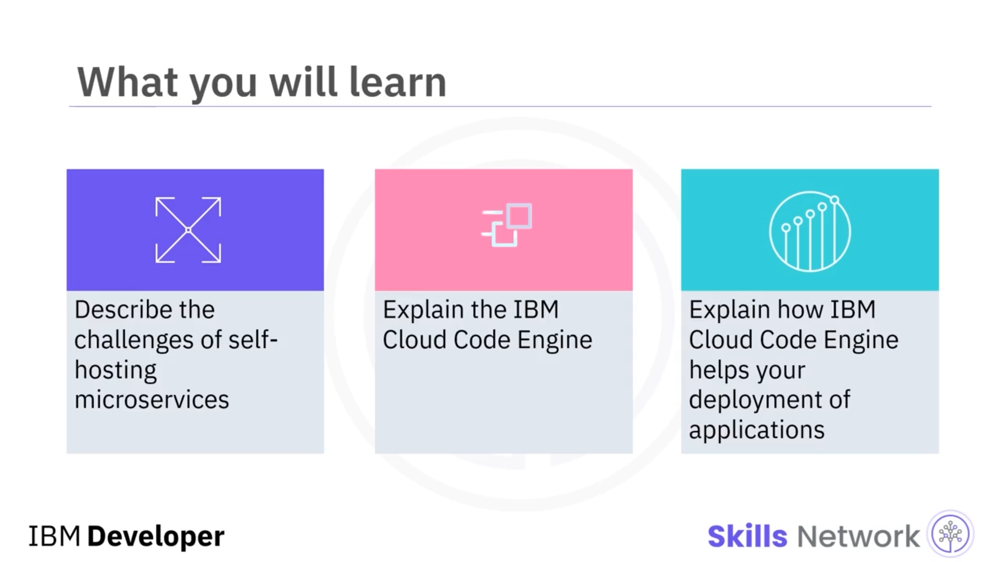
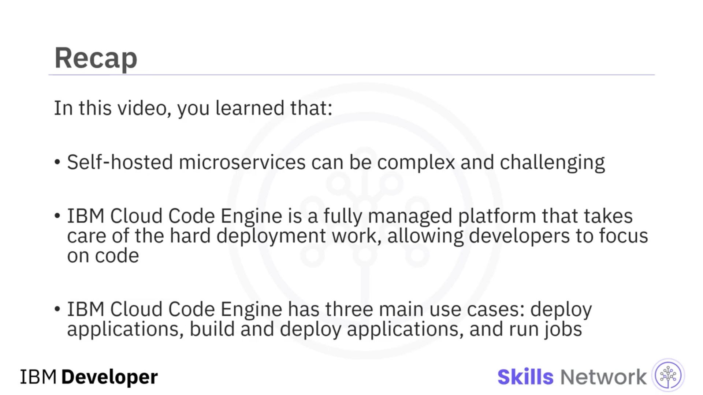

# 🚀 IBM Cloud Code Engine

## 📺 Giriş ve Öğrenme Hedefleri

‘IBM Cloud Code Engine’e hoş geldiniz.

Bu videoyu izledikten sonra, mikroservisleri kendi başınıza barındırmanın zorluklarını tanımlayabilecek, *IBM Cloud Code Engine*i açıklayabilecek ve  *IBM Cloud Code Engine* 'in uygulamalarınızın dağıtımına nasıl yardımcı olduğunu açıklayabileceksiniz.

---

## ⚙️ Kendi Kendine Barındırılan Mikroservislerin Zorlukları

Mikroservislerinizi yerel olarak başarıyla oluşturup test ettikten sonra, bunları dağıtmanız gerekir. Mikroservislerinizi kendi altyapınızda barındırmayı seçerseniz, ayrıntılı ayarlamalar yapmanız ve azımsanmayacak pek çok zorlukla dikkatli bir şekilde başa çıkmanız gerekir.

Öncelikle, kütüphane bağımlılıkları, kaynaklar, kimlik bilgileri ve benzeri gerekli öğeleri de içerecek şekilde mikroservislerinizi üretim ortamına hazır hâle getirmek için bilinçli olarak yapılandırmanız ve derleyip inşa etmeniz gerekir. Ardından, barındırma ortamlarında çalıştırılmak üzere bunları tek bir çalıştırılabilir ikili ( *binary* ) hâline derleyip inşa etmeniz gerekir.

Sonrasında,  *web sunucuları* , işletim sistemleri, ağlar, veritabanları ve benzeri bileşenler gibi mikroservislerinizi çalıştıracak altyapıyı dikkatle seçmeniz gerekir. Ekibinizin, çok sayıda seçenek arasından dikkatle seçim yapması gerekir.

Mikroservisleriniz değişken trafikle karşılaştığından, kapasiteyi dinamik olarak artırmanız veya azaltmanız gerekir. Örneğin, e-ticaret siteleri tatil dönemlerinde her zaman en yüksek trafik seviyelerine ulaşır ve bu trafik, birkaç gün veya bir hafta sonra önemli ölçüde azalabilir.

Çoğu durumda, birlikte çalışan ve iletişim kuran, birbiriyle ilişkili birden çok mikroservisi dağıtmanız gerekir. Mikroservisler arasındaki iletişimin güvenilir ve güvenli olması gerekir. Ve son olarak, tüm mikroservislerin kararlı olduğundan emin olmak ve üretim sorunlarının tespit edilebilmesi, hatta öngörülebilmesi için günlükleme ( *logging* ), izleme ( *monitoring* ) ve panolar ( *dashboard* 'lar) üzerinde çalışma gibi faaliyetler de gereklidir.

Ayrıca, mikroservislerin gerçekleştirilme ve inşa edilme biçimine bağlı olan ve onlara özgü başka, kendi ortamınızda barındırma zorlukları da olabilir.

---

## 🐍 Python Tabanlı Bir Mikroservisin Dağıtımı

Şimdi, Python tabanlı bir mikroservisin nasıl dağıtılabileceğine dair daha somut bir örnek göreceksiniz. Diyelim ki bir Python tabanlı mikroservis geliştirdiniz; bu,  *Flask* , *Django* ya da herhangi başka bir Python web uygulaması olabilir. Bu mikroservis, gerekli hizmeti doğrudan sunmaya başlayamaz.

Mikroservisinizi çağırmak için bir *web sunucusu arayüzüne* veya giriş noktasına ihtiyaç duyar. Python tabanlı mikroservisler için kullanılabilen iki ana arayüz türü vardır:

* *Web Server Gateway Interface* veya  *WSGI* , web sunucuları ile web uygulamaları ya da mikroservisler arasındaki iletişim için temel Python standardıdır.
* Ve adından da anlaşılacağı üzere, yalnızca eşzamanlı hizmet çağrılarını destekler.

*Green Unicorn* ve *uWSGI* gibi birçok popüler WSGI web sunucusu vardır. Gereksinimlerinize en uygun olanın hangisi olduğuna karar vermeniz gerekir.

*Asynchronous Server Gateway Interface* veya  *ASGI* , bir diğer web sunucusu arayüzüdür. WSGI'den temel farkı, mikroservisinizin eşzamansız olarak çağrılabilmesi için eşzamansız kodu desteklemesidir. *Daphne* ve  *Hypercorn* , popüler ASGI web sunucularından bazılarıdır.

Hem WSGI hem de ASGI web sunucularının, belirli bir tür altyapı üzerinde çalışması gerekir. Hizmet gereksinimlerinize veya anlaşmalarınıza bağlı olarak bu altyapı bir dizüstü bilgisayar, adanmış bir iş istasyonu ya da yüzlerce işlem ve veri düğümüne sahip karmaşık bir küme olabilir.

Görülebileceği gibi, bir mikroservisi üretim ortamına dağıtmak için birçok ödün vermeniz ve ciddi çaba harcamanız gerekecektir.

---

## ☁️ IBM Cloud Code Engine'e Genel Bakış

Neyse ki, artık mikroservisleri bulut platformlarında minimum çabayla dağıtabilirsiniz. Şimdi, mikroservislerinizi kolayca dağıtmanız için kapsamlı ve güçlü bir platform olan *IBM Cloud Code Engine*i tanıtalım.

*IBM Cloud Code Engine* ya da kısaca  *Code Engine* , geliştiricilerin kod geliştirmeye odaklanabilmesi için iş yüklerini oluşturma, dağıtma ve yönetmeye ilişkin operasyonel yükü soyutlar.  *IBM Cloud Code Engine* 'in temel amacı, geliştiricilerin dağıtım yükünü hafifletmektir. Onun sayesinde geliştiriciler kodlarını bulut platformuna gönderebilir ve altyapıyı göz ardı edebilir.

 *IBM Cloud Code Engine* , tamamen yönetilen, sunucusuz ( *serverless* ) bir platform olarak görülebilir. Bu platform,  *Platform as a Service (PaaS)* , *Containers as a Service (CaaS)* ve sunucusuz dağıtım modelleri tarafından ihtiyaç duyulan tüm özellikleri bir araya getirir.

---

## 🧩 IBM Cloud Code Engine Kullanım Senaryoları

 *IBM Cloud Code Engine* , mikroservisler, web uygulamaları, olaya dayalı fonksiyonlar ya da toplu işler ( *batch jobs* ) dâhil olmak üzere iş yüklerinizi çalıştırır. Bir mikroservis geliştirdiyseniz, altyapınızı yönetmeden, gelen HTTPS isteklerine sezgisel bir kullanıcı deneyimiyle yanıt vermek için onu bir *IBM Cloud Code Engine* uygulaması olarak kolayca çalıştırabilirsiniz.

 *IBM Cloud Code Engine* 'in üç ana kullanım durumu veya dağıtım modu vardır. İlk kullanım durumu, oluşturulmuş bir uygulamayı *Code Engine* üzerine dağıtmayı içerir. Buradaki bir uygulama, bir mikroservisi, bir web uygulamasını veya bir konsol uygulamasını temsil edebilir.

İkinci kullanım durumu, kaynak kodun doğrudan gönderilmesidir.  *Code Engine* , uygulamanızı bir *GitHub* deposu gibi uzak bir depodan ya da yerel çalışma alanınızdan gelen kaynak koddan oluşturabilir. Oluşturulan uygulama daha sonra, oluşturma süreciyle ilgilenmenize gerek kalmadan otomatik olarak dağıtılabilir; bu da hem elverişli hem de zaman kazandırıcıdır.

Üçüncü kullanım durumu ise, veri işleme veya analitik görevi gibi toplu işler ( *batch jobs* ) oluşturup çalıştırmaktır. Örneğin, mikroservislerinizden biri sonuçları analiz etmek zorundaysa, analitik görevlerini aynı platformda gerçekleştirmek için bir toplu işi dağıtabilirsiniz. Böylece, tüm dağıtılmış mikroservisleriniz ve işleriniz, aynı altyapı üzerinde barındırıldıkları için birbiriyle sorunsuz şekilde çalışabilir.

---

## 🏗️ IBM Cloud Code Engine'in Sağladığı Faydalar

Şimdi,  *IBM Cloud Code Engine* 'in sağlayabileceği potansiyel faydaları özetleyelim. Sunucu sağlama, yapılandırma, ölçekleme ve sunucuları yönetme dâhil olmak üzere tüm küme ( *cluster* ) yönetimiyle ilgilenir. Temel altyapı konusunda endişelenmeniz gerekmez ve kodunuza odaklanabilirsiniz.

Ayrıca, uygulamalarınızı saniyeler içinde oluşturur ve dağıtır. Bu, acil bir güncellemeyi dağıtmak istediğinizde önemli olabilir.  *Code Engine* , iş yükünüzü otomatik olarak yukarı veya aşağı ölçekler. Platform ve hizmet erişim izinlerini, *IBM Cloud* altyapısı ve erişim yönetimine dayanarak kontrol eder.

Ayrıca, *Transport Layer Security (TLS)* kullanarak güvenli bağlantılar sağlar ve iş yüklerini birbirinden yalıtır. Ve son olarak, *IBM Cloud* ile tam olarak bütünleşir; böylece *IBM Cloud* hizmet kataloğunun tamamından yararlanabilirsiniz.

---

## 📚 Bu Videoda Öğrendikleriniz

Bu videoda şunları öğrendiniz: kendi kendine barındırılan mikroservislerin çok karmaşık ve zorlayıcı olabileceğini;  *IBM Cloud Code Engine* 'in, geliştiricilerin kodlarına odaklanmasına olanak tanıyan ve zorlu dağıtım işlerinin tamamını üstlenen, tamamen yönetilen bir platform olduğunu; ve  *IBM Cloud Code Engine* 'in üç ana kullanım durumuna sahip olduğunu: uygulama dağıtmak, uygulama inşa edip dağıtmak ve işler ( *jobs* ) çalıştırmak.

