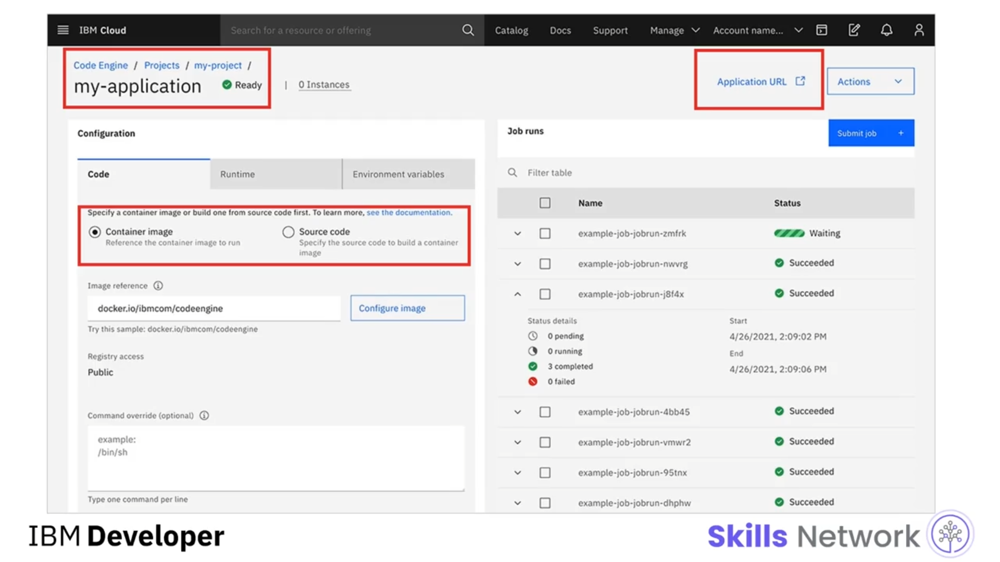
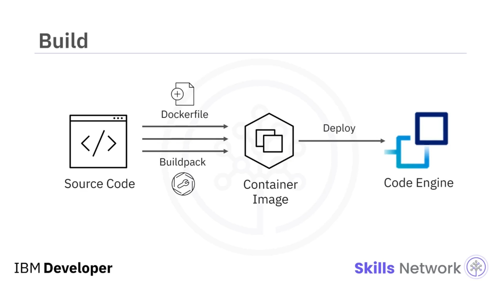
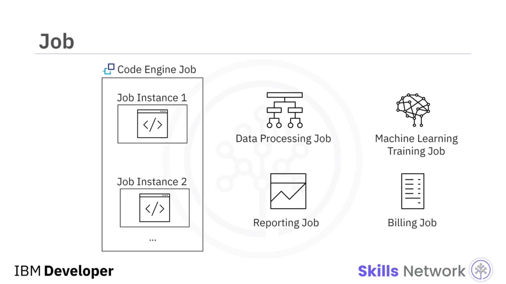

# 📦 Proje, Uygulama, Build ve İşler

## 🎯 ‘Project, Application, Build, and Jobs’ Videosuna Hoş Geldiniz

‘Project, Application, Build, and Jobs’ videosuna hoş geldiniz.

Bu videoyu izledikten sonra şunları açıklayabileceksiniz:

* IBM Cloud Code Engine'de bir projenin ne olduğunu,
* IBM Cloud Code Engine'de bir uygulamanın ne olduğunu,
* IBM Cloud Code Engine'de bir build'in ne olduğunu,
* IBM Cloud Code Engine'de bir job'un ne olduğunu.

---

## 📁 Code Engine'de Proje Nedir?

Code Engine'de *project* terimi, kendi kaynak ve varlıklarını içeren ve yöneten bir grubu ifade eder.

Code Engine içindeki bir gruplama;  *build* ,  *app* , *job* ve *Transport Layer Service* (veya  *TLS* ) HTTPS bağlantıları için sertifikalar gibi varlıkları içerir.

Bir projenin önemli işlevlerinden biri, varlıkları için bir *namespace* sağlamaktır.

 *Namespace* , tek bir grup içinde varlık ve kaynak gruplarını birbirinden yalıtmak için bir mekanizma sunar.

Varlık adlarının bir *namespace* içinde benzersiz olması gerekir; ancak  *namespace* 'ler arasında benzersiz olmak zorunda değildir.

---

## 🔐 Kaynak Yönetimi ve Erişim Denetimi

Bir diğer önemli işlev ise kaynakları yönetmek ve erişim denetimi sağlamaktır. Burada, IBM Cloud Code Engine'de bir projenin nasıl göründüğüne dair örnek bir ekran görüntüsü görebilirsiniz.

Bu projenin adı `my-project`'tir ve tüm varlıklarını gruplar, onlar için bir *namespace* sağlar.

Tüm varlıkların özetini kolayca bulabilirsiniz; örneğin burada 11 uygulama ve 2 job bulunduğunu görebilirsiniz.

Ayrıca proje, hangi kaynakların güncellendiğini görebilmeniz için erişim denetimi ve kaynakların denetlenmesini ( *auditing* ) sağlar.

Buna ek olarak, tüm proje için kaynak tahsisini, örneğin Toplam CPU ( *Total CPU* ) veya bellek kullanımını izleyebilirsiniz.

---

## ⚙️ Code Engine Uygulaması

Code Engine'de kodunuz bir uygulama ( *application* ) içinde çalışır.

Yayına alınmış normal web uygulamalarında olduğu gibi, çalışan uygulamanız HTTP isteklerini karşılayabilir veya  *REST API* 'leri sağlayabilir.

Ayrıca geleneksel HTTP isteklerine ek olarak, Code Engine *WebSocket* kullanan uygulamaları da destekler.

WebSocket, *Transmission Control Protocol* (veya  *TCP* ) üzerine kurulmuş bir iletişim protokolüdür.

Genellikle, sohbet uygulaması gibi istemciler ve sunucular arasındaki uzun süreli ve oturum tabanlı iletişim için kullanılır.

Code Engine, çalışan uygulama örnekleri oluşturarak veya yok ederek uygulamanızı ölçeklendirir.

Bir uygulamanın çalışan örneklerinin sayısı, gelen iş yüklerine ve yapılandırma ayarlarınıza bağlı olarak otomatik biçimde artırılır veya azaltılır (sıfıra kadar düşürülebilir).

Burada bir Code Engine projesine ait örnek bir kullanıcı arayüzü ( *UI* ) görürsünüz.

---

## 🖥️ Uygulama Arayüzü ve Kaynak Yapılandırması

Uygulamanın adı `my-application`'dır ve `my-project` adlı bir projenin altındadır.

Ayrıca, bu uygulamanın başarıyla dağıtıldığını ve hizmet vermeye hazır olduğunu gösteren yeşil bir onay simgesini görebilirsiniz.

Web uygulamanızın URL'sini açmak için *Application URL* bağlantısına tıklayabilirsiniz.

*Configuration* bölümünde, kayıtlı bir konteyner imajından veya doğrudan kaynak koddan gelebilecek uygulamanızın kaynağını yapılandırabilirsiniz.

---

## 🏗️ Build ve Konteyner İmajı Oluşturma

Code Engine bağlamında *build* (veya  *image build* ), kaynak kodunuzdan bir konteyner imajı oluşturmak için kullanabileceğiniz bir mekanizmadır.

Bir konteyner imajı; çalışması için konteynerin ihtiyaç duyduğu çalıştırılabilir kaynak kodu, bağımlılıklar, kaynaklar, konteyner motorları, sistem kütüphaneleri, yapılandırma ayarları ve benzeri tüm varlıkları içerir.

Code Engine, bir Docker konteyner imajı oluşturmak için gerekli tüm komutları içeren bir metin dosyası olan `Dockerfile` üzerinden build almayı destekler.

Alternatif olarak, *Cloud Native Buildpack* de kullanabilir.

 *Buildpack* , konteyner imajı oluşturmanın diğer popüler bir yoludur.

Kaynak kodu incelemek, bir build planı oluşturmak veya bir imaj üretmek üzere bu build planını yürütmek gibi görevleri gerçekleştiren çalıştırılabilir bileşenler içerir.

Kaynak koddan konteyner imajınız oluşturulduktan sonra, oluşturduğunuz bu konteyner imajını Code Engine'e dağıtabilir ve buna uygun bir uygulama oluşturabilirsiniz.

---

## 🧩 Job: Kodunuzu Tek Seferlik Çalıştırma

Bir  *job* , kodunuzun tek seferlik yürütülmesidir.

Bir uygulamada olduğu gibi, bir job da çalıştırılabilir kodu çalıştırır ve iş yüküne bağlı olarak Code Engine bir veya birden çok job örneği oluşturur.

HTTP isteklerini veya WebSocket oturumlarını birincil olarak ele alan uygulamaların aksine, job'lar bir kez çalışıp sonlanacak şekilde tasarlanmıştır.

Bu nedenle Code Engine'de bir job çalıştırmadan önce, job her çalıştığında kullanılan iş yükü yapılandırmalarını belirleyebilirsiniz.

Tipik job türlerinden bazıları şunlardır: verileri toplu olarak sorgulayıp dönüştüren veri işleme job'ları, makine öğrenmesi model eğitim job'ları, önceden belirlenmiş bir takvime göre rapor üreten raporlama job'ları ve fatura oluşturup gönderen faturalama job'ları.

---

## 📝 Bu Videoda Öğrendikleriniz

Bu videoda şunları öğrendiniz:

* Bir proje, uygulamalar, job'lar ve build'ler gibi Code Engine varlıklarının bir gruplamasıdır.
* Bir uygulama, HTTP isteklerini karşılamak veya WebSocket oturumları oluşturmak için kodunuzu çalıştırır.
* Bir build, kaynak kodunuzdan bir konteyner imajı oluşturma sürecidir.
* Bir job, çalıştırılabilir kodunuzun bir veya daha fazla örneğini çalıştırır.

