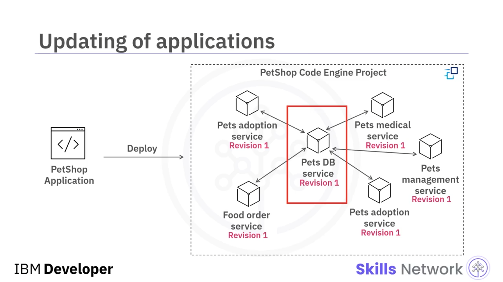
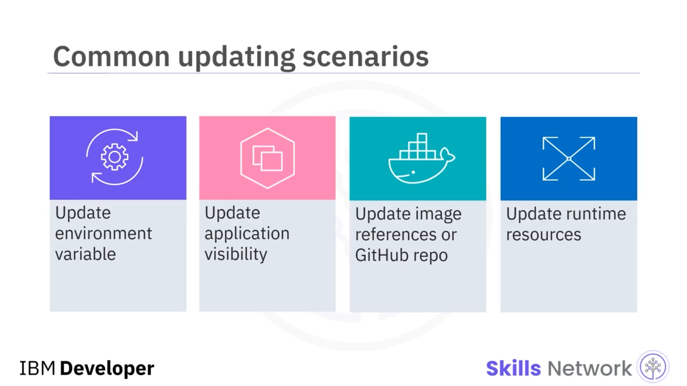
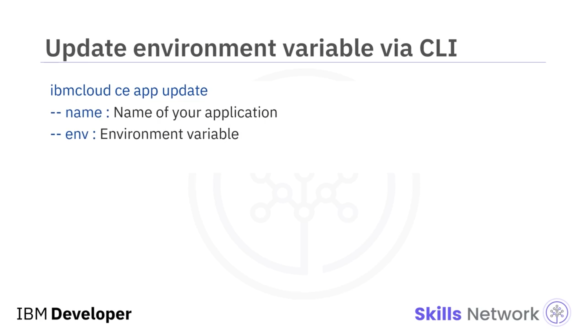
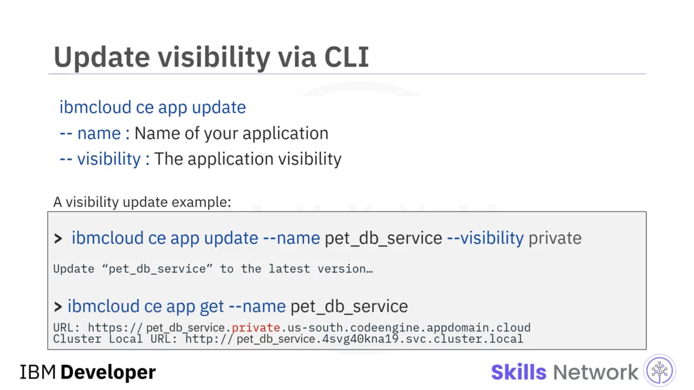
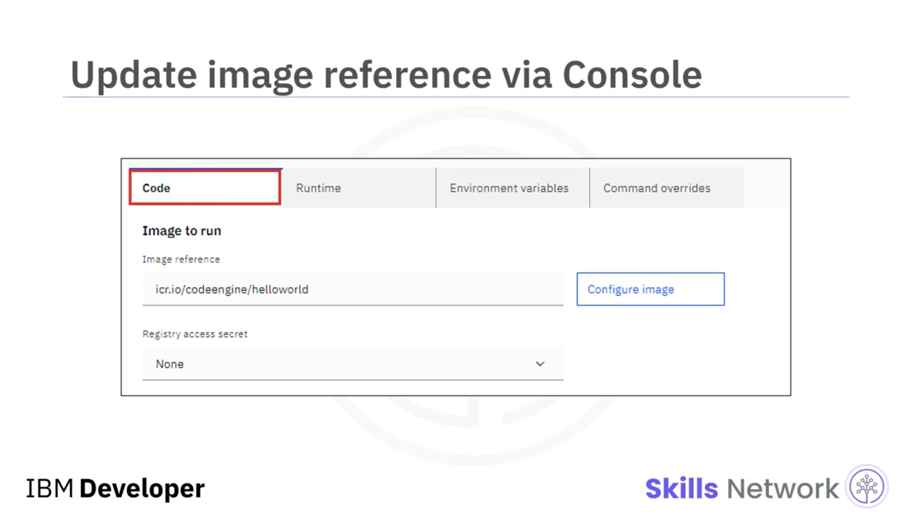
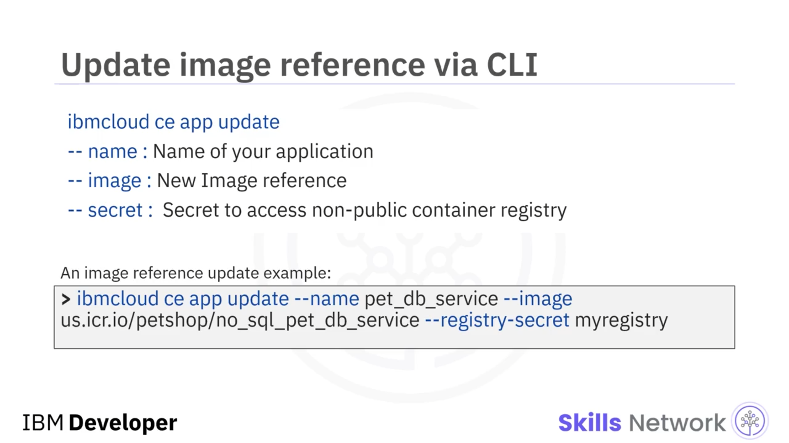
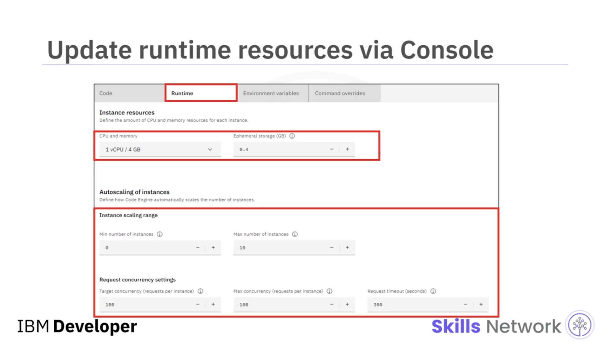

# 🔄 Dağıtılmış Uygulamaların Güncellenmesi

## 🎯 Öğrenme Hedefleri

“Dağıtılmış Uygulamaların Güncellenmesi”ne hoş geldiniz.

Bu videoyu izledikten sonra, uygulamaların güncellenmesine ilişkin yaygın senaryoları açıklayabilecek, IBM Cloud Console üzerinden uygulamaları güncelleyebilecek ve IBM Cloud CLI kullanarak uygulama güncellemeleri yapabileceksiniz.


---

## 🐾 Senaryo: Mikroservis Tabanlı PetShop Uygulaması

Evcil hayvan işletmeniz için mikroservis tabanlı bir PetShop web uygulaması geliştirdiğinizi ve her mikroservisi bir Code Engine projesi içinde birer uygulama olarak dağıttığınızı varsayalım.

PetShop uygulamanız çok yüksek miktarda web trafiği aldığından, verilerinizin bir kısmını bir SQL DB’den bir Non-SQL DB’ye taşımaya karar veriyorsunuz.

Bunun sonucunda, yeni veritabanı servisiniz için başka bir konteyner imajı geliştirip oluşturuyor ve `Pets` DB servisinizi bu yeni imaja göre güncelliyorsunuz. Buna ek olarak, uygulamanız için bazı yeni ortam değişkenlerine ve NoSQL DB’nize gelen istekleri işleyebilmek için daha fazla hesaplama kaynağına ihtiyaç duyuyorsunuz.




---

## 📦 Sürüm Yönetimi ve Yaygın Güncelleme Senaryoları

Code Engine, dağıtılmış uygulamanızın her bir  *revision* ’ını yönettiği için, uygulamanızı silip yeniden dağıtmanız gerekmez.

Mevcut uygulamayı basitçe güncelleyebilirsiniz ve Code Engine sizin için yeni bir *revision* oluşturur ve yönetir.

Code Engine uygulamalarınızı güncellerken karşılaşabileceğiniz dört yaygın senaryo şöyledir:

* Veritabanı konumu veya gizli anahtar ( *secret key* ) gibi ortam değişkenlerini güncellemek
* Bir uygulamanın URL’sini herkese açık durumdan özel ya da yalnızca proje içi olacak şekilde değiştirerek uygulama görünürlüğünü güncellemek
* Uygulamanızın imaj referansını veya GitHub deposunu güncellemek
* Uygulamanızın çalışma zamanı ( *runtime* ) kaynaklarını güncellemek



---

## 🧰 Güncelleme Yöntemleri: IBM Cloud Console ve CLI

Tıpkı uygulama dağıtımlarında olduğu gibi, uygulamanızı IBM Cloud Code Engine Console veya CLI kullanarak da güncelleyebilirsiniz.

Eğer ortam değişkeni eklemek gibi basit bir güncelleme yapıyorsanız, iyi tasarlanmış console arayüzünü (UI) kullanmak daha kolay ve hızlıdır. Ancak daha karmaşık ve hassas uygulama güncellemeleri için Code Engine CLI daha uygun olabilir.

Tüm uygulama güncelleme işlemlerini gerçekleştirmek için temel komut şudur:

```bash
ibmcloud ce application update
```


---

## ⚙️ Ortam Değişkenlerini (Environment Variables) Güncelleme

Uygulama console sayfanızda, `Environment variables` tablosuna tıklarsanız tüm ortam değişkenlerini görebilirsiniz. Bir ortam değişkeni eklemek veya güncellemek için **“Add environment variable”** düğmesine tıklayabilirsiniz.


Alternatif olarak, komut satırı arayüzünü (IBM Cloud CLI) tercih ediyorsanız, bir ortam değişkeni eklemek veya güncellemek için temel komut:

```bash
ibmcloud ce app update
```

Bu komutun iki ana argümanı vardır:

* Uygulamanızın adı
* Ortam değişkeninizin adı ve değeri



---

### 🧪 Örnek: `DB_HOST` Ortam Değişkenini Ekleme

Örneğin önce, `pet_db_service` uygulamasına değeri `localhost` olan `DB_HOST` adında bir ortam değişkeni eklersiniz.

Güncelleme komutu, `pet_db_service`’in en son sürüme güncellendiğini belirten bir mesaj döndürür.

Ortam değişkeninin başarıyla eklenip eklenmediğini iki kez kontrol etmek için, `pet_db_service` uygulamasının ayrıntılı bilgilerini görüntülemek amacıyla `app get` komutunu kullanabilirsiniz:

```bash
app get
```

Artık beklendiği gibi `DB_HOST` ortam değişkeninin eklendiğini görebilirsiniz.


---

## 🌐 URL Türleri ve Uygulama Görünürlüğü

Uygulamanızı dağıttığınızda, iki tür URL atanır: *internal* ve *external* URL’ler.

Internal URL’ler, uygulamanızın diğer uygulamalarla kendi içinde iletişim kurmasına yardımcı olur. External URL’ler ise herkese açık ( *public* ), harici ( *external* ) veya yalnızca IBM özel ağına ( *IBM private network only* ) açık olabilir.

Seçtiğiniz URL türü, uygulamanızın görünürlüğünü tanımlar.

Uygulamanızın görünürlüğünü güncellemek için uygulama console sayfanızda **System Domain mappings** sekmesine tıklayın.

* **No external system domain mapping** seçiliyken, bu uygulamaya genel internetten erişilemez ve ağ erişimi yalnızca bu proje içindeki bileşenlerden (cluster-local) mümkündür. Bu seçenek seçildiğinde *cluster-local* URL görüntülenir.
* **Private** seçildiğinde, bu uygulamaya IBM Cloud Virtual Private Endpoints aracılığıyla erişilebilir.
* **Public** seçildiğinde, uygulama için hem public URL’yi hem de cluster-local URL’yi görüntüleyebilirsiniz.


---

### 💻 CLI ile Uygulama Görünürlüğünü Güncelleme

Benzer şekilde, uygulama görünürlüğünü CLI üzerinden de güncelleyebilirsiniz.

Temel komut yine:

```bash
ibmcloud ce app update
```

Burada iki ana argüman kullanılır:

* Uygulamanızın adı
* Uygulamanızın görünürlüğü

Örneğin, önce `pet_db_service` uygulamasının görünürlüğünü `"private"` olarak güncellersiniz. Ardından uygulamanın ayrıntılı bilgilerini aldığınızda iki URL görmeniz gerekir.

External URL artık özel ( *private* ) bir alt alan adı içerir; bu, `pet_db_service`’in yalnızca IBM sanal özel ağları (virtual private networks) üzerinden erişilebilir olduğu anlamına gelir.



---

## 🐳 İmaj Referansını (Image Reference) Güncelleme

Console UI üzerinden imaj referansını şu şekilde güncelleyebilirsiniz:

Uygulama console sayfanızda **“Code”** sekmesine tıklayın. Ardından uygulamanız için yeni imaj referansını belirtin.

CLI tarafında ise, imaj referanslarını güncellemek için `ibmcloud ce app update` komutu üç argümanla kullanılır:

* Uygulamanızın adı
* İmaj referansınızın adı ve değeri
* Genel olmayan (non-public) container registry’ye erişmek için registry  *secret* ’ı

Örneğe bakalım: Burada imaj referansını `us.icr.io/petshop/no_sql_pet_db_service` olarak güncellersiniz ve container registry olarak `myregistry` kullanılır.



---

## 📈 Çalışma Zamanı Kaynaklarını ve Ölçeklemeyi Güncelleme

Eğer uygulama instance’larınızın yanıt süresi çok uzunsa veya CPU ve bellek kullanımı çok yüksekse, uygulamanın çalışma zamanı ( *runtime* ) kaynaklarını artırabilirsiniz.

Bunu yapmak için, uygulama sayfanıza gidip **`Runtime`** sekmesine tıklayın. Daha sonra gereksinimlerinize göre instance’ınızın CPU, bellek ve ephemeral storage değerlerini güncelleyebilirsiniz.

Uygulamanızın ölçeklenmesini yukarı veya aşağı yapmak istiyorsanız, aynı UI üzerinden *scaling* ve *concurrency* ayarlarını da güncelleyebilirsiniz.



CLI üzerinden CPU veya GPU güncellemek için yine aynı `ibmcloud ce app update` komutunu üç ana argümanla kullanmanız gerekir:

* Uygulamanızın adı
* Instance için ayarlanan CPU miktarı
* Instance için ayarlanan bellek miktarı

Örnekte, `pet_db_service` uygulamasının her bir instance’ının çalışma zamanı kaynaklarını 2 CPU ve 16 GB bellek olacak şekilde artırırsınız.




---

## ✅ Video Özeti

Bu videoda, bir Cloud Engine uygulamasını ya itilen (pushed) bir konteyner imajından ya da bir kaynak kod deposundan Cloud Engine’in imajı oluşturmasını isteyerek oluşturabileceğinizi öğrendiniz.

Ayrıca, dağıtım görevlerini kendi tercihinize göre IBM Cloud Console üzerinden UI ile ya da IBM Cloud CLI komut satırı arayüzü ile gerçekleştirebileceğinizi gördünüz.


