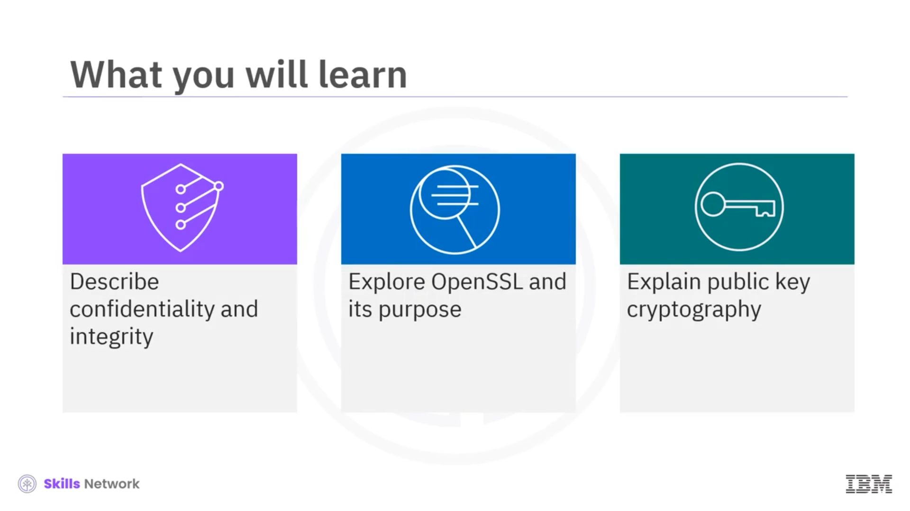
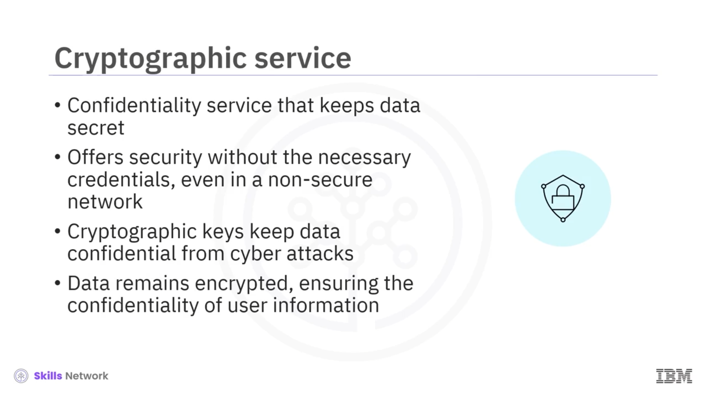
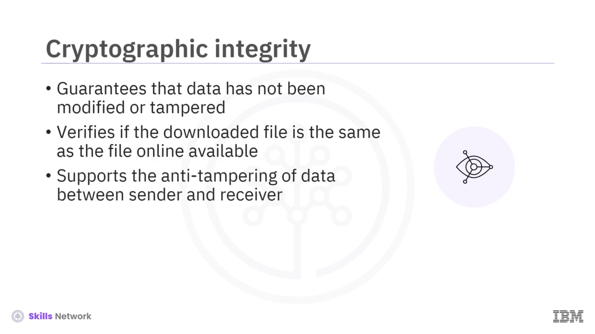
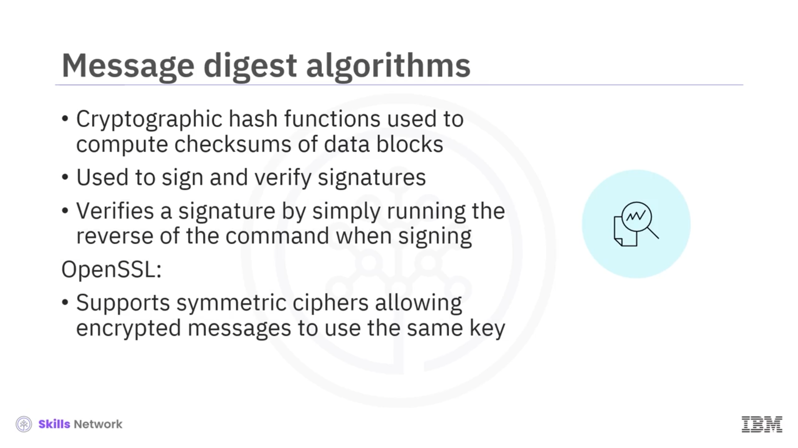
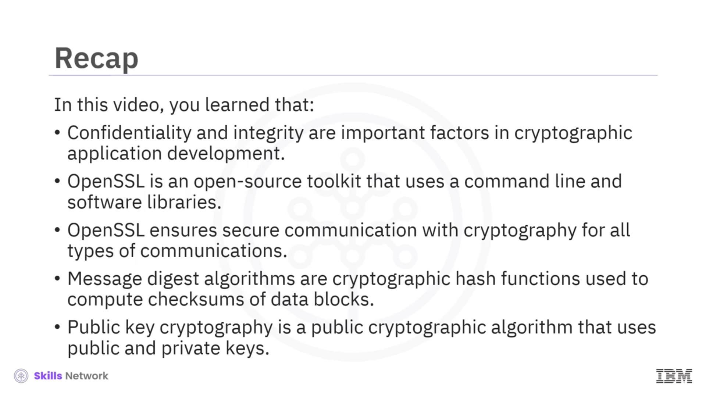

# 🔐 OpenSSL Nedir?

“OpenSSL Nedir”e hoş geldiniz.

Bu videoyu izledikten sonra *gizlilik* ( **confidentiality** ) ve *bütünlüğü* ( **integrity** ) açıklayabilecek, OpenSSL’i ve amacını inceleyebilecek ve *açık anahtar kriptografisini* açıklayabileceksiniz.

---

## 🌍 Günümüz Dünyasında Veri Güvenliği

Günümüzün geniş ve birbirine bağlı dünyasında, veri iletiminin güvenliğini ve bütünlüğünü sağlamak son derece önemlidir.

Bu nedenle, İnternet üzerinde bilgilerin gizli tutulması, uygulamaları devreye almak ve işletmek için kritik öneme sahiptir.

Kriptografi uygulayarak, kötü niyetli kişilerin dinleme veya *eavesdropping* yapma olasılığını ortadan kaldırabilirsiniz.

Buna ek olarak, *spoofing* ve *hijacking* gibi diğer ağ saldırıları da durdurulabilir.

Nasıl mı?

---

## 🧩 Kriptografi Hizmetlerine Giriş

Haydi kriptografi hizmetlerine ve bunlardan nasıl yararlanabileceğinize bakalım.

Kriptografi hizmeti, veriyi gizli tutan bir *gizlilik* hizmetidir.

Amacı, veri güvenli olmayan bir ağ üzerinden geçerken bile, gerekli kimlik bilgilerine sahip olmayan kişilerden veriyi korumaktır.

Kriptografik anahtarlar, özellikle de  *özel anahtarlar (private keys)* , veriyi siber saldırılara karşı gizli tutmak için kullanabileceğiniz araçlardır.

Genel ve özel anahtarlar olmadan, e-ticaret işlemleri için veri şifreli kalır ve kullanıcıların bilgilerinin gizliliği sağlanır.

Bir sonraki kriptografi hizmeti  *bütünlüktür (integrity)* .

Bütünlük, verinin iletim sırasında ve alındıktan sonra değiştirilmediğini veya kurcalanmadığını garanti eder.

Örneğin, bir dosya  *checksum* ’u, indirilen dosyanın çevrimiçi olarak sunulan dosyayla aynı olduğunu doğrulamanın bir yöntemidir.

Kriptografik bütünlük, gönderici ve alıcı arasında veri doğrulamasına ihtiyaç duyan kullanıcılar için verinin kurcalanmaya karşı korunmasına yardımcı olur.

---

## 🧰 OpenSSL Nedir?

Şimdi kriptografiyi nasıl kullanabileceğinizi anlamaya çalışalım.

 **OpenSSL** , *Secure Socket Layer (SSL)* protokolünü uygulayan bir yazılım kütüphanesidir.

Kişisel, ticari ve e-ticaret işlemleri de dahil olmak üzere her türlü iletişim için kriptografi ile güvenli iletişim sağlamak amacıyla kullanılan, açık kaynaklı bir araç takımıdır.

Bu yazılım kütüphanesi; simetrik ve açık anahtar kriptografisi,  *message digest* ’ler ve *hash* algoritmalarını içerir.

OpenSSL ayrıca bir *sözde rastgele sayı üreticisi (pseudorandom number generator)* içerir ve anahtar materyalini ve yaygın sertifika formatlarını yönetir.

---

## 👨‍💻 Geliştiriciler İçin OpenSSL Kullanımı

Bir uygulama geliştiricisi olarak, OpenSSL kütüphanesini programlarınıza dahil ederek uygulamalarınıza güçlü kriptografi sağlayabilirsiniz.

OpenSSL’i yerel bir bilgisayara kurduktan sonra doğrudan komut satırından da kullanabilirsiniz.

Ayrıca, Linux veya Mac üzerinde `OpenSSL` komutunu ya da Windows üzerinde `OpenSSL.exe` komutunu çalıştırarak OpenSSL komutunu doğrudan çalıştırabilirsiniz.

Komut satırı aracı çok sayıda seçenek sunar ve belirli gereksinimlerinize daha iyi uyum sağlayacak şekilde yapılandırmaları varsayılan olarak ayarlamak için kullanılabilecek bir yapılandırma dosyası da mevcuttur.

---

## 🧮 Mesaj Özeti (Message Digest) Algoritmaları

Şimdi *message digest* algoritmalarının ne olduğunu inceleyelim.

*Message digest* algoritmaları, veri bloklarının  *checksum* ’larını hesaplamak için kullanılan kriptografik *hash* fonksiyonlarıdır.

Hash hesaplamanın yanı sıra,  *message digest* ’i imza oluşturmak ve imzaları doğrulamak için de kullanabilirsiniz.

Bir imzayı doğruladığınızda, aslında imzalama sırasında kullanılan komutun tersini çalıştırmış olursunuz.

Ayrıca, OpenSSL’in, şifrelenmiş mesajların aynı anahtarı kullanmasına izin veren simetrik şifreleri de desteklediğini unutmamak önemlidir.

---

## 🔑 Açık Anahtar Kriptografisi (Public Key Cryptography)

Sırada, açık ve özel anahtarlar kullanan bir açık kriptografik algoritma olan *açık anahtar kriptografisi (public key cryptography)* vardır.

 **Rivest, Shamir ve Adleman (RSA)** , açık anahtar kriptografisinin en popüler uygulamasıdır.

RSA, herkesin kullanabileceği gizlilik, kimlik doğrulama ve şifreleme sağlar.

RSA’yı, farklı şifreleme seviyelerine göre değişen anahtar uzunlukları kullanarak özel anahtar üretimi için asal sayı üretimini uygulamak amacıyla da kullanabilirsiniz.

---

## 📌 Özet

Bu videoda, kriptografik uygulama geliştirmede *gizlilik* ve *bütünlüğün* önemli faktörler olduğunu öğrendiniz.

OpenSSL’in, kişisel, ticari ve e-ticaret işlemleri de dahil olmak üzere her türlü iletişim için kriptografi ile güvenli iletişim sağlamak amacıyla komut satırı ve yazılım kütüphaneleri kullanan açık kaynaklı bir araç takımı olduğunu gördünüz.

Ayrıca, veri bloklarının  *checksum* ’larını hesaplamak için kullanılan kriptografik *hash* fonksiyonları olan *message digest* algoritmalarını ve açık anahtar kriptografisini de incelediniz.

Bu açık kriptografik algoritma, açık ve özel anahtarlar kullanır.

