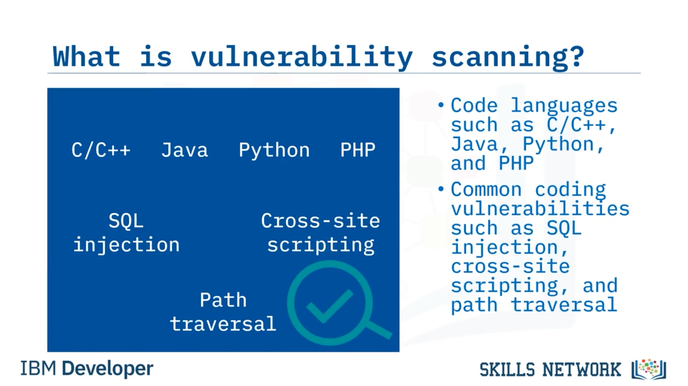
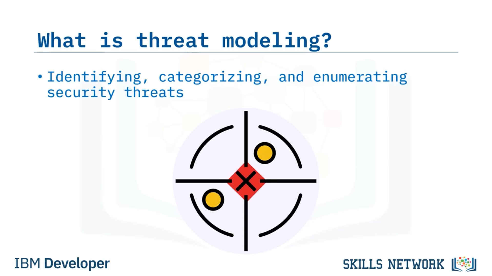
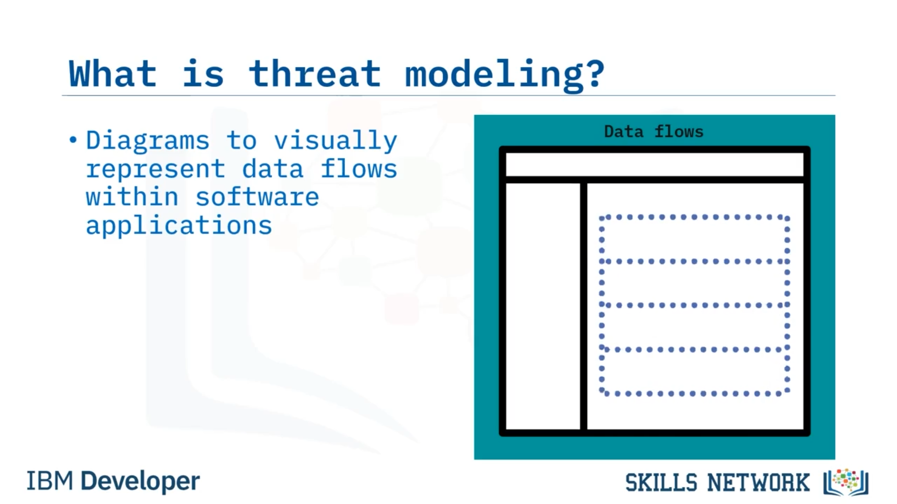
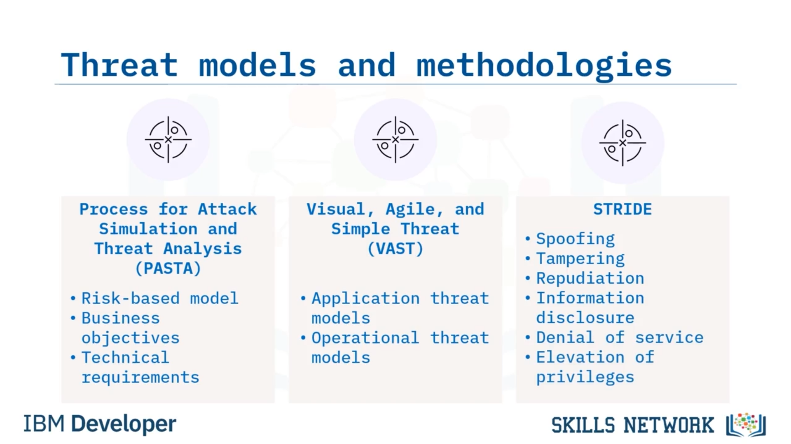
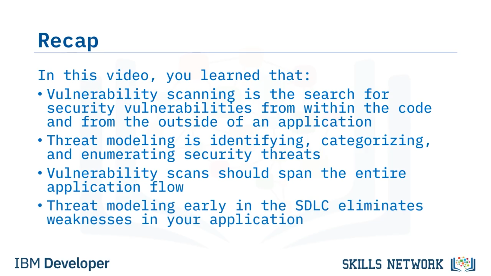

# 🛡️ Zafiyet Taraması ve Tehdit Modellemesi

## 🎬 Giriş

Zafiyet Taraması ve Tehdit Modellemesine hoş geldiniz!

Bu videoyu izledikten sonra şunları yapabileceksiniz:

Zafiyet taramasını tanımlamak ve yazılım geliştirme için tehdit modellemesini açıklamak.

---

## 🔍 Zafiyet Taraması Nedir?

Önce, zafiyet taraması nedir?

 *Zafiyet taraması* , güvenlik açıklarını kodun içinden ve bir uygulamanın dışından arama işlemidir.

Zafiyet tarayıcıları, C veya C++, Java, Python ve PHP gibi çeşitli kod dillerinde arama yapar.

Web uygulamalarında taranacak yaygın kod zafiyetleri arasında, yapılandırılmış sorgu dili (veya  *SQL* ) enjeksiyonu, *cross-site scripting* ve dosya ile dizinlerin *path traversal* yoluyla kötüye kullanılması yer alır.

---

## 📏 Zafiyet Taraması İçin Yönergeler

Peki, zafiyet taraması gerçekleştirirken bazı yönergeler nelerdir?

Güvenli bir tasarım geliştirmek için zafiyet taramalarını, belirli platform yapılandırmasına, yama seviyelerine veya uygulamanın bileşimine dayandırmanız gerekir.

Bir web uygulaması için zafiyet taramaları, kullanıcıların uygulamayla nasıl etkileşime girdiğine göre uygulamanın akışını taramak amacıyla kullanıcı kimlik bilgilerine erişim gerektirebilir.

Zafiyet taramaları, tüm uygulama akışını, tüm uygulamayı, yığını ( *stack* ) ve tüm destekleyici platformları kapsamalıdır.

---

## 🧰 Zafiyet Taraması Araçları

Zafiyet taraması için mevcut bazı araçlara bakalım.

En popüler dört araç şunlardır:  **Coverity** ,  **CodeSonar** , **Snyk Code** ve  **Static Reviewer** .

Bunlar, *static application security testing* (veya  *SAST* ) araçlarına örnektir.

 **Coverity** , C, C++, Java ve Python gibi programlama dilleri için artımlı analiz yapan bir tarayıcıdır.

 **CodeSonar** , kodu modellemek ve yollar ile program değişkenlerindeki zayıflıkları bulmak için soyutlama ( *abstraction* ) kullanır.

 **Snyk Code** , geliştirme aşaması boyunca kodlama ve güvenlik hatalarını keşfetmek için anlamsal analiz ( *semantic analysis* ) gerçekleştiren tümleşik bir geliştirme aracıdır.

**Static Reviewer** ise iyi bilinen zafiyetleri ortadan kaldırır.

Security Reviewer paketinin bir bileşeni olan bu araç, *Open Web Application Security Project* (veya  *OWASP* ), *Common Vulnerabilities and Exposures* (veya  *CVEs* ) ve *National Institute of Standards and Technology* (veya  *NIST* ) gibi çerçevelerle uyumludur.

---

## 🧠 Tehdit Modellemesi Nedir?

Şimdi, tehdit modellemesi nedir?

 *Tehdit modellemesi* , güvenlik tehditlerini tanımlama, kategorize etme ve listeleme ( *enumeration* ) işlemidir.

Tehdit modellemesi, devam eden tehditleri analiz etmek ve yazılım kodlama zayıflıkları ile zafiyetlerinin oluşma potansiyelini ortadan kaldırmak için bir süreç sağlar.

Tehdit modelleri, yazılım uygulamaları içindeki veri akışlarını temsil etmek için diyagramlar kullanır.

---

## 🏗️ Tehdit Modellemesinin SDLC İçindeki Yeri

Tehdit modellemesi, yazılım geliştirme yaşam döngüsünün (veya  *SDLC* ) neresine aittir?

En iyi zaman, tasarım aşamasıdır.

Tehdit modellerini erken geliştirerek, yazılım zafiyetlerinin potansiyelini azaltabilir ve uygulamadaki zayıflıkları ortadan kaldırabilirsiniz.

---

## 🧩 Yaygın Tehdit Modelleme Yaklaşımları

Kullanabileceğiniz üç popüler tehdit modeli şunlardır:

* *Process for Attack Simulation and Threat Analysis* (veya  **PASTA** ),
* *Visual, Agile, and Simple Threat* (veya  **VAST** ),
* ve son olarak  **STRIDE** .

 **PASTA** , iş hedefleri ve teknik gereksinimlerle bağlantı kuran risk tabanlı bir modeldir.

 **VAST** , uygulama tehdit modelleri ve operasyonel tehdit modellerini içeren çevik ( *agile* ) bir yöntemdir.

VAST, mimari bakış açısını temsil etmek için süreç akış diyagramları ( *process-flow diagrams* ) kullanır.

**STRIDE** ismini şu kavramların baş harflerinden alır:

 *Spoofing identity* ,  *Tampering with data* ,  *Repudiation* ,  *Information disclosure* , *Denial of service* ve  *Elevation of privileges* .

Microsoft tarafından ortaya konan STRIDE, tehdit ve zafiyetleri bulmak için uygulamaları ve sistemleri değerlendirir.

---

## ✅ Özet

Bu videoda şunları öğrendiniz:

* Zafiyet taraması, güvenlik zafiyetlerini kodun içinden ve bir uygulamanın dışından arama işlemidir.
* Tehdit modellemesi, güvenlik tehditlerini tanımlama, kategorize etme ve listeleme işlemidir.
* Zafiyet taramaları, tüm uygulama akışını kapsamalıdır.
* Ve SDLC’nin erken safhalarında gerçekleştirilen tehdit modellemesi, uygulamanızdaki zayıflıkları ortadan kaldırır.

