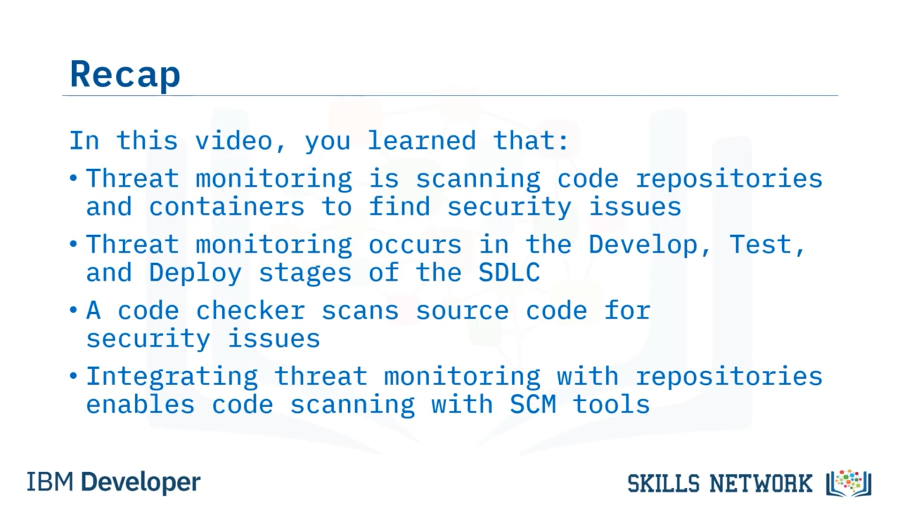

# 🔍 Tehdit İzleme

## 🎬 Giriş ve öğrenme hedefleri

Tehdit İzleme’ye hoş geldiniz! Bu videoyu izledikten sonra şunları yapabileceksiniz: tehdit izlemeyi tanımlamak, depo ( *repository* ) taramasını açıklamak ve konteyner taramasını açıklamak.

## ❓ Tehdit izleme nedir?

Şimdi, *tehdit izleme* nedir?

Tehdit izleme, güvenlik sorunlarını bulmak için kod depolarını ve konteynerleri taramaktır. Parola yanlış kullanımı, protokol güvensizlikleri ve hatalı izinler, tehdit izleme ile keşfedebileceğiniz sorunlara örnektir.

## 🧩 SDLC içinde threat modeling’in yeri

*Threat modeling* (tehdit modellemesi), yazılım geliştirme yaşam döngüsünün (SDLC) neresine aittir?

Aslında, tehdit modellemesini SDLC’nin üç aşamasına entegre edersiniz. Yani, Geliştirme ( *Develop* ) aşamasında, Test aşamasında ve Dağıtım ( *Deploy* ) aşamasında gerçekleşir.

Tümleşik geliştirme ortamlarında (IDE’ler) ve kaynak kontrol yönetimi (SCM) araçlarında kod taramasını kullanmak, geliştirmeden dağıtıma kadar güvenlik kontrollerini entegre ederek SDLC’yi destekler. Kod tarama araçları, Open Web Application Security Project (OWASP) Top 10 gibi güvenlik tehditlerini ve zafiyetleri depolayan veritabanlarına başvurur.

## 🧪 Kod denetleyiciler ( *code checker* ) ile tehdit izleme

Tehdit izleme gerçekleştirmek için *code checker* araçlarını kullanabilirsiniz. Bir  *code checker* , kaynak kodu güvenlik sorunları ve zafiyetler açısından tarar ve bu da sizi kodlama sorunları konusunda uyarır.

Kod denetleyiciler, kod sözdizimi, stil ve dokümantasyon gibi özniteliklerdeki sorunları bulmak için kodu analiz eder. Kod denetleyiciler, kodda sorunların nerede düzeltileceğine dair içgörüler sağlar.

Dolayısıyla bir *code checker* kullanmak, güvenli kod geliştirmenize ve uygulamanızın kalitesini artırmanıza yardımcı olur.

## 📁 Depolarda tehdit izleme ve depo taraması

Tehdit izlemeyi kod depolarınıza entegre edebilirsiniz. Depolar genellikle işbirlikçi ve açık kaynaklı olduğu için, önemli ölçüde güvenlik tehdidi ve zafiyet riski taşırlar.

Tehdit izlemeyi kod depoları ile entegre etmek, GitHub gibi kaynak kontrol yönetimi (SCM) araçlarının kod taramasını mümkün kılar. Kod depolarını tararken otomatik “fix” pull request’leri oluşturabilen kod proje izleme özelliklerinden yararlanabilirsiniz.

Kod tarayıcıları, depolarınızdaki kodu taradıktan sonra zafiyet raporlaması ve içgörüler sağlar. Ayrıca, her bir pull request’i güvenlik zafiyetleri açısından tarar ve test ederler.

Ve güvenilir kaynakların doğrulanması olarak, commit’leri genel şifreleme anahtarı veya Pretty Good Privacy (PGP) anahtarı ile imzalarlar.

## 📦 Konteyner taraması

Tehdit izlemenin bir diğer türü, kod içeren konteyner imajlarını tarama süreci olan *konteyner taraması*dır. Konteynerler, uygulama kodu ve paketlenmiş kütüphane bağımlılıklarının paketleridir.

Konteynerlerin bağımlılıkları olduğundan, dış kaynaklardan gelen güvenlik zafiyetlerine maruz kalırlar. Konteyner taraması, zafiyetler ve güvenlik tehditleri içerebilen konteynerlere dağıtılmış kodu tarar.

Konteyner imajları genellikle zafiyetleri olabilen diğer konteyner imajlarından oluşturulduğundan, konteyner taraması yalnızca temel imajı değil, diğer tüm katmanlı konteyner imajlarını da kapsamalıdır.

Tüm konteyner imajlarının izlenmesi, güvenlik risklerini azaltmaya yardımcı olur.

## 🧾 Özet

Bu videoda şunları öğrendiniz:

Tehdit izleme, güvenlik sorunlarını bulmak için kod depolarını ve konteynerleri taramaktır. Tehdit izleme, SDLC’nin Geliştirme ( *Develop* ), Test ve Dağıtım ( *Deploy* ) aşamalarında gerçekleşir.

Bir  *code checker* , güvenlik sorunlarını bulmak için kaynak kodu tarar. Ve tehdit izlemenin depolarla entegre edilmesi, SCM araçlarıyla kod taramasını mümkün kılar.

