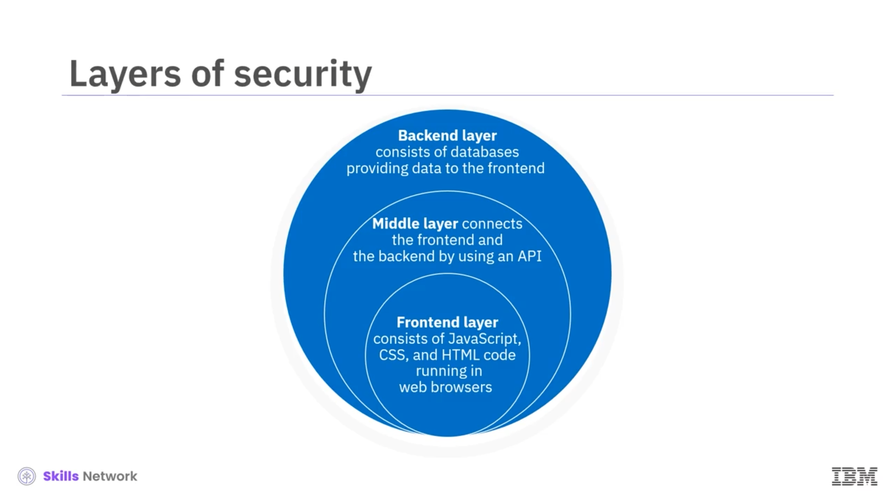
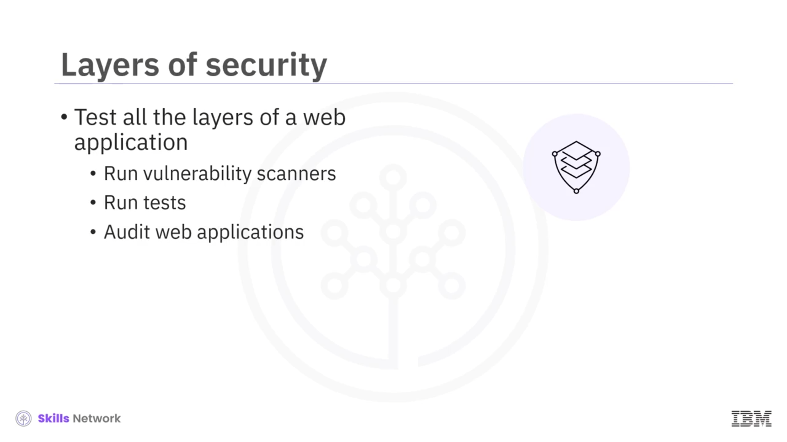
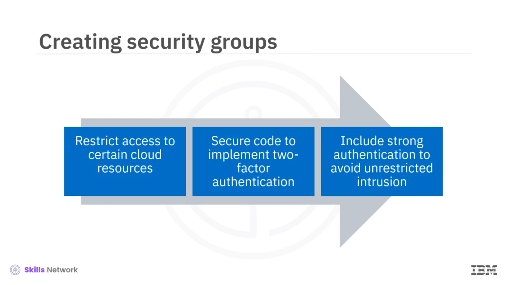
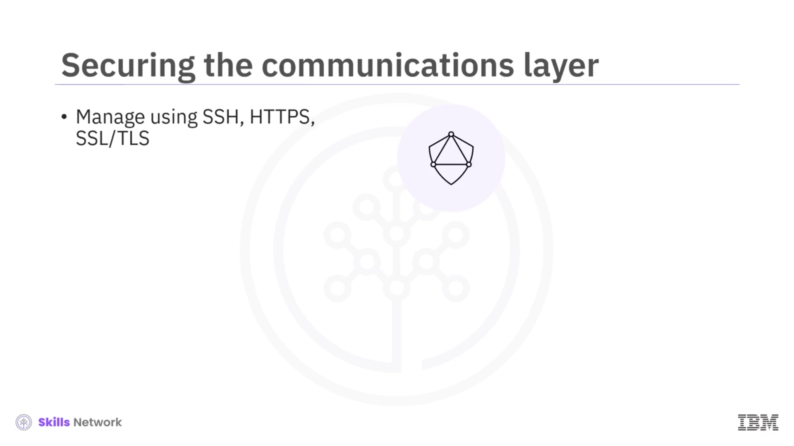
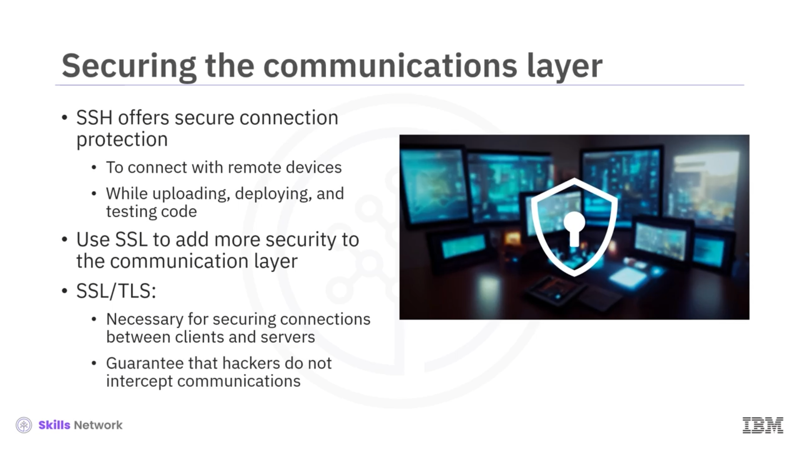
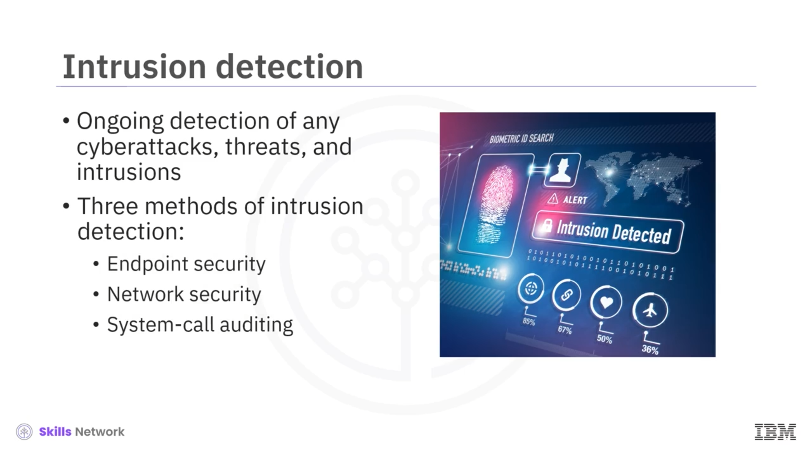
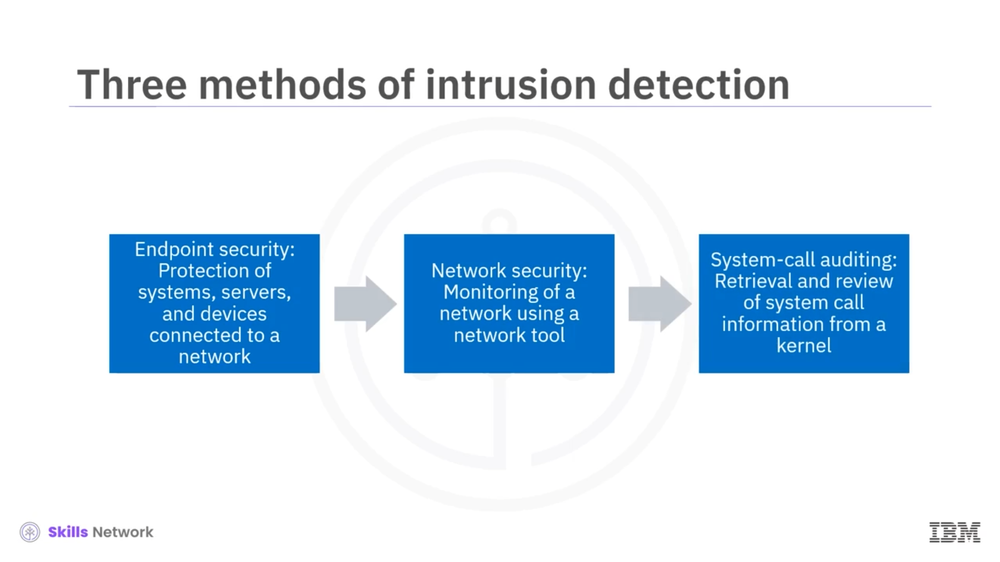
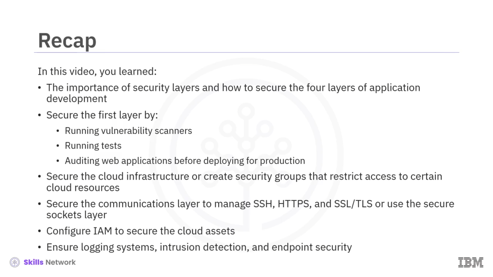

# 🔒 Uygulama Geliştirme için Katmanların Güvenliği

## 👋 Uygulama Geliştirme için Katmanların Güvenliğine Hoş Geldiniz

Uygulama Geliştirme için Katmanların Güvenliği’ne hoş geldiniz. Bu videoyu izledikten sonra, her bir katmanın güvenliğini sağlamanın önemini açıklayabilecek, uygulama geliştirmedeki dört güvenlik katmanını belirleyebilecek ve uygulama geliştirme için katmanların güvenliğini sağlamaya yönelik günlükleme, analiz ve tespit yöntemlerini açıklayabileceksiniz.

## 🍰 Katmanlı Güvenlik için Pasta Benzetmesi

Herkes güzel bir pastayı sever, değil mi? Ben kesinlikle severim.

Ancak pastalar, farklı tatlar ve kremalardan yapılır ve bu katmanlar, pastaya görsel çekicilik kazandırır ve ona iştah açıcı bir lezzet verir.

Bir pastanın katmanlarının sağladığı faydalar, özellikle sizin gibi uygulama geliştiriciler için güvenlik katmanlarını sağlamaya yönelik mükemmel bir benzetmedir.

Uygulama geliştirirken kullanılması gereken önemli güvenlik katmanlarına bakalım.

---

## 🌐 Birinci Katman: Web Uygulaması Katmanı

Uygulama geliştiriciler için güvence altına alınması gereken ilk katman, web uygulaması katmanıdır.

Web uygulaması katmanı, farklı cihazlarda `HTTPS` ( *Hypertext Transport Protocol Secure* ) kullanarak web tarayıcılarında çalışan `JavaScript`, `CSS` ve `HTML` kodundan oluşan bir ön uç katmanından meydana gelebilir.

Buna karşılık, web uygulaması katmanının arka uç katmanı genellikle, kullanıcıların uygulamayla etkileşimde bulundukları sırada ön uca veri sağlayan veritabanlarından oluşur.

Web uygulamasının orta katmanı ise, `Python`, `Java` veya `Ruby` gibi dillerle geliştirilen bir *application programming interface (API)* kullanarak ön uç ile arka uç arasında bir bağlantı sağlar.

Bir uygulama geliştiricisi olarak, bir web uygulamasının tüm katmanlarını test etmek zorundasınız.

Bunu nasıl yapabilirsiniz?

Güvenlik açığı tarayıcıları çalıştırın, testler yapın ve üretim ortamına geçmeden önce diğer ekip geliştiricilerinin web uygulamalarını denetlemesine (audit) izin verin.

---

## ☁️ İkinci Katman: Bulut Altyapısını Güvence Altına Alma

Bir sonraki katmanı korumanın yolu, Bulut altyapısını güvenli hâle getirmektir.

Bulut tabanlı veritabanları; kullanıcı adları, parolalar ve diğer gizli bilgiler gibi kullanıcı verilerinin kaynaklarıdır.

Bu nedenle, olası bir siber tehdit durumuna karşı, Bulut tabanlı veritabanlarına bağlanan uygulamaları geliştirirken yönetici kimlik bilgilerini dahil etmediğinizden emin olmalısınız.

Başka bir koruma önlemi ise, belirli Bulut kaynaklarına erişimi kısıtlayan güvenlik grupları oluşturmaktır.

Erişimi kısıtlamaya ek olarak, güvenli kod, web uygulamalarının tüm kullanıcıları için iki faktörlü kimlik doğrulamayı da uygulamalıdır.

İster telefon ister kısa mesaj tabanlı kimlik doğrulama olsun, kötü niyetli bir kişinin sınırsız şekilde içeri sızma olasılığını azaltmak için güçlü kimlik doğrulamayı da dahil etmelisiniz.

---

## 🔗 Üçüncü Katman: İletişim Katmanını Güvence Altına Alma

Bulut katmanına ek olarak, iletişim katmanının güvenliğini sağlamak da önemlidir ve bu, güvenli bir kabuk olan `SSH`, `HTTPS`, *Secure Sockets Layer (SSL)* ve *Transport Layer Security (TLS)* yani `SSL/TLS` kullanılarak yönetilmelidir.

`SSH`, fiziksel ve Bulut sunucuları gibi uzak cihazlarla bağlantı kurmak için kullanılan güvenli bir bağlantı koruma yöntemidir.

`SSH` uygulayarak, uygulama geliştiriciler kod yüklerken, dağıtırken ve test ederken uzak cihazlara olan bağlantılarını güvence altına alırlar.

İletişim katmanındaki bir diğer güvenlik önlemi, *Secure Sockets Layer (SSL)* ve *TLS* kullanmaktır; `SSL` ve `TLS`, istemciler ve sunucular arasındaki bağlantıları güvenceye almak için gerekli teknolojilerdir.

`SSL` ve `TLS` ile güvenli bağlantılar üzerinden aktarılan veriler, ortadaki adam ( *man-in-the-middle* ) saldırısı gerçekleştirmeye çalışan bilgisayar korsanlarının iletişimleri ele geçirmesini engeller.

---

## 🚚 Dördüncü Katman: Güvenli Kod Teslim Boru Hattı (Delivery Pipeline)

Uygulama geliştiriciler bir uygulama projesine kod göndermeleri gerektiğinde, güvenli kod teslim boru hattı katmanı da güvence altına alınmalı ve kısıtlanmalıdır.

Bunu yapmak için, `GitHub` üzerindeki kod depolarını belirli izinlerle kilitleyebilir ve periyodik olarak bir denetim (audit) yapılmasını sağlayabilirsiniz.

İki faktörlü kimlik doğrulama, `GitHub` ve ilgili Bulut sağlayıcıları gibi üçüncü tarafların kimliğini doğrulamak için de önemlidir.

---

## 👤 IAM ve Gizli Bilgilerin Güvenli Yönetimi

Uygulama geliştirmek için Bulut kaynakları kullanılıyorsa, geliştirme sırasında ihtiyaçlar ve roller doğrultusunda Bulut varlıklarını güvence altına almak için *Identification and Access Management (IAM)* yapılandırılmalıdır.

 *IAM rolleri* , Bulut altyapıları içinde uygulamalara ve sistemlere izin vermek için önemli bir güvenlik mekanizmasıdır.

Son olarak, gizli parolalar, sertifikalar ve şifreleme anahtarları `HashiCorp Vault` gibi gizli saklama servislerinde tutulmalıdır.

---

## 📝 Günlükleme (Logging) ve Anomali Tespiti

Her uygulamanın, herhangi bir anomaliyi belirlemek için günlük (log) mesajlarını toplamak üzere bir günlükleme sistemine sahip olması gerektiğini hatırlamak da önemlidir.

Anomaliler, bir uygulama veya sistem içinde meydana gelen benzersiz ve beklenmedik olaylardır.

Bir anomaliye örnek olarak, gerekli kimlik bilgilerine sahip olmadan bir sistemin yöneticisi olarak oturum açma girişimi verilebilir.

Günlükleme, uygulama geliştiriciler tarafından gelecekte incelenmek üzere analiz edilen ve saklanan bir başka güvenlik katmanı olarak kabul edilir.

Son olarak, günlük mesajlarına erişim tüm sistem kullanıcılarına değil, yalnızca güvenilebilecek ve inceleme ile analiz için erişime ihtiyaç duyan kişilere sağlanmalıdır.

---

## 🛡️ Son Savunma Katmanı: İzinsiz Giriş Tespiti

Son savunma katmanı, izinsiz giriş tespitidir ( *intrusion detection* ).

İzinsiz giriş tespiti, bir uygulamayı veya sistemi tehlikeye atan her türlü siber saldırıyı, tehdidi ve izinsiz girişi sürekli olarak tespit etme sürecidir.

İzinsiz giriş tespitinin üç yöntemi;  *uç nokta güvenliği (endpoint security)* , *ağ güvenliği (network security)* ve *sistem çağrısı denetimi (system-call auditing)*dir.

Şimdi, izinsiz giriş tespitinin bu üç yönteminden her birini anlayalım:  *endpoint security* , bir ağa bağlı sistemleri, sunucuları ve çeşitli cihaz türlerini korur.

 *Ağ güvenliği (network security)* , `Nmap` ve `Snort` gibi bir ağ aracı kullanarak bir ağın izlenmesidir.

*Sistem çağrısı denetimi (system call auditing)* ise, `Linux` çekirdeği gibi bir çekirdekten sistem çağrısı bilgilerini alıp bunları gözden geçirme işlemidir.

---

## ✅ Özet: Uygulama Geliştirme Katmanlarını Güvence Altına Alma

Bu videoda, güvenlik katmanlarının önemini ve uygulama geliştirmenin dört katmanının nasıl güvence altına alınacağını öğrendiniz.

İlk katmanı, güvenlik açığı tarayıcıları çalıştırarak, testler yaparak ve web uygulamalarını üretime almadan önce denetleyerek güvence altına alabilirsiniz.

Bulut altyapısını güvence altına almalı veya belirli Bulut kaynaklarına erişimi kısıtlayan güvenlik grupları oluşturmalısınız.

İletişim katmanının güvenliğini, `SSH`, `HTTPS` ve `SSL/TLS` ya da *Secure Sockets Layer* kullanarak yönetmek önemlidir.

Uygulama geliştirmek için Bulut kaynakları kullanılıyorsa, geliştirme sırasında ihtiyaçlar ve roller doğrultusunda Bulut varlıklarını güvence altına almak için *Identification and Access Management (IAM)* yapılandırılmalıdır.

Son olarak, günlükleme sistemlerini sağlamalı ve son savunma katmanını, yani izinsiz giriş tespitini ve uç nokta güvenliğini korumalısınız.

