# 🔐 Güvenlik Kalıpları

## 🧩 Giriş

Güvenlik Kalıplarına hoş geldiniz. Bu videoyu izledikten sonra, güvenlik kalıplarını tanımlayabilecek, güvenlik kalıplarının amacını ve yapısını analiz edebilecek ve güvenlik kalıplarının nasıl organize edileceğini açıklayabileceksiniz.

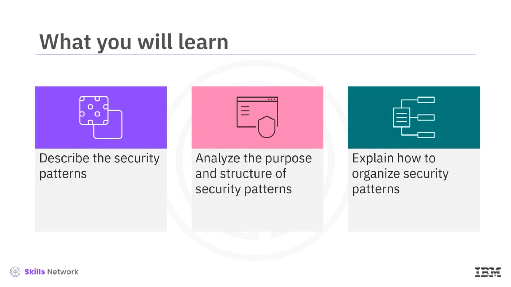

Sürekli değişen, teknolojik olarak gelişmiş ve tehditlerin bulunduğu bir ortamda çalışan bir yazılım geliştirici veya mühendissiniz diye hayal edin. Yetkisiz erişimden kaynaklanan güvenlik ihlallerinin en yaygın nedeni olan yanlış yapılandırılmış yazılım ayarları üzerinde çalışmanız gerekmektedir.

Yazılım ayarlarındaki güvenlikle ilgili herhangi bir tasarım hatası, şirketin ve müşterilerin hassas bilgilerini açığa çıkarabilir. Teknoloji ilerledikçe, siz yazılım mühendisleri ve geliştiriciler uygulamalarınızı tehdit ve saldırılardan korumak için en temel güvenlik önlemlerini uygulamaya mecbur kalırsınız.

Güvenliği geliştirme planına haritalandırarak, sistemi potansiyel saldırılara karşı güvence altına alabilir ve kuruluşun saldırılardan kurtulma yeteneğini güçlendirebilirsiniz.

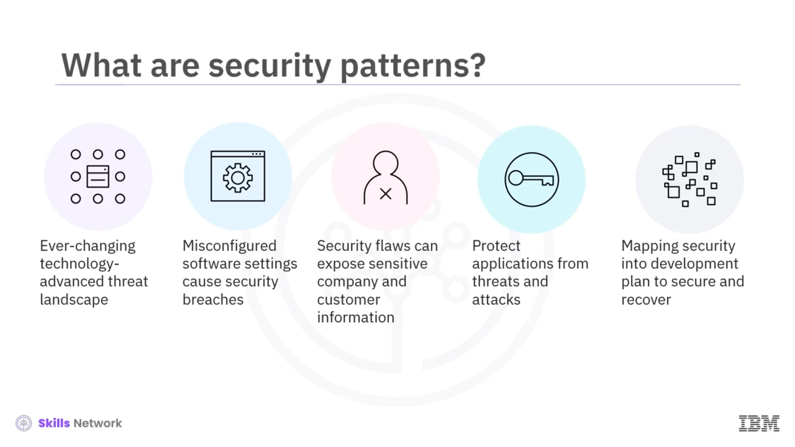

---

## 📚 Güvenlik kalıplarının tanımı

İşte tam bu noktada güvenlik kalıpları devreye girer. Güvenlik kalıplarını tanımlayarak başlayalım.

Bir güvenlik kalıbı, yinelenen güvenlik tehditleri veya sorunlarına yeniden kullanılabilir bir çözümü temsil eden ve tanımlayan bir dizi kuraldır.

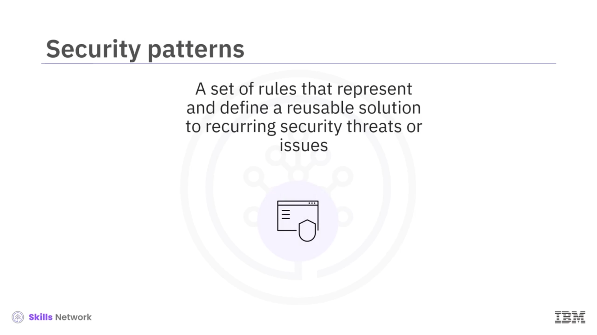

Bir güvenlik tasarımı eseri olarak güvenlik kalıbı genellikle güvenlik tehditlerinin veya sorunlarının belgelenmesini içerir. Bir güvenlik sorununun varlığı nasıl etkilediğinin ortaya konulmasını, kullanılabilirliği artırmak için kullanımın standartlaştırılmasını, tehditleri azaltmak için öngörülen kontrollerin izlenebilir tutulmasını ve güvenlik sorunlarının belirli satıcı veya teknoloji uygulamalarından ayrıştırılmasını içerir.

Şimdi güvenlik kalıplarının amacına bakalım.

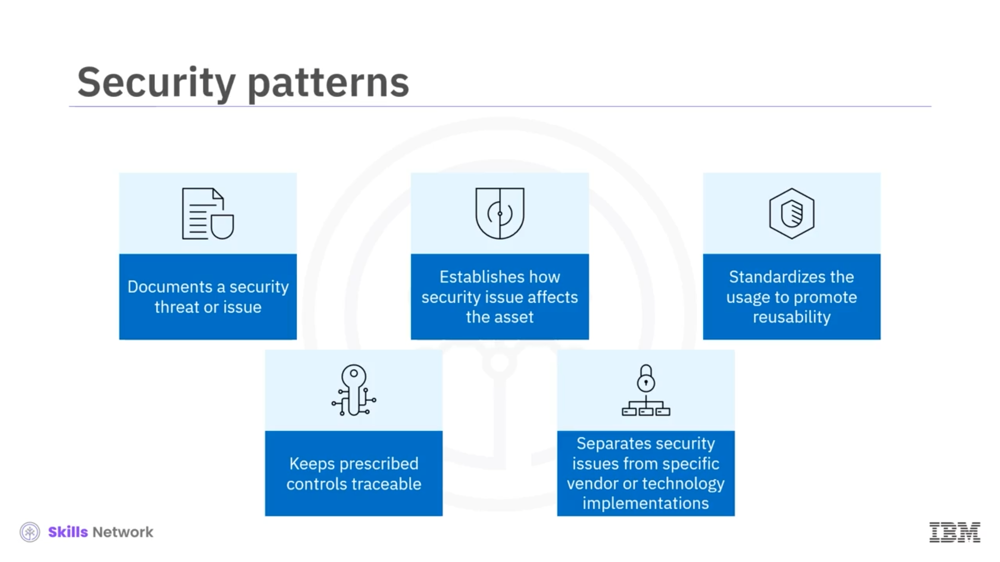

---

## 🎯 Güvenlik kalıplarının amacı

Bilgi teknolojileri sektöründe talep ve dağıtım döngülerinin hızı sürekli artmaktadır. Bu hıza ayak uydurabilmek için kuruluşlar zaman ve emeklerini daha akıllı, yeniden kullanılabilir ve uyarlanabilir güvenlik mimarisi ve tasarımına harcar.

Yazılım geliştiriciler, yazılımlarını kolayca tanımlanabilir, yeniden kullanılabilir ve diğer uygulama ve hizmetlerle birlikte çalışabilir kılmak için güvenlik kalıplarını kullanmalıdır.

Güvenlik kalıplarının, güvenlik tehditlerini ve saldırılarını yönetmenin karmaşıklığını basitleştirdiğini belirtmek gerekir. Güvenlik kalıplarını takip ederek kuruluşlar, sistemlerinin veri gizliliğini, bütünlüğünü ve erişilebilirliğini güvence altına alırken sağlam güvenlik çerçeveleri oluştururlar.

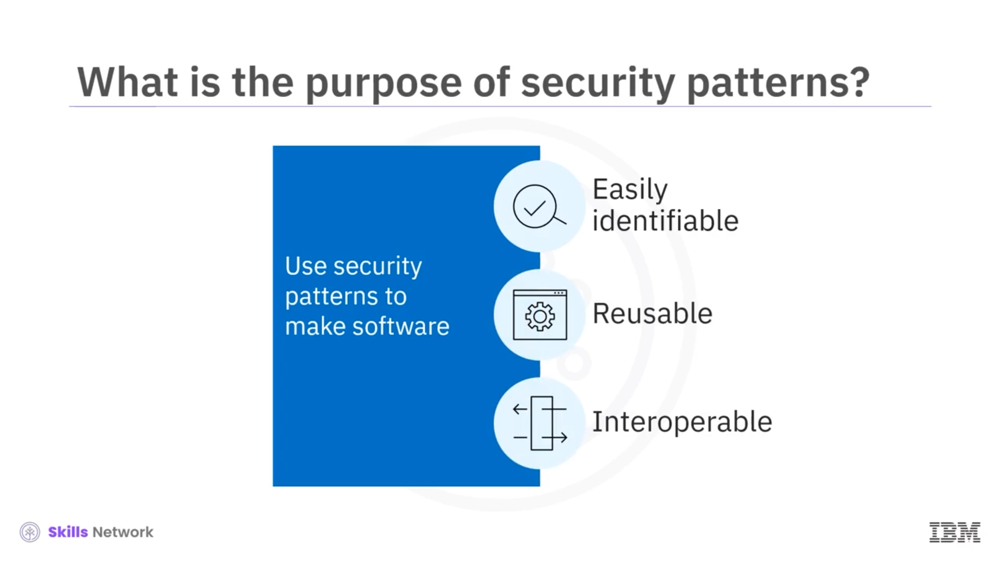

Güvenlik kalıpları, riskleri azaltmak, hassas bilgileri korumak ve uygulamaların genel güvenlik ekosistemini güçlendirmek için standartlaştırılmış ve kanıtlanmış yaklaşımlar sunar. Ayrıca güvenlik kontrollerinin, izleme mekanizmalarının, kimlik doğrulama süreçlerinin, şifreleme protokollerinin ve daha fazlasının uygulanmasına yönelik uygulanabilir çözümler ve öneriler sağlarlar.

---

## 🧱 Hedefler ve güvenlik kalıplarının gösterimi

Güvenlik kalıplarının temel amacı, gelecekteki güvenlik tehditlerini azaltmak veya ortadan kaldırmaktır. Bu kalıplar, bir zafiyetten ziyade doğrudan belirli bir tehditle ilişkilidir.

Güvenlik kalıpları önceki olaylar ve zafiyetleri temel aldığından, yeni tehditler ortaya çıktığında kuruluşların yeni güvenlik kalıpları geliştirmesi gerekir.

Bir geliştirici olarak güvenlik kalıplarını diyagramlar kullanarak görselleştirebilirsiniz. *Unified Modeling Language* veya  *UML* , bir sistemin mimarisini ve tasarımını daha iyi anlamak için o sistemi görsel olarak modelleyip temsil edebilir.

Güvenlik kalıplarını yazılım tasarımları üzerinden de gösterebilirsiniz. Gerçek kodun analiz edilmesi, geliştiricilerin yazılımın bir uygulamanın, hizmetin veya ağın genel güvenliğini nasıl etkilediğini anlamalarına yardımcı olur.

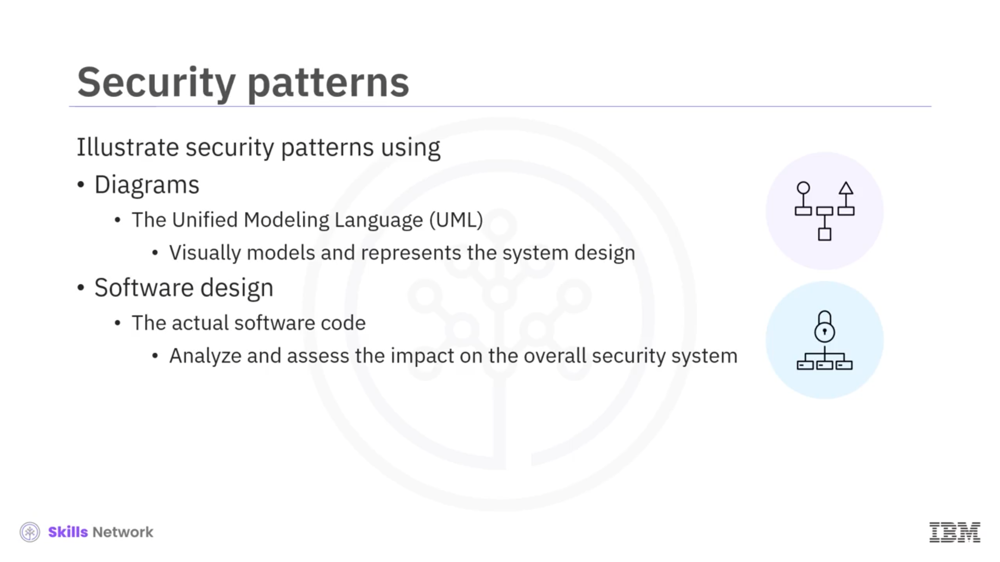

---

## 🧬 Güvenlik kalıplarının yapısı

Güvenlik kalıplarının yapısına geldiğimizde, bir güvenlik kalıbı aşağıdaki unsurları içermelidir:

Tasarımı, varlık, hizmet veya süreç merkezli olmalıdır. Geliştiricilere adımlar ve süreçler sunmak için tehditleri analiz etmeli ve modellemelidir.

Yeniden kullanılabilirliği artırmak için tehdit modelini güvenlik gereksinimlerine kadar izleyebilmelidir. Ayrıca izlenebilirlik ve yeniden kullanılabilirlik için standart bir taksonomi kullanmalıdır.

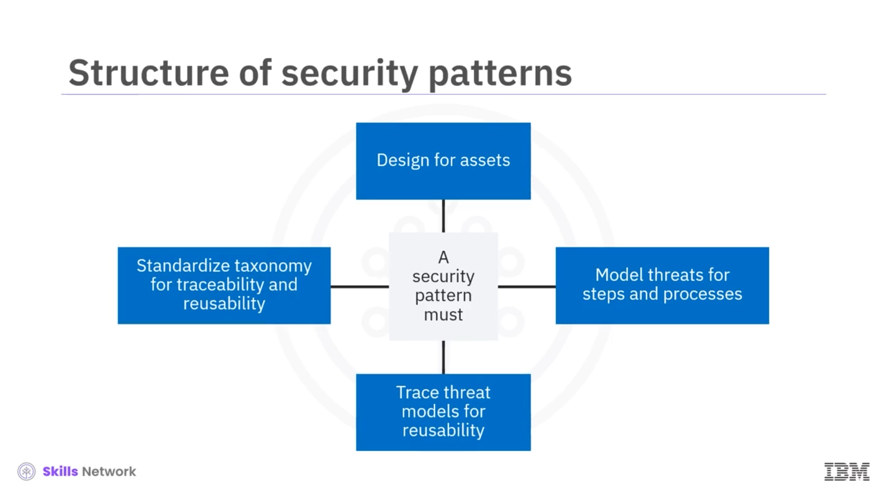

---

## 🗂️ Güvenlik kalıplarının düzenlenmesi

Şimdi güvenlik kalıplarının nasıl organize edileceğine bakalım. Türlerine ve konularına göre çeşitli güvenlik kalıpları bir güvenlik kalıbı kataloğunda düzenlenip kategorize edilebilir.

Örneğin güvenlik kalıpları, kimlik doğrulama, erişim denetimi veya bir ağ içindeki ağ trafiğinin filtrelenmesi başlıkları altında sınıflandırılabilir.

Yetkilendirme, rol tabanlı erişim denetimi, güvenlik duvarları ve  *SAML* , *XACML* ve *XML* güvenlik duvarları gibi web hizmeti güvenliği mekanizmaları, güvenlik kalıplarına dair diğer örneklerdir.

Şimdi güvenlik kalıplarını kategorize etmenin avantajlarına bakalım.

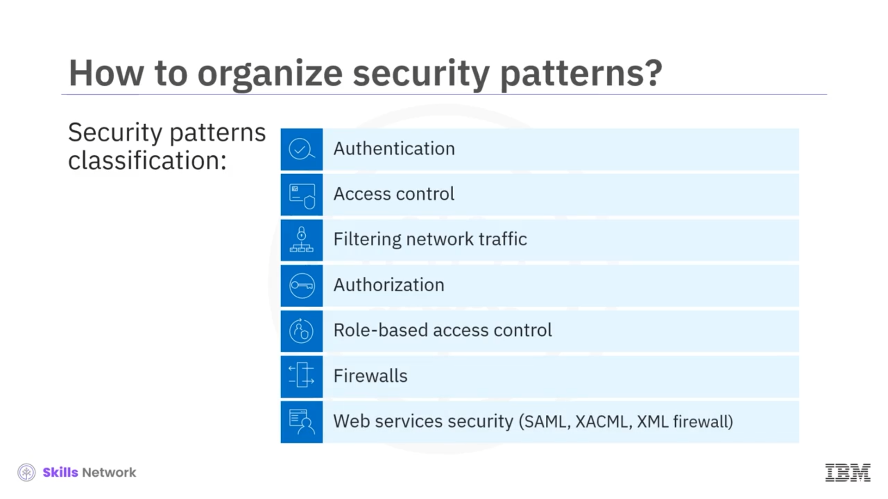

---

## 📖 Güvenlik kalıbı kataloglarının avantajları

Bir güvenlik kalıbı kataloğu, yazılım geliştiricilerin uygulama kodlarının gerekli ve ilave güvenlik özelliklerini geliştirmek için güvenlik kalıplarını gözden geçirip seçmelerini sağlar.

Dağıtıma yönelik geliştirme yaparken, iyi sınıflandırılmış bir güvenlik kalıbı kataloğu geliştiricilerin güvenlik kalıplarını birden çok uygulama arasında yeniden kullanmasını mümkün kılar.

Yazılım geliştiriciler, ilişkili güvenlik mekanizmalarının daha fazla farkına varmak için de güvenlik kalıbı kataloglarına güvenirler.

Örneğin, bir ağ güvenlik duvarı giden bağlantıları engelleyebilir ve bununla ilgili referans, ilgili güvenlik kalıbında güvenlik kalıpları kataloğunda yer alır. Bu güvenlik kalıbının var olduğunu bilmek, yazılım geliştiricilerin kodlarına güvenlik mekanizmaları ekleyerek ilave güvenlik sağlamalarına ve uygulamanın genel güvenliğini iyileştirmelerine olanak tanır.

---

## 📝 Dokümantasyon ve kullanılabilirlik

Sınıflandırmanın yanı sıra, kapsamlı dokümantasyon da güvenlik kalıplarını daha kullanılabilir kılan bir diğer unsurdur.

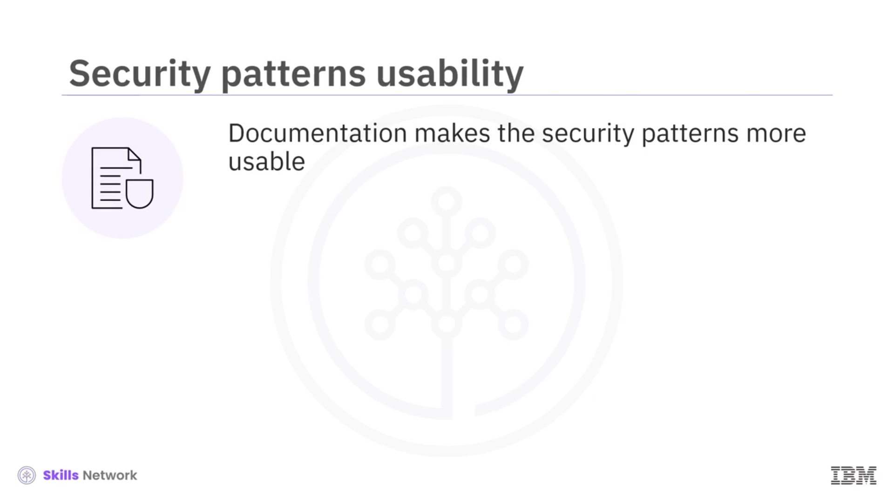

Yazılım geliştiriciler, erişilebilir, kesin, okunması ve takip edilmesi kolay güvenlik kalıbı dokümantasyonlarına başvurma eğilimindedir. Bir güvenlik kalıbı ne kadar kullanılabilir ve uygulanabilir olursa, gereksiz kod yazma potansiyeli o kadar azalır.

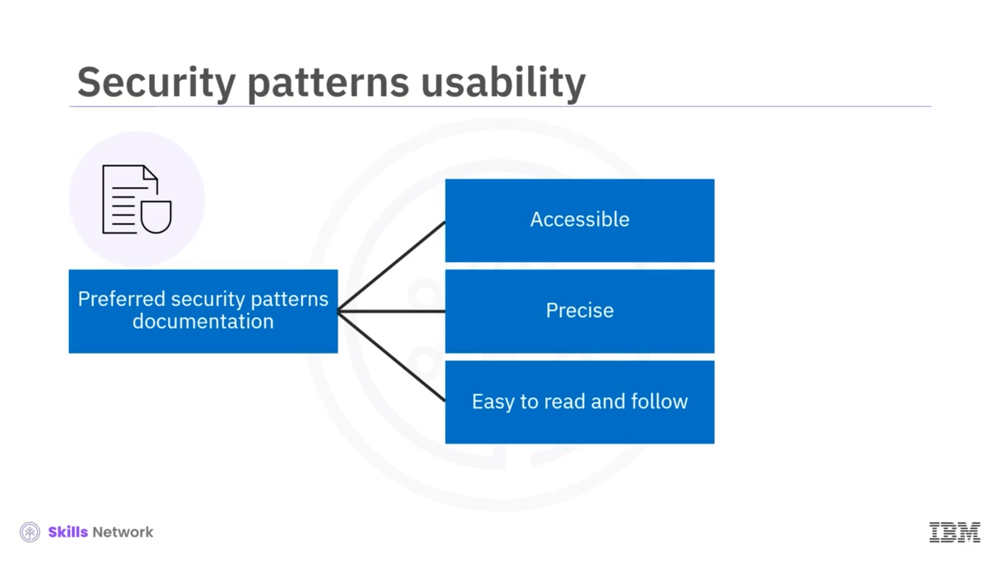

---

## 📈 Sürekli öğrenme ve güvenlik hedefleri

Ayrıca güvenlik kalıpları, geliştiricilerin sistem güvenliğindeki yaygın güvenlik kalıpları hakkında daha fazla bilgi edinmelerini sağlar.

Yeni güvenlik kalıplarını derinlemesine anlamaları ve sürekli öğrenmeleri sayesinde geliştiriciler, güvenlik hedeflerini, yazılım geliştirme planlarını ve bir kuruluşun güvenlik önlemlerini destekleyebilir.

Genel olarak güvenlik kalıpları, benzersiz güvenlik zorluklarını ele almak, müşteri bilgilerini korumak ve kuruluşun ekosistem bütünlüğünü sağlamak için kapsamlı bir çerçeve sunar.

---

## ✅ Özet

Bu videoda, güvenlik kalıplarının yinelenen güvenlik tehditleri veya sorunlarına yeniden kullanılabilir bir çözümü temsil eden ve tanımlayan bir dizi kural olduğunu öğrendiniz.

Güvenlik kalıplarının, riskleri azaltmak, hassas bilgileri korumak, güvenlik tehditlerini ve saldırılarını yönetmenin karmaşıklığını basitleştirmek ve genel güvenlik ekosistemlerini güçlendirmek için standartlaştırılmış ve kanıtlanmış yaklaşımlar sağladığını gördünüz.

Ayrıca, güvenlik kalıplarının yazılım oluşturma ve geliştirme süreçlerine dâhil edilebilmesi için bunların türlerine ve konularına göre kategorize edilmesinin önemini de öğrendiniz.

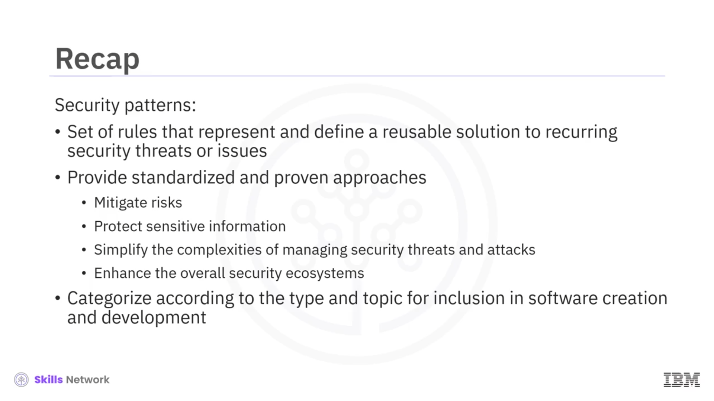
