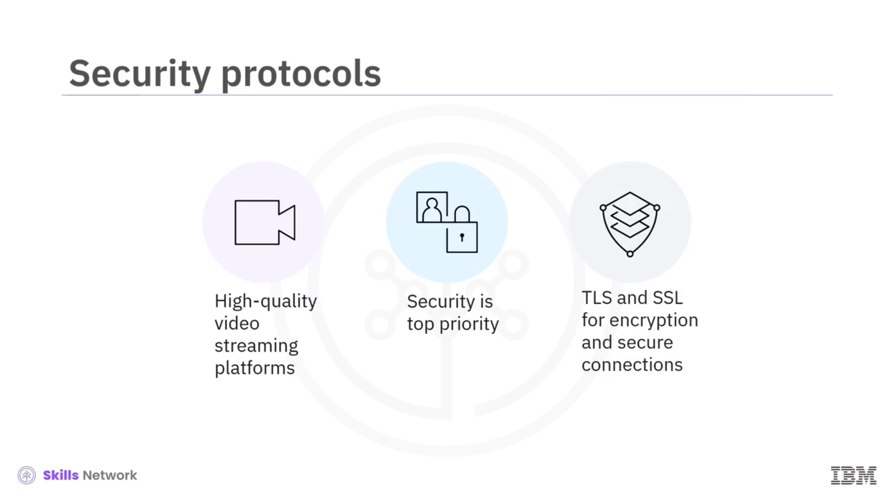
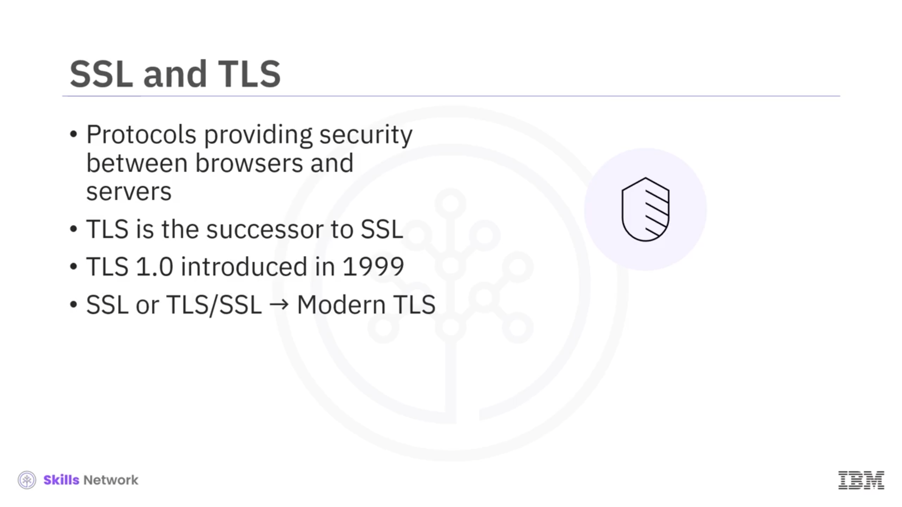
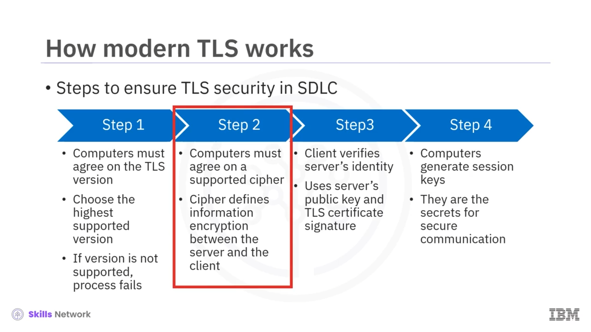
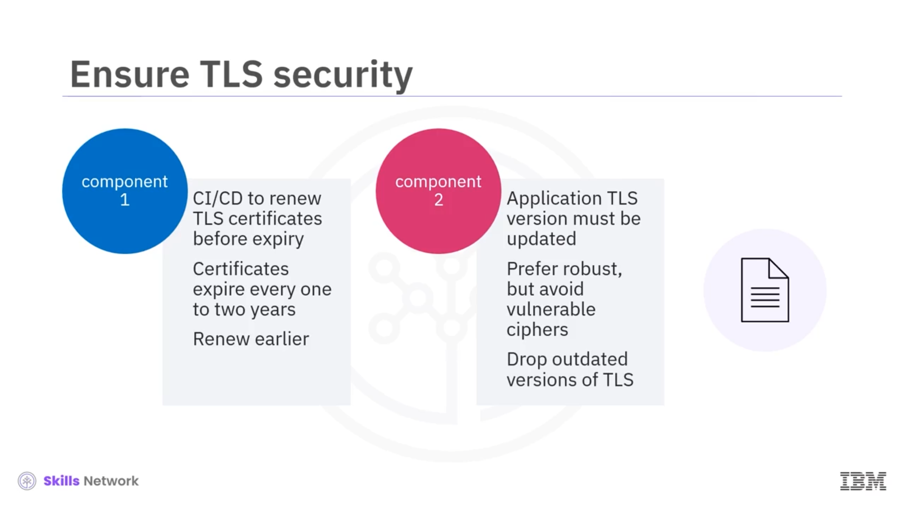
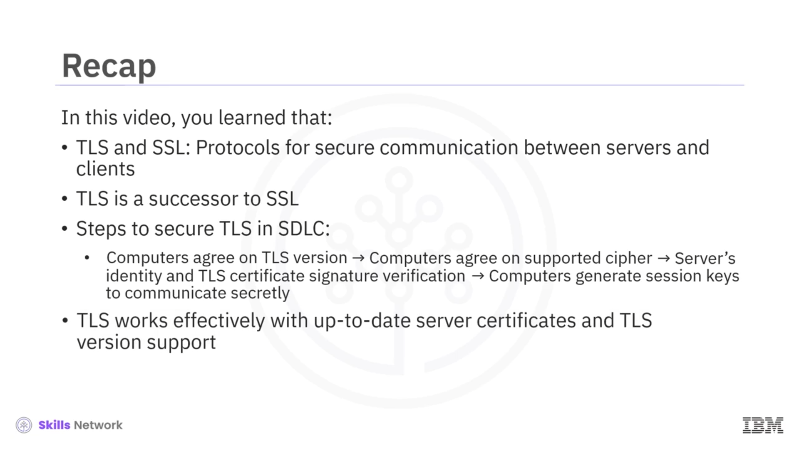

# 🔐 TLS/SSL

## 🎯 Öğrenme Hedefleri

TLS/SSL'ye hoş geldiniz. Bu videoyu izledikten sonra *Transport Layer Security* ( *TLS* ) ve *Secure Sockets Layer* ( *SSL* ) kavramlarını tanımlayabilecek, modern TLS'nin nasıl çalıştığını açıklayabilecek ve *Software Development Lifecycle* ( *SDLC* ) sürecinde TLS'yi nasıl güvenli tutacağınızı belirleyebileceksiniz.

## 📺 Video Akış Platformları ve Güvenlik

Günümüzde yüksek kaliteli video akış platformları televizyonlarımızı ve mobil ekranlarımızı ele geçirmiş durumda. Bu platformlar dünya çapında milyonlarca kullanıcıya yüksek kaliteli video içerik sunar.

Bu platformlar için, video iletimi sırasında kullanıcı verilerinin korunmuş kalmasını sağlamak adına güvenlik en öncelikli konudur. Bunu başarmak için platformlar, video verilerini şifrelemek ve sunucu ile istemciler arasında güvenli bağlantılar kurmak üzere *Transport Layer Security* ( *TLS* ) ve *Secure Sockets Layer* ( *SSL* ) protokollerini uygular.

## 🔐 SSL ve TLS Nedir?

Peki SSL ve TLS nedir? İkisi de özellikle bir sunucu ve bir istemci olmak üzere ağ üzerindeki bilgisayarlar arasında güvenli bağlantılar kurmaya yarayan protokollerdir.

Güvenli dediğimizde, eğer birisi iletişimi ele geçirirse, şifreleme nedeniyle okunamaz olacağından onun için işe yaramaz olacağını kastederiz. Basitçe söylemek gerekirse, güvenli; İnternet üzerinden veya bir bilgisayar ağı üzerinden gönderilen verilerin korunması anlamına gelir;

 peki veri nasıl korunur?

Hem *Secure Sockets Layer* ( *SSL* ) hem de *Transport Layer Security* ( *TLS* ), web tarayıcıları ile sunucular arasında güvenlik sağlar; peki SSL ile TLS arasındaki fark nedir? Aslında TLS, SSL'in ardılıdır; TLS'in ilk sürümü olan TLS 1.0, 1999 yılında tanıtılmıştır. Günümüzde insanlar SSL veya TLS/SSL'den bahsettiklerinde genellikle modern TLS'yi kastederler.

## ⚙️ Modern TLS Nasıl Çalışır?

Peki modern TLS nasıl çalışır?

Yüksek seviyede bakıldığında dört adım kullanır; TLS'nin *Software Development Lifecycle* ( *SDLC* ) sürecinde güvenli kalmasını sağlamak için bu adımları izleyebilirsiniz.

İki bilgisayarın güvenli bir TLS protokolü kullanarak iletişim kurabilmesi için öncelikle hangi TLS sürümünü kullanacakları konusunda anlaşmaları gerekir. Her ikisi de destekledikleri en yüksek sürümü seçecektir. Eğer iki bilgisayarın desteklediği ortak bir sürüm yoksa süreç başarısız olur.

İstemci ve sunucu bilgisayarlar kullanılacak desteklenen bir TLS sürümünde anlaştıktan sonra, bu TLS sürümünde desteklenen bir şifreleme algoritması ( *cipher* ) üzerinde anlaşırlar. Bir  *cipher* , sunucu ile istemci arasındaki bilgilerin nasıl şifreleneceğini tanımlar.

Bir *cipher* seçildikten sonra, istemci sunucunun kimliğini sunucunun açık anahtarını ve sunucunun TLS sertifikası imzasını kullanarak doğrular.

Son olarak, iki bilgisayar sertifikalarının açık ve özel anahtarlarını kullanarak oturum anahtarları üretir. Bu anahtarlar daha sonra 2. adımda seçilen *cipher* içinde kullanılır; sunucu ve istemcinin güvenli bir şekilde iletişim kurmasını sağlayan gizli değerlerdir.

## 🧩 SDLC'de TLS Güvenliğini Sürdürmek

Peki, uygulamanızın SDLC sürecinde TLS'nin güvenli kalmasını nasıl sağlarsınız?

Temelde iki bileşenle: Birincisi, TLS sertifikalarını son kullanma tarihlerinden önce yenilemek için *Continuous Integration and Continuous Delivery* ( *CI/CD* ) kullanırsınız. Bunlar genellikle yaklaşık her bir ya da iki yılda bir sona erer; ancak örneğin birkaç ayda bir olacak şekilde daha erken yenilemek iyi bir uygulamadır.

İkincisi, uygulamanızın TLS sürüm desteğini güncel tutmanız gerekir; bu da mevcut en yeni TLS sürümünü desteklemesi gerektiği anlamına gelir. Ayrıca, en güçlü  *cipher* 'ları tercih etmeli ve savunmasız  *cipher* 'lardan her ne pahasına olursa olsun kaçınmalısınız.

Bu çoğu zaman `1.0` ve `1.1` gibi eski TLS sürümlerine verilen desteği bırakmak anlamına gelir.

## 📌 Özet

TLS ve SSL, istemci ile sunucu arasında güvenli, güvenilir ve kesintisiz iletişime katkıda bulunur. Bu protokolleri uygulayarak verilerinizi koruyabilir ve hem gizliliğini hem de bütünlüğünü güvence altına alabilirsiniz.

Bu videoda, TLS ve SSL'nin özellikle bir sunucu ve bir istemci olmak üzere ağ üzerindeki bilgisayarlar arasında güvenli bağlantılar veya iletişim kurmak için kullanılan protokoller olduğunu öğrendiniz. TLS'nin SSL'in ardılı olduğunu ve her ikisinin de genellikle aynı protokole atıfta bulunmak için kullanıldığını gördünüz.

SDLC içinde TLS'nin güvenli olmasını sağlamak için dört adım olduğunu öğrendiniz: Öncelikle bilgisayarlar hangi TLS sürümünün kullanılacağı konusunda anlaşmalıdır. İkinci olarak, bilgisayarlar desteklenen bir *cipher* üzerinde anlaşmalıdır; üçüncü olarak, istemci sunucunun kimliğini ve TLS sertifikası imzasını doğrular ve son olarak, iki bilgisayar gizlice iletişim kurmak için oturum anahtarları üretir.

Ayrıca TLS'nin, sunucunun güncel bir sertifikaya ve güncel TLS sürüm desteğine sahip olduğunda etkin şekilde çalıştığını da öğrendiniz.

