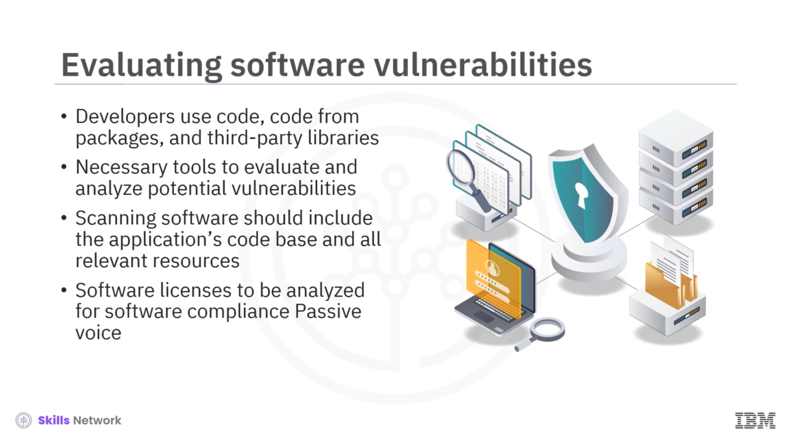
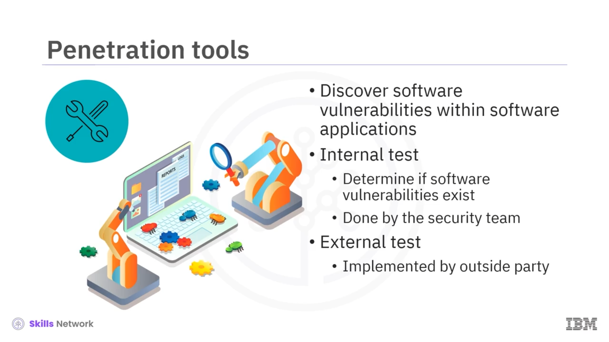
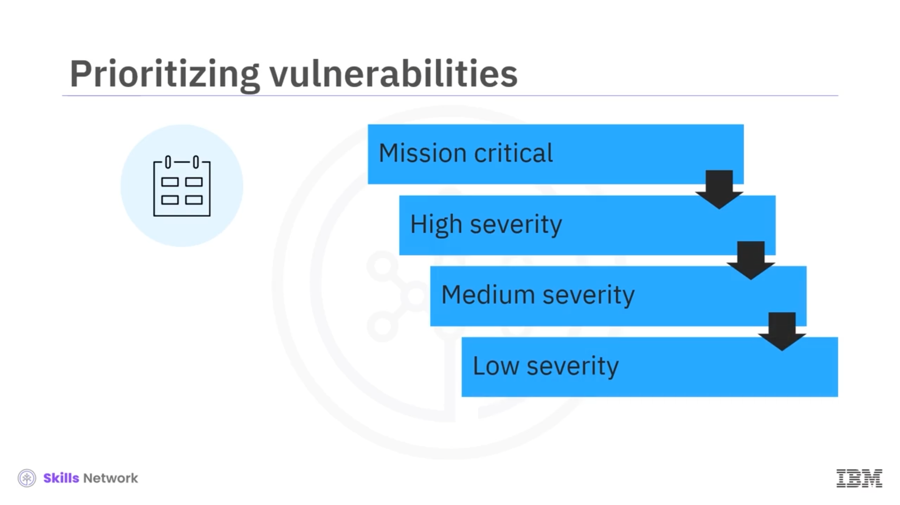
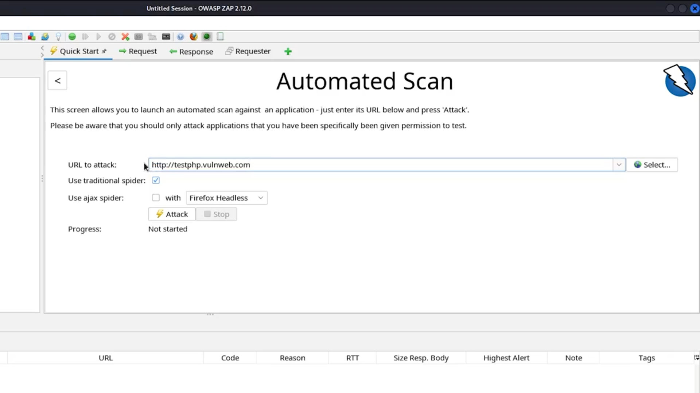
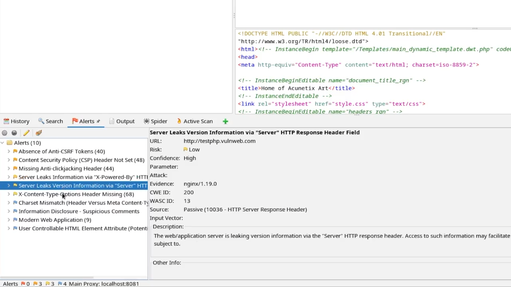

# 🧪 Zafiyet Analizinin Değerlendirilmesi

## 🎯 Öğrenme Hedefleri

Evaluating Vulnerability Analysis’e hoş geldiniz!

Bu videoyu izledikten sonra: yazılım zafiyeti ve yazılım bileşimi analizi ( *software component analysis – SCA* ) araçlarının kullanımını açıklayabilecek, hata izleme (defect tracking) araçlarını ve bunların uygulama geliştiricileri nasıl desteklediğini açıklayabilecek ve zafiyet içeren bir web sitesini taramak için OWASP’in `ZAP` aracının kullanımını gösterebileceksiniz.

---

## 🧱 Uygulama Kod Tabanı ve Tarama Kapsamı

Geliştiriciler, uygulamalarını kendi kodlarını, paketlerden gelen kodu ve üçüncü taraf kütüphaneleri kullanarak yazarlar.

Bu nedenle, uygulama geliştiriciler, uygulamalarını yayınlamadan önce potansiyel zafiyetleri değerlendirmek ve analiz etmek için araçlara ihtiyaç duyar.

Tarama yazılımı, uygulamanın kod tabanını ve konteynerler ile konteyner imajları gibi, statik veya dinamik olarak, tüm ilgili kaynakları kapsamlı biçimde içermelidir.

Ek olarak, yazılımın uyumlu kalmasını sağlamak için yazılım lisansları da analiz edilmelidir. Açık kaynaklı bir yazılım zafiyeti, yazılım geliştiriciler tarafından analize tabi tutulmalıdır.

---

## ⚖️ Açık Kaynak Uyumluluğu ve Hukuki Konular

Öncelikle geliştiriciler, yazılımla ilgili tüm uyumluluk veya hukuki sorunları çözmelidir.

Bu, bilinen zafiyetler açısından diğer açık kaynak yazılımların kontrol edilmesini de içerir.

Bir uygulamaya dahil edilen tüm açık kaynak yazılımlar bir araya getirilmeli, listelenmeli ve uyumlu oldukları doğrulanmalıdır.

---

## 🧩 Yazılım Bileşimi Analizi ( *Software Composition Analysis – SCA* )

Yazılım zafiyetlerini taramanın yöntemlerinden biri,  *software composition analysis (SCA)* , yani yazılım bileşimi analizidir.

*SCA* araçları, açık kaynaklı veya mülkiyetli (proprietary) zafiyetleri tespit etmeye ve gidermeye yardımcı olur.

Ek olarak, *SCA* araçları, *National Vulnerability Database (NVD)* aracılığıyla yazılım kütüphanelerindeki üçüncü taraf sorunlarını tespit edebilir.

Geliştiriciler, çeşitli yazılım zafiyetlerini kamuya açık bir referans olması için bu veritabanına gönderirler.

---

## 🕵️‍♂️ Penetrasyon Araçları ve Test Türleri

Penetrasyon araçları, yazılım uygulamaları içindeki yazılım zafiyetlerinin keşfedilmesine yardımcı olur.

Farklı türde penetrasyon testleri vardır.

Dahili bir test, herhangi bir yazılım zafiyeti olup olmadığını belirleyebilir. Bu testi genellikle bir güvenlik ekibi yürütür.

Bir diğer seçenek ise, dış bir tarafın harici bir test yürütmesi ve herhangi bir zafiyet olup olmadığını raporlamasıdır.

---

## 🧾 Hata İzleme ( *Defect Tracking* ) Araçları

Keşfedilen zafiyetleri takip etmeye yardımcı olmak için bir hata izleme ( *defect-tracking* ) aracına ihtiyaç duyulabilir.

`Jira` ve `Bugzilla`, yeni keşfedilen zafiyetlerin kaydedilmesi ve düzeltilmesi sürecinin ilerlemesini izlemek için kullanılan iki popüler hata izleme aracıdır.

Bu hata izleme araçları, yazılım geliştiricilerin zafiyetlerin ciddiyetini kategorize etmelerine yardımcı olur.

---

## 📊 Zafiyetlerin Önceliklendirilmesi ve Merkezi Yönetim

Ayrıca hata izleme araçları, zafiyetlerin kuruluş genelinde merkezî olarak tutulmasını sağlayarak, birden çok geliştiricinin bunları kendi yazılım geliştirme süreçleri içinde ele almasını mümkün kılar.

Bir yazılım geliştiriciyseniz, zafiyetleri önceliklendirmek sizin için önemli bir görevdir.

Görev açısından kritik ( *mission-critical* ) zafiyetler, en yüksek öncelikle ele alınmalıdır.

Görev açısından kritik zafiyetler kapatıldıktan sonra, yüksek önem derecesine sahip zafiyetler bir sonraki en yüksek önceliğe sahiptir.

Orta ve düşük seviyeli zafiyetler ise daha düşük önceliklere sahiptir.

---

## 🛠️ OWASP ZAP ile Zafiyet Taraması Gösterimi

Şimdi, web sitenizi zafiyetlere karşı nasıl tarayabileceğinize dair bir gösterim görelim.

Bu gösterim için, zafiyet içeren bir web sitesini taramak amacıyla OWASP’in `ZAP` adlı zafiyet aracını kullanacağız.

---

## ▶️ Otomatik Tarama Adımları

Karşılama ( *Welcome* ) penceresinde  **Automated Scan** ’i tıklayın.

`http://testphp.vulnweb.com` gibi PHP zafiyetleri olan bir web sitesi girin.

Ardından  **Attack** ’i tıklayın.

Bundan sonra ZAP, sitedeki tüm zafiyetleri bulmak için web sitesini otomatik olarak tarayacaktır.

Alt bölmede ZAP, tüm web sitesinin aktif taramasını gerçekleştirir; bu işlem birkaç dakika sürer.

Ön sonuçları gözden geçirmek için  **Stop** ’u tıklayın.

Taramanın geçmişini **History** sekmesini tıklayarak görüntüleyebilirsiniz.

Ardından, bu web sitesinde bulunan tüm zafiyet uyarılarını görmek için  **Alerts** ’i tıklayın; bunlara örnek olarak şunlar verilebilir:

---

## 🚨 ZAP’ın Tespit Ettiği Zafiyet Uyarıları

* Cross-Site Scripting (XSS)
* Anti-CSRF belirteçlerinin (token’larının) bulunmaması ( *Absence of Anti-CSRF Tokens* )
* *Content Security Policy Header Not Set* (Content-Security-Policy başlığının ayarlanmamış olması)
* Eksik anti-clickjacking başlığı ( *Missing Anti-clickjacking Header* )
* Sunucunun HTTP yanıt başlık alanları aracılığıyla bilgi sızdırması ( *Server Leaks Information via HTTP Response Header Fields* )
* Sunucunun, HTTP yanıtındaki **Server** başlık alanı aracılığıyla sürüm bilgisi sızdırması ( *Server Leaks Version Information via Server HTTP Response Header Field* )
* *Cross-Content-Type-Options Header Missing* (Cross-Content-Type-Options başlığının eksik olması)
* *Header Missing* (Başlık eksik)
* *Charset Missing* (Charset eksik)
* Bilgi ifşası ( *Information Disclosure* )
* Şüpheli yorumlar ( *Suspicious Comments* )
* Modern web uygulaması ( *Modern Web Application* )
* Kullanıcı tarafından kontrol edilebilir HTML öğe özniteliği ( *User Controllable HTML Element Attribute* ), ki bu da potansiyel olarak Cross Site Scripting zafiyetine açıktır.

Bir kuruluşun kapatılması gereken çok fazla zafiyeti varsa, uygulanabilecek bir çözüm olarak bir *bug bounty* programı düşünülebilir.

---

## 🏅 Ödül Programları ( *Bug Bounty* )

Bir *bug bounty* programı, kurum içinde yönetilebilir veya herhangi bir kişinin bir zafiyeti çözmeye çalışıp karşılığında bir ödül kazanabilmesi için herkese açık biçimde yürütülebilir.

---

## 📌 Sonuç ve Özet

Sonuç olarak, yazılım zafiyetlerinin yönetimini desteklemek için zafiyet politikalarına sahip olmak önemlidir.

Bu videoda şunları öğrendiniz:

Uygulama geliştiriciler, uygulamalarını yayınlamadan önce potansiyel zafiyetleri değerlendirmek ve analiz etmek için araçlara ihtiyaç duyar.

Yazılım zafiyetlerini keşfetmeye ve değerlendirmeye yardımcı olan bazı araçlar;  *software composition analysis (SCA)* , penetrasyon araçları ve `Jira` ile `Bugzilla` gibi hata izleme araçlarıdır.

Zafiyet içeren bir web sitesini taramak için OWASP `ZAP` zafiyet aracının kullanımına ilişkin bir gösterim izlediniz.

Ayrıca, çok fazla zafiyeti bulunan bir kuruluşun bir *bug bounty* programı kullanabileceğini ve bunun, zafiyetlerin kapatılmasına yardımcı olanlara bir ödül sunduğunu da öğrendiniz.

