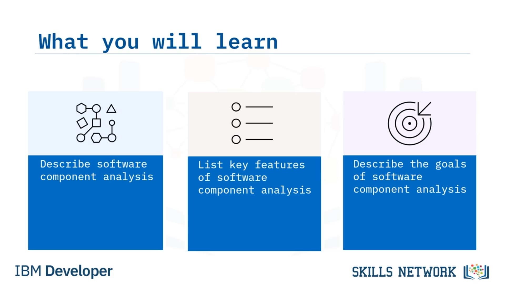
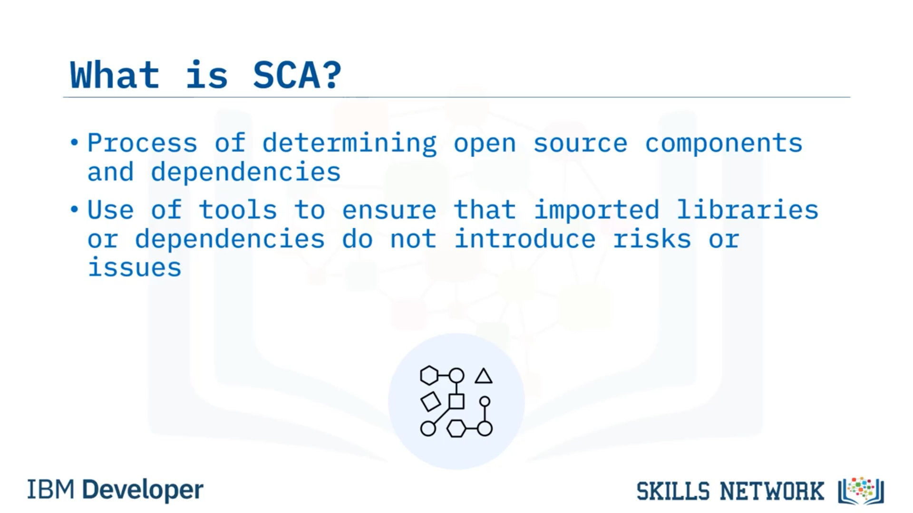
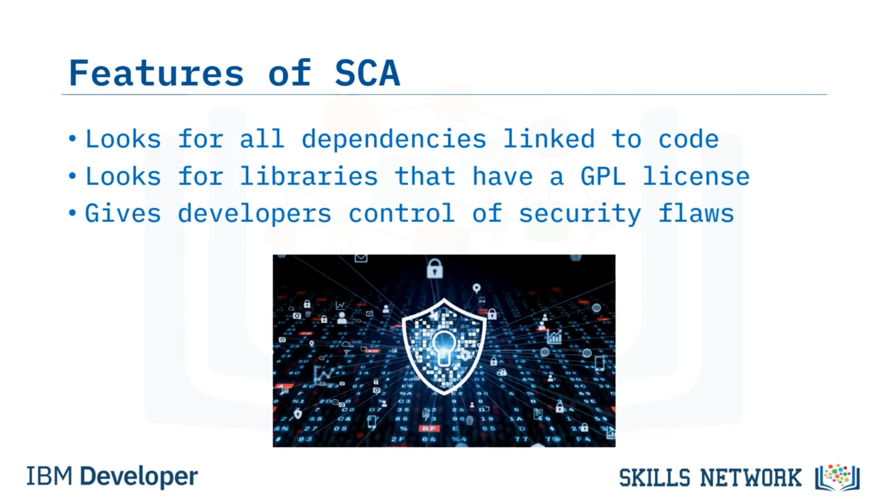
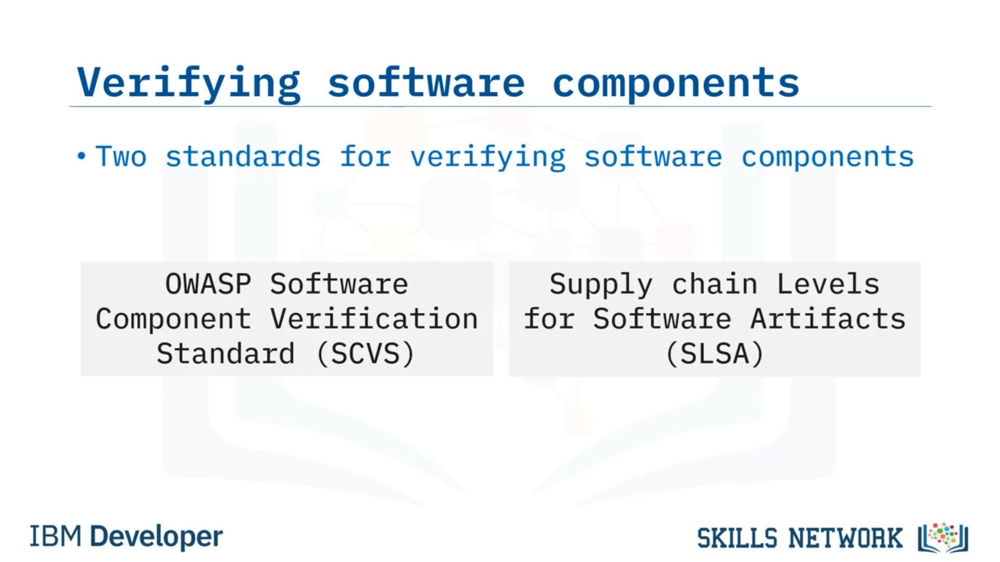
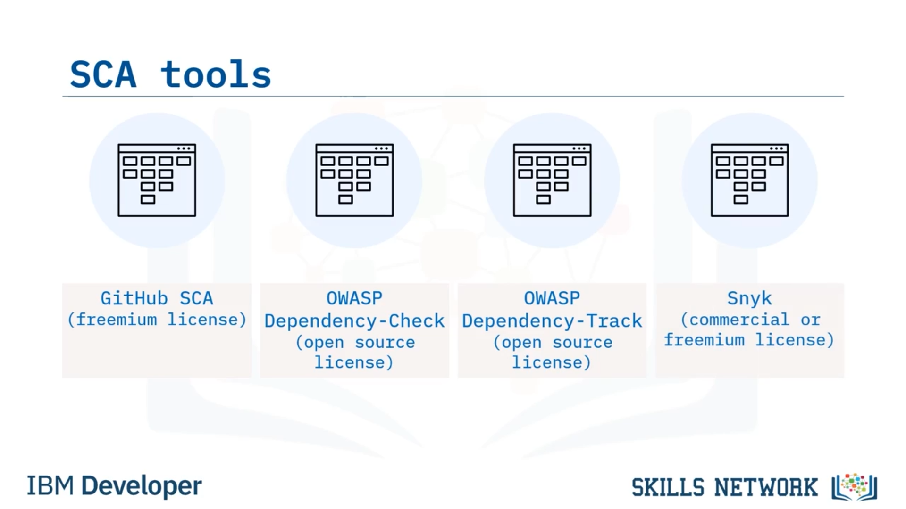

# 🧩 Yazılım Bileşen Analizi

## 🎬 Hoş Geldiniz ve Öğrenme Hedefleri

Yazılım Bileşen Analizi’ne hoş geldiniz! Bu videoyu izledikten sonra şunları yapabileceksiniz: Yazılım bileşen analizini ( *software component analysis* veya *SCA* ) açıklamak, yazılım bileşen analizinin temel özelliklerini listelemek ve yazılım bileşen analizinin hedeflerini açıklamak.

## 🌐 Açık Kaynak Yazılım Kullanımı ve SCA’nın Tanımı

Açık kaynak yazılım kullanımı çoğu sektörde genişliyor ve bileşenleri her zamankinden daha fazla takip etmeniz gerekiyor. Açık kaynak geliştirmedeki olası sorunlar ve güvenlik açıklarına karşı işletmenizi güvence altına almak giderek daha önemli hale geliyor.

Yazılım bileşen analizi ( *SCA* ), uygulamanızda hangi açık kaynak bileşenlerin ve bağımlılıkların kullanıldığını belirleme sürecidir.

## 🔁 SCA Araçlarının Geliştirme Sürecine Entegrasyonu

İçe aktarılan kütüphanelerin veya bağımlılıkların, kodunuzda güvenlik riski veya yasal uyumluluk sorunu yaratmamasını sağlamak için SCA araçlarını yazılım geliştirme iş akışınız boyunca kullanabilirsiniz. SCA araçlarını yazılım geliştirme iş akışınıza doğru şekilde dahil etmek, kodunuzun güvenliğini ve bütünlüğünü artırma yolunda büyük bir adımdır.

## 🔍 SCA’nın Temel Özellikleri

Peki, SCA’nın başlıca özellikleri nelerdir? SCA, kodunuza bağlı tüm bağımlılıkları, farkında olmadıklarınız da dahil olmak üzere arar.

Örneğin, *Flask* kütüphanesini içe aktarıyorsanız, *Flask* ihtiyaç duymadığınız bağımlılıkları talep edebilir ve kurabilir. Siz savunmasız olmayan bir sürüm kullanıyor olsanız bile,  *Flask* ’in kullandığı bağımlılıklardan biri savunmasız olabilir.

Kurumsal bir işletme için çalışıyorsanız, kullandığınız kütüphanelerin *GNU General Public License* (veya kısaca  *GPL lisansı* ) içermediğinden emin olmalısınız.

## ⚖️ GPL Lisansı ve Kaynak Kodun Açığa Çıkması

Bir GPL lisanslı kütüphaneye bağlanırsanız, kaynak kodunuzu vermeye istekli olmalısınız. Bu, açık kaynak bir ortamdaysanız sorun olmayacaktır. Ancak ürününüzün kaynak kodunu vermek istemiyorsanız, sorun yaşayacaksınız. Ve tüm gizli bilgilerinizi vermiş olursunuz.

Genel olarak SCA, geliştiricilere kullandıkları açık kaynak bileşenlerdeki potansiyel güvenlik açıkları üzerinde görünürlük ve kontrol sağlar.

## 🎯 SCA’nın Hedefleri

Peki, SCA’nın hedefleri nelerdir? Dört hedef vardır.

Birincisi, tüm açık kaynak bileşenlerin keşfedilmesi ve izlenmesi gerekir.

İkincisi, riski azaltmak için açık kaynak lisans uyumluluğu izlenmelidir.

Üçüncüsü, açık kaynak güvenlik açıkları tanımlanmalıdır.

Ve dördüncüsü, duruma ve gereksinimlere bağlı olarak çeşitli taramaların yürütülmesi gerekir.

## 🧾 Yazılım Bileşenlerini Tanımlamaya Yönelik Endüstri Çabaları

Yazılım bileşenlerini tanımlamaya yönelik üç endüstri girişimi şunlardır:

* *National Institute of Standards and Technology* ( *NIST* )  *CPE Dictionary* ; bu, ürünlerin *Common Platform Enumeration* ( *CPE* ) için merkezi bir veritabanıdır.
* *Software Identification Tags* (veya  *SWID Tags* ), ticari yazılımı tanımlamak için bir standarttır.
* *Package URL specification* .

Bir *package URL specification* örneği, `scheme` ile başlayan ve bunu `type` eğik çizgi `namespace` eğik çizgi `name` `@version` `?qualifiers` `#subpath` düzeninde izleyen bir dizgedir.

Yazılım bileşenlerini doğrulamak için endüstri standartlarını takip edin.

## 🧪 Yazılım Bileşenlerini Doğrulamak için Kullanılabilecek Standartlar

Kullanabileceğiniz iki standart şunlardır:

* *OWASP Software Component Verification Standard* ; bu, bir yazılım tedarik zincirinde riski azaltmak için sürdürülebilir bir çerçeve oluşturmaya yönelik, topluluk tarafından desteklenen bir çalışmadır.
* *Supply-chain Levels for Software Artifacts* (veya “ *salsa* ”); bu da standartlar ve kontroller uygulayarak bütünlüğü iyileştirmeye ve kurcalamayı önlemeye yönelik bir güvenlik çerçevesi sağlar.

## 🛠️ Yaygın ve Popüler SCA Araçları

Şu dört popüler SCA aracını kullanmayı düşünün:

* *GitHub SCA* , GitHub.com kullanırken bağımlılık paketlerini ve güvenlik açıklarını görüntülemek içindir.
* OWASP’in sunduğu iki SCA aracı *Dependency-Check* ve  *Dependency-Track* ’tir.
  * *Dependency-Check* , proje bağımlılıkları içindeki güvenlik açıklarını kontrol etmek içindir.
  * *Dependency-Track* ise yazılım tedarik zincirindeki herhangi bir riski belirlemek içindir.
* Ve son olarak,  *Snyk* ; bu araç, kod tabanlarını analiz ederek güvenliği, kod kalitesini ve lisanslamayı değerlendirmek için kullanılır.

## 📚 Videonun Özeti

Bu videoda şunları öğrendiniz: Yazılım bileşen analizinin ( *SCA* ) amacının, güvenlik ve lisans uyumluluğu risklerini daha iyi yönetebilmeniz için bir kod tabanındaki açık kaynak bileşenleri keşfetmek olduğu.

SCA’nın, kodunuza bağlı tüm bağımlılıkları aradığı ve kaynak kodunuzu ifşa etmenizi engellemeye yardımcı olduğu. Yazılım bileşenlerini tanımlamanın ve doğrulamanın, riskleri azaltmak için ikisinin de önemli olduğu.

Ve yazılım bileşenlerinizi değerlendirmek için  *GitHub SCA* , OWASP *Dependency-Check* ve *Dependency-Track* ile *Snyk* gibi SCA araçlarını kullanabileceğiniz.

