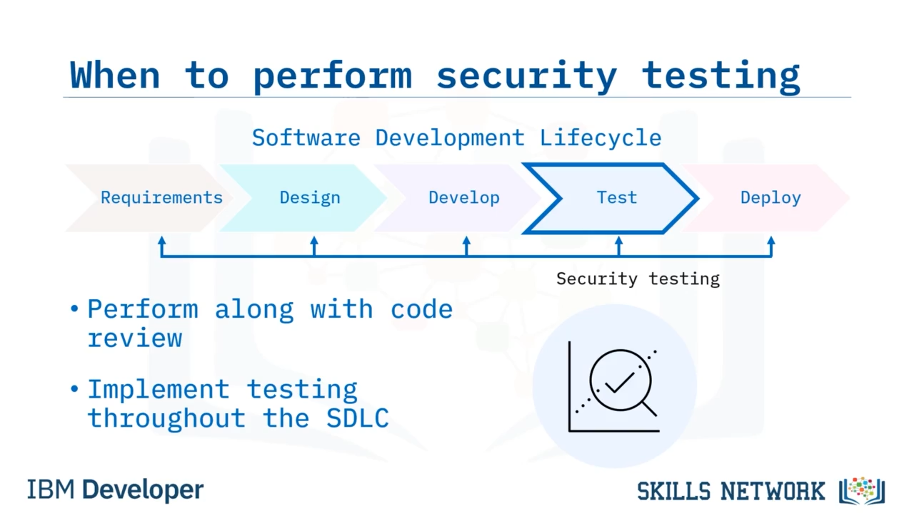
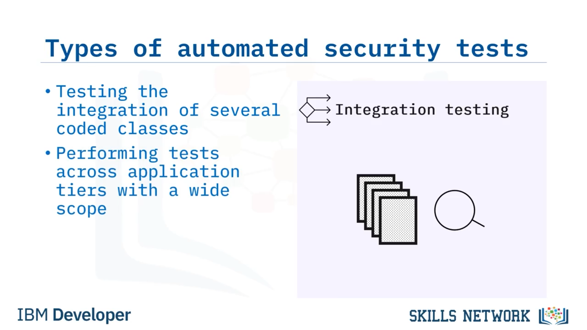
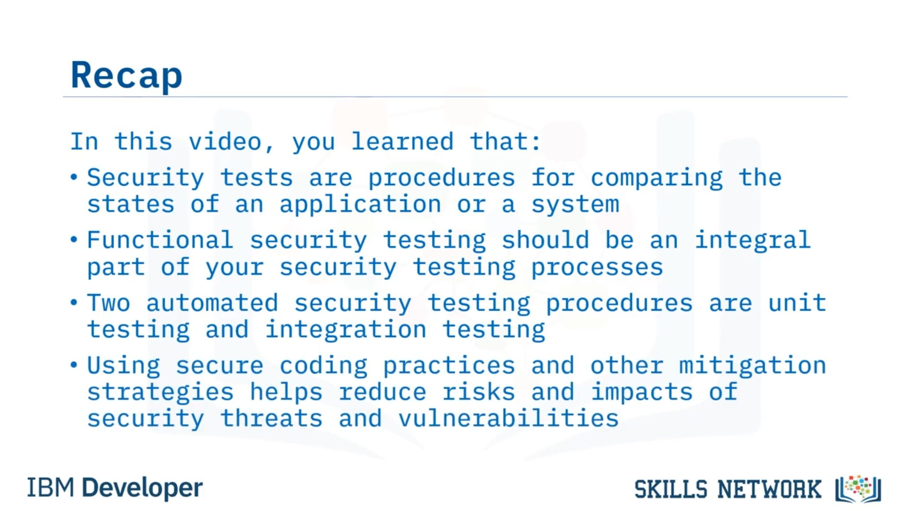

# 🔐 Güvenlik Testine ve Azaltma Stratejilerine Giriş

## 👋 Karşılama ve Öğrenme Hedefleri

Güvenlik Testine ve Azaltma Stratejilerine Giriş'e hoş geldiniz!

Bu videoyu izledikten sonra şunları yapabileceksiniz:

Güvenlik testini tanımlamak.

Azaltma ( *mitigation* ) stratejilerini tanımlamak.

Ve beş temel azaltma stratejisini sıralamak.

---

## 🧪 Güvenlik Testi Nedir?

Peki, güvenlik testi nedir?

Güvenlik testleri, bir uygulamanın veya sistemin durumlarını karşılaştırmaya yönelik prosedürlerdir. Güvenlik testi, geliştirme için güvenli bir kod temel çizgisi ( *baseline* ) sağlar.

Etkilerin riskini azaltmak için tüm yeni kod üzerinde güvenlik testleri gerçekleştirmelisiniz. Herhangi bir kod değişikliği, daha önce güvenli olan koda zafiyetler ekleyebilir.

---

## 🔁 SDLC İçinde Güvenlik Testinin Yeri

Peki güvenlik testi, yazılım geliştirme yaşam döngüsünde (*Software Development Lifecycle* –  *SDLC* ) nereye oturur?

Güvenli test, kod incelemesi ( *code review* ) ile birlikte Test aşamasında gerçekleşir. Test aşamasında güvenli kod en önemli önceliklerden biri olmalı olsa da, güvenlik testi, *SDLC* boyunca güvenli kodlama süreçlerinizin bir parçası olmalıdır.

---

## 📏 Güvenli Temel Çizgi (Baseline) ve Durum Karşılaştırması

Güvenlik testi yapmak için ilk adım, geliştirme sırasında güvenli bir temel çizgi ( *baseline* ) sağlamaktır.

Bir temel çizgi oluşturulduktan sonra, bir uygulamanın veya sistemin durumlarını karşılaştırabilirsiniz.

---

## ✅ İşlevsel Güvenlik Testi

İşlevsel güvenlik testi, güvenlik testi süreçlerinizin ayrılmaz bir parçası olmalıdır.

İşlevsel güvenlik testi, bir yazılımı veya sistemi test ederken beklenen davranışların kontrol edilmesidir. İşlevsel güvenlik testi yapmak için işlevsel gereksinimlerinizin bir listesine ihtiyaç duyarsınız.

İşlevsel güvenlik testi, kodun güvenlik gereksinimlerinizi karşıladığından emin olmanıza yardımcı olur.

## 🧩 İşlevsel Test Türleri: *Ad hoc* ve Keşif ( *Exploratory* ) Testleri

İki tür işlevsel test vardır: *Ad hoc testing* ve  *exploratory testing* .

 *Ad hoc testing* , bir zafiyet keşfedildiğinde yapılan özel testtir.

*Exploratory testing* (keşif testi), resmi test süreçlerinin dışında gerçekleştirilir. Bir teoriyi test etmek veya bir fikri sınamak, keşif testine örnek olarak verilebilir.

---

## 🤖 Otomatik Güvenlik Testleri: Birim ve Entegrasyon Testleri

Otomatikleştirilmiş güvenlik testinde, iki yaygın test prosedürü *unit testing* (birim testi) ve *integration testing* (entegrasyon testi)dir.

Birim testleri, sınıfları ve metotları test ederek uygulama programlama arayüzü (*Application Programming Interface* –  *API* ) sözleşmelerini değerlendirmek için kullanılır. Birim testlerini, kapsamı sınırlı olacak şekilde tekil sınıflar üzerinde gerçekleştirebilirsiniz.

<pre class="vditor-reset" placeholder="" contenteditable="true" spellcheck="false">

</pre>

Entegrasyon testleri, bir uygulama içindeki birden fazla kod sınıfının entegrasyonunu test etmek için kullanılır. Entegrasyon testlerini uygulamanın katmanları boyunca, geniş bir test kapsamıyla yürütebilirsiniz.

---

## 🧰 Güvenlik Testi Otomasyon Çerçeveleri

Bir uygulama veya sistemin güvenlik testlerini otomatikleştirmek için otomasyon çerçeveleri ( *framework* ) de kullanabilirsiniz.

Güvenlik testi otomasyon çerçevelerine üç örnek  *BDD-Security* , *Mittn* ve  *Gauntlt* 'tır.

 *BDD-Security* , davranış odaklı geliştirme (*Behavior-Driven Development* –  *BDD* ) kullanan bir güvenlik testi çerçevesidir.

 *Mittn* , sürekli entegrasyona (*Continuous Integration* –  *CI* ) dahil etmek için popüler bir araç setidir.

Ve  *Gauntlt* , güvenlik araçlarına bağlanarak entegrasyonu kolaylaştıran bir güvenlik çerçevesidir.

---

## 🛡️ Azaltma (Mitigation) Stratejilerine Giriş

Azaltma ( *mitigation* ) stratejilerini kullanmak, güvenlik tehditlerinin ve zafiyetlerinin risklerini ve etkilerini azaltmaya yardımcı olur.

Kod geliştirirken bu beş temel azaltma stratejisini kullanın.

---

### 1️⃣ API Veri Yükleri için JSON Kullanımı

İlk olarak, API veri yükleriniz ( *data payloads* ) için *JavaScript Object Notation* ( *JSON* ) kullanın.

*Extensible Markup Language* ( *XML* )'den farklı olarak  *JSON* , karmaşık iç içe geçmiş elemanlar ve daha yavaş ayrıştırma ( *parsing* ) yerine, basit anahtar-değer çiftleriyle veri kodlamasına olanak tanır.

---

### 2️⃣ Güvenli Kodlama Uygulamalarını Uygulama

Sonraki adım olarak, güvenli kodlama uygulamalarını hayata geçirin.

Güvenlik standartlarını ekibiniz ve kuruluşunuz genelinde açıkça iletin.

---

### 3️⃣ Zafiyet Taraması Kullanımı ve Otomasyonu

Koddaki zafiyetleri bulmak için zafiyet tarayıcıları ( *vulnerability scanners* ) kullanın.

Zafiyet taramasını da otomatikleştirebilirsiniz.

---

### 4️⃣ Tehdit Modellemesi

Tehdit modellemesi, bir diğer önemli azaltma stratejisidir.

Kötü niyetli aktörlerin davranışlarını net bir şekilde anlamak için süreçlerinize tehdit modellemesini dahil edin.

Tehdit modellemesi, nelerin ele geçirilebileceğini (kompromize olabileceğini) öngörmenize ve tehdidi derhal nasıl sınırlayacağınızı belirlemenize yardımcı olur.

---

### 5️⃣ OWASP Top 10 Farkındalığını Sürdürme

Ayrıca *Open Web Application Security Project* ( *OWASP* ) En Kritik 10 güvenlik zafiyeti listesinin ( *OWASP Top 10* ) farkındalığını koruyun.

Düzenli olarak güncellenen bu liste, kodu canlı ortama ( *production* ) almadan önce, en kritik güvenlik risklerini göz önünde bulundurarak geliştirme sırasında güvenlik testleri gerçekleştirmenize yardımcı olacaktır.

---

## 📌 Özet

Bu videoda şunları öğrendiniz: Güvenlik testleri, bir uygulamanın veya sistemin durumunu karşılaştırmaya yönelik prosedürlerdir.

İşlevsel güvenlik testi, güvenlik testi süreçlerinizin ayrılmaz bir parçası olmalıdır.

İki otomatikleştirilmiş güvenlik testi prosedürü *unit testing* (birim testi) ve *integration testing* (entegrasyon testi)dir.

Ve güvenli kodlama uygulamalarını ve diğer azaltma stratejilerini kullanmak, güvenlik tehditlerinin ve zafiyetlerinin risklerini ve etkilerini azaltmaya yardımcı olur.

