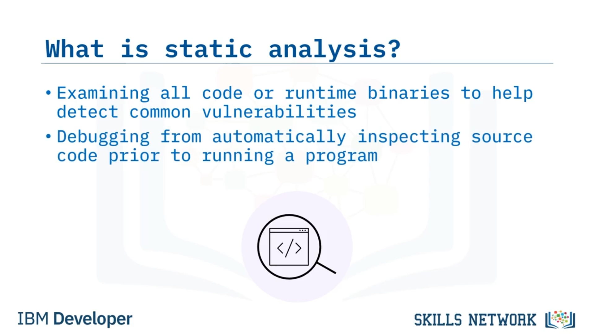
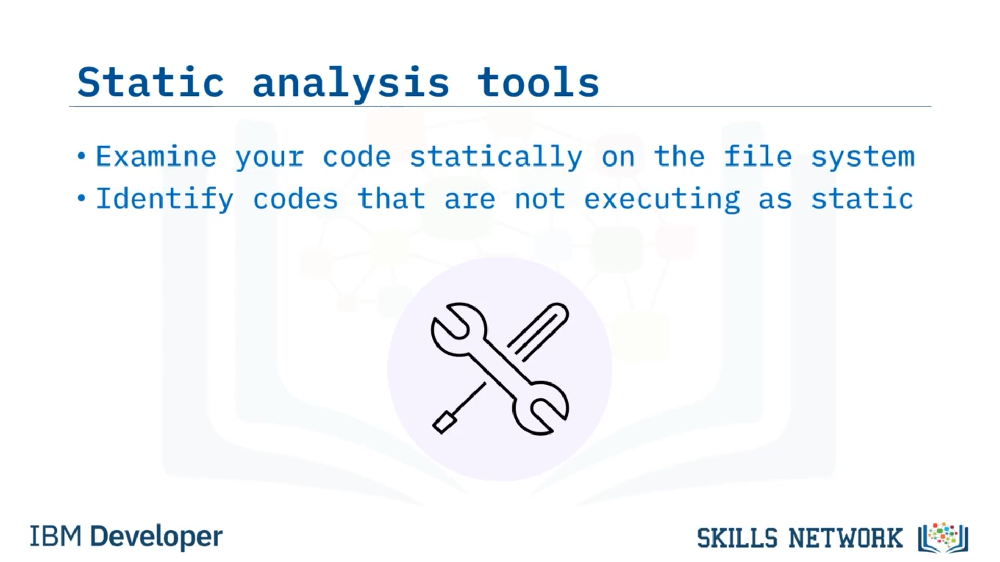
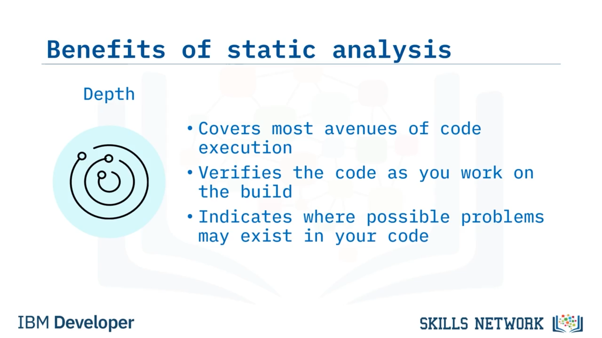
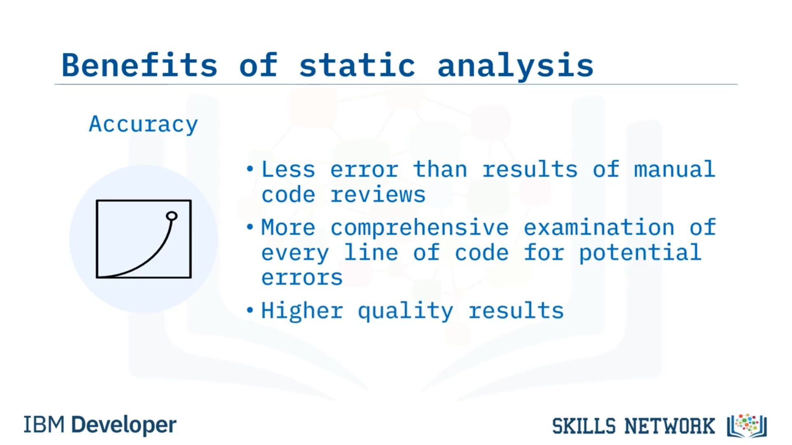

# 🧮 Statik Analiz

## 🎯 Öğrenme Hedefleri

Statik Analiz'e hoş geldiniz! Bu videoyu izledikten sonra:

Statik analizi tanımlayabileceksiniz.

Statik analiz kullanmanın faydalarını açıklayabileceksiniz.

---

## 🔍 Statik Analiz Nedir?

Önce, statik analiz nedir?

Statik analiz, yaygın zafiyetleri tespit etmeye yardımcı olmak için tüm kodu veya çalışma zamanı ikililerini ( *runtime binaries* ) inceler. Çalıştırma öncesinde kaynak kodu otomatik olarak inceleyen bir hata ayıklama yöntemidir.

 *Static Application Security Testing (SAST)* , kuruluşunuzun uygulamalarını saldırılara karşı savunmasız hale getiren güvenlik açıklarını belirlemek için kaynak kodu inceler.

Elle değerlendirdiğiniz kodda bile sorunları tespit etmede son derece etkilidir. Bazı *SAST* çözümleri, *DevOps* entegrasyonu için uygulama programlama arayüzleri ( *API'ler* ) sağlar ve kodun tamamlanmış olmasını gerektirmez.

Statik analiz, kodu ayrıntılı biçimde taradığı için uzun sürebilir.

---

## 🧱 SDLC İçinde Statik Analiz

Peki, statik analiz yazılım geliştirme yaşam döngüsünde ( *SDLC* ) nereye oturur?

Statik kod analizi, geliştirme sürecinin erken safhalarında, yazılım testleri başlamadan önce gerçekleştirilir. *DevOps* işletmeleri için statik analiz, *Develop* aşaması sırasında gerçekleşir ve otomatik bir geri bildirim döngüsü oluşturur.

Böylece, kodunuzdaki sorunların farkına en baştan varırsınız. Ve bu sorunları çözmeniz daha kolay olur.

Statik analiz araçları, kodunuzu dosya sistemi üzerinde statik olarak inceler. Kod çalıştırılmadığı için buna “statik” denir.

---

## ✅ Statik Analiz Araçlarının Başlıca Faydaları

İşte statik analiz araçları kullanmanın en önemli üç faydası. En iyi statik kod analizi araçları derinlik, hız ve doğruluk sunar.

### 📐 Derinlik

Öncelikle, statik analiz derinlik sağlar.

Testler, kod yürütmenin düşünülebilecek tüm yollarını kapsayamazken, statik kod analizörü bunların çoğunu kapsayabilir. Derleme üzerinde çalışırken statik analiz kodu doğrular.

Belirlediğiniz kriterlere göre, kodunuzda olası sorunların nerede bulunabileceğine dair ayrıntılı bir analiz elde edersiniz.

### ⚡ Hız

Bir sonraki fayda, statik analizin sağladığı hızdır; bu da yüksek kaliteli yazılımı hızlı ve uygun maliyetle teslim etmenize yardımcı olur.

Otomatik araçlar, manuel analizlerden çok daha hızlıdır. Statik kod incelemesi sorunları erken aşamada belirler ve sorunun kod içerisindeki tam konumunu işaret eder.

Sonuç olarak, sorunları daha hızlı düzeltebilirsiniz. Ve koddaki sorunları erken aşamada düzeltmek daha az maliyetlidir.

### 🎯 Doğruluk

Doğruluk da bir diğer faydadır.

Otomatik statik analiz araçları yüksek düzeyde doğruluk sağlar. Manuel incelemeler, zafiyetler hakkında yüksek düzeyde bilgi gerektirirken, otomatik tarama en son zafiyetlere ilişkin daha derin bilgi birikiminden yararlanabilir.

Otomatik araçlar, potansiyel hatalar için kodun her satırını inceler. Bu hataların ne olduğunu bildiğinizde, testler başlamadan önce en iyi kodu yerleştirebilirsiniz.

Sonuçta, kodlama standartları söz konusu olduğunda kalite vazgeçilmezdir.

---

## 📌 Özet

Bu videoda şunları öğrendiniz:

* Statik analiz, kaynak kodu çalıştırılmadan önce otomatik olarak inceleyen bir hata ayıklama yöntemidir.
* Statik kod analizi testleri ( *SAST* ),  *SDLC* 'nin erken safhalarında başlar.
* *DevOps* işletmeleri için statik kod analizi, Geliştirme ( *Development* ) aşamasında gerçekleşir.
* Statik analiz araçları, üretim öncesinde kodunuzu dosya sistemi üzerinde inceler.
* Statik kod analizi araçları derinlik, hız ve doğruluk sunar.

