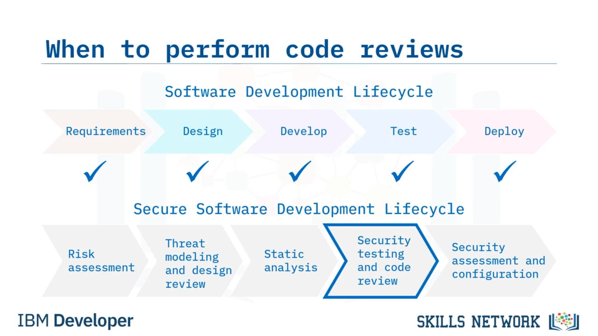
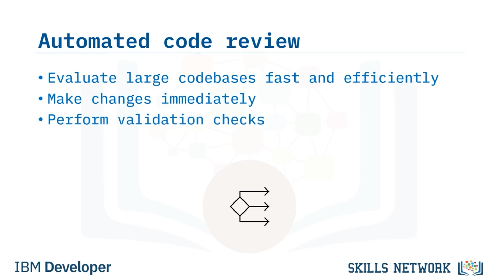
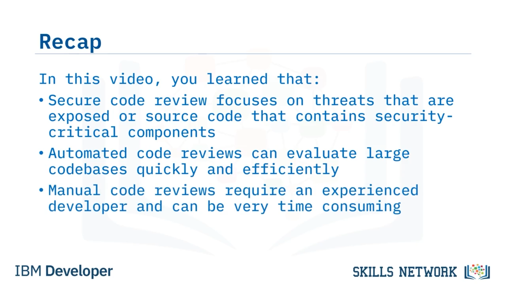

# 🔍 Kod İncelemesi

## 🎯 Öğrenme Hedefleri

Code Review’a hoş geldiniz! Bu videoyu izledikten sonra şunları yapabileceksiniz:

* Kod incelemesini tanımlamak.
* Kod inceleme türlerini açıklamak.

## 🛡️ Güvenlik ve Kod İncelemesinin Rolü

Güvenlik, *DevOps* topluluğu için büyük bir endişe kaynağı hâline gelmiştir ve geliştiriciler güvenlik test metodolojilerini yazılım geliştirme yaşam döngüsüne (*software development lifecycle* –  *SDLC* ) eklemektedir.

Kod inceleme, güvenlik testinin önemli bir parçasıdır. Kod incelemede, otomatik statik analiz güvenlik testi kullanır ve manuel kod incelemesi yaparsınız.

Her iki tür kod incelemede de odak, açığa çıkmış tehditler veya güvenlik açısından kritik bileşenler içeren kaynak kod üzerindedir. Amacınız, mevcut olabilecek güvenlik hatalarını veya zafiyetleri bulmaktır.

Diğer şeylerin yanı sıra, kod inceleme mantık hatalarını arar, gereksinim/sözleşme ( *spec* ) uygulamasını gözden geçirir ve stil kurallarını doğrular.

Kod inceleme en etkili, onu sürecin başlarında yaptığınızda olur; çünkü hataları en kolay ve en hızlı şekilde o zaman ele alabilirsiniz. Ancak kod incelemeyi  *SDLC* ’nin herhangi bir aşamasında uygulayabilirsiniz.

Şimdi iki tür kod incelemeye bakalım: otomatik inceleme ve manuel inceleme.

## 🤖 Otomatik Kod İncelemesi

Eğer çok sayıda dosyanız ve uzun kodlarınız varsa, otomatik kod inceleme en iyi eylem seçeneğidir. Büyük kod tabanları hızlı ve verimli şekilde değerlendirilebilir.

Kodu yazarken otomatik kod inceleme kullandığınızda, değişiklikleri hemen yapabilirsiniz.

Sürekli entegrasyon ( *continuous integration* ) sırasında,  *pull request* ’ler ana dala ( *main branch* ) birleştirilmadan önce doğrulama kontrollerini gerçekleştirmek için otomatik kod taraması kullanabilirsiniz.

Kod yazarken zafiyetleri gerçek zamanlı olarak ortaya çıkarmak için ücretsiz veya ücretli otomatik araçlar kullanabilirsiniz.

Gelişmiş geliştirme ekiplerinin çoğu statik analiz güvenlik testi (*static analysis security testing* –  *SAST* ) araçlarını kullanır. *SAST* araçları ek girdiler sağlayabilir ve bu zafiyetleri kodunuzu *check in* etmeden önce ele alabilirsiniz.

## 👁️‍🗨️ Manuel Kod İncelemesi

Ve bir de manuel inceleme vardır. Manuel incelemeler, testlerin gözden kaçırdığı sorunları sıklıkla tespit eder.

İlk kod geçişini geliştirirken fark etmemiş olabileceğiniz hataları bulabilirsiniz. Bir manuel incelemeyi tamamlamak, tüm programı gözden geçirmek zorunda olan kıdemli veya daha deneyimli bir geliştirici gerektirir.

Uygulamanın karmaşık kontrol ve mantık akışlarını okuyup anlayabilecek birine ihtiyaç duyduğundan, bu süreç oldukça zaman alıcı olabilir.

Bir geliştirici bir güvenlik birim testi ( *security unit test* ) yazdığında, her seferinde test senaryoları değişebilir ve test senaryoları geliştiriciden geliştiriciye farklılık gösterebilir.

Bu durumda, dikkate alınacak politikaları tanımlamanız gerekebilir. Ve günümüzde sizi koruyabilecek birçok kütüphane mevcuttur. Bu son noktayı yeterince vurgulayamayacağım.

## 📌 Pull Request’lerde Kod İncelemesi

Her  *pull request* ’te kodunuzu manuel olarak gözden geçirmeniz ve herhangi bir sorun hakkında yorum yapmanız gerekir.

Bir *pull request* içinde 50 veya 100 satır kodu incelemek, haftalar sonra binlerce satır kodu incelemekten çok daha kolaydır.

## 📝 Bu Videoda Öğrendikleriniz

Bu videoda şunları öğrendiniz: Güvenli kod inceleme, açığa çıkmış tehditlere veya güvenlik açısından kritik bileşenler içeren kaynak koda odaklanır.

Otomatik kod incelemeler, büyük kod tabanlarını hızlı ve verimli bir şekilde değerlendirebilir.

Ve manuel kod incelemeleri, deneyimli bir geliştirici gerektirir ve çok zaman alıcı olabilir.

